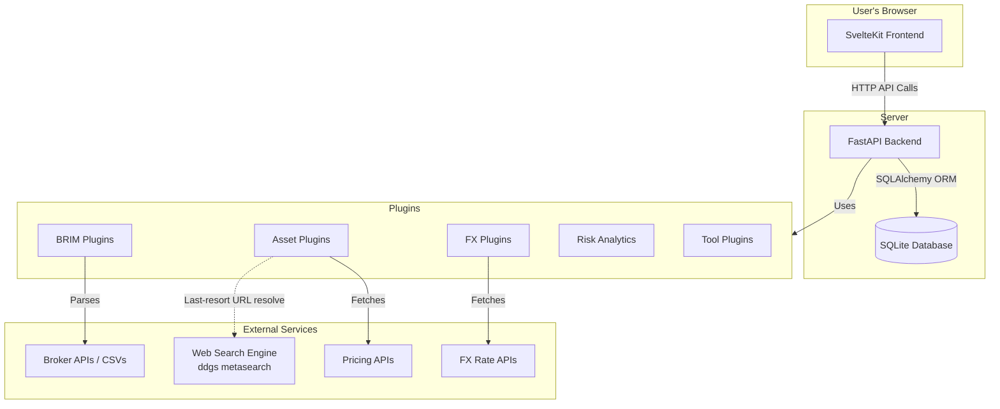
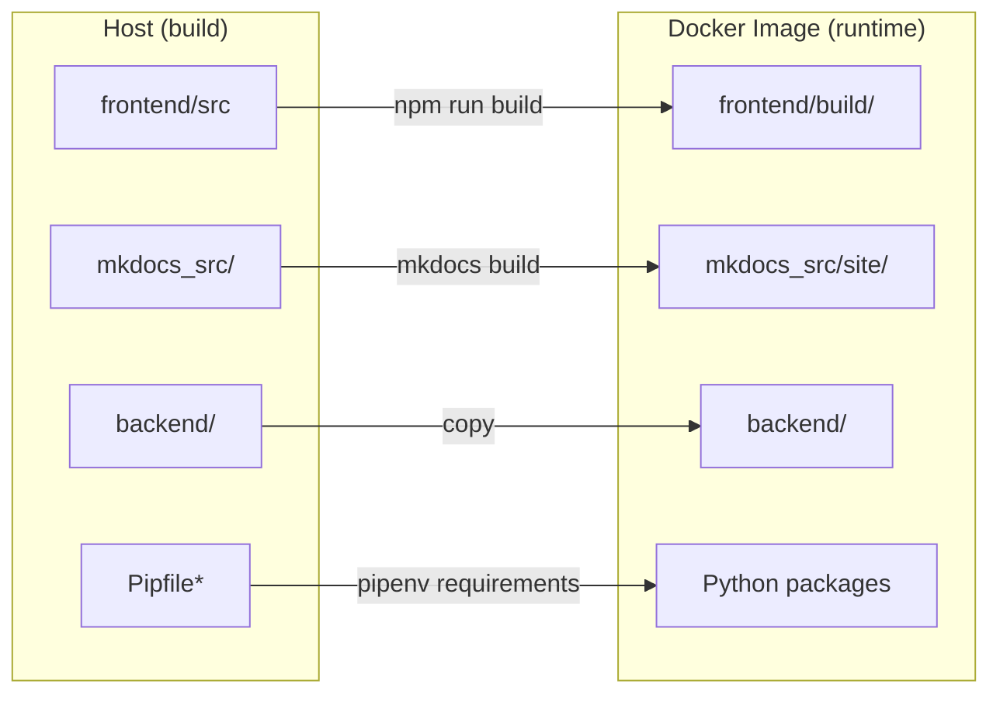

# 🏗️ System Architecture Overview

LibreFolio is designed as a modern web application with a clear separation between the backend API and the frontend user interface.

## 🗺️ High-Level Diagram

The architecture can be visualized as three main components:

```mermaid
graph TD
    subgraph User's Browser
        Frontend[SvelteKit Frontend]
    end

    subgraph Server
        Backend[FastAPI Backend]
        Database[(SQLite Database)]
    end

    subgraph External Services
        direction TB
        BrokerAPIs[Broker APIs / CSVs]
        PricingAPIs[Pricing APIs]
        FXAPIs[FX Rate APIs]
        WebSearch[Web Search Engine<br/>ddgs metasearch]
    end
    
    subgraph Plugins
        direction TB
        B_Plugins[BRIM Plugins]
        A_Plugins[Asset Plugins]
        F_Plugins[FX Plugins]
        R_Plugins[Risk Analytics]
        T_Plugins[Tool Plugins]
    end

    Frontend -- HTTP API Calls --> Backend
    Backend -- SQLAlchemy ORM --> Database
    
    Backend -- Uses --> Plugins
    
    B_Plugins -- Parses --> BrokerAPIs
    A_Plugins -- Fetches --> PricingAPIs
    F_Plugins -- Fetches --> FXAPIs

    A_Plugins -. Last-resort URL resolve .-> WebSearch
```

### 🧱 Components

1. 🖥️ **Frontend (SvelteKit)**: A single-page application (SPA) that runs in the user's browser. It communicates with the backend via a RESTful API to fetch and display data.

2. ⚙️ **Backend (FastAPI)**: A Python-based API server that handles all business logic, including:
    - 🔐 User authentication and authorization.
    - 🗃️ Database operations (CRUD).
    - 📥 Data import from brokers (BRIM).
    - 📈 Fetching asset prices and FX rates from external sources.

3. 🗄️ **Database (SQLite)**: A single-file database that stores all user data, including transactions, assets, user settings, and cached data.

4. 🔌 **Provider Plugins**: A system of pluggable modules that abstract the interaction with external data sources. This makes it easy to add support for new brokers, pricing APIs, or FX rate providers without modifying the core application logic. The same registry mechanism also discovers plugins that call no external service: the [risk analytics](../backend/risk/architecture.md) and the [Tools](patterns/tool_plugins.md).

## 🔑 Key Subsystems

For detailed architectural documentation of specific subsystems, see:

- 🗃️ **[Database Schema](database/index.md)**: Data models and relationships.
- 👤 **[Users & Brokers](users_and_brokers.md)**: Authentication and multi-user access control.
- 🔐 **[Access Control (RBAC)](access_control.md)**: Role-based broker access (Owner/Editor/Viewer).
- ⚙️ **[Settings System](settings.md)**: User preferences and global settings.
- 📥 **[BRIM Architecture](../backend/brim/architecture.md)**: Broker Report Import Manager.
- 📈 **[Asset Pricing](../backend/assets/architecture.md)**: Asset data fetching and metadata.
    - 🔎 See also: **[Asset Search & Link-Finder](../backend/assets/search_link_finder.md)** for the three-layer interactive search (on-site → `ddgs` web link-finder → `resolve_url`); best-effort, last-resort, and **never** used on automated price fetches.
- 💱 **[FX Architecture](../backend/fx/architecture.md)**: Foreign Exchange system.
    - 🔀 See also: **[FX Configuration & Routing](../backend/fx/configuration.md)** for multi-provider setup.
- 🧮 **[Financial Math Layer](../backend/transactions/wac.md#financial-math-layer)**: `backend/app/services/financial_math/`, the home of financial calculations — each takes the plain data of its problem and calls the services it needs, such as the FX service. Its first module is the single average-cost implementation.
- 📉 **[Risk Engine](../backend/risk/architecture.md)**: Bulk risk analytics over a portfolio, a broker, an asset or a selection of assets — plugin catalogue, eligibility verdicts, and simulation and optimization in spawned worker pools.
- 🧰 **[Tool Plugins](patterns/tool_plugins.md)**: Atomic, typed calculations behind a versioned catalogue (first tool: the PAC allocator), each computed in a spawned process the executor owns.
- 🧭 **[Onboarding Guides](../frontend/onboarding.md)**: Welcome setup, intro tour and contextual guides, with versioned per-user progress kept by the backend.
- 📁 **File Upload System**: Custom uploads stored with a JSON metadata sidecar, and the default avatars seeded at startup (`backend/app/services/static_uploads.py`); image previews go through an in-memory cache (`PreviewCache` in `backend/app/api/v1/uploads.py`: 50 MB by default, `PREVIEW_CACHE_MAX_MB`, entries expire after 1 hour). Broker report files belong to [BRIM](../backend/brim/architecture.md). Where all these files live: [Data Directory on Disk](database/index.md#data-directory).

## 🔄 Request Flow Example: Displaying Portfolio

1. User logs in and navigates to the dashboard.
2. The **Frontend** makes an API request to `GET /api/v1/portfolio`.
3. The **Backend** receives the request, authenticates the user, and queries the **Database** for the user's transactions.
4. For each asset, the backend may need to fetch the latest price. It calls the appropriate **Asset Provider Plugin** (e.g., Yahoo Finance).
5. If currency conversion is needed, the backend calls the **FX Provider Plugin** to get the latest exchange rate.
6. The backend processes the data, calculates portfolio metrics, and returns a JSON response to the frontend.
7. The **Frontend** receives the JSON data and renders the portfolio dashboard.

## 🚀 Server Startup {: #server-startup }

The FastAPI lifespan (`lifespan()` in `backend/app/main.py`) prepares everything before the first request, in this order:

1. Logs `Starting LibreFolio` with the version, the database path and the test mode.
2. Checks the signal-plugin runtime (`validate_signal_runtime()`) and discovers the signal plugins.
3. Loads the [Tool](patterns/tool_plugins.md) catalogue (`ToolPluginRegistry.get_snapshot()`, in a thread).
4. Creates the [data directories](database/index.md#data-directory) (`ensure_data_dirs()`).
5. Loads the [risk](../backend/risk/architecture.md) scenario catalogue (`initialize_risk_scenario_catalog()`).
6. Seeds the default avatars (`seed_default_avatars()`).
7. Creates or [migrates](database/index.md#migrations) the database (`ensure_database_exists()`); a failed `alembic upgrade head` stops the server (`sys.exit(1)`).
8. Runs the [post-migration fixes](database/index.md#post-migration-fixes), which never stop the startup.
9. Seeds the missing [global settings](settings.md) (`_initialize_global_settings()`).
10. Starts, in the background, the provider cache pre-warm (`_prewarm_provider_caches()`) and the market-holiday table, built in its own process (`start_market_holiday_prewarm()`).
11. Starts the [scheduler](../backend/scheduler.md) task (`scheduler_loop()`).

On shutdown it stops the Tool executor and the scheduler, then shuts down the asset, FX and BRIM providers, the BRIM parse pool, the quant worker pools and any market-holiday build, and closes the TTL caches.

## 🐳 Docker Image {: #docker-image }

The production image is **runtime-only**: the frontend (SvelteKit) and the documentation (MkDocs) are built on the host and copied in, so the image carries neither Node.js nor the documentation toolchain. `./dev.py docker build` prepares those builds first (see [Developer Workflow → Docker Integration](../dev_workflow.md#docker-integration)); the release workflow builds and tags the published images (see [Release & CI/CD Pipeline](../docs/release-pipeline.md#docker-images-and-tags)).

```mermaid
graph LR
    subgraph "Host (build)"
        FE["frontend/src"]
        MK["mkdocs_src/"]
        BE["backend/"]
        PF["Pipfile*"]
    end
    subgraph "Docker Image (runtime)"
        FB["frontend/build/"]
        MS["mkdocs_src/site/"]
        BC["backend/"]
        PP["Python packages"]
    end
    FE -- "npm run build" --> FB
    MK -- "mkdocs build" --> MS
    BE -- "copy" --> BC
    PF -- "pipenv requirements" --> PP
```

- **Build stages** (`Dockerfile`): `docs-full` and `docs-light` take the pre-built `mkdocs_src/site/`, and `docs-light` deletes the gallery images before they reach the final image (the `DOCS_VARIANT` build argument picks one). `frontend` runs `scripts/docker/check_frontend_build.sh`, which refuses a debug, coverage-instrumented or sourcemapped `frontend/build/`. `pybuilder` installs `requirements.txt` with the compiler toolchain, and only the installed packages reach the final `python:3.13-slim` stage, which adds `gosu` and `sqlite3`.
- **Contents**: `backend/`, `scripts/`, `dev.py`, the checked frontend build, the documentation site, `VERSION` (the git version frozen at build time, since the image has no `.git/`) and `.env.example` copied as `/app/.env`. `.dockerignore` keeps out, among others, `backend/data/`, `backend/test_scripts/`, the documentation sources and the developer journal.
- **Startup**: `entrypoint.sh` starts as root, creates the data directory and hands it to the numeric `LIBREFOLIO_UID:LIBREFOLIO_GID` (the `UID`/`GID` build arguments, default `1000:1000`), then `exec gosu` replaces itself with the command. The default command is `uvicorn backend.app.main:app --host 0.0.0.0 --port 6040`: one worker, PID 1 of the container, always on port `6040`. `PORT` only changes the host side of the Compose port mapping.
- **Database**: the container runs the same [startup sequence](#server-startup) as any server, so pending migrations and the post-migration fixes are applied before the first request: a container never needs a manual `db upgrade`.

---

## 🧰 Tech Stack

### ⚙️ Backend

- 🚀 **[FastAPI](https://fastapi.tiangolo.com/)**: A high-performance web framework for building APIs with Python (LibreFolio requires Python 3.13), based on standard Python type hints. It provides automatic interactive documentation (Swagger UI and ReDoc).
- 🗃️ **[SQLAlchemy](https://www.sqlalchemy.org/)**: The SQL toolkit and Object-Relational Mapper (ORM) used for all database interactions. LibreFolio uses SQLAlchemy's **asyncio support** for non-blocking database queries.
- 📋 **[Pydantic](https://docs.pydantic.dev/)**: A data validation and settings management library. Used extensively for defining data schemas, validating API requests, and managing application settings.
- 🔄 **[Alembic](https://alembic.sqlalchemy.org/)**: A lightweight database migration tool for SQLAlchemy. See [Database Migrations](patterns/alembic.md).
- 🗄️ **[SQLite](https://www.sqlite.org/)**: The default database engine. Simple, serverless, and perfect for a self-hosted application. Configured in WAL (Write-Ahead Logging) mode for better concurrency.

### 🎨 Frontend

- 🖥️ **[SvelteKit](https://kit.svelte.dev/)**: A web application framework for building fast, modern user interfaces with server-side rendering, routing, and great developer experience.
- 📝 **[TypeScript](https://www.typescriptlang.org/)**: A statically typed superset of JavaScript that adds type safety to the frontend codebase.
- 🎨 **[TailwindCSS](https://tailwindcss.com/)**: A utility-first CSS framework for rapidly building custom designs.
- ⚡ **[Vite](https://vitejs.dev/)**: The build tool and development server. Provides extremely fast Hot Module Replacement (HMR).

### 🧪 Testing

- 🐍 **[Pytest](https://docs.pytest.org/)**: The framework used for writing and running backend tests.
- 🎭 **[Playwright](https://playwright.dev/)**: A framework for end-to-end testing of the web application.
- 📊 **[Coverage.py](https://coverage.readthedocs.io/)**: A tool for measuring code coverage of Python programs.
