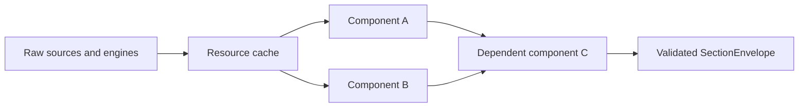

# 🧩 AI Export Composition and Prompt

AI Export composes small factual units instead of routing tasks through monolithic
profiles or domain assemblers.

The profile/assembler implementation was retired before the first Public
Catalog V1 release.
`runtime_service.py`, `Composer`, `BuildContext`, and the component/dataset/
analysis registries are the only executable snapshot pipeline.

## 🧱 ComponentSpec

A `ComponentSpec` is the smallest declarative runtime unit. It defines:

- stable `component_id` and implementation `version`;
- independent `schema_id` and `schema_version`;
- applicable domain;
- strict Pydantic `output_model`;
- sync or async builder;
- required component dependencies;
- period behavior and optional temporal aggregator metadata.

Dependencies are always required for the dependent component itself. Whether a
top-level failure is fatal depends on whether the dataset requested that component
as required or optional.



Every envelope carries `component_id`, component version, schema identity/version,
and a JSON-safe payload.

## ♻️ BuildContext and Resource Memoization

One `BuildContext` exists per snapshot request. It owns two separate caches:

1. **Component cache** — each component builds at most once, including shared
   dependencies.
2. **Typed resource cache** — raw reports, price/rate series, lots, and signal
   bundles are shared by builders but never serialized as sections.

Successes and failures are memoized. DB-backed resources use one request-scoped,
re-entrant-per-task lock because all builders share one `AsyncSession`.

The context also records price sampling, per-indicator sampling, event-selection
usage, and internal optional-component diagnostics.

## 📚 DatasetSpec, Visibility, and Public Composition

A `DatasetSpec` declares:

- domain, stable identity, version, i18n keys, icon, and applicable pages;
- required and optional component IDs;
- exact `section_order`;
- technical prerequisites and period semantics;
- supported detail levels.
- direct-selection visibility (`public` or `internal`, default internal).

The runtime registry contains 40 datasets. The public catalog exposes only:

| Domain    | General                          | Detailed                  |
| --------- | -------------------------------- | ------------------------- |
| Portfolio | `portfolio.overview_and_history` | `portfolio.asset_history` |
| Broker    | `broker.overview_and_history`    | `broker.asset_history`    |
| Asset     | `asset.position_and_history`     | `asset.market_history`    |
| FX        | `fx.market_and_exposure`         | `fx.market_history`       |

Legacy granular datasets, including `*.all_data`, remain internal composition
blocks. The catalog filters them out and direct requests using their IDs fail
closed as unsupported selections.

The four `*.all_data` datasets remain computed internal unions. They are not
special builders.
The union:

- deduplicates by component ID;
- keeps a component required if any source dataset requires it;
- keeps it optional only when every source treats it as optional;
- uses canonical component-registry order.

Focused semantic datasets such as `portfolio.asset_comparison` and
`fx.market_context` are internal projections. They remain excluded from
`*.all_data` to avoid exporting both the complete series and a duplicate summary.

Each `*.all_data` union is composed only from its domain's canonical complete
datasets:

| all_data             | Source datasets                                        | Derived contexts excluded                                                                                         |
| -------------------- | ------------------------------------------------------ | ----------------------------------------------------------------------------------------------------------------- |
| `portfolio.all_data` | `overview`, `performance_flows`, `technical`, `fifo`   | `technical_summary`, `asset_snapshot`, `asset_comparison`, `drawdown_context`, `income_evidence`                  |
| `broker.all_data`    | `overview`, `performance_flows`, `technical`, `fifo`   | `technical_summary`, `asset_comparison`, `drawdown_context`, `concentration_evidence`, `cost_efficiency_evidence` |
| `asset.all_data`     | `overview`, `position_performance`, `market_technical` | `position_context`, `drawdown_context`                                                                            |
| `fx.all_data`        | `overview`, `market_technical`, `direct_exposure`      | `market_context`, `conversion_timing_context`                                                                     |

Derived context and task-specific evidence datasets stay opt-in: they are
projections or targeted evidence for one analysis, so bundling them into
`all_data` would duplicate facts the complete series already carries.

## 🎯 Focused Technical Projections

Semantic Composition V2 adds backend-owned projection components:

- technical entity and Signal coverage;
- small uniform per-asset market snapshots;
- broader multi-asset comparison rows;
- aggregate breadth summaries;
- restricted structural-event contexts;
- focused Asset-position and FX-market contexts;
- peak-relative drawdown context delegated to the Risk engine;
- compact per-Asset observed-price Drawdown comparison for PAC Planning;
- task-specific evidence: dated income, broker concentration, broker
  cost/turnover, and non-predictive FX conversion timing.

Projection builders read the same request-scoped price/rate/Signal resources as
the complete components. They do not filter rendered payloads and do not repeat
I/O or Signal calculation. Signal/output allowlists, limited-history depth, and
event policies are declared in backend code and tested deterministically.

Complete technical datasets still contain every existing Signal, history row,
period summary, latest value, and selected full-policy event.

### 🔢 Universe Coverage Counts

Multi-asset technical coverage distinguishes raw period legs from the eligible
held universe so breadth counts are never overstated:

| Count                            | Meaning                                                                                                          | Unit   |
| -------------------------------- | ---------------------------------------------------------------------------------------------------------------- | ------ |
| `period_position_leg_count`      | Period `(broker_id, asset_id)` contribution legs before eligibility, including legs fully sold inside the period | legs   |
| `period_contributor_asset_count` | Unique asset IDs across all period legs (broker-deduplicated, includes fully-sold-in-period assets)              | assets |
| `eligible_asset_count`           | Unique currently-held (not fully sold, non-zero end value) assets, broker-deduplicated                           | assets |
| `covered_asset_count`            | Eligible assets with at least one included Signal (subset of eligible)                                           | assets |

Weight ratios use gross absolute open-position value:
`eligible_portfolio_weight_ratio` sums over all eligible assets,
`covered_portfolio_weight_ratio` over covered assets only, and
`covered_weight_ratio` is their ratio (covered ÷ eligible). Single Asset/FX
targets are not a universe: they report `selected`/`eligible`/`covered` entity
tallies (0 or 1) and carry no portfolio weight.

### 🏦 Portfolio Broker Universes

Portfolio financial components distinguish calculation scope, current positions,
and period contributors:

| Field                             | Semantics                                               | Period-sensitive |
| --------------------------------- | ------------------------------------------------------- | :--------------: |
| `scoped_broker_count`             | Brokers selected after access validation                |        No        |
| `broker_scope`                    | The same selected Broker universe, rendered as B# refs  |        No        |
| `position_broker_count`           | Brokers with current open positions at `snapshot_as_of` |        No        |
| `period_contributor_broker_count` | Brokers represented by performance contribution rows    |       Yes        |

The Portfolio Engine always runs over the full scoped set. A Broker with no current
position remains in scope. A historical contributor can appear in the period count
without appearing in the current-position count.

## 📉 Drawdown Risk Context

`portfolio.drawdown_context`, `broker.drawdown_context`, and
`asset.drawdown_context` are optional analysis sections that expose the canonical
Risk `drawdown_summary` analytic without re-deriving any math. Every payload is
produced by delegating to `RiskService.execute(... drawdown_summary ...)`; the
drawdown magnitudes, episode dates, and coverage are never recomputed from AI
Export NAV buckets.

Scope and basis are honestly typed per domain:

| Component                    | Risk scope                          | Basis                    | Currency                             |
| ---------------------------- | ----------------------------------- | ------------------------ | ------------------------------------ |
| `portfolio.drawdown_summary` | whole portfolio (`broker_ids=None`) | TWRR / `historical_twrr` | build target currency                |
| `broker.drawdown_summary`    | selected broker ID(s)               | TWRR / `historical_twrr` | build target currency                |
| `asset.drawdown_summary`     | single Asset                        | native `price_only`      | asset observed native price currency |

The Asset basis is the asset's native observed price currency (declared
dependency on `asset.market_snapshot` → `observed.native_price.code`) so it
matches the technical `price_only` / `price_only_close` semantics rather than
blindly using the portfolio target currency. When no native observation exists
the component returns an explicit `unavailable` payload, never an approximation.

There is deliberately **no FX-pair drawdown** dataset (an FX rate is not a
peer-relative wealth path), and a dedicated recovery-focused analysis remains
**deferred**: the current output already publishes
`maximum_drawdown_recovery_status` (`no_drawdown` / `recovered` / `open`) and the
recovery date, but no standalone recovery Analysis is wired yet.

If the Risk result is `unavailable`/`failed` (or the call raises) the component
still builds an honest `unavailable`/`failed` payload with a machine-readable
`reason_code`, so an optional analysis section never fails closed.

PAC Planning also uses `portfolio.asset_drawdown_snapshot`. It reuses the
Portfolio's already-loaded observed native-price series and the canonical
`drawdown_episodes` primitive to publish one compact row per eligible Asset:
current Drawdown, maximum Drawdown, maximum-episode recovery status,
remaining-to-peak, basis, observation count, available range, coverage, and
data-quality status. It exports no Drawdown history.

## 🧾 Task-specific Evidence Datasets

Baseline adequacy rating flagged missing concrete evidence for several analyses.
V2 adds deterministic, honestly-typed evidence datasets — each reuses existing
engine outputs and never forecasts:

| Dataset                           | New evidence                                                                                                                             | Honesty rule                                                                                                                                                                                  |
| --------------------------------- | ---------------------------------------------------------------------------------------------------------------------------------------- | --------------------------------------------------------------------------------------------------------------------------------------------------------------------------------------------- |
| `portfolio.income_evidence`       | dated realized `DIVIDEND`/`INTEREST` timeline, ownership-share aware, FX-converted with provenance                                       | realized ledger rows only; missing rate keeps native amount with `conversion_reason`, never coerced to zero; no coupon forecast                                                               |
| `broker.concentration_evidence`   | allocation-by-type/sector/geography/currency slices plus HHI-points and largest-position weight, optional broker-vs-portfolio comparison | slices/HHI read verbatim off the report; explicit coverage/unknown buckets; no row identifiers                                                                                                |
| `broker.cost_efficiency_evidence` | recorded fees, taxes, total costs, contributor categories, BUY/SELL turnover, average NAV and other denominators, plus explicit ratios   | recorded zero, unavailable, and not applicable stay distinct; formulas/operands/unit/coverage are exported; trading/FX/other subtypes stay unavailable when the source does not classify them |
| `fx.conversion_timing_context`    | observed period min/max, range position, distance-to-extreme, realized volatility, partial-history flag                                  | observed genuine rates only; no forecast/predictive band; flat/empty range → `range_position_unavailable_reason`; neutral-scenario user inputs surfaced through `missing_user_inputs`         |

Each evidence dataset is bound to its task analysis and complements — never
replaces — the retained aggregates (for example `portfolio.income_evidence` uses
the same `(start, end]` window as `portfolio.flows_income` so they cannot
contradict each other).

## 🧭 Public Analysis Dataset Bindings

Required datasets fail closed; optional components inside general snapshots
degrade independently. Fiscal Analyses add the internal full-FIFO dataset.

| Analysis                               | Required datasets                | Additional public export     |
| -------------------------------------- | -------------------------------- | ---------------------------- |
| `portfolio.pac_planning`               | `portfolio.overview_and_history` | `portfolio.asset_history`    |
| `portfolio.rebalancing`                | `portfolio.overview_and_history` | `portfolio.asset_history`    |
| `portfolio.performance_market_drivers` | `portfolio.overview_and_history` | `portfolio.asset_history`    |
| `portfolio.fiscal_lots`                | general + internal full FIFO     | `portfolio.asset_history`    |
| `broker.review`                        | `broker.overview_and_history`    | `broker.asset_history`       |
| `broker.performance_market_drivers`    | `broker.overview_and_history`    | `broker.asset_history`       |
| `broker.fiscal_lots`                   | general + internal full FIFO     | `broker.asset_history`       |
| `asset.position_review`                | `asset.position_and_history`     | `asset.market_history`       |
| `asset.market_analysis`                | `asset.market_history`           | `asset.position_and_history` |
| `fx.pair_analysis`                     | `fx.market_history`              | `fx.market_and_exposure`     |
| `fx.exposure_impact`                   | `fx.market_and_exposure`         | `fx.market_history`          |

Forward-looking tasks use a shared Scenario Thesis. Market-driver Analyses require
dated per-Asset research and causal confidence labels. Fiscal Analyses separate
economic FIFO evidence from jurisdiction-dependent legal tax treatment.

### 📅 PAC Planning Contract

PAC Planning uses supplied facts first and asks only for missing user inputs that
materially change the scenarios. Questions are grouped into capital/cadence,
goals/horizon, risk preferences, and operational constraints, with indispensable
answers separated from optional refinements.

The prompt may still provide conditional scenarios before optional answers exist.
It never invents budget, targets, risk tolerance, liquidity needs, exclusions, or
operating constraints. Portfolio/Asset Drawdown, trend, momentum, volatility, and
events are historical subordinate evidence, not forecasts or standalone purchase
signals.

### 🧾 Capital-Loss Offset Contract

Portfolio and Broker fiscal-lot Analyses are specifically for exploring how
available or expiring tax losses might offset legally eligible gains. Before
proposing paths, the prompt asks for:

- country of tax residence or jurisdiction, tax regime, and account/wrapper;
- official tax-loss inventory, such as the Italian `cassetto fiscale`;
- original, remaining, used/reserved, and expiring amounts by legal category;
- origin and expiry dates, offset order, limits, and eligible gain categories;
- whether balances span Brokers/accounts and can legally be pooled or transferred;
- expected gains, intended disposals, exposure constraints, liquidity, and costs.

LibreFolio FIFO rows remain economic evidence, not legal tax lots. The response
compares no-action, eligible-gain realization, staged realization/rebalancing, and
loss-harvesting paths only when relevant. Every path stays conditional, shows
expiry windows and portfolio trade-offs, and must never recommend a transaction
solely for tax reasons.

## 🧠 AnalysisSpec

An `AnalysisSpec` declares required and optional datasets, applicable pages,
applicability code, and frontend contract identities:

- instruction template ID/version;
- response contract ID/version;
- user-note support;
- structured recommendations for additional public datasets.

Each additional-export recommendation declares a dataset ID, localized reason key,
recommended period/detail, and required/optional necessity. The backend owns the
selection contract; the frontend resolves the public label and localized UI path.

## 🧮 Composer Ordering and Deduplication

Composition is deterministic:

1. required datasets in analysis declaration order;
2. optional datasets in analysis declaration order;
3. each dataset's components in `section_order`;
4. shared envelopes deduplicated by `(component_id, component_version)`;
5. first occurrence wins.

For a direct dataset export, only that dataset is composed. For an analysis, the
composer returns the ordered union of every used dataset.

No token budget, payload size, or heuristic relevance rule changes this order.

## 🗺️ Applicability

| UI page   | Runtime page slug | Domain    | Available catalog types |
| --------- | ----------------- | --------- | ----------------------- |
| Dashboard | `dashboard`       | Portfolio | datasets and analyses   |
| Broker    | `broker`          | Broker    | datasets and analyses   |
| Asset     | `asset`           | Asset     | datasets and analyses   |
| FX        | `fx`              | FX        | datasets and analyses   |

Static catalog applicability filters where an item may be offered. Runtime
applicability can additionally reject facts such as an Asset analysis requiring a
position or an FX analysis requiring direct exposure.

## 📝 Exact Prompt Order

### 📤 Export Data

Dataset selections produce `data_only`:

1. **Snapshot Metadata and Dataset Manifest**
2. **Snapshot Data**

No analysis objective, verification instructions, response contract, domain notes,
user notes, or response language is added.

### 🔬 Request Analysis

Analysis selections produce `full_prompt` in this exact order:

1. **Analysis Objective**
2. **Shared Verification Instructions**
3. **Response Contract**
4. **Snapshot Metadata and Dataset Manifest**
5. **Snapshot Data**
6. **Additional LibreFolio Data**
7. **Domain Notes**
8. **User Notes**, only when non-empty and supported
9. **Response Language**

Trusted frontend templates provide instructions. Metadata/manifests use safe YAML;
Snapshot Data uses deterministic compact text/pipe tables with a safe YAML fallback
for unknown component versions. User notes remain safely serialized untrusted data.

## 📋 Manifests

`dataset_manifest` records what was actually composed:

```yaml
dataset_manifest:
  - dataset_id: portfolio.overview
    dataset_version: 2
    role: required
  - dataset_id: portfolio.asset_comparison
    dataset_version: 2
    role: optional
```

Direct data exports use role `selected`. Analysis exports use `required` or
`optional`; an omitted optional dataset has no manifest row.

The API response also carries top-level `technical_sampling` and `event_selection`
manifests when those policies were used. Component payloads carry detailed event
selection summaries. Clipboard rendering places the dataset, technical-sampling,
and event-selection manifests in the metadata block; component payloads remain in
Snapshot Data.

The public technical manifest contains one request-level `detail_level`, the
price `bucket_count`, and per-indicator identity, `temporal_class`, and
`bucket_count`. Sampling parameters `P`, `M`, and `K` are internal mathematical
diagnostics and are never copied into the prompt.

FX responses may additionally carry `meta.history_coverage` with requested and
available periods, calendar-day coverage, observed/backfilled counts, and a
partial-history reason code. The prompt renderer presents normalized coverage as
a percentage.

## 🧪 Real Prompt Density Probe

The permanent probe exercises the same path as the UI:

```text
login
→ runtime catalog
→ official frontend request builder
→ POST /api/v1/ai-export/snapshot
→ official prompt renderer
→ saved prompt file
→ filesystem measurements
```

Run the standard tuning audit from the repository root:

```bash
LIBREFOLIO_AI_EXPORT_PROBE_PASSWORD='<local probe password>' \
pipenv run python backend/test_scripts/diagnostics/ai_export_real_prompt_probe.py \
  --profile tuning-v2 \
  --manifest-shape slim \
  --normalize-copy-credentials
```

The password is read only from the process environment and is never written to
the output. Credential normalization, when explicitly requested, modifies only
the disposable runtime copy.

For smoke, targeted, comparison, partial-history, and Task Adequacy workflows, see
[Probe Workflow & Review](ai_export_probe_workflow.md) and the project
`ai-export-probe-tuning` skill. Always inspect the current `--help`; do not copy
historical flags without verification.

The `tuning-v2` profile uses one data-rich user, the full Dashboard scope, one
deterministic Broker, one deterministic Asset, and one deterministic FX pair.
Every non-`all_data` dataset is measured at 3M/6M/1Y across all detail levels;
temporal analyses use 3M/1Y across all detail levels. New semantic datasets are
tagged as a separate comparison cohort so stable V1-to-V2 prompt keys remain
honest.

The probe creates an immutable source snapshot from the local production
database, launches a lifespan-disabled API on an independent copy, and verifies
that the source snapshot's primary SQLite file remains unchanged. A concurrently
running production server may still change the original database independently;
that drift is recorded separately.

Each timestamped run contains:

```text
real_prompt_probe/<run_id>/
├── prompts/
├── canonical/
├── metrics.json
├── summary.md
├── run_manifest.json
└── failures.json
```

`metrics.json` keeps canonical JSON measurements as diagnostics, but the primary
decision metric is always the content reread from the final rendered prompt file.
Canonical payload files are not retained by default; use `--keep-canonical` only
when debugging a specific case.

## 🚨 Failure and Partial-Success Semantics

| Situation                                         | Result                                                                                                             |
| ------------------------------------------------- | ------------------------------------------------------------------------------------------------------------------ |
| Required component raises                         | Whole snapshot fails with `503 snapshot_source_failure`.                                                           |
| Optional component raises                         | Component omitted; diagnostic remains internal.                                                                    |
| Required dataset component raises                 | Analysis fails closed.                                                                                             |
| Optional dataset has a required-component failure | Entire optional dataset is skipped.                                                                                |
| Builder returns an empty valid payload            | Section remains successful and included.                                                                           |
| Analysis facts fail applicability                 | `422 selection_not_applicable`.                                                                                    |
| Signal result is `unavailable` or `failed`        | Only that indicator instance is omitted.                                                                           |
| Signal result is `ok` or `partial`                | Indicator is exported with its available canonical series.                                                         |
| FX warm-up dates precede source history           | Missing prefix dates are skipped; available observations and calculable Signal are returned with coverage warning. |
| No FX rate exists on or before snapshot date      | Snapshot fails with a typed source reason.                                                                         |
| Contract identity differs                         | `409 version_mismatch`; no fallback.                                                                               |

Signal omission is intentionally narrower than component failure: one
non-calculable indicator does not remove sibling indicators, the technical
component, or unrelated datasets.

## 📎 Frontend Clipboard Boundary

Frontend flow:

1. load and validate catalog compatibility;
2. submit selected V1 IDs and versions;
3. validate snapshot identity and analysis contract;
4. render safe deterministic text;
5. write through Clipboard API, with textarea fallback where required.

Clipboard transport changes only how the same final prompt is copied. It never
switches builders, serializers, financial logic, sampling, or contract versions.
No network request to an AI provider occurs.

## 🧭 Localized Additional Data Guidance

For Request Analysis prompts, the frontend renders only the catalog suggestions
declared by that Analysis and not already present in the manifest. Each block
contains:

- localized public dataset label and description;
- localized reason;
- localized LibreFolio UI path;
- recommended period and detail;
- required/optional status;
- no internal dataset ID.

The renderer does not decide which financial or technical data is useful; it only
presents the backend contract.

## 🔗 Related Documentation

- [AI Export Overview](ai_export_snapshot.md)
- [Technical Sampling](ai_export_sampling.md)
- [Probe Workflow & Review](ai_export_probe_workflow.md)
- [Signal Plugin Guide](signal_plugin_guide.md)
