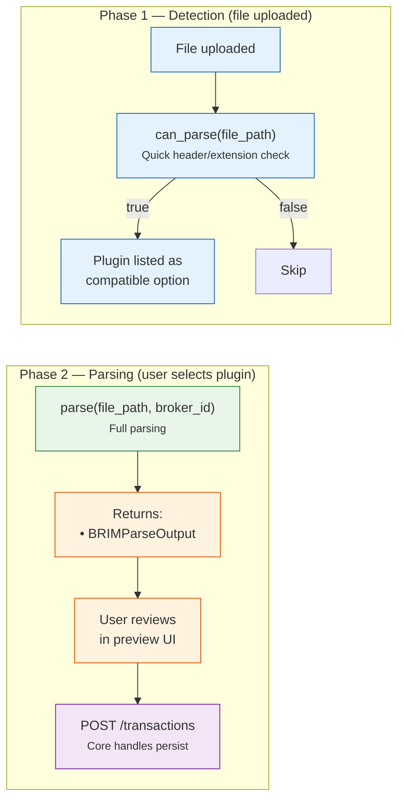

# 📦 BRIM Plugin Guide

How to create a new **Broker Report Import Manager** plugin to support a new broker's CSV/Excel export format.

**Base class**: `BRIMProvider` (in `backend/app/services/brim_provider.py`)
**Plugin folder**: `backend/app/services/brim_providers/`
**Registry**: `BRIMProviderRegistry`

---

## 🤖 Tip: Let an LLM write the plugin for you

Paste this entire page plus the [Generic CSV Provider](../../backend/brim/generic_csv.md) page into an LLM and use this prompt:

!!! tip "Suggested prompt"

    ```
    Here is the LibreFolio BRIM plugin specification: [paste this page]
    Here is the Generic CSV reference implementation: [paste generic_csv page]

    I have a broker called [BROKER_NAME]. Here is a sample of their CSV export: [paste header + 3–5 rows]

    Write a complete Python BRIMProvider plugin for this broker. Follow the conventions
    exactly (BRIMParseOutput, BRIMExtractedAssetInfo, sign conventions, @register_provider).
    ```

    The LLM will produce a complete, working plugin skeleton. Test it with the probe endpoint,
    then add it to `brim_providers/` and restart — it will be auto-discovered.

---

## 🔄 Flow

The system calls plugin methods in two distinct phases:



**Phase 1** runs automatically when a file is uploaded — every registered plugin is asked if it can parse the file. Compatible plugins are listed for the user.

**Phase 2** runs when the user selects a specific plugin — the plugin parses the file, the user reviews the results, and confirms the import.

**Plugin responsibility**: Read the broker-specific file format and convert to standard `TXCreateItem` DTOs.
**Core responsibility**: File storage, asset matching, duplicate detection, database persistence.

---

## 🧭 Import philosophy & currency rules

A BRIM plugin is a **faithful transcriber, not a re-calculator**. These rules are
mandatory for every new plugin:

- **Verbatim / copy-paste import.** Import the numbers exactly as they appear in the
  broker's report. Do not recompute totals, prices or amounts; transcribe them.
- **No forex system.** A BRIM plugin must **never** invoke the FX subsystem and must
  **never** convert amounts using the report's own exchange-rate column. If the export
  has a rate column (e.g. Fineco's *Cambio*), **ignore it**.
- **Currency from the source.** Derive each transaction's currency from the broker's own
  currency column (per row) and tag **every** monetary figure in that row with it. A
  single file may legitimately contain multiple currencies — that's expected, keep them
  as reported.
- **Delimiter detection.** Always resolve the separator with
  `self.detect_csv_delimiter(file_path)` — **never hardcode** `,` or `;`.
- **Multiple export layouts.** When a broker ships more than one report layout (e.g. with
  and without commission columns), detect the variant **dynamically** — locate the header
  row and branch on the actual column set rather than assuming a fixed line offset.
- **Sign conventions.** Set signs per `TransactionType` (BUY: qty > 0, cash < 0; SELL:
  qty < 0, cash > 0; DIVIDEND/INTEREST: qty = 0, cash > 0; FEE/TAX: qty = 0, cash < 0;
  ADJUSTMENT: qty ≠ 0, no cash), but take the **magnitudes** verbatim from the report.
- **One source row may emit several transactions.** Keep economic legs explicit: securities-only buys can be `DEPOSIT + BUY`, sells can be `SELL + WITHDRAWAL`, maturities can be `SELL at par + INTEREST`, and snapshots can be `DEPOSIT + ADJUSTMENT` seeds.
- **Fake asset IDs.** Emit high positive fake asset IDs (keyed by ISIN/ticker) plus
  `BRIMExtractedAssetInfo` so the core can drive the asset-matching UI.

---

## 📋 ABC Methods

### ✅ Required (Abstract)

| Method | Signature | Description |
|--------|-----------|-------------|
| `provider_code` | `@property → str` | Unique identifier (e.g., `"directa_csv"`) |
| `provider_name` | `@property → str` | Display name (e.g., `"Directa CSV"`) |
| `description` | `@property → str` | Brief description for the UI |
| `can_parse(file_path)` | `→ bool` | Quick check if this plugin can parse the file (check extension, header row) |
| `parse(file_path, broker_id)` | `→ BRIMParseOutput` | Full parsing — returns structured BRIMParseOutput object containing transactions, warnings, and extracted asset info |

### 🔧 Optional (Override)

| Method | Default | Description |
|--------|---------|-------------|
| `supported_extensions` | `['.csv']` | Accepted file extensions |
| `detection_priority` | `100` | Auto-detection priority (higher = checked first). Use 0-49 for generic plugins. |
| `icon_url` | `None` | Broker favicon URL for the UI (see [Favicons](#favicons)) |
| `docs_url` | `None` | Link to a user-facing MkDocs page. Leave `None` if no page exists (avoids dead links). |
| `plugin_version` | `"1.0.0"` | Semver of the parsing logic — **bump it** whenever output for the same input changes |
| `test_file_pattern` | `None` | Single filename substring used by the test suite to map a sample → this plugin |
| `test_file_patterns` | derived from `test_file_pattern` | **List** of filename substrings when one plugin owns several export formats (e.g. `["revolut-invest", "revolut-crypto"]`) |
| `generate_static_url(path)` | — | Helper to build `/api/v1/uploads/plugin/brim/{path}` |

### 🧰 Base-class helpers you should use

Defined on `BRIMProvider` — call these instead of re-implementing:

| Helper | Use it in | What it does |
|--------|-----------|--------------|
| `self._read_file_head(file_path, num_lines=15)` | `can_parse` | Reads the first N lines trying multiple encodings (utf-8-sig, utf-8, latin-1, cp1252) |
| `self.detect_csv_delimiter(file_path)` | `parse` | Sniffs the delimiter (`,` `;` `\t`) via `csv.Sniffer` with a char-count fallback |
| `self._create_transaction(row_num, transactions, validation_issues, context, **tx_fields)` | `parse` | Builds a `TXCreateItem`, appends on success, or records structured `BRIMValidationIssue`s on `ValidationError`. **Never** call `TXCreateItem(...)` directly. |

---

## 💻 Implementation Example

```python
# backend/app/services/brim_providers/my_broker.py

from pathlib import Path
from backend.app.services.brim_provider import BRIMProvider
from backend.app.services.provider_registry import register_provider, BRIMProviderRegistry
from backend.app.schemas.brim import BRIMExtractedAssetInfo, BRIMParseOutput
from backend.app.schemas.transactions import TXCreateItem

@register_provider(BRIMProviderRegistry)
class MyBrokerProvider(BRIMProvider):

    @property
    def provider_code(self) -> str:
        return "my_broker_csv"

    @property
    def provider_name(self) -> str:
        return "My Broker (CSV)"

    @property
    def description(self) -> str:
        return "Import transactions from My Broker CSV exports"

    def can_parse(self, file_path: Path) -> bool:
        """Quick check: read first lines and look for known header."""
        content = self._read_file_head(file_path, num_lines=5)
        return "Date;Operation;ISIN;Amount" in content

    def parse(self, file_path: Path, broker_id: int) -> BRIMParseOutput:
        """Parse the CSV and return transactions in a BRIMParseOutput envelope."""
        transactions = []
        warnings = []
        extracted_assets = {}

        # ... your parsing logic ...

        return BRIMParseOutput(
            transactions=transactions,
            warnings=warnings,
            extracted_assets={
                fake_id: BRIMExtractedAssetInfo(
                    extracted_symbol=info["extracted_symbol"],
                    extracted_isin=info["extracted_isin"],
                    extracted_name=info["extracted_name"],
                )
                for fake_id, info in extracted_assets.items()
            }
        )
```

### 🔍 Auto-Discovery

Place the file in `brim_providers/` and restart the app. The `BRIMProviderRegistry` will automatically discover and register it. The plugin will appear in the [ImportPluginSelect](../../frontend/components/core-ui/select.md#importpluginselect) dropdown.

---

## 🧭 Real-world reference plugins

Copy the structure of an existing, well-tested plugin rather than starting from scratch:

| File | Best example of |
|------|-----------------|
| `backend/app/services/brim_providers/broker_directa.py` | Equity/ETF, index-based columns, Italian types, ISIN grouping, tax/fee linking |
| `backend/app/services/brim_providers/broker_generic_csv.py` | Column auto-detection, locale-aware number parsing |
| `backend/app/services/brim_providers/broker_coinbase.py` | Crypto assets (symbol, no ISIN), staking as `ADJUSTMENT`, separate fee tx |
| `backend/app/services/brim_providers/broker_revolut.py` | **One plugin, two formats** (invest + crypto) via header detection |
| `backend/app/services/brim_providers/broker_intesa.py` | CSV/XLSX, two layouts in one plugin; patrimonio snapshot → liquidity `DEPOSIT` when present + per-holding `ADJUSTMENT` seed with per-unit `cost_basis_override` |
| `backend/app/services/brim_providers/broker_credit_agricole.py` | **Richest wizard integration**: two layouts in one plugin, 4-tier causale registry, evidence tables, `info` notices, blocking and splitting field todos — read it before designing any `field_todos`. Also: automatic cash counter-entries, par-100 bond maturity split, succession rows as cashless `ADJUSTMENT` |
| `backend/app/services/brim_providers/broker_saxo.py` | Mixed trade/cash rows, verb-in-text events, localized verbs |

## 📥 Canonical imports

```python
from __future__ import annotations

import csv
from datetime import date as date_type
from datetime import datetime
from decimal import Decimal, InvalidOperation
from pathlib import Path
from typing import Dict, List, Optional

import structlog

from backend.app.db.models import TransactionType
from backend.app.schemas.brim import FAKE_ASSET_ID_BASE, BRIMAssetNotice, BRIMExtractedAssetInfo, BRIMParseOutput, BRIMValidationIssue
from backend.app.schemas.common import Currency
from backend.app.schemas.transactions import TXCreateItem
from backend.app.services.brim_provider import BRIMParseError, BRIMProvider
from backend.app.services.provider_registry import BRIMProviderRegistry, register_provider

logger = structlog.get_logger(__name__)
```

## ➕➖ Sign conventions (enforced by the test suite)

`TransactionType` (in `backend/app/db/models.py`) fixes the sign of `quantity` and cash
`amount`. `test_all_transactions_are_schema_valid` fails the plugin if any emitted
transaction breaks these rules, so flip source signs as needed:

| Type | quantity | cash amount | asset |
|------|----------|-------------|-------|
| `BUY` | `> 0` | `< 0` | required |
| `SELL` | `< 0` | `> 0` | required |
| `DIVIDEND` | `= 0` | `> 0` | required |
| `INTEREST` | `= 0` | `> 0` | optional |
| `DEPOSIT` | `= 0` | `> 0` | none |
| `WITHDRAWAL` | `= 0` | `< 0` | none |
| `FEE` | `= 0` | `< 0` | optional |
| `TAX` | `= 0` | `< 0` | optional |
| `ADJUSTMENT` / `TRANSFER` | `+/-` | **must be `None`** | optional |

- `DIVIDEND`/`INTEREST` carry **no** quantity — set `quantity=0` and discard any token
  amount with a warning (see coinbase).
- **Crypto — the fiat leg decides the type.** If a row settles in **fiat** (your account
  currency) use a cash type: buy crypto with fiat → `BUY`, sell for fiat → `SELL`, a reward
  paid out in fiat → `INTEREST`, a stock payout → `DIVIDEND`, plain cash in/out →
  `DEPOSIT`/`WITHDRAWAL`. If a row has **no fiat leg** — staking/airdrop paid in coins, a
  crypto↔crypto trade, an on-chain transfer in/out, or a crypto-denominated fee — model it as
  a **cashless `ADJUSTMENT`** (`quantity` +/-, `cash=None`) so the position still updates.
  This is what keeps every crypto row schema-valid, because `ADJUSTMENT` forbids a cash
  amount. Reference: `broker_bitvavo.py`, `broker_cointracking.py`, `broker_delta.py`,
  `broker_cryptocom.py` (note `cryptocom` emits `INTEREST` for fiat-valued rewards but a
  cashless `ADJUSTMENT` for coin-only rewards).
- Prefer **skipping a row with a warning** over emitting a schema-invalid transaction.

!!! tip "Warning language follows the input format"

    A plugin's user-facing `warnings` (and any `BRIMAssetNotice.reason`) should be written
    in the language of the export it parses. For a single-nation broker whose report is
    published in only one language — e.g. Crédit Agricole, Directa, Intesa Sanpaolo, Fineco
    (Italian) — emit the warnings in that language so they match the report the user is
    reading. When a broker ships differently localized export layouts (a UK vs. IT Fineco
    file, a non-Italian Crédit Agricole entity), detect the format and emit each variant's
    warnings in its own language. Code, comments and docstrings stay in English.

!!! warning "`cost_basis_override` is PER-UNIT, never a total"

    When a plugin freezes an inherited cost basis (WAC) on a `TRANSFER`/`ADJUSTMENT`
    seed — e.g. an opening *patrimonio* snapshot, or a `TRANSFER_IN` — the value you put
    in `cost_basis_override` (and its `cost_basis_currency`) **must be the cost per single
    unit**, not the position's total countervalue. The portfolio engine and the lot
    analysis both **multiply it by `quantity`** to reconstruct the total cost basis, so a
    total slipped in here is silently multiplied again and blows the cost basis up by a
    factor of `quantity`.

    If your source only reports a **total** (e.g. Intesa's *"Controvalore di carico
    fiscale €"*), divide it by the quantity first:

    ```python
    unit_cost = (total_cost / qty).quantize(Decimal("0.000001"))
    cost_basis_override = Currency(code="EUR", amount=unit_cost)
    ```

    Bond nominal note: for bonds `quantity` is the face value (e.g. `50000`) and the seed
    per-unit cost lands near `1.0` — that is correct, the engine handles the /100 quote
    scaling elsewhere. Canonical example: `broker_intesa.py` (patrimonio seed).

!!! tip "Matured-bond redemption: close at par, surplus → INTEREST"

    A bond is **redeemed at par (100)** at maturity. When the bank credits *more* than par
    (e.g. a BTP Italia *premio fedeltà* or a `FOI` inflation revaluation), that surplus is
    **reddito di capitale** — the same nature as a coupon — and must be booked as a separate
    **`INTEREST`** leg, *not* folded into the sale price. Folding it in would inflate the
    realised gain and leave a residual position when `ctv/price` ≠ the true nominal.

    **Working assumption (document it on the plugin's own page):** a maturity/redemption row
    is a bond quoted at par 100, so *anything above 100 is interest*. A plugin whose maturity
    causale is bond-specific (e.g. Crédit Agricole's `TITOLI SCADUTI`) can apply this
    unconditionally; a plugin whose causale is generic (e.g. Fineco's `Rimborso`, which also
    covers equities) must still gate on `io.looks_like_bond(name)`. Generalise only when a
    real counter-example appears.

    The nominal to redeem comes from the **held position** (the BUY / succession / seed
    rows), never from the maturity row itself (whose `quantity` is often `0`). Use the shared
    helper:

    ```python
    from backend.app.services.brim_providers import _brim_io as io

    if ctv is not None:                       # (+ io.looks_like_bond(name) if the causale is generic)
        model = io.model_bond_maturity(ctv=ctv, price=price, held_qty=held or None)
        sell_qty  = -model.nominal            # SELL closes the nominal at par, e.g. -30000
        sell_cash = model.principal_cash      # e.g. 30000.00 (nominal × par/100)
        if model.surplus_cash > 0:            # surplus over par → INTEREST income
            emit_interest(cash=model.surplus_cash)   # e.g. 105.00
    ```

    - **`held_qty > 0` → `source == "position"`**: exact close, **no verify flag**. This is
      the normal case — the nominal lives in the position, so there is nothing for the user
      to check. If the file is not chronologically ordered, pre-compute the position in a
      first pass (see `broker_credit_agricole.py`).
    - **no position → `source == "derived"`**: the nominal is inferred from `ctv/price` (a
      best effort, imprecise because the quoted price embeds the premium — e.g. `30105/100.40
      = 29985` vs a true `30000`). This happens on a **partial download** (a "last 3 months"
      export where the buy legs are missing). Attach a `warning` `BRIMFieldTodo`
      (`reason_code="derived_quantity"`) so the user verifies the nominal — the plugin sees
      only the file, so it cannot confirm the close against the position already stored in
      LibreFolio (that reconciliation happens in the portfolio engine at compute time).
    - **Cash-only maturity in a bank/account export → nominal from a same-day companion
      row (still in-file).** Some exports carry the redemption only as a *cash* row with no
      securities position and no reliable price (e.g. Crédit Agricole's account
      `TITOLI SCADUTI O ESTRATTI`, whose truncated securities export had already dropped the
      opening BUY). Such a row has just the total cash, so it cannot split par vs premium on
      its own. Recover the nominal from **another row in the same file**: the final coupon
      paid on the same date states the security's `ISIN` + `NOMINALE`. Match the two by
      security code in a first pass, then feed that nominal as `held_qty` to
      `model_bond_maturity` (`source == "position"`). This **never touches the database** — a
      plugin only ever reads its own file. If no same-day companion row identifies the
      security, **book the whole redemption as a `SELL` for the full cash (everything as sold,
      no premium split) plus a `warning`** — never a plain cash `DEPOSIT`, so the proceeds
      reduce a position instead of inflating paid-in capital (consistent with the
      securities-export fallback). With no held position and no reported price, assume a par
      (100) redemption so the derived nominal equals the cash (`SELL` with `quantity < 0`,
      flagged for the user to verify). See `broker_credit_agricole.py`
      (`_parse_account_movements`, `income_identity_by_date`, `_ACCT_MATURITY_CAUSALI`).
    - A price **at or below par** yields `surplus_cash == 0` → emit a single plain SELL
      (pass-through); don't invent negative income.
    - Keep the plugin's usual cash model: if BUYs get a balancing `DEPOSIT` and SELLs a
      `WITHDRAWAL`, the par principal nets to zero and only the `INTEREST` surplus adds cash.

    Reference plugins: `broker_credit_agricole.py` (`TITOLI SCADUTI` in the securities export
    with the position pre-computed from succession legs, **and** the account cash-only
    `TITOLI SCADUTI O ESTRATTI` with the nominal recovered from the same-day coupon) and
    `broker_fineco.py` (`Rimborso` above par, nominal from the row).

## 📡 Talking to the import wizard

A plugin does not only produce transactions. It produces **what it could not do**, and that
is what drives the wizard's UI. There are **four output channels**, and picking the right one
is the single most important design decision in a plugin:

| Channel | Field on `BRIMParseOutput` | The plugin is saying | Where it shows |
|---------|---------------------------|----------------------|----------------|
| Transactions | `transactions` | "I read this row" | Review table |
| Validation issues | `validation_issues` | "I read this row and the schema refused it" | Parse-detail modal, red |
| Notices | `warnings` | "Something about the **file** you should know" | Parse-detail modal + confirmation modal |
| Field todos | `field_todos` | "I booked this row but a **specific field** is a guess" | **Correction step**, before the duplicate check |

!!! danger "A notice is not a todo"

    The line is not severity, it is **actionability**. If the user can fix it on one row,
    it is a `BRIMFieldTodo`; if it is a statement about the file as a whole, it is a
    `BRIMNotice`. Putting a fixable problem in `warnings` sends the user to a modal that
    offers no way to fix it, and showing the same finding in both channels teaches them to
    skip both. Crédit Agricole has a test asserting a given finding appears in exactly one.

### 🔔 `BRIMNotice` — something about the file

```python
warnings.append(
    BRIMNotice(
        severity="info",                       # "info" (blue) | "warning" (amber)
        code="ca_unknown_causale",             # machine-readable, i18n-stable
        message="12 righe con 3 causali non previste …",   # report's language
        context={"causali": [...], "row_count": 12},
        evidence=[...],                        # see below
    )
)
```

- `severity="info"` — *the plugin did something correct and non-obvious*: explain it. An
  unknown transaction code booked by sign, a succession row turned into a cashless
  `ADJUSTMENT`. Blue, still surfaced in the confirmation modal.
- `severity="warning"` — *the plugin had to fall back or guess*: look at it.
- A bare `str` still works (coerced to `severity="warning"`, `code="legacy"`), but new code
  should never use it: the `code` is what lets the frontend and the tests address the notice.

### 🔎 `BRIMEvidence` — show the row, do not just describe it

Every notice and every todo can carry evidence tables. This is what turns *"row 282 looks
bundled"* into something the user can check without opening the file:

```python
BRIMEvidence(
    title="Riga di acquisto",                 # short caption
    headers=["Data Op.", "Causale", "Descrizione", "Importo"],
    rows=[["28/07/2025", "COMPRAVENDITA …", "NOTA INF. ACQ. TIT:BTP …", "-46603.73"]],
    row_numbers=[282],                        # 1-based source line, per row
    comment="L'importo di questa riga è un totale: comprende …",
)
```

- **`row_numbers` is not decoration.** It renders a *"row N in the file"* button that opens
  the file preview scrolled to that line, so the user sees the neighbours too. Omit it and
  the evidence becomes an unverifiable claim.
- **Attach evidence at the moment the plugin gives up** — that is the only moment the source
  row is still in hand. Re-reading the preview later costs a fetch and misaligns indexes if
  the preview paginates.
- **`comment` is the reasoning, the message is the headline.** The collapsed row in the
  correction list is read while scrolling twenty others: keep it to one line. Everything the
  plugin looked at, found and concluded belongs in `comment`, which is read only by someone
  who opened the row.
- Several tables are allowed: Crédit Agricole shows the purchase row **and** the coupon row
  that supplied the nominal, each with its own comment.

### 🧩 `BRIMFieldTodo` — one field, one question, one screen

```python
BRIMFieldTodo(
    tx_index=len(transactions) - 1,     # index into transactions[]
    field="asset_id",                   # TXCreateItem field that needs input
    severity="blocker",                 # "blocker" | "warning"
    reason_code="ca_account_trade_unresolved",
    message="Riga 282: acquisto di BTP … — l'importo potrebbe raggruppare più voci.",
    context={...},                      # see the contract below
    evidence=[source_row_evidence(row, offset, comment="…")],
)
```

**`field` and `severity` together decide where the row lands**, so they are not free-form:

| `severity` | `field` | Wizard behaviour |
|-----------|---------|------------------|
| `blocker` | one of `type`, `date`, `quantity`, `asset_id`, `cash`, `cash.amount`, `cash.code` | Correction step, **"trades" panel**. The step cannot be passed until every such row is settled. |
| `blocker` | anything else (e.g. `cost_basis_override`) | Carried on the transaction, but **not** shown in the correction step — that screen cannot fix it. |
| `warning` | `asset_id` | Correction step, **"charges" panel** — a fee or an income with no instrument. |
| `warning` | any, with `context.split_hint` | Correction step, **"split" panel** — see below. |

A row is filed by its **worst** todo: a `blocker` that also carries `split_hint` lands in the
trades panel, and its split zone appears there as soon as the user types the row into a
`BUY`/`SELL`. That is deliberate — an unresolved trade is a trade too, only a less complete
one, and its total is bundled for exactly the same reason.

!!! info "Why blockers must be *duplicate-relevant* fields"

    The correction step runs **before** the duplicate comparison, and only for fields the
    comparison actually reads (`DUP_RELEVANT_FIELDS` in `ImportWizardModal.svelte`). A
    purchase the plugin could only record as a cash withdrawal gets compared against cash
    withdrawals — a real duplicate is missed, an imaginary one invented. Correcting after
    the comparison cannot repair that; correcting before it can.

### 🗝️ `context` keys the frontend understands

`context` is a free `Dict[str, Any]`, but a handful of keys are a **contract** with the
correction step. All of them are currently produced by `broker_credit_agricole.py`, which is
the reference implementation:

| Key | Type | Effect in the wizard |
|-----|------|----------------------|
| `split_hint` | `str` (e.g. `"trade_charges"`) | **Presence alone** turns the row into a split candidate. The split zone then appears only if the row's type is `BUY` or `SELL` — the plugin's own or the one the user just picked. |
| `split_suggestions` | `List[str]` | Bullet list of what the plugin found *elsewhere in the file* about this row. |
| `compare_nominal` | `bool` | Shows the "row amount vs face value" comparison. Set it `False` on sales: proceeds have no reason to resemble the face value, and showing them side by side invites the user to read a gap that means nothing. |
| `nominale` | `str`/`Decimal` | The face value shown in that comparison. Requires `compare_nominal: True`. |
| `nominale_row` | `int` | Source line of the row the nominal was read from; renders as a link into the file preview. |
| `cash`, `currency` | `str` | The row total, used when the transaction itself cannot supply it (unresolved rows). |
| `row` | `int` | Source line number — always include it. |

Everything else in `context` is free: it is passed through untouched and is useful for tests
and for i18n interpolation.

!!! tip "Fire the todo on the *shape* of the row, not on a contradiction you happened to spot"

    Crédit Agricole first raised the split todo only when the cash disagreed with a face
    value recovered from a coupon **in the same file**. A user importing period by period —
    the purchase this month, the coupons next year — never saw it, because by then the
    purchase was already imported. The trigger had to become *"this is a trade, and this
    layout never separates price from charges"*: fired on **every** resolved `BUY`/`SELL`.

    That inversion is only acceptable because the noise was **measured before accepting it**:
    on the real files it went from 2 to 3 warnings over 507 transactions, because account
    trades are rare in this layout. Measure yours the same way; a flag on every row is a
    flag on no row.

### ✂️ The split zone (`split_hint`)

When one source row bundles several economic facts — a bond bought on the secondary market
pays price, accrued interest and commissions in a single debit — the plugin must **not**
invent the breakdown. It flags the row, and the user, who has the contract note, types the
charges. The wizard writes N extra `FEE`/`TAX` legs and leaves the rest on the trade, so the
legs always re-sum to the source row.

The plugin's only job is the flag plus honest suggestions. The most valuable suggestion is
the one that **prevents a mistake**: if the file *already* books a commission row within a
few days, splitting it out of the trade total again would count it twice.

```python
BRIMFieldTodo(
    ...,
    field="cash",
    severity="warning",
    context={
        "row": offset,
        "split_hint": "trade_charges",
        "compare_nominal": is_buy,
        "nominale": str(nominal), "nominale_row": nominal_row,
        "split_suggestions": [
            "Il file registra già una riga di spese il 30/07/2025 (−40,00 €): se la scorpori "
            "di nuovo da questo totale la conti due volte.",
            "È un'obbligazione: se non l'hai comprata all'emissione, parte dell'importo è "
            "rateo cedolare.",
        ],
    },
)
```

!!! warning "Accrued interest is a `FEE`, never an `INTEREST`"

    `schemas/transactions.py` rule 11 requires `cash > 0` for `INTEREST`, and accrued
    interest paid on a purchase is money **leaving**. `FEE` is also the semantically right
    answer, not a workaround: accrued interest is not part of the security's cost — it comes
    back with the first gross coupon — and `FEE` is exactly the type the FIFO engine keeps
    out of the cost basis (`_LOT_AFFECTING_TYPES` in `portfolio_service.py`).

## 🆔 Fake asset IDs

Asset-linked transactions reference a *fake* high positive asset id at parse time; the core
maps it to a real asset later. Allocate them yourself, grouping rows of the same asset:

```python
next_fake_id = FAKE_ASSET_ID_BASE          # 2**31 - 1 high positive sentinel
asset_to_fake_id: dict[str, int] = {}
extracted_assets_raw: dict[int, dict] = {}

asset_key = isin or ticker                 # stable key per asset
if asset_key in asset_to_fake_id:
    asset_id = asset_to_fake_id[asset_key]
else:
    asset_id = next_fake_id
    asset_to_fake_id[asset_key] = asset_id
    extracted_assets_raw[asset_id] = {
        "extracted_symbol": ticker or None,
        "extracted_isin": isin or None,     # None for crypto
        "extracted_name": name or None,
    }
    next_fake_id -= 1
```

Return them as `BRIMExtractedAssetInfo` in `BRIMParseOutput.extracted_assets`. Every
`tx.asset_id` must appear as a key (checked by `test_extracted_assets_consistent_with_transactions`).

## ⚠️ Per-asset import notices

A `BRIMAssetNotice` is not about a transaction, it is about the **instrument**: something the
user needs to know at the moment they create it. Attach them to the `BRIMExtractedAssetInfo`:

```python
extracted_assets[asset_id].notices.append(
    BRIMAssetNotice(
        kind=io.MATURITY_NOTICE_KIND,          # "maturity_suspected"
        reason="Rilevata almeno una transazione di scadenza/rimborso.",
        transaction_indexes=[tx_index],
    )
)
```

`BRIMAssetMapping.notices` carries them to the frontend; the asset-create modal groups them
by `kind` into amber banners and de-duplicates identical `reason` texts, so the same notice
raised by three files collapses into one bullet. Informational only — they never change
import behaviour.

The `kind` needs an i18n label under `assets.modal.importNotices.kind.*`; an unknown `kind`
falls back to the generic label, so a new category degrades instead of breaking.

### 🪦 The maturity advisory (shared helper)

The one category shipped today. It is the **only warning** telling the user that a security is
delisted and that no price provider will ever quote it — without it, the asset is created
silently and then fails to price with no explanation:

```python
from backend.app.services.brim_providers import _brim_io as io

for asset_id, idxs in io.detect_maturity_hits(transactions).items():
    info = extracted_assets.get(asset_id)
    if info is not None:
        info.notices.append(BRIMAssetNotice(kind=io.MATURITY_NOTICE_KIND, reason="…", transaction_indexes=idxs))
```

`detect_maturity_hits` scans `description` with `looks_like_maturity` (substrings `scadut`,
`scaden`, `rimbors`, `estinzion`, `redemption`, `matured`, `maturity`) and **skips rows with
no asset**, which is what keeps a cash refund (`SCT:RIMBORSO` on a bank transfer, a tax
rebate) from ever labelling an instrument as expired.

!!! danger "Call it from **every** layout your plugin parses"

    Real bug, found in beta: Crédit Agricole wired the scan into its securities-export branch
    only. A bond redeemed in the *account statement* got its `SELL` but no notice — and the
    account file is the one that spans years, so that is where redemptions normally appear.
    A plugin with two `_parse_*` branches needs the call in both; factor it into one helper
    (`_attach_maturity_notices`) so adding a third branch cannot forget it.

Reference: `broker_credit_agricole.py`, `broker_intesa.py`.

## 🚪 Opening-date gate

Do not implement an opening-date filter in the backend plugin. The shipped gate lives in the Svelte import wizard and uses the local status key `before_opening` (not a backend enum). The exact comparison is strict:

```ts
return info !== null && txDate !== '' && txDate < info.openedAt;
```

Rows before the broker opening date are deselected and non-importable; rows on the opening day remain importable. The wizard offers **Edit broker date** and re-checks after broker data refresh.

## 🔀 One plugin, several export formats

A single broker often ships multiple export layouts (e.g. Revolut *invest* vs *crypto*).
**Do not create two plugins** unless the files are genuinely indistinguishable and the user
must choose. Instead:

1. Make `can_parse` return `True` for **any** owned layout (detect by header).
2. In `parse`, read the header row, pick the variant, and dispatch to a private helper
   (`_parse_invest(...)` / `_parse_crypto(...)`), keeping one `BRIMProvider` class.
3. Register **one sample per variant** in `sample_reports/` and list every filename
   substring in `test_file_patterns`:

```python
@property
def test_file_patterns(self) -> List[str]:
    return ["revolut-invest", "revolut-crypto"]
```

The test suite loops over every matching sample, so each variant is exercised.

## 🧪 Register a sample (required for tests)

The parametrized suite in `backend/test_scripts/test_external/test_brim_providers.py`
auto-covers your plugin — **but only if a sample is present**. Copy one real (anonymized)
export into `backend/app/services/brim_providers/sample_reports/`, with a filename that
contains your `test_file_pattern`/`test_file_patterns` substring:

```bash
cp mybroker-export.csv backend/app/services/brim_providers/sample_reports/mybroker-export.csv
```

Then run just the BRIM suite:

```bash
./dev.py test external brim-providers                       # all plugins
./dev.py test external brim-providers --providers broker_mybroker   # one plugin
```

`test_all_plugins_used_at_least_once` and `test_specific_broker_detection_via_plugin_pattern`
will fail if the sample is missing or if `can_parse` collides with another plugin — keep the
header check specific.

## 🖼️ Favicons

Set `icon_url` to the broker's favicon (`https://<domain>/favicon.ico`). It is rendered both in
the app **Settings → Import** UI and on the mkdocs import page, so it must be embeddable
**cross-origin**. Two failure modes to check for:

- **Cloudflare / bot block** — the domain returns `403`/`404` to non-browser requests but the
  icon still loads in a real browser. `curl -sI` is *not* conclusive here; if it renders in the
  UI, keep it.
- **`cross-origin-resource-policy: same-origin`** — the icon downloads fine with `curl` but the
  browser refuses to embed it from another origin, so it renders **nowhere** in-app (this was
  the Delta case). Check for it:

    ```bash
    curl -sI -L https://<domain>/favicon.ico | grep -i cross-origin-resource-policy
    ```

    If it reports `same-origin`, don't hotlink it — use Google's CORP-free favicon proxy
    (which sends `cross-origin-resource-policy: cross-origin`):

    ```python
    return "https://www.google.com/s2/favicons?domain=<domain>&sz=64"
    ```

    When you place that proxy URL in an HTML `` inside the docs, escape the
    ampersand as `&amp;sz=64`; the raw `&` is fine in the Python `icon_url` string.

If no working icon exists, ship `icon_url = None` and mark the broker in
[Providers List](../../backend/brim/providers_list.md) for a maintainer to fill in.

## 📚 Register the user-facing docs

Expose the plugin to users by wiring up its documentation. Point `docs_url` at the page.

`docs_url` accepts **either** an internal MkDocs slug **or** an external absolute URL:

- **Internal wiki slug (recommended, the convention used by every current plugin)** —
  an absolute `/mkdocs/...` path. Use this whenever you ship a page under
  `user/transactions/import/`. The frontend localizes it automatically by rewriting
  `/mkdocs/` → `/mkdocs/<lang>/`, so **only the internal slug form gets translated**.
- **External URL** — a full `https://...` link to a broker help page. Allowed (opens in a
  new tab) but it is **not** localized, so prefer an internal page when one exists.

```python
@property
def docs_url(self) -> Optional[str]:
    return "/mkdocs/user/transactions/import/<slug>/"   # internal slug (localized)
    # or: return "https://broker.example/help/exports"   # external URL (not localized)
```

Then, reusing `<slug>` everywhere:

1. **Page (×4 languages)** — create `<slug>.en.md`, `.it.md`, `.fr.md`, `.es.md` in
   `mkdocs_src/docs/user/transactions/import/`. A short beta placeholder is fine (favicon in
   the H1, a "how to export" line, a note that it was built from sample exports). Use
   `directa.it.md` as a fuller reference once real export steps are known.
2. **Index card** — add an `<a href="<slug>/">` card in each
   `mkdocs_src/docs/user/transactions/import/index.<lang>.md` (in the matching broker group,
   before the final `Request New Plugin` / `generic-csv` card). Copy an existing card and
   swap the slug, favicon, name and description:

    ```html
    <a href="<slug>/" class="card-link" style="flex-direction: column; align-items: stretch; gap: 0.5rem;">
    <div style="display: flex; align-items: center; gap: 0.75rem;">
    " width="24" height="24" style="object-fit: contain; border-radius: 4px;" alt="favicon <Display>">
    <span class="card-title" style="margin: 0;"><Display></span>
    </div>
    <span class="card-desc">Import the <…> export from <Display>.</span>
    </a>
    ```

3. **Capacity table** — add one row per language in the `??? info "📊 Importer Capabilities"`
   table of those same index files, **4-space indented** so it stays inside the admonition.
   Columns are `Broker | Status | Format | Buy/Sell | Dividends | Deposits/Cash | Fees/Taxes | Notes`
   (use ✅ / ❌ per capability):

    ```markdown
    | " width="16" height="16" style="vertical-align: middle; margin-right: 4px;"> **<Display>** | 🧪 Beta | CSV | ✅ | ✅ | ❌ | ✅ | <short note> |
    ```
4. **Nav** — add `- <Display>: user/transactions/import/<slug>.md` in `mkdocs_src/mkdocs.yml`
   under the right `📥 Import from Broker` subgroup, and add any new group/leaf title to the
   `nav_translations` of each non-English locale.
5. **Validate** — `./dev.py mkdocs build` must report **no** `unrecognized relative link` /
   `no such anchor`. Internal links use the `.md` form (`how-to.md`,
   `../../../community/contribute.md`), never trailing-slash paths.
6. **Developer providers overview** — add one row for the broker to
   [Providers List](../../backend/brim/providers_list.md) (favicon, code, formats, status,
   notes) so the developer-side catalogue stays in sync.

---

## 🔗 Related Documentation

- [BRIM Architecture](../../backend/brim/architecture.md) — Full pipeline design
- [Generic CSV Provider](../../backend/brim/generic_csv.md) — User-configurable CSV mapper (reference implementation)
- [Providers List](../../backend/brim/providers_list.md) — All supported brokers
- [Registry Pattern Overview](registry_pattern.md) — How the plugin system works
