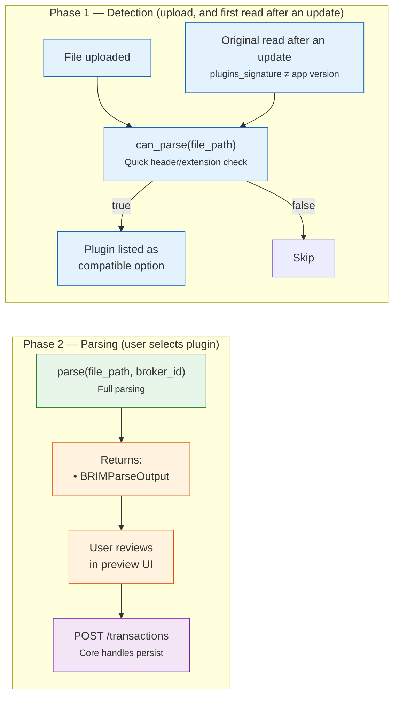
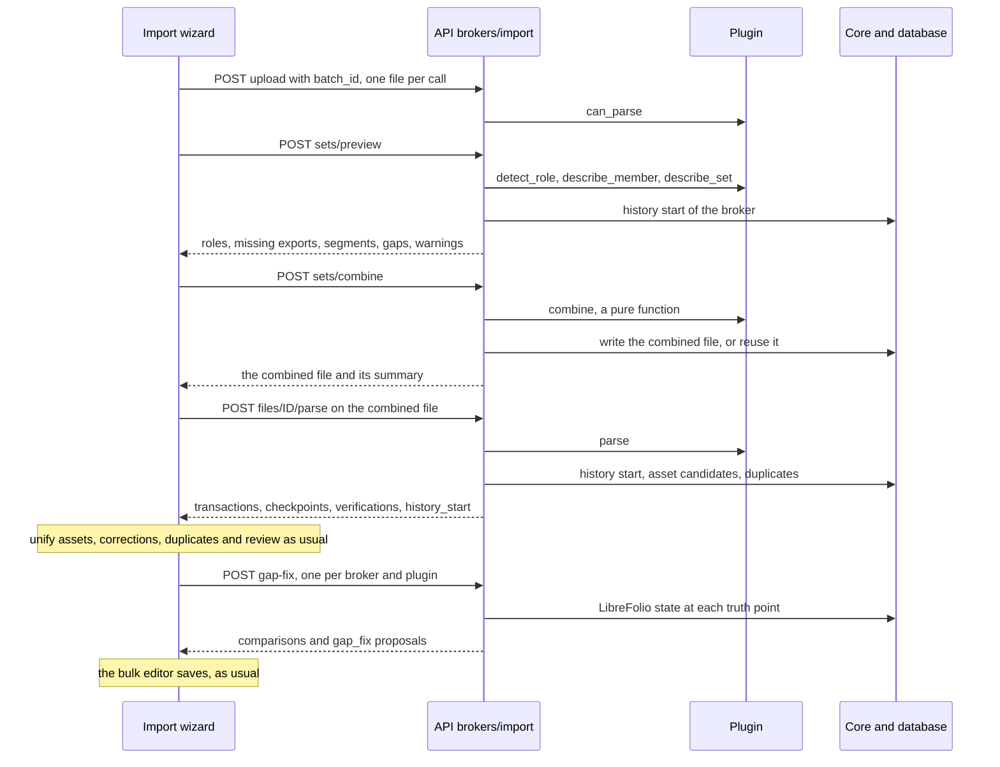

# 📦 BRIM Plugin Guide

How to create a new **Broker Report Import Manager** plugin to support a new broker's CSV/Excel export format.

**Base class**: `BRIMProvider` (in `backend/app/services/brim_provider.py`)
**Plugin folder**: `backend/app/services/brim_providers/`
**Registry**: `BRIMProviderRegistry`

---

## 🤖 Tip: Let an LLM write the plugin for you

Paste this entire page plus the [Generic CSV Provider](../../backend/brim/generic_csv.md) page into an LLM and use this prompt:

!!! tip "Suggested prompt"

    ```
    Here is the LibreFolio BRIM plugin specification: [paste this page]
    Here is the Generic CSV reference implementation: [paste generic_csv page]

    I have a broker called [BROKER_NAME]. Here is a sample of their CSV export: [paste header + 3–5 rows]

    Write a complete Python BRIMProvider plugin for this broker. Follow the conventions
    exactly (BRIMParseOutput, BRIMExtractedAssetInfo, sign conventions, @register_provider).
    ```

    The LLM will produce a complete, working plugin skeleton. Test it with the probe endpoint,
    then add it to `brim_providers/` and restart — it will be auto-discovered.

---

## 🔄 Flow

The system calls plugin methods in two distinct phases:


```mermaid
graph TD
    subgraph "Phase 1 — Detection (upload, and first read after an update)"
        D1["File uploaded"] --> D2["can_parse(file_path)<br/><small>Quick header/extension check</small>"]
        D0["Original read after an update<br/><small>plugins_signature ≠ app version</small>"] --> D2
        D2 -->|true| D3["Plugin listed as<br/>compatible option"]
        D2 -->|false| D4["Skip"]
    end

    subgraph "Phase 2 — Parsing (user selects plugin)"
        P1["parse(file_path, broker_id)<br/><small>Full parsing</small>"] --> P2["Returns:<br/>• BRIMParseOutput"]
        P2 --> P3["User reviews<br/>in preview UI"]
        P3 --> P4["POST /transactions<br/><small>Core handles persist</small>"]
    end

    D3 ~~~ P1

    style D0 fill:#e3f2fd,stroke:#1565c0
    style D1 fill:#e3f2fd,stroke:#1565c0
    style D2 fill:#e3f2fd,stroke:#1565c0
    style D3 fill:#e3f2fd,stroke:#1565c0
    style P1 fill:#e8f5e9,stroke:#2e7d32
    style P2 fill:#fff3e0,stroke:#e65100
    style P3 fill:#fff3e0,stroke:#e65100
    style P4 fill:#f3e5f5,stroke:#7b1fa2
```

**Phase 1** runs automatically when a file is uploaded — every registered plugin is asked if it can parse the file. Compatible plugins are listed for the user. It runs again, once per app version, when an original detected by another version is read: see [The lifecycle of `compatible_plugins`](#compatible-plugins-lifecycle).

A file's `compatible_plugins` are what the import wizard offers for it, so `can_parse` must not claim a file that `parse` would refuse, fallback plugins included: the Generic CSV (`broker_generic_csv`, `detection_priority` 0) says `True` only for a `.csv` whose header row names both required columns, `date` and `type`, directly or through its multilingual aliases (`HEADER_MAPPINGS`: `data`, `fecha`, `datum`…; `tipo`, `operazione`, `action`…) — it used to claim any CSV with a header, then fail at parse. A file no plugin recognises is offered every plugin; parsing it with a single-file plugin whose `can_parse` says no answers 400 `Plugin '<code>' cannot parse file '<file_id><ext>'`, followed by `: <reason>` when the plugin says why ([`cannot_parse_reason`](#cannot-parse-reason)), and moves the file to `failed` with that message as its error.

The rule has one **extension**: a plugin may claim a file it recognises as its own broker's even
when it cannot import it, provided `parse` explains what is wrong — no transactions and one
`BRIMNotice` in the file's language saying what to upload instead. The plugin does not fail to
read such a file: it knows the file is its broker's, so `cannot_parse_reason` stays `None`, and
`parse` succeeds instead of refusing it — the file moves to `parsed` with the notice. Reference:
DEGIRO's **Transactions** export, the list of orders, which has no dividends, deposits,
withdrawals or currency conversions. `broker_degiro` claims it next to the Account Statement
(`_layout` tells the two apart), and its `parse` returns no transactions and the
`degiro_orders_list` warning, which asks for the Account Statement.

**Phase 2** runs when the user selects a specific plugin — the plugin parses the file, the user reviews the results, and confirms the import.

**Plugin responsibility**: Read the broker-specific file format and convert to standard `TXCreateItem` DTOs.
**Core responsibility**: File storage, asset matching, duplicate detection, database persistence.

A bank that splits one account across several exports (Danske Bank: a custody XLSX and a cash
CSV) adds a step between the two phases: the exports uploaded together form a **report set**,
the plugin combines them, and phase 2 parses the combined file. See
[Multi-report plugins (report sets)](#report-sets).

### ♻️ The lifecycle of `compatible_plugins` {: #compatible-plugins-lifecycle }

A file's `compatible_plugins` is detected once per app version, not once for the file's whole life
(`brim_provider.py`):

1. **At upload**, `save_uploaded_file` asks every plugin
   (`BRIMProviderRegistry.get_compatible_plugins`) and stores the list in the file's sidecar with
   `plugins_signature`, the signature of the plugin catalogue that detected it:
   `detection_signature()`, which is the app version (`get_version()`).
2. **On read** — `get_file_info` and `list_files`, so also the wizard's Plugin column, its set
   grouping (`setPluginFor`) and `collect_members` — an original whose stored signature is missing
   (a file uploaded before 1.2) or differs from the running version's is detected again, on the
   data file beside its sidecar, whatever its status. The read returns the new list and saves it
   with the current signature, once per version; under the current signature the stored list is
   trusted as it is.
3. **Kept as stored**: a combined file is never detected again — its list is the plugin that built
   it. An original whose data file is gone, or whose detection fails, keeps its stored list and
   nothing is saved: the next read tries again.

The effect: after an update, a plugin added or changed since a file's upload is offered for it, and
one that no longer reads it drops out — the Generic CSV, stricter since 1.2, drops from the CSVs
that lack its `date` or `type` column, which 1.1.0 offered it for. Files uploaded together (one
`batch_id`) before a [report-set](#report-sets) plugin could read them form their set after the
update, without a new upload. Files uploaded with 1.1.0 or earlier are the exception: those
versions recorded no `batch_id`, so the files belong to no set — each is offered the set plugin,
whose parse answers 422 `set_required` — and must be uploaded again, together.

**For a plugin author** there is nothing to implement, but `can_parse` answers are cached per app
version and evaluated again after an update:

- a change to `can_parse` reaches the files already uploaded with the next app version, and needs
  no `plugin_version` bump: that version covers what `parse` and `combine` output, not detection;
- a `can_parse` that raises counts as `False` (`get_compatible_plugins` skips the plugin), and that
  answer is cached like any other until the next version — never raise;
- in a development checkout the version is `git describe --tags --always --dirty`, read once per
  process: an edited `can_parse` reaches the files already uploaded only once that string changes
  (a commit) and the server restarts — or upload the file again.

The detection itself takes no lock, because it reads the file. The save takes the
[broker metadata lock](#broker-metadata-lock), reads the sidecar again under it and writes only if
the sidecar is still where it was read and still lacks the current signature, changing only
`compatible_plugins` and `plugins_signature`: a move, a deletion or another write made meanwhile is
never undone. Because a read may now open the file, the API calls `list_files` and `get_file_info`
(in `_get_brim_file_with_access`) through `asyncio.to_thread`.

### 🔒 The broker metadata lock {: #broker-metadata-lock }

Every write of a broker's sidecars holds that broker's lock, `broker_metadata_lock(broker_id)`
(`_broker_metadata_lock` inside `brim_provider.py`). A plugin never takes it: the core does, around
its own writes.

- **Two layers.** In the process, a re-entrant `threading.RLock` per broker; across processes, an
  advisory `fcntl.flock` on `broker_reports/.locks/broker_<id>.lock` (`broker_none.lock` for the
  legacy files at the root of a status folder). The file lock is taken once, by the outermost block
  of a thread, and released when that block ends, on an exception too. It must hold across
  processes because a server may run several uvicorn workers (`./dev.py server --workers N`); the
  Docker image runs one.
- **Holders**: the upload (`save_uploaded_file`, around its sidecar write), `_update_metadata`,
  `save_combined_file`, `save_parse_result`, `_move_file` (`move_to_parsed`, `move_to_failed`),
  `delete_file`, and the save of a re-detection. The key is the broker of the sidecar's folder,
  `<status>/broker_<id>/`; a move changes only the status folder, so every writer of a file takes
  the same lock.
- **Reads take no lock**: every write is an atomic rename (`_write_metadata_atomic`), so a reader
  sees the old sidecar or the new one.
- **Never across an `await`**: re-entrant within a thread, the lock would let two coroutines of the
  event loop in together. `combine_set` holds it in a worker thread, from the reuse check to the
  save ([`POST /sets/combine`](#report-sets)).

---

## 🧭 Import philosophy & currency rules

A BRIM plugin is a **faithful transcriber, not a re-calculator**. These rules are
mandatory for every new plugin:

- **Verbatim / copy-paste import.** Import the numbers exactly as they appear in the
  broker's report. Do not recompute totals, prices or amounts; transcribe them.
- **No forex system.** A BRIM plugin must **never** invoke the FX subsystem and must
  **never** convert amounts using the report's own exchange-rate column. If the export
  has a rate column (e.g. Fineco's *Cambio*), **ignore it**.
- **Currency from the source.** Derive each transaction's currency from the broker's own
  currency column (per row) and tag **every** monetary figure in that row with it. A
  single file may legitimately contain multiple currencies — that's expected, keep them
  as reported.
- **Delimiter detection.** Always resolve the separator with
  `self.detect_csv_delimiter(file_path)` — **never hardcode** `,` or `;`.
- **Encoding fallback.** Never open an export with a fixed encoding such as
  `open(file_path, encoding="utf-8-sig")` — banks and Excel on Windows often write
  Windows-1252 or Latin-1, and a UTF-8 read fails on the first accented byte. Read text
  with `self._open_text(file_path)` (add `newline=""` when the stream feeds `csv` and
  line endings must be kept) or through `_brim_io.read_rows`. The test suite enforces
  it (class `TestWindows1252Invariance`): `test_no_plugin_opens_files_with_a_fixed_encoding`
  fails on any `open(..., encoding=...)` in a `broker_*.py`, and
  `test_sample_parses_identically_when_saved_as_windows_1252` requires every non-ASCII
  CSV sample, re-saved as Windows-1252, to be detected and parsed identically by each
  plugin that accepts the original.
- **Multiple export layouts.** When a broker ships more than one report layout (e.g. with
  and without commission columns), detect the variant **dynamically** — locate the header
  row and branch on the actual column set rather than assuming a fixed line offset.
- **Sign conventions.** Set signs per `TransactionType` (BUY: qty > 0, cash < 0; SELL:
  qty < 0, cash > 0; DIVIDEND/INTEREST: qty = 0, cash > 0; FEE/TAX: qty = 0, cash < 0;
  ADJUSTMENT: qty ≠ 0, no cash), but take the **magnitudes** verbatim from the report.
- **One source row may emit several transactions.** Keep economic legs explicit: securities-only buys can be `DEPOSIT + BUY`, sells can be `SELL + WITHDRAWAL`, maturities can be `SELL at par + INTEREST`, and snapshots can be `DEPOSIT + ADJUSTMENT` seeds.
- **Fake asset IDs.** Emit high positive fake asset IDs (keyed by ISIN/ticker) plus
  `BRIMExtractedAssetInfo` so the core can drive the asset-matching UI.

---

## 📋 ABC Methods

### ✅ Required (Abstract)

| Method | Signature | Description |
|--------|-----------|-------------|
| `provider_code` | `@property → str` | Unique identifier (e.g., `"directa_csv"`). Must `return` a **string literal** — see below |
| `provider_name` | `@property → str` | Display name, in English (e.g., `"Directa CSV"`); the UI shows the value of `brimPlugins.<code>.name`, in the user's language — see [Register the name and description](#plugin-name-i18n) |
| `description` | `@property → str` | Brief description for the UI, in English; the UI shows the value of `brimPlugins.<code>.description` |
| `can_parse(file_path)` | `→ bool` | Quick check if this plugin can parse the file (check extension, header row) |
| `parse(file_path, broker_id)` | `→ BRIMParseOutput` | Full parsing — returns structured BRIMParseOutput object containing transactions, warnings, and extracted asset info |

!!! warning "`provider_code` must `return` a string literal"

    Write `return "broker_my_bank"` — never a module constant (`return PROVIDER_CODE`) or an
    expression. Two tools read the code **from the source, without importing the module**:

    - the R13 test in `frontend/src/lib/components/ui/select/optionFilter.test.ts` (run by
      `./dev.py test front-utility core-unit`) scrapes every `broker_*.py` for what
      `provider_code`, `provider_name` and `description` return, and fails on anything but
      string literals (adjacent literals and a parenthesised run of literals are accepted;
      an f-string, a name, a call or a `+` are not);
    - the test runner's `_PROVIDER_CODE_RE` in `scripts/test_runner/_backend_external.py`
      builds the list of BRIM codes shown in the `--providers` / `--exclude-providers` help:
      a plugin it cannot read is missing from that list (the filter itself still works,
      because the option has no fixed choices).

    Danske Bank once returned a constant: the R13 suite failed as a whole, and the runner's help
    listed one BRIM plugin too few. `provider_name` and `description` follow the same rule,
    because the R13 test reads them the same way.

### 🔧 Optional (Override)

| Method | Default | Description |
|--------|---------|-------------|
| `supported_extensions` | `['.csv']` | Accepted file extensions |
| `detection_priority` | `100` | Auto-detection priority (higher = checked first). Use 0-49 for generic plugins. |
| `cannot_parse_reason(file_path)` | `None` | Why `can_parse` refuses a file, in one short sentence the user can act on — appended to the parse guard's 400. See [Saying why a file is refused](#cannot-parse-reason) |
| `cannot_parse_detail(file_path)` | wraps `cannot_parse_reason`, no code | The same refusal as a `BRIMRefusal`, with a stable `code` the frontend translates and its `context` — asked by the import wizard right after an upload. See [Saying why with a code](#cannot-parse-detail) |
| `icon_url` | `None` | Broker favicon URL for the UI (see [Favicons](#favicons)) |
| `docs_url` | `None` | Link to a user-facing MkDocs page. Leave `None` if no page exists (avoids dead links). |
| `plugin_version` | `"1.0.0"` | Semver of the parsing logic — **bump it** whenever output for the same input changes |
| `test_file_pattern` | `None` | Single filename substring used by the test suite to map a sample → this plugin |
| `test_file_patterns` | derived from `test_file_pattern` | **List** of filename substrings when one plugin owns several export formats (e.g. `["revolut-invest", "revolut-crypto"]`) |
| `report_roles` (and the rest of the report-set contract) | `[]` | Non-empty turns the plugin into a **report-set plugin**: see [Multi-report plugins](#report-sets) |
| `generate_static_url(path)` | — | Helper to build `/api/v1/uploads/plugin/brim/{path}` |

### 🗣️ Saying why a file is refused {: #cannot-parse-reason }

`cannot_parse_reason(file_path) -> Optional[str]` is a concrete method of `BRIMProvider`, not an
abstract one: it returns `None` by default, so a plugin written without it stays valid. Override it
when your `can_parse` refuses a file for a cause the user can fix in the file — a missing column,
say.

- **When the core asks.** In the guard of `parse_file` (`brim_provider.py`), after
  `can_parse` answered `False` for the file the parse runs your plugin on. The guard asks about
  the path it checked last: the relocated one, when a concurrent parse moved the file in the
  meantime. The default [`cannot_parse_detail`](#cannot-parse-detail) asks it too, when the
  import wizard checks an upload against the broker's default plugin.
- **What it returns.** One short English sentence saying why `can_parse` refuses the file, with a
  lowercase start and no final period, because it completes the guard's message; `None` when
  there is nothing to add.
- **What the user reads.** The guard's `Plugin '<code>' cannot parse file '<file_id><ext>'` (the
  name LibreFolio stores the file under, not the user's file name) gains `: <reason>`. The API
  answers 400 with that text, the file goes to `failed` with it as its `error_message`, and the
  wizard's parse-error box shows it after the user's file name:

    ```text
    export.csv — Plugin 'broker_generic_csv' cannot parse file '<file_id>.csv': required column 'date' not found in the CSV header
    ```

- **Cost and failure.** Keep it as cheap as `can_parse` and never raise. Without a reason — the
  default `None`, or no such method at all, since the guard reads it with `getattr` — the message
  stays plain. If the method raises anyway, the guard logs the exception and keeps the plain
  message: still a 400, never a 500.

The Generic CSV is the reference implementation. It checks, in this order:

| The file | `cannot_parse_reason` answers |
|----------|-------------------------------|
| has an extension other than `.csv` | `the Generic CSV reads only .csv files` |
| cannot be read | `the file could not be read` |
| is empty, or starts with an empty row | `the file has no header row` |
| has a header row without `date`, `type` or both — no alias of `HEADER_MAPPINGS` matches | `required column 'date' not found in the CSV header`, the same with `'type'`, or `required columns 'date' and 'type' not found in the CSV header` |
| has a header row naming both | `None` |

Its `can_parse` is `return self.cannot_parse_reason(file_path) is None`, so the two can never
disagree: build yours the same way when your refusals have causes worth naming. The suite holds
every registered plugin to the contract: `test_every_plugin_answers_nothing_or_one_sentence`, in
`backend/test_scripts/test_external/test_brim_providers.py` (`./dev.py test external brim-providers`),
asks the method about every file of `sample_reports/` and about paths with nothing to read, and
fails on an exception or on an answer that is neither `None` nor one sentence (a non-empty single
line, lowercase start, no final period).

### 🏷️ Saying why with a code {: #cannot-parse-detail }

`cannot_parse_detail(file_path) -> Optional[BRIMRefusal]` gives the same refusal as
[`cannot_parse_reason`](#cannot-parse-reason), with a stable code the frontend translates. It is a
concrete method of `BRIMProvider` too: the default wraps `cannot_parse_reason` without a code
(`BRIMRefusal(message=reason)`, or `None` when there is no reason), so every plugin answers it
unchanged. Override it when the user should read your reason in their own language.

`BRIMRefusal` (`backend/app/schemas/brim.py`):

| Field | Type | Content |
|-------|------|---------|
| `code` | `Optional[str]` | Stable snake_case code (`^[a-z][a-z0-9_]*$`), translated by the frontend as `importWizard.parseRefusal.<code>`; `None` when the plugin gives only a sentence |
| `message` | `str`, not empty | The `cannot_parse_reason` sentence — one short English sentence, lowercase start, no final period: the fallback text |
| `context` | `Dict[str, Any]` | The parameters of the translation, e.g. the plugin that reads the file |

- **Same rules as `cannot_parse_reason`**: as cheap as `can_parse`, `None` when there is nothing
  to add, and never raise.
- **One sentence, two methods**: `message` must be what `cannot_parse_reason` returns. Write the
  detail and derive the sentence from it, as the Scalable plugins do — the parse guard keeps
  reading `cannot_parse_reason`, the plugin check below reads `cannot_parse_detail`:

    ```python
    def cannot_parse_detail(self, file_path: Path) -> Optional[BRIMRefusal]:
        return _scalable.refusal(self, file_path, _scalable.BROKER)

    def cannot_parse_reason(self, file_path: Path) -> Optional[str]:
        detail = self.cannot_parse_detail(file_path)
        return detail.message if detail else None
    ```

**The endpoint.** `GET /api/v1/brokers/import/files/{file_id}/plugin-check?plugin_code=<code>`
(`check_file_plugin` in `api/v1/brokers.py`) asks one plugin about one uploaded file and answers a
`BRIMPluginCheck`: `plugin_code`, `can_parse` and `refusal`.

```json
{
  "plugin_code": "broker_scalable",
  "can_parse": false,
  "refusal": {
    "code": "scalable_deposit_file",
    "message": "this is the export of the Scalable overnight account: read it with the Scalable Capital overnight account plugin",
    "context": {"plugin_code": "broker_scalable_deposit", "plugin_name": "Scalable Capital overnight account"}
  }
}
```

- **Nothing is parsed**, and the file keeps its status. The work is `check_file_with_plugin`
  (`brim_provider.py`), run off the event loop (`asyncio.to_thread`) because the plugin reads the
  file.
- **`refusal`** comes only with `can_parse: false`, and stays `null` when the plugin has nothing to
  add. A `can_parse` that raises counts as `false`, and a `cannot_parse_detail` that raises leaves
  `refusal` empty: both are logged, never a 500. As in the parse guard, a refusal on a path that a
  concurrent parse has just moved is asked again on the new path.
- **Access**: any user with access to the file's broker (VIEWER+), 403 otherwise. 404 for an
  unknown file, an unknown plugin, or a file whose content is gone.

**In the import wizard.** Right after an upload, the wizard asks the endpoint about the broker's
default import plugin. When that plugin refuses the file, the wizard shows the reason under *Notes
from the plugin* in its [wrong-broker prompt](../../frontend/components/features/import-wizard.md#broker-mismatch),
translated as `importWizard.parseRefusal.<code>`, with `context` as its parameters, and falls back
to the English `message` when the refusal has no code or the code no translation. A plugin that
`context` names by `plugin_code` gets its name in the UI language as `plugin_name`, from its
[catalogue key](#plugin-name-i18n): the `plugin_name` the refusal carries — the named plugin's
English `provider_name` — is only the fallback.

**Example: Scalable Capital.** One plugin per account, each account in its own LibreFolio broker:
`broker_scalable` reads the broker account, `broker_scalable_deposit` the overnight account, and
both import the shared reader `_scalable.py`. Each refuses the other account's file and names the
plugin that reads it (`_scalable.refusal`):

| `code` | Given by | For | `context` |
|--------|----------|-----|-----------|
| `scalable_deposit_file` | `broker_scalable` | the exporter's overnight account file | `broker_scalable_deposit`, `Scalable Capital overnight account` |
| `scalable_broker_file` | `broker_scalable_deposit` | the exporter's broker account file | `broker_scalable`, `Scalable Capital broker` |
| `scalable_prime_file` | `broker_scalable_deposit` | Scalable's own CSV (PRIME) | `broker_scalable`, `Scalable Capital broker` |
| `scalable_mixed_file` | both | an exporter file mixing the two accounts | empty: the message asks to export the two accounts separately |

`context` names the other plugin, as `plugin_code` and `plugin_name`. Any other file gets `None`:
the two plugins give a reason only for Scalable's own exports.

### 🧰 Base-class helpers you should use

Defined on `BRIMProvider` — call these instead of re-implementing:

| Helper | Use it in | What it does |
|--------|-----------|--------------|
| `self._read_file_head(file_path, num_lines=15)` | `can_parse` | Reads the first N lines trying `TEXT_ENCODINGS` (module constant in `brim_provider.py`) in order: UTF-8 (with or without BOM), then Windows-1252, then Latin-1, which always decodes |
| `self.detect_csv_delimiter(file_path)` | `parse` | Sniffs the delimiter (`,` `;` `\t`) via `csv.Sniffer` with a char-count fallback; reads the head with the same `TEXT_ENCODINGS` fallback |
| `self._open_text(file_path, newline=None)` | `parse` (and `can_parse` when you must read the header with `csv`) | Drop-in replacement for `open(...)`: an in-memory text stream decoded with `TEXT_ENCODINGS`; `newline=""` keeps line endings for `csv` |
| `self._create_transaction(row_num, transactions, validation_issues, context, **tx_fields)` | `parse` | Builds a `TXCreateItem`, appends on success, or records structured `BRIMValidationIssue`s on `ValidationError`. **Never** call `TXCreateItem(...)` directly. |

---

## 💻 Implementation Example

```python
# backend/app/services/brim_providers/my_broker.py

from pathlib import Path
from backend.app.services.brim_provider import BRIMProvider
from backend.app.services.provider_registry import register_provider, BRIMProviderRegistry
from backend.app.schemas.brim import BRIMExtractedAssetInfo, BRIMParseOutput
from backend.app.schemas.transactions import TXCreateItem

@register_provider(BRIMProviderRegistry)
class MyBrokerProvider(BRIMProvider):

    @property
    def provider_code(self) -> str:
        return "my_broker_csv"

    @property
    def provider_name(self) -> str:
        return "My Broker (CSV)"

    @property
    def description(self) -> str:
        return "Import transactions from My Broker CSV exports"

    def can_parse(self, file_path: Path) -> bool:
        """Quick check: read first lines and look for known header."""
        content = self._read_file_head(file_path, num_lines=5)
        return "Date;Operation;ISIN;Amount" in content

    def parse(self, file_path: Path, broker_id: int) -> BRIMParseOutput:
        """Parse the CSV and return transactions in a BRIMParseOutput envelope."""
        transactions = []
        warnings = []
        extracted_assets = {}

        # ... your parsing logic ...

        return BRIMParseOutput(
            transactions=transactions,
            warnings=warnings,
            extracted_assets={
                fake_id: BRIMExtractedAssetInfo(
                    extracted_symbol=info["extracted_symbol"],
                    extracted_isin=info["extracted_isin"],
                    extracted_name=info["extracted_name"],
                )
                for fake_id, info in extracted_assets.items()
            }
        )
```

### 🔍 Auto-Discovery

Place the file in `brim_providers/` and restart the app. The `BRIMProviderRegistry` will automatically discover and register it. The plugin will appear in the [ImportPluginSelect](../../frontend/components/core-ui/select.md#importpluginselect) dropdown, under its English `provider_name` until it has its [catalogue keys](#plugin-name-i18n).

A module whose name starts with an underscore is not a plugin: `auto_discover` skips it
(`provider_registry.py`), and the R13 test reads only `broker_*.py`. That is where code shared by
several plugins lives — `_brim_io.py` and `_brim_output.py` for any plugin, `_scalable.py` for the
two Scalable Capital plugins, whose `broker_*.py` files hold only their properties (the string
literals R13 reads among them) and calls to it.

---

## 🧭 Real-world reference plugins

Copy the structure of an existing, well-tested plugin rather than starting from scratch:

| File | Best example of |
|------|-----------------|
| `backend/app/services/brim_providers/broker_directa.py` | Equity/ETF, index-based columns, Italian types, ISIN grouping, tax/fee linking |
| `backend/app/services/brim_providers/broker_generic_csv.py` | Column auto-detection, locale-aware number parsing |
| `backend/app/services/brim_providers/broker_coinbase.py` | Crypto assets (symbol, no ISIN), staking as `ADJUSTMENT`, separate fee tx |
| `backend/app/services/brim_providers/broker_revolut.py` | **One plugin, two formats** (invest + crypto) via header detection |
| `backend/app/services/brim_providers/broker_intesa.py` | CSV/XLSX, two layouts in one plugin; patrimonio snapshot → liquidity `DEPOSIT` when present + per-holding `ADJUSTMENT` seed with per-unit `cost_basis_override` |
| `backend/app/services/brim_providers/broker_credit_agricole.py` | **Richest wizard integration**: two layouts in one plugin, 4-tier causale registry, evidence tables, `info` notices, blocking and splitting field todos — read it before designing any `field_todos`. Also: automatic cash counter-entries, par-100 bond maturity split, succession rows as cashless `ADJUSTMENT` |
| `backend/app/services/brim_providers/broker_saxo.py` | Mixed trade/cash rows, verb-in-text events, localized verbs |
| `backend/app/services/brim_providers/broker_danske_bank.py` | **Report set** (custody XLSX + cash CSV): roles, a pure `combine` with pairing, zones and truth points, the parse of its combined file, Finnish notices — see [Multi-report plugins](#report-sets) |
| `backend/app/services/brim_providers/broker_degiro.py` | **One layout in many languages**: the Account Statement read by column position, the notice language picked from the header (`_detect_language`), **linked `FX_CONVERSION` pairs** (see [Linked pairs](#linked-pairs)), and its orders list (the Transactions export) claimed and answered with one notice instead of transactions (the rule's extension in [Flow](#flow)) |

## 📥 Canonical imports

```python
from __future__ import annotations

import csv
from datetime import date as date_type
from datetime import datetime
from decimal import Decimal, InvalidOperation
from pathlib import Path
from typing import Dict, List, Optional

import structlog

from backend.app.db.models import TransactionType
from backend.app.schemas.brim import FAKE_ASSET_ID_BASE, BRIMAssetNotice, BRIMExtractedAssetInfo, BRIMParseOutput, BRIMValidationIssue
from backend.app.schemas.common import Currency
from backend.app.schemas.transactions import TXCreateItem
from backend.app.services.brim_provider import BRIMParseError, BRIMProvider
from backend.app.services.provider_registry import BRIMProviderRegistry, register_provider

logger = structlog.get_logger(__name__)
```

## ➕➖ Sign conventions (enforced by the test suite)

`TransactionType` (in `backend/app/db/models.py`) fixes the sign of `quantity` and cash
`amount`. `test_all_transactions_are_schema_valid` fails the plugin if any emitted
transaction breaks these rules, so flip source signs as needed:

| Type | quantity | cash amount | asset |
|------|----------|-------------|-------|
| `BUY` | `> 0` | `< 0` | required |
| `SELL` | `< 0` | `> 0` | required |
| `DIVIDEND` | `= 0` | `> 0` | required |
| `INTEREST` | `= 0` | `> 0` | optional |
| `DEPOSIT` | `= 0` | `> 0` | none |
| `WITHDRAWAL` | `= 0` | `< 0` | none |
| `FEE` | `= 0` | `< 0` | optional |
| `TAX` | `= 0` | `< 0` | optional |
| `ADJUSTMENT` / `TRANSFER` | `+/-` | **must be `None`** | optional |

- `DIVIDEND`/`INTEREST` carry **no** quantity — set `quantity=0` and discard any token
  amount with a warning (see coinbase).
- **Crypto — the fiat leg decides the type.** If a row settles in **fiat** (your account
  currency) use a cash type: buy crypto with fiat → `BUY`, sell for fiat → `SELL`, a reward
  paid out in fiat → `INTEREST`, a stock payout → `DIVIDEND`, plain cash in/out →
  `DEPOSIT`/`WITHDRAWAL`. If a row has **no fiat leg** — staking/airdrop paid in coins, a
  crypto↔crypto trade, an on-chain transfer in/out, or a crypto-denominated fee — model it as
  a **cashless `ADJUSTMENT`** (`quantity` +/-, `cash=None`) so the position still updates.
  This is what keeps every crypto row schema-valid, because `ADJUSTMENT` forbids a cash
  amount. Reference: `broker_bitvavo.py`, `broker_cointracking.py`, `broker_delta.py`,
  `broker_cryptocom.py` (note `cryptocom` emits `INTEREST` for fiat-valued rewards but a
  cashless `ADJUSTMENT` for coin-only rewards).
- Prefer **skipping a row with a warning** over emitting a schema-invalid transaction.

!!! tip "Warning language follows the input format"

    A plugin's user-facing `warnings` (and any `BRIMAssetNotice.reason`) should be written
    in the language of the export it parses. For a single-nation broker whose report is
    published in only one language — e.g. Crédit Agricole, Directa and Intesa Sanpaolo
    (Italian), Danske Bank (Finnish) — emit the warnings in that language so they match the report the user is
    reading. Fineco is still an exception: it reads only the Italian export, but writes its warnings in English.
    When a broker ships differently localized export layouts (a UK vs. IT Fineco
    file, a non-Italian Crédit Agricole entity), detect the format and emit each variant's
    warnings in its own language. Code, comments and docstrings stay in English.

    A broker can also ship **one layout in many languages**: DEGIRO's Account Statement has
    the same twelve columns in every language, so the layout cannot tell the language, but
    the header can. `broker_degiro.py` (`_detect_language`) counts, for each language, how
    many of the file's named columns are among that language's header names
    (`_HEADER_WORDS`; `ISIN` and `FX`, the same everywhere, do not count) and picks the best
    language only with at least three matches and no tie (`_MIN_LANGUAGE_MATCHES`). A word
    two languages share decides nothing on its own — `Datum` is Dutch and German — and any
    other header gets English. The language chooses the messages only (`_MESSAGES`:
    English, Dutch, German, French, Spanish): rows are classified with the words of every
    language, because one DEGIRO file can mix them.

    The user reads the file's language only if the notice code has **no**
    `importWizard.brimNotice.<code>` key. The wizard resolves a notice with
    `resolveBrimNoticeMessage` (`frontend/src/lib/utils/transactions/resolveBrimNotice.ts`):
    a key, when it exists, replaces the plugin's message with the text in the UI language;
    without one, the plugin's `message` is shown as written. The `degiro_*` codes have no
    key on purpose, and `test_no_i18n_key_overrides_the_language_of_the_file`
    (`test_brim_degiro.py`) fails if one is added.

    Field todos follow the same rule, keyed by their `reason_code` under the same namespace
    and resolved by `resolveBrimTodoMessage` (same file), wherever the wizard and the bulk
    editor list them. A todo is worth a key only when its message has no file language to
    honour, like the Generic CSV's `corporate_action`; every other todo keeps the file's
    language on purpose.

    The comment under a notice's evidence table follows the notices' contract too, in its own
    namespace: `importWizard.brimEvidence.<code>` — the notice's `code`, with its `context` as
    values — replaces the [evidence](#brim-evidence)'s `comment` when the key exists
    (`resolveBrimEvidenceComment`, in `resolveBrimNotice.ts` too, called by
    `BrimNoticeList.svelte`). There is one key per notice, so a notice with several commented
    tables shows the same text under each; and a key only replaces: a table without a `comment`
    stays without. The caption needs no key: an empty `title` gets the wizard's own,
    `importWizard.evidenceRowsTitle` (*Source rows*, *Righe del file*), where the table folds
    behind its caption — the confirmation modal; the parse-detail modal shows such a table
    without a caption. The Scalable plugins write in English, so they leave `title` empty and
    give each of their twelve notice codes both keys: the user reads the whole notice —
    message, caption and comment — in the UI language. `TestWhatTheWizardWords`
    (`test_brim_scalable.py`, `./dev.py test external brim-scalable`) holds them to it: both
    keys for every code in the four catalogues, and no title on the samples' evidence tables. A
    plugin that writes in its file's language gives its evidence no key either.

!!! warning "`cost_basis_override` is PER-UNIT, never a total"

    When a plugin freezes an inherited cost basis (WAC) on a `TRANSFER`/`ADJUSTMENT`
    seed — e.g. an opening *patrimonio* snapshot, or a `TRANSFER_IN` — the value you put
    in `cost_basis_override` (and its `cost_basis_currency`) **must be the cost per single
    unit**, not the position's total countervalue. The portfolio engine and the lot
    analysis both **multiply it by `quantity`** to reconstruct the total cost basis, so a
    total slipped in here is silently multiplied again and blows the cost basis up by a
    factor of `quantity`.

    If your source only reports a **total** (e.g. Intesa's *"Controvalore di carico
    fiscale €"*), divide it by the quantity first:

    ```python
    unit_cost = (total_cost / qty).quantize(Decimal("0.000001"))
    cost_basis_override = Currency(code="EUR", amount=unit_cost)
    ```

    Bond nominal note: for bonds `quantity` is the face value (e.g. `50000`) and the seed
    per-unit cost lands near `1.0` — that is correct, the engine handles the /100 quote
    scaling elsewhere. Canonical example: `broker_intesa.py` (patrimonio seed).

!!! tip "Matured-bond redemption: close at par, surplus → INTEREST"

    A bond is **redeemed at par (100)** at maturity. When the bank credits *more* than par
    (e.g. a BTP Italia *premio fedeltà* or a `FOI` inflation revaluation), that surplus is
    **reddito di capitale** — the same nature as a coupon — and must be booked as a separate
    **`INTEREST`** leg, *not* folded into the sale price. Folding it in would inflate the
    realised gain and leave a residual position when `ctv/price` ≠ the true nominal.

    **Working assumption (document it on the plugin's own page):** a maturity/redemption row
    is a bond quoted at par 100, so *anything above 100 is interest*. A plugin whose maturity
    causale is bond-specific (e.g. Crédit Agricole's `TITOLI SCADUTI`) can apply this
    unconditionally; a plugin whose causale is generic (e.g. Fineco's `Rimborso`, which also
    covers equities) must still gate on `io.looks_like_bond(name)`. Generalise only when a
    real counter-example appears.

    The nominal to redeem comes from the **held position** (the BUY / succession / seed
    rows), never from the maturity row itself (whose `quantity` is often `0`). Use the shared
    helper:

    ```python
    from backend.app.services.brim_providers import _brim_io as io

    if ctv is not None:                       # (+ io.looks_like_bond(name) if the causale is generic)
        model = io.model_bond_maturity(ctv=ctv, price=price, held_qty=held or None)
        sell_qty  = -model.nominal            # SELL closes the nominal at par, e.g. -30000
        sell_cash = model.principal_cash      # e.g. 30000.00 (nominal × par/100)
        if model.surplus_cash > 0:            # surplus over par → INTEREST income
            emit_interest(cash=model.surplus_cash)   # e.g. 105.00
    ```

    - **`held_qty > 0` → `source == "position"`**: exact close, **no verify flag**. This is
      the normal case — the nominal lives in the position, so there is nothing for the user
      to check. If the file is not chronologically ordered, pre-compute the position in a
      first pass (see `broker_credit_agricole.py`).
    - **no position → `source == "derived"`**: the nominal is inferred from `ctv/price` (a
      best effort, imprecise because the quoted price embeds the premium — e.g. `30105/100.40
      = 29985` vs a true `30000`). This happens on a **partial download** (a "last 3 months"
      export where the buy legs are missing). Attach a `warning` `BRIMFieldTodo`
      (`reason_code="derived_quantity"`) so the user verifies the nominal — the plugin sees
      only the file, so it cannot confirm the close against the position already stored in
      LibreFolio (that reconciliation happens in the portfolio engine at compute time).
    - **Cash-only maturity in a bank/account export → nominal from a same-day companion
      row (still in-file).** Some exports carry the redemption only as a *cash* row with no
      securities position and no reliable price (e.g. Crédit Agricole's account
      `TITOLI SCADUTI O ESTRATTI`, whose truncated securities export had already dropped the
      opening BUY). Such a row has just the total cash, so it cannot split par vs premium on
      its own. Recover the nominal from **another row in the same file**: the final coupon
      paid on the same date states the security's `ISIN` + `NOMINALE`. Match the two by
      security code in a first pass, then feed that nominal as `held_qty` to
      `model_bond_maturity` (`source == "position"`). This **never touches the database** — a
      plugin only ever reads its own file. If no same-day companion row identifies the
      security, **book the whole redemption as a `SELL` for the full cash (everything as sold,
      no premium split) plus a `warning`** — never a plain cash `DEPOSIT`, so the proceeds
      reduce a position instead of inflating paid-in capital (consistent with the
      securities-export fallback). With no held position and no reported price, assume a par
      (100) redemption so the derived nominal equals the cash (`SELL` with `quantity < 0`,
      flagged for the user to verify). See `broker_credit_agricole.py`
      (`_parse_account_movements`, `income_identity_by_date`, `_ACCT_MATURITY_CAUSALI`).
    - A price **at or below par** yields `surplus_cash == 0` → emit a single plain SELL
      (pass-through); don't invent negative income.
    - Keep the plugin's usual cash model: if BUYs get a balancing `DEPOSIT` and SELLs a
      `WITHDRAWAL`, the par principal nets to zero and only the `INTEREST` surplus adds cash.

    Reference plugins: `broker_credit_agricole.py` (`TITOLI SCADUTI` in the securities export
    with the position pre-computed from succession legs, **and** the account cash-only
    `TITOLI SCADUTI O ESTRATTI` with the nominal recovered from the same-day coupon) and
    `broker_fineco.py` (`Rimborso` above par, nominal from the row).

## 🔗 Linked pairs from a plugin {: #linked-pairs }

A currency conversion is two transactions that only exist together: the cash that leaves one
currency and the cash that arrives in another. A plugin emits both legs as `FX_CONVERSION` and
gives them the same `link_uuid`; the batch turns the shared id into reciprocal
`related_transaction_id`s and never stores the id itself (see
[Transaction Service → Linked Pairs](../../backend/transactions/service.md#linked-pairs)).
`broker_degiro.py` is the first plugin to emit pairs (`_pair_fx_legs`, `_fx_pair`): Swissquote
skips its conversion legs with a warning, and the Generic CSV refuses the paired types.

**What the batch accepts** — `resolve_create_links` in `transaction_batch_stages.py`, with
`_validate_linked_pair` and `_validate_pair_description_tags` in `transaction_service.py`:

- exactly **two** creates per `link_uuid`: a leg alone, or a third one, is `linkUuidPairCount`;
- the **same type** on both legs (`pairTypeMismatch`);
- an **identical description** (`pairDescriptionMismatch`) and **identical tags**
  (`pairTagsMismatch`). Brokers word the two legs differently, so build one description for
  both: DEGIRO keeps the text when both legs read the same, and joins the two otherwise
  (`FX Credit / FX Debit`);
- each leg valid on its own: an `FX_CONVERSION` has `quantity = 0`, a non-zero cash amount in
  its own currency, and no asset.

**The `link_uuid` is deterministic.** `test_parse_is_idempotent` compares two parses of each
sample, and `test_sample_parses_identically_when_saved_as_windows_1252` compares a non-ASCII
sample with its Windows-1252 copy: a `uuid4()` fails the first, an id hashed from the file's
bytes fails the second. DEGIRO derives it with `uuid5` from a SHA-256 of the **decoded** rows of
the whole file and the line numbers of the two legs, so the same statement always gives the same
ids, whatever its encoding, and two statements that differ give different ones.

**Recognise the legs without the rate.** [No forex system](#import-philosophy-currency-rules)
still holds: the report's exchange rate neither converts nor matches anything. DEGIRO only asks
whether a row's FX cell is filled — that makes the row a leg — and finds its partner by
structure: the same order (same Order Id, or the same date and time when there is none), another
currency, the opposite sign, and the adjacent row when several qualify. A leg whose partner is
missing or ambiguous is listed in a notice (`degiro_unpaired_fx`) and not imported: never a
guessed pair, and never a lone leg, which the batch would reject.

**In the import wizard** a pair is one row of the review step: the leg that pays (the negative
amount; the first one the plugin emitted when both legs have the same sign), with the leg
that receives shown as its **To** and the rate the two amounts imply — computed from the
amounts, not read from the report. The receiving leg is not a row of its own (`pairs.hidden`,
`step4Rows`): the row's cash cell (`data-testid="import-tx-pair-cash"`) holds a **From** line
and a **To** line in the bulk editor's markup (`renderFromToHtml` mirrors `renderDualHtml` of
`TransactionBulkModal.svelte`), then a chip such as `USD → EUR @ 0.8554`
(`renderImpliedRateHtml`: `|to| / |from|` through `computeFxConversionInfo`). Selecting the
row selects both legs (`setPairSelected`: its tick shows the pair as selected only when both
legs are, and select all, deselect all and select visible move both legs too), only complete
pairs reach the bulk editor, and each pair reaches it with a fresh `link_uuid`, the same for
both legs (`frontend/src/lib/utils/transactions/importPairs.ts`, and `pairCellHtml.ts` beside
it for the cell): the plugin's ids repeat whenever the same statement is parsed again, so two
uploads of one statement would share them. The counters and the `Import {n} transactions`
button count transactions, not rows, so a pair counts as two (`step4SelectedCount` and
`step4TotalCount`, over `step4LegRows`): the English sample shows 17 transactions in 15 rows.

## 📡 Talking to the import wizard

A plugin does not only produce transactions. It produces **what it could not do**, and that
is what drives the wizard's UI. There are **four output channels**, and picking the right one
is the single most important design decision in a plugin:

| Channel | Field on `BRIMParseOutput` | The plugin is saying | Where it shows |
|---------|---------------------------|----------------------|----------------|
| Transactions | `transactions` | "I read this row" | Review table |
| Validation issues | `validation_issues` | "I read this row and the schema refused it" | Parse-detail modal, red |
| Notices | `warnings` | "Something about the **file** you should know" | Parse-detail modal + confirmation modal |
| Field todos | `field_todos` | "I booked this row but a **specific field** is a guess" | **Correction step**, before the duplicate check |

!!! danger "A notice is not a todo"

    The line is not severity, it is **actionability**. If the user can fix it on one row,
    it is a `BRIMFieldTodo`; if it is a statement about the file as a whole, it is a
    `BRIMNotice`. Putting a fixable problem in `warnings` sends the user to a modal that
    offers no way to fix it, and showing the same finding in both channels teaches them to
    skip both. Crédit Agricole has a test asserting a given finding appears in exactly one.

### 🔔 `BRIMNotice` — something about the file

```python
warnings.append(
    BRIMNotice(
        severity="info",                       # "info" (blue) | "warning" (amber)
        code="ca_unknown_causale",             # machine-readable, i18n-stable
        message="12 righe con 3 causali non previste …",   # report's language
        context={"causali": [...], "row_count": 12},
        evidence=[...],                        # see below
    )
)
```

- `severity="info"` — *the plugin did something correct and non-obvious*: explain it. An
  unknown transaction code booked by sign, a succession row turned into a cashless
  `ADJUSTMENT`. Blue, still surfaced in the confirmation modal.
- `severity="warning"` — *the plugin had to fall back or guess*: look at it.
- A bare `str` still works (coerced to `severity="warning"`, `code="legacy"`), but new code
  should never use it: the `code` is what lets the frontend and the tests address the notice.

### 🔎 `BRIMEvidence` — show the row, do not just describe it {: #brim-evidence }

Every notice and every todo can carry evidence tables. This is what turns *"row 282 looks
bundled"* into something the user can check without opening the file:

```python
BRIMEvidence(
    title="Riga di acquisto",                 # short caption
    headers=["Data Op.", "Causale", "Descrizione", "Importo"],
    rows=[["28/07/2025", "COMPRAVENDITA …", "NOTA INF. ACQ. TIT:BTP …", "-46603.73"]],
    row_numbers=[282],                        # 1-based source line, per row
    comment="L'importo di questa riga è un totale: comprende …",
)
```

- **`row_numbers` is not decoration.** It renders a *"row N in the file"* button that opens
  the file preview scrolled to that line, so the user sees the neighbours too. Omit it and
  the evidence becomes an unverifiable claim.
- **Attach evidence at the moment the plugin gives up** — that is the only moment the source
  row is still in hand. Re-reading the preview later costs a fetch and misaligns indexes if
  the preview paginates.
- **`comment` is the reasoning, the message is the headline.** The collapsed row in the
  correction list is read while scrolling twenty others: keep it to one line. Everything the
  plugin looked at, found and concluded belongs in `comment`, which is read only by someone
  who opened the row.
- Several tables are allowed: Crédit Agricole shows the purchase row **and** the coupon row
  that supplied the nominal, each with its own comment.
- **`title` may be empty.** The field is required, but `title=""` lets the wizard show its own
  caption, translated (*Source rows*), where the table folds behind it: the Scalable plugins,
  whose notices are translated, leave it empty rather than write an English caption. The
  `comment` of a notice's table can be translated by code too — both are explained in the tip
  *Warning language follows the input format*, under
  [Sign conventions](#sign-conventions-enforced-by-the-test-suite).

### 🧩 `BRIMFieldTodo` — one field, one question, one screen

```python
BRIMFieldTodo(
    tx_index=len(transactions) - 1,     # index into transactions[]
    field="asset_id",                   # TXCreateItem field that needs input
    severity="blocker",                 # "blocker" | "warning"
    reason_code="ca_account_trade_unresolved",
    message="Riga 282: acquisto di BTP … — l'importo potrebbe raggruppare più voci.",
    context={...},                      # see the contract below
    evidence=[source_row_evidence(row, offset, comment="…")],
)
```

**`field` and `severity` together decide where the row lands**, so they are not free-form:

| `severity` | `field` | Wizard behaviour |
|-----------|---------|------------------|
| `blocker` | one of `type`, `date`, `quantity`, `asset_id`, `cash`, `cash.amount`, `cash.code` | Correction step, **"trades" panel**. The step cannot be passed until every such row is settled. |
| `blocker` | anything else (e.g. `cost_basis_override`) | Carried on the transaction, but **not** shown in the correction step — that screen cannot fix it. |
| `warning` | `asset_id` | Correction step, **"charges" panel** — a fee or an income with no instrument. |
| `warning` | any, with `context.split_hint` | Correction step, **"split" panel** — see below. |

A row is filed by its **worst** todo: a `blocker` that also carries `split_hint` lands in the
trades panel, and its split zone appears there as soon as the user types the row into a
`BUY`/`SELL`. That is deliberate — an unresolved trade is a trade too, only a less complete
one, and its total is bundled for exactly the same reason.

!!! info "Why blockers must be *duplicate-relevant* fields"

    The correction step runs **before** the duplicate comparison, and only for fields the
    comparison actually reads (`DUP_RELEVANT_FIELDS` in `ImportWizardModal.svelte`). A
    purchase the plugin could only record as a cash withdrawal gets compared against cash
    withdrawals — a real duplicate is missed, an imaginary one invented. Correcting after
    the comparison cannot repair that; correcting before it can.

### 🗝️ `context` keys the frontend understands

`context` is a free `Dict[str, Any]`, but a handful of keys are a **contract** with the
correction step. All of them are currently produced by `broker_credit_agricole.py`, which is
the reference implementation:

| Key | Type | Effect in the wizard |
|-----|------|----------------------|
| `split_hint` | `str` (e.g. `"trade_charges"`) | **Presence alone** turns the row into a split candidate. The split zone then appears only if the row's type is `BUY` or `SELL` — the plugin's own or the one the user just picked. |
| `split_suggestions` | `List[str]` | Bullet list of what the plugin found *elsewhere in the file* about this row. |
| `compare_nominal` | `bool` | Shows the "row amount vs face value" comparison. Set it `False` on sales: proceeds have no reason to resemble the face value, and showing them side by side invites the user to read a gap that means nothing. |
| `nominale` | `str`/`Decimal` | The face value shown in that comparison. Requires `compare_nominal: True`. |
| `nominale_row` | `int` | Source line of the row the nominal was read from; renders as a link into the file preview. |
| `cash`, `currency` | `str` | The row total, used when the transaction itself cannot supply it (unresolved rows). |
| `row` | `int` | Source line number — always include it. |

Everything else in `context` is free: it is passed through untouched and is useful for tests
and for i18n interpolation.

!!! tip "Fire the todo on the *shape* of the row, not on a contradiction you happened to spot"

    Crédit Agricole first raised the split todo only when the cash disagreed with a face
    value recovered from a coupon **in the same file**. A user importing period by period —
    the purchase this month, the coupons next year — never saw it, because by then the
    purchase was already imported. The trigger had to become *"this is a trade, and this
    layout never separates price from charges"*: fired on **every** resolved `BUY`/`SELL`.

    That inversion is only acceptable because the noise was **measured before accepting it**:
    on the real files it went from 2 to 3 warnings over 507 transactions, because account
    trades are rare in this layout. Measure yours the same way; a flag on every row is a
    flag on no row.

### ✂️ The split zone (`split_hint`)

When one source row bundles several economic facts — a bond bought on the secondary market
pays price, accrued interest and commissions in a single debit — the plugin must **not**
invent the breakdown. It flags the row, and the user, who has the contract note, types the
charges. The wizard writes N extra `FEE`/`TAX` legs and leaves the rest on the trade, so the
legs always re-sum to the source row.

The plugin's only job is the flag plus honest suggestions. The most valuable suggestion is
the one that **prevents a mistake**: if the file *already* books a commission row within a
few days, splitting it out of the trade total again would count it twice.

```python
BRIMFieldTodo(
    ...,
    field="cash",
    severity="warning",
    context={
        "row": offset,
        "split_hint": "trade_charges",
        "compare_nominal": is_buy,
        "nominale": str(nominal), "nominale_row": nominal_row,
        "split_suggestions": [
            "Il file registra già una riga di spese il 30/07/2025 (−40,00 €): se la scorpori "
            "di nuovo da questo totale la conti due volte.",
            "È un'obbligazione: se non l'hai comprata all'emissione, parte dell'importo è "
            "rateo cedolare.",
        ],
    },
)
```

!!! warning "Accrued interest is a `FEE`, never an `INTEREST`"

    `schemas/transactions.py` rule 11 requires `cash > 0` for `INTEREST`, and accrued
    interest paid on a purchase is money **leaving**. `FEE` is also the semantically right
    answer, not a workaround: accrued interest is not part of the security's cost — it comes
    back with the first gross coupon — and `FEE` is exactly the type the FIFO engine keeps
    out of the cost basis (`_LOT_AFFECTING_TYPES` in `portfolio_service.py`).

## 🆔 Fake asset IDs

Asset-linked transactions reference a *fake* high positive asset id at parse time; the core
maps it to a real asset later. Allocate them yourself, grouping rows of the same asset:

```python
next_fake_id = FAKE_ASSET_ID_BASE          # 2**31 - 1 high positive sentinel
asset_to_fake_id: dict[str, int] = {}
extracted_assets_raw: dict[int, dict] = {}

asset_key = isin or ticker                 # stable key per asset
if asset_key in asset_to_fake_id:
    asset_id = asset_to_fake_id[asset_key]
else:
    asset_id = next_fake_id
    asset_to_fake_id[asset_key] = asset_id
    extracted_assets_raw[asset_id] = {
        "extracted_symbol": ticker or None,
        "extracted_isin": isin or None,     # None for crypto
        "extracted_name": name or None,
    }
    next_fake_id -= 1
```

Return them as `BRIMExtractedAssetInfo` in `BRIMParseOutput.extracted_assets`. Every
`tx.asset_id` must appear as a key (checked by `test_extracted_assets_consistent_with_transactions`).

## ⚠️ Per-asset import notices

A `BRIMAssetNotice` is not about a transaction, it is about the **instrument**: something the
user needs to know at the moment they create it. Attach them to the `BRIMExtractedAssetInfo`:

```python
extracted_assets[asset_id].notices.append(
    BRIMAssetNotice(
        kind=io.MATURITY_NOTICE_KIND,          # "maturity_suspected"
        reason="Rilevata almeno una transazione di scadenza/rimborso.",
        transaction_indexes=[tx_index],
    )
)
```

`BRIMAssetMapping.notices` carries them to the frontend; the asset-create modal groups them
by `kind` into amber banners and de-duplicates identical `reason` texts, so the same notice
raised by three files collapses into one bullet. Informational only — they never change
import behaviour.

The `kind` needs an i18n label under `assets.modal.importNotices.kind.*`; an unknown `kind`
falls back to the generic label, so a new category degrades instead of breaking.

### 🪦 The maturity advisory (shared helper)

The one category shipped today. It is the **only warning** telling the user that a security is
delisted and that no price provider will ever quote it — without it, the asset is created
silently and then fails to price with no explanation.

The responsibilities are deliberately split:

- `_brim_io.py` provides schema-neutral detection/input support.
  `detect_maturity_hits` identifies affected asset IDs and their transaction indexes without
  importing BRIM schema types.
- `_brim_output.py` provides schema-aware output construction and owns the canonical
  `attach_maturity_notices` helper.

When building a plugin, use that output helper rather than constructing the notice directly:

```python
from backend.app.services.brim_providers._brim_output import attach_maturity_notices

attach_maturity_notices(transactions, extracted_assets, reason="provider-specific reason")
```

`detect_maturity_hits` scans `description` with `looks_like_maturity` (substrings `scadut`,
`scaden`, `rimbors`, `estinzion`, `redemption`, `matured`, `maturity`) and **skips rows with
no asset**, which is what keeps a cash refund (`SCT:RIMBORSO` on a bank transfer, a tax
rebate) from ever labelling an instrument as expired. The human-readable `reason` stays
provider-local because each export needs wording grounded in its own terminology.

!!! danger "Call it from **every** layout your plugin parses"

    Real bug, found in beta: Crédit Agricole wired the scan into its securities-export branch
    only. A bond redeemed in the *account statement* got its `SELL` but no notice — and the
    account file is the one that spans years, so that is where redemptions normally appear.
    Invoke `attach_maturity_notices` from every `_parse_*` layout branch; adding another
    supported layout means adding the call there too.

Crédit Agricole and Intesa are the concrete references: see `broker_credit_agricole.py` and
`broker_intesa.py`. Add or generalize a shared output helper only when a real second consumer
needs the same semantics; otherwise keep the logic provider-local.

## 🚪 Opening-date gate

Do not implement an opening-date filter in the backend plugin. The shipped gate lives in the Svelte import wizard and uses the local status key `before_opening` (not a backend enum). The exact comparison is strict:

```ts
return info !== null && txDate !== '' && txDate < info.openedAt;
```

Rows before the broker opening date are deselected and non-importable; rows on the opening day remain importable. The wizard offers **Edit broker date** and re-checks after broker data refresh.

## 🔀 One plugin, several export formats

A single broker often ships multiple export layouts (e.g. Revolut *invest* vs *crypto*).
**Do not create two plugins** unless the files are genuinely indistinguishable and the user
must choose. Instead:

1. Make `can_parse` return `True` for **any** owned layout (detect by header).
2. In `parse`, read the header row, pick the variant, and dispatch to a private helper
   (`_parse_invest(...)` / `_parse_crypto(...)`), keeping one `BRIMProvider` class.
3. Register **one sample per variant** in `sample_reports/` and list every filename
   substring in `test_file_patterns`:

```python
@property
def test_file_patterns(self) -> List[str]:
    return ["revolut-invest", "revolut-crypto"]
```

The test suite loops over every matching sample, so each variant is exercised.

## 🧺 Multi-report plugins (report sets) {: #report-sets }

Some banks split one account across several exports that only make sense together. Danske Bank
Finland exports its equity savings account as a **custody** XLSX (trades with quantity and
price, but no deposits and no balance) and a **cash** CSV (every cash movement with the running
balance, but no quantities). A **report-set plugin** declares these exports as **roles**; the
files uploaded together for one broker and recognised by the plugin form a **set**; the plugin
**combines** them into one **combined file**; and the import wizard parses that file like any
other.

Every default of the contract keeps a plugin single-file, so the existing plugins do not change.
The reference implementation is `backend/app/services/brim_providers/broker_danske_bank.py`; the
framework lives in `backend/app/services/brim_report_sets.py` (members, preview, combine, history
start) and `backend/app/services/brim_gap_fix.py` (the corrections), the schemas in
`backend/app/schemas/brim.py`, and the wizard side in
[Import Wizard → Report sets](../../frontend/components/features/import-wizard.md#report-sets).


```mermaid
sequenceDiagram
    participant W as Import wizard
    participant A as API brokers/import
    participant P as Plugin
    participant C as Core and database
    W->>A: POST upload with batch_id, one file per call
    A->>P: can_parse
    W->>A: POST sets/preview
    A->>P: detect_role, describe_member, describe_set
    A->>C: history start of the broker
    A-->>W: roles, missing exports, segments, gaps, warnings
    W->>A: POST sets/combine
    A->>P: combine, a pure function
    A->>C: write the combined file, or reuse it
    A-->>W: the combined file and its summary
    W->>A: POST files/ID/parse on the combined file
    A->>P: parse
    A->>C: history start, asset candidates, duplicates
    A-->>W: transactions, checkpoints, verifications, history_start
    Note over W: unify assets, corrections, duplicates and review as usual
    W->>A: POST gap-fix, one per broker and plugin
    A->>C: LibreFolio state at each truth point
    A-->>W: comparisons and gap_fix proposals
    Note over W: the bulk editor saves, as usual
```

### 🎭 Roles and the contract

A report-set plugin overrides `report_roles` with one `BRIMReportRole` per export:

| Field | Meaning | Danske `custody` | Danske `cash` |
|---|---|---|---|
| `code` | Role id, unique within the plugin | `custody` | `cash` |
| `required` | The set cannot be combined without at least one file of this role (default `True`) | `True` | `True` |
| `multiple` | Several files of this role are allowed in one set (default `False`) | `True` | `True` |
| `extensions` | Accepted file extensions | `[".xlsx"]` | `[".csv"]` |
| `description` | English description of the export; the UI falls back to it when `importWizard.reportSet.roleName.<code>` has no translation | `"Custody transactions (Sijoitukset → Tapahtumat), …"` | `"Cash account statement of the equity savings account, …"` |
| `max_history` | How far back the bank exports this role, as an ISO 8601 duration | `P1Y` | `P5Y` |
| `must_cover` | The role whose period this role must cover: it gives the period of a missing export and drives the `coverage_starts_late` / `coverage_ends_early` warnings | — | `custody` |

The rest of the contract, all on `BRIMProvider` (`members` is always `Dict[str, List[Path]]`,
role code → the files of that role):

| Member | Default | In a report-set plugin |
|---|---|---|
| `report_roles` | `[]` | Non-empty: `is_report_set_plugin` becomes `True` |
| `can_parse(path)` | — | `True` for every member **and** for the plugin's own combined files |
| `detect_role(path)` | `None` | The role of a member; `None` for a combined or a foreign file |
| `describe_member(path)` | raises `NotImplementedError` | `BRIMMemberSummary`: role, data rows, coverage per date axis (`trade` or `value`), and an `account_fingerprint` compared in memory only (never serialised) |
| `describe_set(members)` | raises `NotImplementedError` | `BRIMSetShape`: segments, proven gaps and notices, **without** combining |
| `combine(members)` | raises `NotImplementedError` | The combined table, from a **pure** function (below) |
| `parse(path, broker_id)` | — | Parses the **combined** file; a member alone raises `BRIMSetRequiredError` |
| `pre_checkpoint_policy` | `"summarize"` | What happens to the rows before the first checkpoint: `summarize` (Danske) or `import` |
| `history_tag` | `provider_code` without `broker_` | The tag that marks the plugin's transactions (`danske_bank`) |
| `settlement_lag_business_days` | `0` | The longest settlement delay (Danske: `5`). Informational: the framework does not read it, and Danske's own zone rules use the same constant |
| `test_sample_sets` | `[]` | The sample sets of the generic test suite (see [Testing](#report-set-tests)) |

### 📦 The set and its API

A set is the files **uploaded together** (same `batch_id`) for **one broker** and recognised by
**one** report-set plugin. Nobody declares which files go together, and the server never looks
for members among the broker's other files: a set is identified by upload batch, broker and plugin.
The user can only leave originals of the upload out — read alone with another plugin, or removed
from the set — and every set request then names them in `exclude_file_ids`. The server stores no
such choice: the wizard derives the list from the user's choices and from the memory of the last
analysis, `FilesTable` (the Files page, a broker's *Uploaded Reports*) from the memory alone, and
the memory is read back from `GET /files` (notably `derived_from`, `status`, `processed_at` and
`parsed_plugin_code`) —
[Import Wizard → The memory of the last analysis](../../frontend/components/features/import-wizard.md#set-memory).

**How the user changes a set: one rule for every report-set plugin.** The wizard applies it, so a
plugin has nothing to implement, but it is the contract every set lives in:

- choosing a report-set plugin for a file puts the file in that plugin's set — the one of its
  broker and upload batch;
- taking a file out of its set never changes its tick: the file keeps its tick and loses its
  plugin, waiting for a new choice — «not with this plugin» is not «not at all»;
- *Read as* (another report-set plugin, or the files one by one) and *Read alone with ‹plugin›*
  change only how the files are read, never which ones are ticked;
- a set ticked only in part is not analysed: the analysis waits until the user ticks the whole set
  or unticks it, and nothing ticks it for them — `exclude_file_ids` names only the files taken out
  of the set, so `/sets/preview` and `/sets/combine` would read its unticked members too.

A file taken out by mistake goes back when the set's plugin is chosen for it again
([Import Wizard → How a set is read](../../frontend/components/features/import-wizard.md#set-read-as)).

All routes live under `/api/v1/brokers/import` and require EDITOR or OWNER access on the broker.

- **`POST /upload`** takes an optional form field `batch_id`, a UUID (anything else is a 422),
  stored in the file's sidecar. The wizard sends one per session, the Files page and a broker's
  *Uploaded Reports* one per upload action, and *Upload the missing file* reuses the set's own.
  A file uploaded without one belongs to no set: the wizard lists it as a single file, and its
  parse answers that the exports must be uploaded together.
- **`GET /files`** returns `BRIMFileInfo` with `batch_id`, `kind` (`original` or `combined`),
  `derived_from` (`file_id`, `role`, `filename` and `deleted` of each original), `combined_into`
  and `combine_is_stale`. **`GET /plugins`** returns the `report_roles` of each plugin.
- **`POST /sets/preview`** — body `BRIMSetRequest`
  `{broker_id, plugin_code, batch_id, exclude_file_ids}`, the last one defaulting to `[]` —
  collects the members with `collect_members` (the original, non-failed files of that batch and
  broker whose [`compatible_plugins`](#compatible-plugins-lifecycle) name the plugin, minus
  `exclude_file_ids`), asks the plugin for `detect_role`,
  `describe_member` and `describe_set`, reads the broker history from the database, and returns
  `BRIMSetPreview`: the members with role, rows and coverage; one
  status per role (`present`, `missing` or `excess`); `missing`, with the period the missing export
  must cover when `must_cover` gives one (from the day before the covered role starts to its last
  day); segments and gaps; the history LibreFolio already holds for the plugin: `history_start`
  ([H0](#report-set-history)), `history_end` (the date of the most recent broker transaction
  carrying the plugin's `history_tag` as an exact tag) and `history_count` (how many of the
  broker's transactions carry that tag, gap-fix corrections included; default 0); warnings with
  stable codes; and `complete`. The three history fields come from one read of the tagged
  transactions (`_tagged_dates`), which also gives the dates of the earlier gap-fix corrections;
  the wizard's set card draws that history from H0 to `history_end`, with its count
  ([Import Wizard → Report sets](../../frontend/components/features/import-wizard.md#report-sets)).
  It writes nothing. An unknown plugin or a batch without members answers 404 — so does an
  `exclude_file_ids` that leaves no member (`members_not_found`) — and a single-file plugin 400.
  An id in `exclude_file_ids` that is not an original of that broker and batch is refused rather
  than ignored, so a stale request never passes silently: 422 `exclude_unknown`
  (`BRIMSetExcludeUnknown`).
- **`POST /sets/combine`** — same body — repeats the preview, with the same exclusions, and answers
  422 `set_incomplete`, with `missing_roles`, unless the set is complete. A combined file of exactly
  these members, built by the same plugin version, is returned as is (`reused: true`): the reuse
  keys on the exact members (`members_key`), so a set with a file left out gets its own combined
  file, and putting the file back reuses the one built with it. Otherwise the core runs
  `plugin.combine` off the event loop, writes the table with `write_combined_csv` (UTF-8 with BOM,
  `;`-separated) and its sidecar with `save_combined_file` (`kind: "combined"`, `derived_from`,
  `combine_plugin_code`, `combine_plugin_version`, `combine_summary`), and adds the new file to the
  `combined_into` of each original. The reuse check, the combine and the save are one step under
  the broker's [metadata lock](#broker-metadata-lock), in a worker thread
  (`_combine_under_broker_lock`): two analyses of one set at once — a double click, two tabs — leave
  one combined file, because the second waits for the lock, finds the first one's file and answers
  `reused: true`. The broker's other metadata writes wait while `plugin.combine` runs. The answer is
  `BRIMSetCombineResponse` `{combined, summary, reused}`. A `BRIMParseError` or `ValueError` raised
  by the plugin becomes a 422 `combine_failed`, and the members stay as they are.
- **`POST /files/{file_id}/parse`** on a member alone answers 422 (`code: "set_required"`, with
  `missing_roles`) and does **not** move the file to `failed`. On the combined file it adds
  `checkpoints`, `verifications` and `history_start` to `BRIMParseResponse`.

`complete` is `True` when every required role has a file, no single-file role has several
(`excess_files`) and the members do not come from different accounts (`mixed_accounts`, decided on
the account fingerprints). No other warning blocks. The core's codes are `unknown_role`,
`excess_files`, `coverage_starts_late`, `coverage_ends_early`, `mixed_accounts`,
`before_history_segment` and `covers_gap_fix`; the plugin adds its own through `describe_set`
(Danske: `empty_member`, `mixed_accounts_in_file`, `overlap_mismatch`, `gap`,
`balance_chain_broken`). The wizard localises `importWizard.reportSet.warning.<code>` and falls back
to the English `message`.

!!! note "Combined files: generated names, stale versions, deleted originals"

    - A combined file gets a generated name, `<provider_name> — combined <first day>…<last day>.csv`,
      never an original's: those may carry an account number (Danske's cash statement does).
    - `combine_is_stale` is `True` once the plugin version has changed since the combine. The next
      combine of the set builds a new file, because reuse needs the same version; the old one stays.
    - Deleting an original marks it `deleted` in the `derived_from` of its combined files, which stay
      readable because they carry the verbatim values. Deleting a combined file removes it from the
      `combined_into` of its originals.

### 🧪 `combine` is pure

`combine` must be a **pure function of the members and of the plugin version**: it never reads
the database. The same set always yields the same combined file, which is what makes reuse safe
and the file reproducible. Whatever depends on the broker's history in LibreFolio is applied by the
core at parse time ([History start](#report-set-history)). `plugin_version` covers both `combine`
and `parse`: bump it when either output changes for the same files.

`combine` returns a `BRIMCombinedTable` (`headers`, `rows`, `summary`): unique headers that include
`lf_row_kind` and `lf_source` (`COMBINED_REQUIRED_HEADERS`), and rows as wide as the headers. The
plugin never writes the file — the core does, so the format is one for every plugin. `summary` is
free-form and kept in the sidecar; the wizard's analysis detail reads its `outcomes` and `reasons`
counters.

Danske's combined file has one line per source row (a pair is one line) plus the truth rows, all
sorted by value date:

| Column | Content |
|---|---|
| `lf_row_kind` | `pair`, `standalone`, `excluded`, `summarized`, `deferred`, `truth_cash`, `truth_position` or `verification` |
| `lf_zone` | `before`, `window`, `gap` or `after` |
| `lf_reason` | Why a row is excluded: `no_counterpart`, `ambiguous`, `not_yet_settled`, `outside_cash_coverage`, `status`, `unknown_type`, `invalid` or `superseded` |
| `lf_checkpoint` | The checkpoint that absorbs the row, or the date of a truth row |
| `lf_source` | Role and line of the source row: `custody:12`, `custody#2:12` when the role has several files, `custody:12 + cash:40` for a pair |
| `lf_match_key` | The pairing key: value date, amount, currency |
| `lf_value`, `lf_currency`, `lf_proof` | Truth rows: the cash or the quantity, its currency, and the proof (`exact:E1`, `exact:E2`, `at_least:E3` or `discarded:<rule>:<reason>`) |
| `custody:<column>`, `cash:<column>` | The verbatim source values — except the custody account column, which is never copied |

### 🗺️ Zones and outcomes

Danske places every row on the **value-date** axis:

- a **segment** is the continuous span covered by the custody files (by trade date): files that
  overlap or touch form one segment, and two segments stay apart only when the cash statement
  **proves** trades between them (a cash trade row without counterpart);
- the **window** of a segment runs from the day after its checkpoint to its last day plus the
  settlement lag (5 business days), capped at the next checkpoint; its **border** is the first 5
  business days after the checkpoint;
- **before** is up to the first checkpoint, a **gap** lies between a window and the next
  checkpoint, and **after** is beyond the last window.

Every row gets exactly one outcome, with a reason when it is excluded: nothing is lost silently.

| Row | before | window | gap | after |
|---|---|---|---|---|
| Cash with no counterpart by nature (deposit, withdrawal, tax, fee, interest) | `standalone`, absorbed by the first checkpoint | `standalone` | `standalone`, imported with its own date | `standalone` |
| Cash trade or income **with** its custody row | — | `pair`: one transaction | — | — |
| Cash trade or income **without** its custody row | `summarized` in the first checkpoint | in the border: `summarized` in that checkpoint (a trade made before the custody export, settled after its start); after the segment's last day: the next zone; elsewhere `excluded` (`no_counterpart`) | `summarized` in the next checkpoint | `deferred`: it comes with the next import |
| Custody trade or income without its cash row | — | `excluded`: `not_yet_settled` (settled after the last cash row), `outside_cash_coverage` (outside the cash statement), otherwise `no_counterpart` | — | — |
| Custody demerger line | — | `standalone`: a cashless `ADJUSTMENT` | — | — |
| Not executed or not booked; unknown type; invalid | `excluded` (`status`, `unknown_type`, `invalid`) | same | same | same |

Pairing keys on value date, amount to the cent, currency and direction (`Osto` with a positive
quantity, `Myynti` with a negative one, income with a positive amount). The name is only a
consistency check — the cash statement truncates its labels, so one name must be a prefix of the
other — and a unique key with a different name still pairs, with a `name_mismatch` notice. Pairing
is one to one: identical candidates pair in file order, and candidates that cannot be told apart
are all `ambiguous` (so are more than 8 per side). The plugin never guesses.

With several files of one role (rule M), each day belongs to the latest file covering it.
Identical rows count once (identical partial fills inside one file stay two rows); where the
files disagree on a day, the rows of the losing file are `excluded` (`superseded`), and
`describe_set` reports `overlap_mismatch`.

### 📍 Truth points and the safety rule

A truth point is what the bank states at a date. The plugin returns two kinds in
`BRIMParseOutput`:

- **`BRIMCheckpoint`** — `as_of`, `kind` (`opening` for the earliest, `gap` for the later ones),
  `cash` (one `BRIMTruthCash` per currency), `positions` (`BRIMTruthPosition`: the parse's fake
  `asset_id`, a `quantity`, `exactness` `exact` or `at_least`, an optional `unit_cost`), `absorbed`
  (`BRIMAbsorbed`: how many rows the checkpoint summarises, their net cash, the rows themselves and,
  for the opening, the balance before them) and `evidence`. The gap-fix compares it with LibreFolio
  and proposes corrections.
- **`BRIMVerification`** — `as_of`, `cash`, `evidence`: compared, never corrected.

Danske puts a checkpoint on the eve of each segment (for the first one, the eve of the first day
both files cover). Its cash is the statement's running balance at the end of that day plus the
cash of the segment's border rows. Its positions come from proofs inside the segment, each brought
back to the checkpoint by removing the movements imported in between:

- **E1** — a `Tuotto` (income) states the shares held: exact, unless a movement of that security
  falls in the 30 days before it;
- **E2** — the old line of a demerger states the whole holding: exact;
- **E3** — selling more than was bought since the segment started proves **at least** the largest
  shortfall;
- **E4** — an excluded row of the same security between the checkpoint and the proof discards it.

Discarded proofs are reported (`proof_discarded`). A final verification compares the cash at the
end of the last segment, or of the cash statement if it ends first. The running balance is checked
day by day: when it does not add up, the cash of every checkpoint becomes a verification
(`balance_chain_broken`).

!!! warning "The safety rule"

    A truth point may become a **checkpoint** — that is, produce corrections — only if **no future
    import will bring, one by one, the rows it summarises**. Otherwise it must be a
    **verification**. Danske's eve of a segment qualifies: it summarises only trades that no custody
    file of the set covers. The end of the last segment does not: the next import brings its
    `not_yet_settled` and `deferred` trades, and a correction there would count them twice.

### ⏮️ The history start (H0) {: #report-set-history }

`history_start()` in `brim_report_sets.py` is the first day of the broker history LibreFolio
already holds for the plugin: the date of the oldest broker transaction carrying the plugin's
`history_tag` as an exact tag, where a `gap_fix` correction counts from the **day after** its date
(it summarises everything up to the end of that day). The preview's `history_end` and
`history_count` come from the same read of the tagged transactions. With no such transaction this
is the **first import**, and `apply_history()` sets H0 to the day after the first checkpoint — or,
with `pre_checkpoint_policy == "import"`, to the date of the oldest parsed transaction.

At parse time `apply_history()`:

- keeps only the checkpoints dated on or after the eve of H0, so a first import keeps its opening
  checkpoint and a segment entirely before the history is dropped;
- on a later import, removes from the kept checkpoints their `opening_cash` and the absorbed rows
  dated before H0, which are already represented;
- returns H0 as `BRIMParseResponse.history_start`: the wizard never selects a row dated strictly
  before it.

The preview reads the same history: `before_history_segment` warns about a segment older than the
history (it will not be imported), and `covers_gap_fix` about an earlier `gap_fix` correction that
falls inside a segment of the set (it must be removed by hand, or the cash counts twice).

### 🏷️ Tags

Every transaction of a report-set plugin carries `import` and its `history_tag` (the generic suite
checks it); Danske adds `demerger` on demerger lines. H0 is computed from `history_tag`, so the tag
must stay stable once users have imported with it; the default, the provider code without
`broker_`, is the tag the existing plugins already write. The gap-fix corrections carry `import`,
the `history_tag` and `gap_fix`.

### 🧮 `POST /brokers/import/gap-fix`

The wizard calls it after the review, once per broker and plugin, with `BRIMGapFixRequest`
`{broker_id, plugin_code, checkpoints, verifications, selection, pending_creates,
pending_delete_tx_ids}`: the truth points of the parse (positions already resolved to real assets
by the wizard), the transactions it is about to hand to the editor, and the editor's unsaved rows
and pending deletions. The answer, `BRIMGapFixResponse`, has one `BRIMGapFixCheckpointResult` per
checkpoint in date order, then the verifications. **It writes nothing.**

For each checkpoint, LibreFolio's state at the end of `as_of` is the sum of the broker's saved
transactions (`TransactionService.get_balances_at_end_of`, without `pending_delete_tx_ids`) and of
the unsaved rows, the selection and the corrections proposed at the earlier checkpoints — which
count as accepted — dated up to `as_of`. Then:

- **cash**, per currency the bank states: a difference above 0.01 becomes a `DEPOSIT` (positive) or
  a `WITHDRAWAL` (negative) dated `as_of`;
- **positions**: an `exact` position gets an `ADJUSTMENT` of the difference, positive or negative;
  an `at_least` one only the missing part, never negative. A positive adjustment without a known
  `unit_cost` gets a blocker todo `gap_fix_cost` on `cost_basis_override` (its `tx_index` counts
  within that checkpoint's proposals); a negative one carries no cost. A position whose asset is
  still a fake id is left out, with an `unresolved_asset` note;
- **explanation**: how many absorbed rows LibreFolio does not have yet (matched on date, currency
  and amount, one transaction per row) and their cash, the opening balance (opening checkpoint
  only), and the part of the difference these do not explain.

Each verification gets the same cash comparison, `ok` when every currency is within 0.01, and
never a proposal. The proposals are ordinary `TXCreateItem`s described as
`Gap-fix <date> — <provider_name>: <what> at the end of the day, as stated by the bank`, and the
bulk editor saves them like any other row. The endpoint accepts any registered plugin, since it
only reads `history_tag` and `provider_name`.

### 🧪 Testing a report-set plugin {: #report-set-tests }

1. Put **synthetic** members (invented values, the real column layout) in `sample_reports/`,
   describe them in its `README.md`, and declare the sets in `test_sample_sets`, one
   `{role: [file names]}` per set:

    ```python
    @property
    def test_sample_sets(self) -> List[Dict[str, List[str]]]:
        return [{"custody": ["danske_bank-custody.xlsx"], "cash": ["danske_bank-cash.csv"]}]
    ```

2. The generic suite (`./dev.py test external brim-providers`) never parses a member alone: it
   combines every declared set and parses the combined file. `TestReportSetPlugin` checks that the
   samples exist and cover the required roles; that each member is recognised with its role and
   auto-detected for the plugin; `describe_member` and `describe_set`; that `combine` is pure (two
   runs give the same table and leave the members untouched); that the combined files are
   recognised without a role; that a member alone raises `BRIMSetRequiredError`; and the parse
   contract — positions point at extracted assets, every transaction carries `import` and the
   history tag, and there is exactly one `opening` checkpoint, the earliest. `TestBRIMPlugin` then
   runs its usual checks on the combined files. To put a set under `TestPluginFrontendContract`
   too, add it to `CONTRACT_SAMPLES` as a `_ContractSampleSet` (and any new todo reason code to
   `KNOWN_REASON_CODES`).
3. Pin the plugin's own rules in a dedicated module, like `test_external/test_brim_danske_bank.py`
   (`./dev.py test external brim-danske-bank`), registered in the test runner.

The framework has its own suites: `./dev.py test services brim-report-sets`,
`./dev.py test services brim-gap-fix` and `./dev.py test api brim`.

## 🧪 Register a sample (required for tests)

The parametrized suite in `backend/test_scripts/test_external/test_brim_providers.py`
auto-covers your plugin — **but only if a sample is present**. Copy one real (anonymized)
export into `backend/app/services/brim_providers/sample_reports/`, with a filename that
contains your `test_file_pattern`/`test_file_patterns` substring:

```bash
cp mybroker-export.csv backend/app/services/brim_providers/sample_reports/mybroker-export.csv
```

Then run just the BRIM suite:

```bash
./dev.py test external brim-providers                       # all plugins
./dev.py test external brim-providers --providers broker_mybroker   # one plugin
```

`test_all_plugins_used_at_least_once` and `test_specific_broker_detection_via_plugin_pattern`
will fail if the sample is missing or if `can_parse` collides with another plugin — keep the
header check specific.

A report-set plugin's members are never parsed alone: declare its samples as sets in
`test_sample_sets` — see [Testing a report-set plugin](#report-set-tests).

## 🌐 Register the name and description (required) {: #plugin-name-i18n }

`provider_name` and `description` are written in English, and the UI shows them in the user's
language: every plugin ships two keys in each of the four catalogues
(`frontend/src/lib/i18n/{en,it,fr,es}.json`).

| Key | In `en` | In `it`, `fr`, `es` |
|-----|---------|---------------------|
| `brimPlugins.<code>.name` | `provider_name`, character for character | A brand name stays as it is (`DEGIRO`, `Interactive Brokers`); only generic words are translated (`Generic CSV` → `CSV generico`; `Scalable Capital overnight account` → `Scalable Capital conto deposito`) |
| `brimPlugins.<code>.description` | `description`, character for character | Translated |

Add them with the i18n tool, which writes the four catalogues in one go — here for the plugin of
the [Implementation Example](#implementation-example):

```bash
./dev.py i18n add "brimPlugins.my_broker_csv.name" --en "My Broker (CSV)" --it "My Broker (CSV)" --fr "My Broker (CSV)" --es "My Broker (CSV)"
./dev.py i18n add "brimPlugins.my_broker_csv.description" --en "Import transactions from My Broker CSV exports" --it "…" --fr "…" --es "…"
```

- **Who reads them.** `brimPluginName` and `brimPluginDescription`
  (`frontend/src/lib/utils/brim/pluginText.ts`): the plugin select (`ImportPluginSelect`, in the
  broker form's **Default Import Plugin** and the wizard's **Plugin** column: the name as the
  label; the description under each option, under the select and in its search), the import
  wizard (the **Parse** table, the report-set card, the missing-export warning and the
  [wrong-broker prompt](../../frontend/components/features/import-wizard.md#broker-mismatch)) and
  **Settings → About** (the name).
- **Without keys** — a plugin the catalogues do not know yet — both helpers fall back to the
  plugin's own English text: the plugin still shows, in English.
- **In a refusal.** A `BRIMRefusal` whose `context` names a plugin by `plugin_code` gets that
  plugin's name in the UI language as `plugin_name`, before `importWizard.parseRefusal.<code>` is
  filled in ([Saying why with a code](#cannot-parse-detail)).
- **The tests.** `TestPluginTextCatalogues`, in `test_brim_providers.py`
  (`./dev.py test external brim-providers`), holds the catalogues to the registry: the English
  keys equal each plugin's `provider_name` and `description`, the Italian, French and Spanish ones
  are filled in for every plugin, and no catalogue keeps a code that no registered plugin has.
  Change a property and its English key together, and remove the keys with the plugin
  (`./dev.py i18n remove`). The two lookups and their fallbacks are pinned by `pluginText.test.ts`
  (`./dev.py test front-transaction tx-unit`).

## 🖼️ Favicons

Set `icon_url` to the broker's favicon (`https://<domain>/favicon.ico`). It is rendered both in
the app **Settings → Import** UI and on the mkdocs import page, so it must be embeddable
**cross-origin**.

It is also the icon of every broker that uses the plugin as its default import plugin and has no
custom icon: it comes before the favicon of the broker's **Portal URL**. A generic fallback plugin —
`detection_priority` below 50, like the Generic CSV — comes after that favicon instead, because its
icon is the same for every broker (`FALLBACK_PLUGIN_PRIORITY_LIMIT` in
`frontend/src/lib/utils/brim/pluginKind.ts`, used by `brokerIconChain.svelte.ts` and
`getBrokerIconCandidates`).

Two failure modes to check for:

- **Cloudflare / bot block** — the domain returns `403`/`404` to non-browser requests but the
  icon still loads in a real browser. `curl -sI` is *not* conclusive here; if it renders in the
  UI, keep it.
- **`cross-origin-resource-policy: same-origin`** — the icon downloads fine with `curl` but the
  browser refuses to embed it from another origin, so it renders **nowhere** in-app (this was
  the Delta case). Check for it:

    ```bash
    curl -sI -L https://<domain>/favicon.ico | grep -i cross-origin-resource-policy
    ```

    If it reports `same-origin`, don't hotlink it — use Google's CORP-free favicon proxy
    (which sends `cross-origin-resource-policy: cross-origin`):

    ```python
    return "https://www.google.com/s2/favicons?domain=<domain>&sz=64"
    ```

    When you place that proxy URL in an HTML `` inside the docs, escape the
    ampersand as `&amp;sz=64`; the raw `&` is fine in the Python `icon_url` string.

If no working icon exists, ship `icon_url = None` and mark the broker in
[Providers List](../../backend/brim/providers_list.md) for a maintainer to fill in.

## 📚 Register the user-facing docs

Expose the plugin to users by wiring up its documentation. Point `docs_url` at the page.

`docs_url` accepts **either** an internal MkDocs slug **or** an external absolute URL:

- **Internal wiki slug (recommended, the convention used by every current plugin)** —
  an absolute `/mkdocs/...` path. Use this whenever you ship a page under
  `user/transactions/import/`. The frontend localizes it automatically by rewriting
  `/mkdocs/` → `/mkdocs/<lang>/`, so **only the internal slug form gets translated**.
- **External URL** — a full `https://...` link to a broker help page. Allowed (opens in a
  new tab) but it is **not** localized, so prefer an internal page when one exists.

```python
@property
def docs_url(self) -> Optional[str]:
    return "/mkdocs/user/transactions/import/<slug>/"   # internal slug (localized)
    # or: return "https://broker.example/help/exports"   # external URL (not localized)
```

Then, reusing `<slug>` everywhere:

1. **Page (×4 languages)** — create `<slug>.en.md`, `.it.md`, `.fr.md`, `.es.md` in
   `mkdocs_src/docs/user/transactions/import/`. A short beta placeholder is fine (favicon in
   the H1, a "how to export" line, a note that it was built from sample exports). Use
   `directa.it.md` as a fuller reference once real export steps are known. In each language, call
   the importer what its `brimPlugins.<code>.name` says ([above](#plugin-name-i18n)): that is the
   name the user reads in the app.
2. **Index card** — add an `<a href="<slug>/">` card in each
   `mkdocs_src/docs/user/transactions/import/index.<lang>.md` (in the matching broker group,
   before the final `Request New Plugin` / `generic-csv` card). Copy an existing card and
   swap the slug, favicon, name and description:

    ```html
    <a href="<slug>/" class="card-link" style="flex-direction: column; align-items: stretch; gap: 0.5rem;">
    <div style="display: flex; align-items: center; gap: 0.75rem;">
    " width="24" height="24" style="object-fit: contain; border-radius: 4px;" alt="favicon <Display>">
    <span class="card-title" style="margin: 0;"><Display></span>
    </div>
    <span class="card-desc">Import the <…> export from <Display>.</span>
    </a>
    ```

3. **Capacity table** — add one row per language in the `??? info "📊 Importer Capabilities"`
   table of those same index files, **4-space indented** so it stays inside the admonition.
   Columns are `Broker | Status | Format | Buy/Sell | Dividends | Deposits/Cash | Fees/Taxes | Notes`
   (use ✅ / ❌ per capability):

    ```markdown
    | " width="16" height="16" style="vertical-align: middle; margin-right: 4px;"> **<Display>** | 🧪 Beta | CSV | ✅ | ✅ | ❌ | ✅ | <short note> |
    ```
4. **Nav** — add `- <Display>: user/transactions/import/<slug>.md` in `mkdocs_src/mkdocs.yml`
   under the right `📥 Import from Broker` subgroup, and add any new group/leaf title to the
   `nav_translations` of each non-English locale.
5. **Validate** — `./dev.py mkdocs build` must report **no** `unrecognized relative link` /
   `no such anchor`. Internal links use the `.md` form (`how-to.md`,
   `../../../community/contribute.md`), never trailing-slash paths.
6. **Developer providers overview** — add one row for the broker to
   [Providers List](../../backend/brim/providers_list.md) (favicon, code, formats, status,
   notes) so the developer-side catalogue stays in sync.

---

## 🔗 Related Documentation

- [BRIM Architecture](../../backend/brim/architecture.md) — Full pipeline design
- [Generic CSV Provider](../../backend/brim/generic_csv.md) — User-configurable CSV mapper (reference implementation)
- [Providers List](../../backend/brim/providers_list.md) — All supported brokers
- [Registry Pattern Overview](registry_pattern.md) — How the plugin system works
