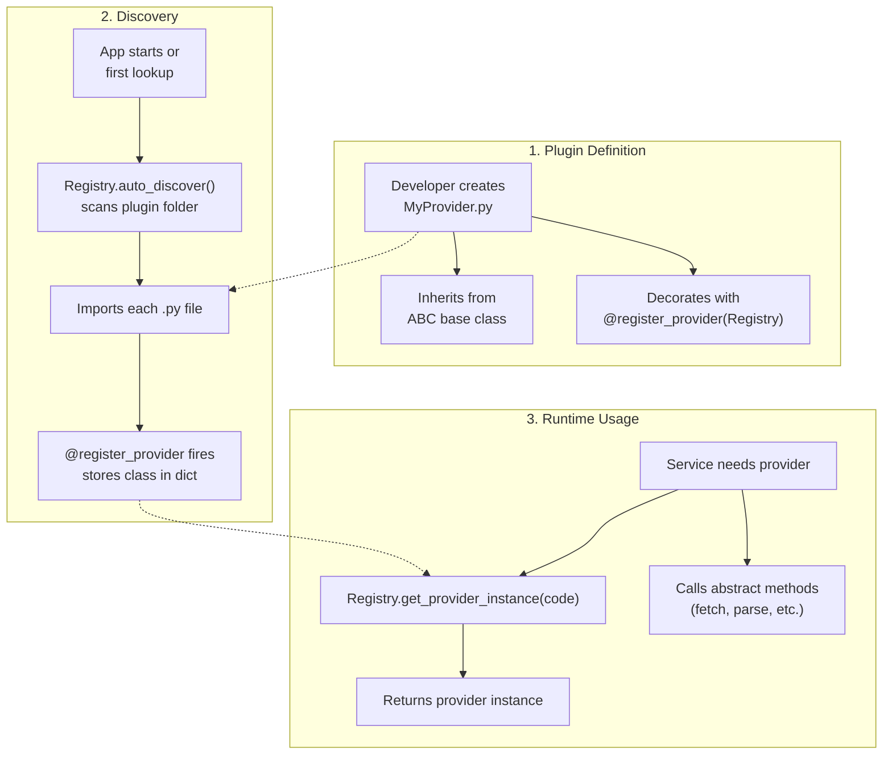

# 🧩 Registry Pattern and Plugin System

LibreFolio uses a **Registry Pattern** to create a flexible and extensible plugin system. This allows new functionality—such as support for new brokers, asset pricing sources, FX providers, technical signals, risk analytics, or Tools—to be added without modifying the core application code.

## ⚙️ How it Works

The system is based on three key components:

1. **Abstract Base Class (ABC)**: A template class that defines the interface a plugin must implement (e.g., `AssetSourceProvider`, `BRIMProvider`, `FXRateProvider`, `SignalPlugin`, `RiskAnalytic`, `ToolPlugin`).
2. **Plugin Registry**: A central class that discovers and stores all available plugins (e.g., `AssetProviderRegistry`, `SignalPluginRegistry`, `ToolPluginRegistry`).
3. **Registration Decorator**: `@register_provider` for provider systems or `@register_plugin` for non-provider plugin systems.

The registries and both decorators live in `backend/app/services/provider_registry.py`. The one exception is `ToolPluginRegistry`, in `backend/app/services/tools/registry.py`, which builds on the same base class.

### 🗺️ High-Level Flow



### 🔍 Discovery Process

1. **Scan**: On first access, `auto_discover()` scans the designated plugin folder (e.g., `backend/app/services/fx_providers/`).
2. **Import**: Each `.py` file is loaded with `importlib`, in file-name order. `__init__.py`, files whose name starts with `_`, the stems a registry ignores (`base` for the signal and risk registries), and modules already in `sys.modules` are skipped.
3. **Register**: The decorator fires on import and calls `Registry.register(class)`, which reads the registry's code attribute and stores the class under that code. The `@register_provider` registries read `provider_code` into `_providers[code]`; the `@register_plugin` registries read their own attribute (`signal_code`, `analytic_code`) into `_plugins[code]`. The Tool registry is the exception: it stages a claim and publishes later (see [Registry Specializations](#registry-specializations)).
4. **Lazy**: Discovery happens once, on the first lookup (`get_plugin()`, `get_provider_instance()`, `list_providers()`, …). Subsequent calls use the cached dictionary. The signal and Tool registries are discovered at startup instead.
5. **Failures**: A module that fails to import is logged, recorded, and left out; `get_discovery_errors()` returns the recorded failures. What happens next depends on the registry: see [Registry Specializations](#registry-specializations).
6. **Thread-safe**: Registry methods also run on worker threads (`asyncio.to_thread`, e.g. two broker reports uploaded in parallel), so the first discovery can be requested by two threads at once. Each registry gets its own re-entrant lock (`threading.RLock`, created in `__init_subclass__`) and `auto_discover()` is double-checked: if `_discovery_done` is already true it returns at once, otherwise it takes the lock, checks again and imports every module while holding it, setting `_discovery_done` only after the last module has run — so a caller arriving mid-discovery waits, then sees the whole catalogue. Without the lock, that caller would skip the modules another thread has put in `sys.modules` but not yet executed and walk a half-filled catalogue: an upload right after a restart could fail with `RuntimeError: dictionary changed size during iteration` (an HTTP 500) or store an incomplete list of compatible plugins. The lock is re-entrant, so a plugin module that calls back into its own registry while it is being imported does not deadlock, and the methods that walk the catalogue (`list_providers`, `shutdown_all_providers`, and the BRIM registry's `auto_detect_plugin`, `get_compatible_plugins`, `list_plugin_info`) iterate a copy, so a later `register()` on another thread cannot break them (covered by `./dev.py test services provider-registry-misc`). `ToolPluginRegistry` wraps this discovery in a lock of its own and refuses re-entry: a Tool module that looks the registry up while it is being imported gets a `RuntimeError` instead of a partial snapshot.

## 🧱 Core Components

### 🧬 `AbstractPluginRegistry`

The base class of every registry. Each subclass gets its own storage, discovery state, and lock (`__init_subclass__`). Provides:

| Method | Description |
|--------|-------------|
| `register(cls, plugin_class)` | Validate a class and store it under its code |
| `get_plugin(cls, code)` | Get the registered class by code (triggers auto-discovery if needed) |
| `get_plugin_instance(cls, code, **kwargs)` | Returns an **instantiated** plugin; retries without arguments when the keyword construction raises `TypeError` |
| `list_plugin_codes(cls)` | All registered codes, in registration order |
| `auto_discover(cls)` | Scan plugin folder and import all modules, once |
| `get_discovery_errors(cls)` | Import failures recorded by the discovery |

A subclass specializes it through class-method hooks: `_get_plugin_folder()` (a folder under `backend/app/services/`), `_get_plugin_code_attr()` (default `plugin_code`), `_normalize_lookup_code()`, `_validate_plugin_class()`, `_ignored_module_stems()`, `_reject_duplicate_codes()`, and `_fail_on_discovery_errors()`.

### 📋 `AbstractProviderRegistry`

The specialization shared by the three provider registries (asset, FX, BRIM). It stores classes in `_providers` and reads `provider_code` from an instance when the class can be built without arguments, from the class attribute otherwise. Provides:

| Method | Description |
|--------|-------------|
| `register(cls, provider_class)` | Store a provider class, keyed by its `provider_code` |
| `get_plugin(cls, code)` | Get provider class by code (triggers auto-discovery if needed) |
| `get_provider_instance(cls, code)` | Returns an **instantiated** provider object |
| `list_providers(cls)` | List all registered providers with `code` and `name` |
| `auto_discover(cls)` | Scan plugin folder and import all modules |
| `shutdown_all_providers(cls)` | Call `shutdown()` on every registered provider instance (graceful teardown) |

### 🛑 Provider Lifecycle — Shutdown

Each ABC base class (`AssetSourceProvider`, `FXRateProvider`, `BRIMProvider`) declares a no-op `shutdown()` method. Providers that hold persistent resources (e.g., background threads, WebSocket connections) override it to release them.

At application shutdown, `main.py`'s lifespan calls:

```python
AssetProviderRegistry.shutdown_all_providers()
FXProviderRegistry.shutdown_all_providers()
BRIMProviderRegistry.shutdown_all_providers()
```

`shutdown_all_providers()` iterates every registered provider, instantiates its class without arguments, and calls `shutdown()`; an error is logged as a warning and does not stop the other providers. No `hasattr` check is needed because the method is defined in the ABC.

**Example**: The JustETF provider overrides `shutdown()` to stop its live-quote WebSocket daemon threads via `shutdown_live_feeds()`.

### 🏷️ Registry Specializations

| Registry | Plugin Folder | Base Class | Purpose |
|----------|--------------|------------|---------|
| `BRIMProviderRegistry` | `brim_providers/` | `BRIMProvider` | Parse broker CSV/Excel files |
| `AssetProviderRegistry` | `asset_source_providers/` | `AssetSourceProvider` | Fetch asset prices |
| `FXProviderRegistry` | `fx_providers/` | `FXRateProvider` | Fetch exchange rates |
| `SignalPluginRegistry` | `signal_plugins/` | `SignalPlugin` | Compute schema-driven technical signals |
| `RiskAnalyticRegistry` | `risk_plugins/` | `RiskAnalytic` (`backend/app/services/risk/base.py`) | Compute multi-asset risk analytics |
| `ToolPluginRegistry` | `tool_plugins/` | `ToolPlugin` (`backend/app/services/tools/base.py`) | Publish atomic, versioned Tool calculations |

The registries share the folder scan but differ in when they discover, how they key a class, and how they react to a broken module:

| Registry | Code attribute (lookup) | Discovery runs | Import failure | Duplicate code |
|----------|-------------------------|----------------|----------------|----------------|
| Asset, FX, BRIM | `provider_code` (exact) | First lookup. At startup, the background cache pre-warm walks the asset registry | Logged and recorded; the other modules stay registered | The class imported last replaces the earlier one |
| `SignalPluginRegistry` | `signal_code` (trimmed, upper-cased) | Startup, in the `main.py` lifespan | Every later lookup raises `PluginDiscoveryError`, so the application does not start | `DuplicatePluginCodeError`, which fails that module's import |
| `RiskAnalyticRegistry` | `analytic_code` (trimmed, lower-cased) | First risk catalogue request or analytic run | Every later lookup raises `PluginDiscoveryError` | `DuplicatePluginCodeError`, which fails that module's import |
| `ToolPluginRegistry` | `services`: one definition per `ToolService.tool_code` | Startup, off the event loop (`asyncio.to_thread(ToolPluginRegistry.get_snapshot)`) | The module's claims are quarantined as `import_failed`; healthy services stay available | Every claimant is quarantined as `duplicate_code` |

The signal and risk registries are strict in one more way: `register()` accepts only subclasses of their base class and calls its `validate_definition()`, so an invalid declaration fails at import. The Tool registry does not store classes as they register. It stages claims, expands each packaged class into its services, validates every service definition, and publishes one read-only, code-sorted snapshot; registration is closed afterwards. See [Tool plugins](tool_plugins.md#discovery-and-version-lifecycle).

`GET /api/v1/system/plugin-diagnostics` lists the import failures of the asset, FX, BRIM, and signal registries. Quarantined Tool services appear in `GET /api/v1/tools/diagnostics` instead.

### 🎯 `@register_provider` Decorator

```python
@register_provider(AssetProviderRegistry)
class MyProvider(AssetSourceProvider):
    ...
```

The decorator is a factory that calls `registry_class.register(provider_class)` at import time.

Technical signals, risk analytics, and Tools use the equivalent non-provider decorator:

```python
@register_plugin(SignalPluginRegistry)
class MySignal(SignalPlugin):
    ...


@register_plugin(RiskAnalyticRegistry)
class MyAnalytic(RiskAnalytic):
    ...


@register_plugin(ToolPluginRegistry)  # ToolPluginRegistry: backend.app.services.tools.registry
class MyTool(ToolPlugin):
    ...
```

---

## 📖 Plugin Development Guides

Each subsystem has its own detailed guide with ABC method tables, flow diagrams, and implementation examples:

| Subsystem | Guide | Base Class | What It Does |
|-----------|-------|------------|-------------|
| **BRIM** | [BRIM Plugin Guide](brim_plugin_guide.md) | `BRIMProvider` | Parse broker export files (CSV, Excel) into transactions |
| **Assets** | [Asset Plugin Guide](asset_plugin_guide.md) | `AssetSourceProvider` | Fetch current and historical asset prices |
| **FX** | [FX Plugin Guide](fx_plugin_guide.md) | `FXRateProvider` | Fetch exchange rates from central banks |
| **Signals** | [Signal Plugin Guide](signal_plugin_guide.md) | `SignalPlugin` | Compute backend technical indicators and expose schema-driven UI metadata |
| **Tools** | [Tool Plugin Guide](tool_plugins.md) | `ToolPlugin` | Publish atomic, versioned calculations with generated codecs and compiled renderers |

Risk analytics have their guide in the Risk Engine page: [Adding a Risk Analytic](../../backend/risk/architecture.md#adding-an-analytic). Their contract is the `RiskAnalytic` base class in `backend/app/services/risk/base.py`, and every module in `backend/app/services/risk_plugins/` is a working example.

---

## 📚 Subsystem Documentation

Each plugin subsystem also has architecture docs, provider lists, and configuration pages:

### 📥 BRIM (Broker Report Import Manager)

- [Architecture](../../backend/brim/architecture.md) — Pipeline design, parsing flow
- [Generic CSV Provider](../../backend/brim/generic_csv.md) — User-configurable CSV mapper
- [Providers List](../../backend/brim/providers_list.md) — All supported brokers (Directa, Degiro, IBKR, etc.)

### 📈 Assets (Pricing & Metadata)

- [Architecture](../../backend/assets/architecture.md) — Provider interface, caching, refresh logic
- [System Providers](../../backend/assets/system_providers.md) — Built-in providers (Scheduled Investment, Manual)
- [Providers List](../../backend/assets/system_providers.md) — All available providers (Yahoo Finance, etc.)

### 💱 FX (Foreign Exchange)

- [Architecture](../../backend/fx/architecture.md) — Multi-provider design, sync process
- [Configuration & Routing](../../backend/fx/configuration.md) — Chain routing algorithm, priority fallback
- [Providers](../../backend/fx/providers/index.md) — ECB, FED, BOE, SNB technical details

### 📊 Technical Signals

- [Signal Plugin Guide](signal_plugin_guide.md) — Runtime architecture, contracts, implementation example, and validation gates
- [Technical Analysis](../../../financial-theory/technical-analysis/index.md) — Financial and mathematical documentation for built-in indicators

### 🛡️ Risk Analytics

- [Risk Engine](../../backend/risk/architecture.md) — Scope resolution, plugin contract, eligibility, simulation workers, and API
- [Risk Metrics](../../../financial-theory/technical-analysis/risk-metrics/index.md) — Financial and mathematical documentation for the risk measures

### 🧰 Tools

- [Tool Plugin Guide](tool_plugins.md) — Contracts, transactional discovery, isolated execution, budgets, and frontend renderers
- [Tools user guide](../../../user/tools/index.md) — What the Tools hub offers to users
