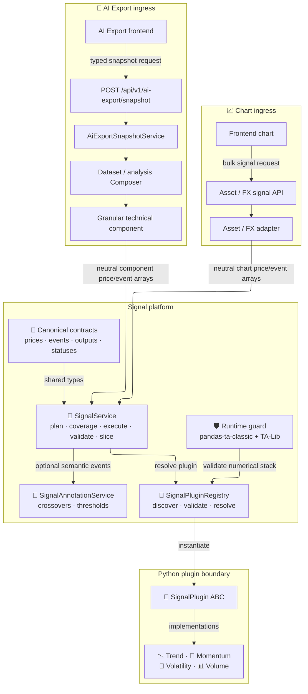
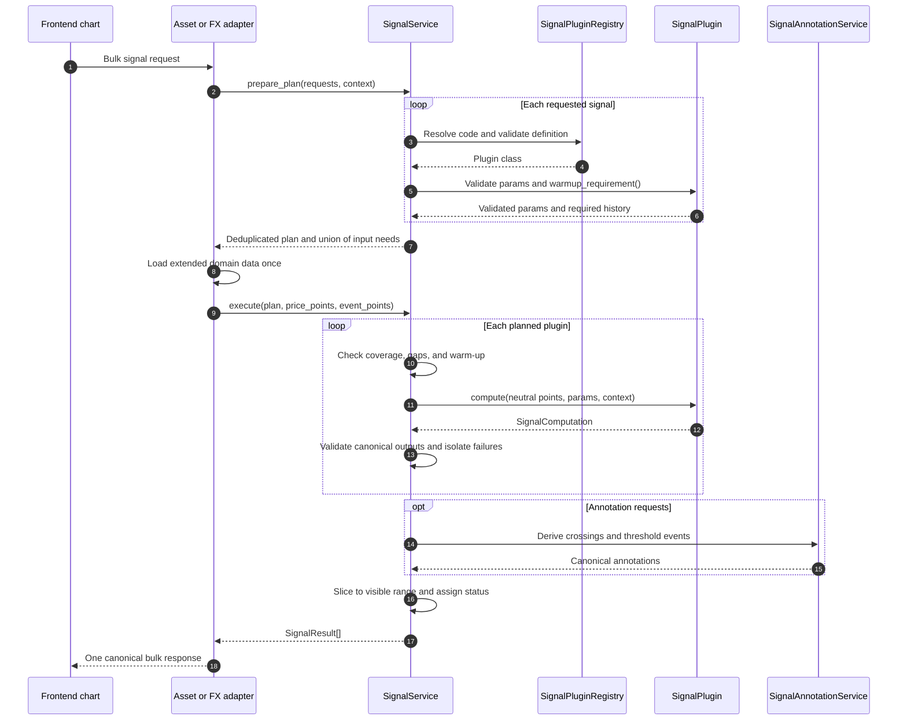
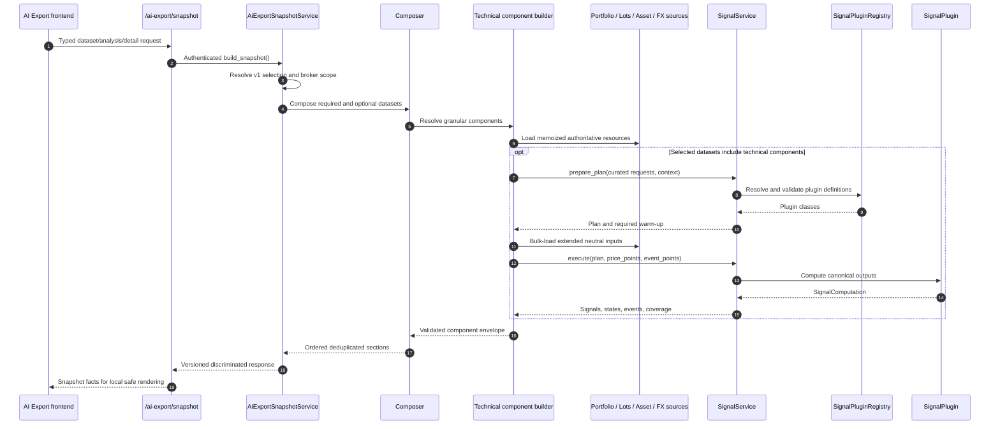

# 📊 Signal Plugin Guide

How to add a backend technical indicator to LibreFolio's schema-driven signal system.

**Base class**: `SignalPlugin`  
**Plugin folder**: `backend/app/services/signal_plugins/`  
**Registry**: `SignalPluginRegistry`  
**Orchestrator**: `SignalService`

---

## 🏗️ Architecture

Signal plugins own indicator-specific behavior. Shared infrastructure owns data loading,
coverage policy, error isolation, annotations, and API serialization.



| Component | Responsibility |
|---|---|
| `signal_runtime.py` | Verify the locked `pandas-ta-classic` + TA-Lib stack at startup and reject silent fallback. |
| `signal_plugins/base.py` | Define the plugin contract and build static catalog metadata. |
| `provider_registry.py` | Discover plugin files, validate definitions, and reject duplicate codes. |
| `signal_service.py` | Plan batches, calculate required history, check coverage, execute plugins, isolate failures, and slice output. |
| `signal_annotations.py` | Derive line crossovers and threshold crossings from extended canonical data. |
| Chart Asset/FX adapters | Load chart-domain data, perform currency conversion, and map it into neutral points. |
| AI Export runtime/components | Compose selected datasets, share request-scoped resources, and call the same `SignalService` for curated technical components. |

!!! important "Plugins do not load data"

    A signal plugin must not access the database, call providers, or know whether it was
    invoked from an Asset or FX endpoint. It receives neutral price/event arrays and
    returns canonical output.

The AI Export browser code never calculates indicators and never sends chart-computed
technical values. It calls `/ai-export/snapshot`; backend component builders own data
loading and invoke the shared signal platform. Dataset and analysis composition does
not change plugin math.

---

## 🔄 Request Lifecycle

Chart requests and AI Export components have separate adapters. They converge only at
`SignalService`.

### 📈 Chart Asset/FX Lifecycle



### 🧠 AI Export Component Lifecycle



### 1. 🧭 Planning

`SignalService.prepare_plan()`:

- resolves each `signal_code` through `SignalPluginRegistry`;
- validates parameters with the plugin-owned Pydantic model;
- deduplicates identical code/parameter combinations while preserving instance IDs;
- asks every plugin for its parameter-aware warm-up requirement;
- aggregates the maximum history and union of required price fields/events;
- records per-instance preflight failures without aborting the remaining batch.

The chart Asset/FX adapter or AI Export domain assembler uses that plan to load one
extended input range.

### 2. 🧮 Execution

The complete batch runs inside one `asyncio.to_thread(...)` call. Plugins execute
sequentially, so synchronous numerical libraries never block FastAPI's event loop.

For each plugin, the service:

1. measures field and date coverage;
2. applies the declared gap policy;
3. verifies minimum history and warm-up;
4. calls `plugin.compute(...)`;
5. validates series shape, finite values, declared output keys, axes, and units;
6. slices the extended result to the requested visible range;
7. isolates failures to that signal instance.

### 3. 🎯 Annotations

Optional annotation requests run after indicator calculation against the extended series.
This allows boundary crossovers to be detected correctly before output is sliced.

Supported primitives:

- line/line crossover;
- price/line crossover;
- threshold crossing;
- observed-only filtering;
- event sampling and limits.

Annotations are generic infrastructure, not plugin-specific trading advice.

---

## 📋 Plugin Contract

Every concrete plugin must declare:

| Member | Purpose |
|---|---|
| `signal_code` | Stable uppercase identifier used by APIs and saved settings. |
| `implementation_version` | Version of the plugin's numerical behavior. |
| `category` | Trend, momentum, volatility, or volume. |
| `display_name_key` | Frontend i18n key for the human-readable name. |
| `description_key` | Frontend i18n key for the short selector description. |
| `icon` | Emoji displayed by the signal selector. |
| `docs_path` | MkDocs path opened by the UI information button. |
| `params_model` | Pydantic model with `extra="forbid"` and JSON Schema UI metadata. |
| `input_requirements` | Required OHLCV fields, events, coverage, and data policy. |
| `output_specs` | Declared line/bar/band components, descriptions, styles, units, axes, levels, and regions. |
| `compatible_domains` | `ASSET`, `FX`, or both. |
| `annotation_capabilities` | Supported generic annotation primitives. |
| `ai_export_temporal_rules` | Plugin-owned fixed or parameter-matched AI Export temporal classes. |
| `warmup_requirement()` | Parameter-aware minimum and stabilization history. |
| `compute()` | Numerical implementation returning `SignalComputation`. |

The base class converts this declaration into `SignalCatalogDefinition`. Therefore the
frontend receives names, descriptions, parameter controls, required data, output shapes,
and documentation links without a signal-specific UI implementation.

### 🎨 Plugin-owned presentation

Every output component can declare a canonical `style`:

```python
SignalOutputSpec(
    key="plus_di",
    label_key="signals.adx.plusDi",
    description_key="signals.adx.plusDiDescription",
    kind=SignalSeriesKind.LINE,
    unit=SignalUnit.INDEX,
    axis=adx_axis,
    style=SignalOutputStyle(
        color_role=SignalColorRole.POSITIVE,
        line_pattern=SignalLinePattern.SOLID,
    ),
)
```

Supported color roles are semantic (`primary`, `secondary`, `positive`, `negative`,
`neutral`, `accent`), not hard-coded hex colors. The frontend combines those roles with
the user-selected base color and uses the same metadata for both chart rendering and the
component legend inside the configuration card.

The card exposes one independent style editor per output component and per value region.
Overrides are stored in `SignalConfig.componentStyles` and
`SignalConfig.partitionStyles`; they affect every chart surface without changing signal
parameters or triggering a backend recomputation. The legacy top-level `style` remains a
backward-compatible default for old saved configurations and frontend-local signals.

When value regions cover an output's complete numeric domain, the redundant parent
component editor is hidden automatically: RSI, CCI, and MFI show only their editable zones.
For mixed outputs, only the partitioned component is hidden; Stochastic RSI therefore keeps
the `%D` component editor while `%K` is represented by its complete zone set.

Line components can customize color, pattern, width, and endpoint markers. Bands customize
their middle line and fill color. Histograms keep signed green/red bars until the user
chooses a component color, after which the selected single color is used.

Value regions can declare their own `line_style`. The frontend applies those threshold
rules to returned points and derives contiguous visual slices at render time. For example,
RSI renders its neutral range as dashed while overbought and oversold segments remain
solid, without an RSI-specific frontend switch.

Multi-output indicators follow their financial definition:

- ADX uses three lines: ADX for strength, `+DI` for positive direction, and `-DI` for
  negative direction;
- MACD and PPO use two lines plus a histogram because the histogram is itself a defined
  output: line minus signal;
- Stochastic RSI uses `%K` plus the smoothed `%D` signal line.

---

## 🧱 Status and Data Policy

Each result has an explicit status:

| Status | Meaning |
|---|---|
| `ok` | Complete required input, complete warm-up, and valid visible output. |
| `partial` | Usable output with an explicit warning, such as incomplete stabilization. |
| `unavailable` | Required fields/history are insufficient, so calculation cannot start safely. |
| `failed` | Parameters, computation, output, or contract validation failed. |

The default policy is `STRICT_CONTIGUOUS`: missing required fields or date gaps are never
silently compacted. If a plugin can safely operate on one complete segment, it may declare
`ALLOW_PARTIAL_CONTIGUOUS`. The service prefers the newest segment that satisfies the
plugin's minimum history; otherwise it uses the longest sufficient segment. Output remains
partial and never jumps across the gap.

Coverage metadata includes both the total missing-point ratio and
`max_consecutive_missing_points`. The UI keeps the backend `partial` status visible, but
promotes it to an amber warning only when coverage is at most 95% or a missing streak is
longer than seven cadence points. Smaller gaps remain an informational notice.

!!! warning "A long history is not automatically complete"

    An asset can contain decades of closing prices while still lacking `high`, `low`, or
    `volume` on one required date. OHLC/volume plugins will report the exact coverage
    problem instead of computing over silently altered input.

---

## 💻 Complete Example

The example below adds an Asset-only Typical Price line:

$$
TP_t = \frac{H_t + L_t + C_t}{3}
$$

```python
# backend/app/services/signal_plugins/typical_price.py
from collections.abc import Sequence

from pydantic import BaseModel, ConfigDict

from backend.app.schemas.signals import (
    SignalAxisRole,
    SignalAxisSpec,
    SignalCategory,
    SignalComputation,
    SignalDomain,
    SignalEventPoint,
    SignalExecutionContext,
    SignalInputRequirements,
    SignalLineSeries,
    SignalOutputSpec,
    SignalPriceField,
    SignalPricePoint,
    SignalSeriesKind,
    SignalUnit,
    SignalValuePoint,
    SignalViewTransform,
    SignalWarmupRequirement,
)
from backend.app.services.provider_registry import (
    SignalPluginRegistry,
    register_plugin,
)
from backend.app.services.signal_plugins.base import SignalPlugin


class TypicalPriceParams(BaseModel):
    model_config = ConfigDict(extra="forbid")


@register_plugin(SignalPluginRegistry)
class TypicalPriceSignalPlugin(SignalPlugin):
    signal_code = "TYPICAL_PRICE"
    implementation_version = "1.0.0"
    category = SignalCategory.TREND
    display_name_key = "signals.typicalPrice.name"
    description_key = "signals.typicalPrice.description"
    icon = "⚖️"
    docs_path = (
        "financial-theory/technical-analysis/indicators/typical-price/"
    )
    params_model = TypicalPriceParams
    input_requirements = SignalInputRequirements(
        price_fields=[
            SignalPriceField.HIGH,
            SignalPriceField.LOW,
            SignalPriceField.CLOSE,
        ]
    )
    output_specs = (
        SignalOutputSpec(
            key="typical_price",
            label_key="signals.typicalPrice.output",
            kind=SignalSeriesKind.LINE,
            unit=SignalUnit.PRICE,
            axis=SignalAxisSpec(
                key="price",
                role=SignalAxisRole.PRICE,
            ),
            view_transform=SignalViewTransform.BASE_PERCENTAGE,
        ),
    )
    compatible_domains = (SignalDomain.ASSET,)
    annotation_capabilities = ("line_crossover",)

    @classmethod
    def warmup_requirement(
        cls,
        params: TypicalPriceParams,
        context: SignalExecutionContext,
    ) -> SignalWarmupRequirement:
        return SignalWarmupRequirement(
            minimum_points=1,
            stabilization_points=0,
            total_points=1,
        )

    def compute(
        self,
        price_points: Sequence[SignalPricePoint],
        event_points: Sequence[SignalEventPoint],
        params: TypicalPriceParams,
        context: SignalExecutionContext,
    ) -> SignalComputation:
        spec = self.output_specs[0]
        points = []
        for point in price_points:
            if point.high is None or point.low is None or point.close is None:
                raise ValueError("Typical Price requires high, low and close")
            points.append(
                SignalValuePoint(
                    date=point.date,
                    value=(
                        float(point.high)
                        + float(point.low)
                        + float(point.close)
                    )
                    / 3,
                )
            )

        return SignalComputation(
            series=[
                SignalLineSeries(
                    key=spec.key,
                    label_key=spec.label_key,
                    unit=spec.unit,
                    axis=spec.axis.model_copy(deep=True),
                    view_transform=spec.view_transform,
                    points=points,
                )
            ]
        )
```

No central registration list is required. Importing the module triggers
`@register_plugin(SignalPluginRegistry)`.

---

## 🎛️ Parameter Metadata

Parameters are ordinary Pydantic fields. JSON Schema extensions control the generic
frontend form:

```python
period: int = Field(
    20,
    ge=2,
    le=500,
    json_schema_extra={
        "x-i18n-key": "chartSettings.params.period",
        "x-control-order": 1,
        "x-suffix": "days",
        "x-step": 1,
        "x-tooltip-key": "chartSettings.tooltips.period",
        "x-affects-outputs": ["line"],
    },
)
```

Prefer schema metadata over frontend conditionals. New parameter shapes should be added
to the shared JSON Schema mapper only when they are reusable across plugins.

For composite indicators, `x-affects-outputs` lists the output keys changed by a
parameter. The generic card resolves those keys to localized component labels. Stochastic
RSI, for example, declares that its main period affects `%K` and the derived `%D`, while
`dPeriod` affects `%D` only and threshold parameters affect the `%K` zones.

---

## ⏱️ AI Export Temporal Contract

An indicator included in AI Export declares semantic speed through
`ai_export_temporal_rules`. Plugin owns classification; central AI Export policy owns
Compact/Standard/Full parameters, formula, and bucket construction.

Use one fixed rule when all supported parameter sets represent one time horizon:

```python
ai_export_temporal_rules = (
    SignalAiExportTemporalRule(
        temporal_class=SignalTemporalClass.MEDIUM_FAST,
    ),
)
```

Use exact parameter rules when one plugin represents materially different horizons.
Current EMA and SMA instances do this:

```python
ai_export_temporal_rules = (
    SignalAiExportTemporalRule(
        temporal_class=SignalTemporalClass.MEDIUM,
        parameter_match={"period": 20},
    ),
    SignalAiExportTemporalRule(
        temporal_class=SignalTemporalClass.SLOW,
        parameter_match={"period": 50},
    ),
    SignalAiExportTemporalRule(
        temporal_class=SignalTemporalClass.VERY_SLOW,
        parameter_match={"period": 200},
    ),
)
```

`resolve_ai_export_temporal_class()` validates parameters, compares normalized JSON
values exactly, and requires exactly one matching rule. Unknown or ambiguous matches
raise; no official plugin uses a default or signal-code fallback.

Temporal class changes exported numeric history density only. It does not change
calculation input, warm-up, output validation, latest values, period summaries, states,
or annotation detection. Multi-output indicators use one shared grid for every output.
See [AI Export Technical Sampling](ai_export_sampling.md) for formula, matrix, mappings,
event selection, and tests.

---

## ✅ Adding a Plugin

1. Create one Python file under `signal_plugins/`.
2. Define a strict Pydantic parameter model.
3. Declare required price fields/events and compatible domains.
4. Declare every canonical output in `output_specs`.
5. If AI Export will curate the plugin, declare fixed or parameter-matched
   `ai_export_temporal_rules`; never add a signal-code branch to AI Export.
6. Implement parameter-aware `warmup_requirement()`.
7. Implement and normalize `compute()`.
8. Validate semantic input/output and provide AI descriptions and annotations.
9. Add all EN/IT/FR/ES UI keys.
10. Add the English financial-theory page referenced by `docs_path`.
11. Add focused numerical/parity tests, temporal-rule resolution tests, and shared-grid
    tests for multi-output indicators.
12. Update `EXPECTED_CODES`, curated AI Export bundle expectations when applicable,
    and the initial class mapping documentation.
13. Verify the selected detail/class matrix row and sampling/event manifests.
14. Run the catalog, plugin, service, API, frontend, and documentation gates.

Useful commands:

```bash
./dev.py test services signal-plugin-matrix
./dev.py test services signal-service
./dev.py test api signal-catalogs
./dev.py api sync
./dev.py front check
./dev.py mkdocs build
./dev.py mkdocs check-links
```

---

## 🛡️ Design Rules

- Keep formulas and third-party library selection inside the plugin.
- Keep DB access, provider calls, currency conversion, and HTTP outside the plugin.
- Never compact missing dates or fields silently.
- Return canonical line, bar, or band series only.
- Use finite numeric output; `NaN` may represent warm-up gaps, infinity may not.
- Declare every output key exactly once in `output_specs`.
- Keep plugin construction argument-free and computation deterministic.
- Do not duplicate technical calculations in the frontend.
- Keep AI Export temporal classification in the plugin; keep sampling parameters and
  formula in the central temporal policy.
- Require exactly one temporal-rule match for every curated instance; no silent fallback.
- Increment `implementation_version` when numerical behavior changes.

---

## 🔗 Related Documentation

- [Registry Pattern Overview](registry_pattern.md)
- [Asset Plugin Guide](asset_plugin_guide.md)
- [FX Plugin Guide](fx_plugin_guide.md)
- [AI Export Overview](ai_export_snapshot.md)
- [AI Export Composition & Prompt](ai_export_composition.md)
- [AI Export Technical Sampling](ai_export_sampling.md)
- [Technical Analysis](../../../financial-theory/technical-analysis/index.md)
