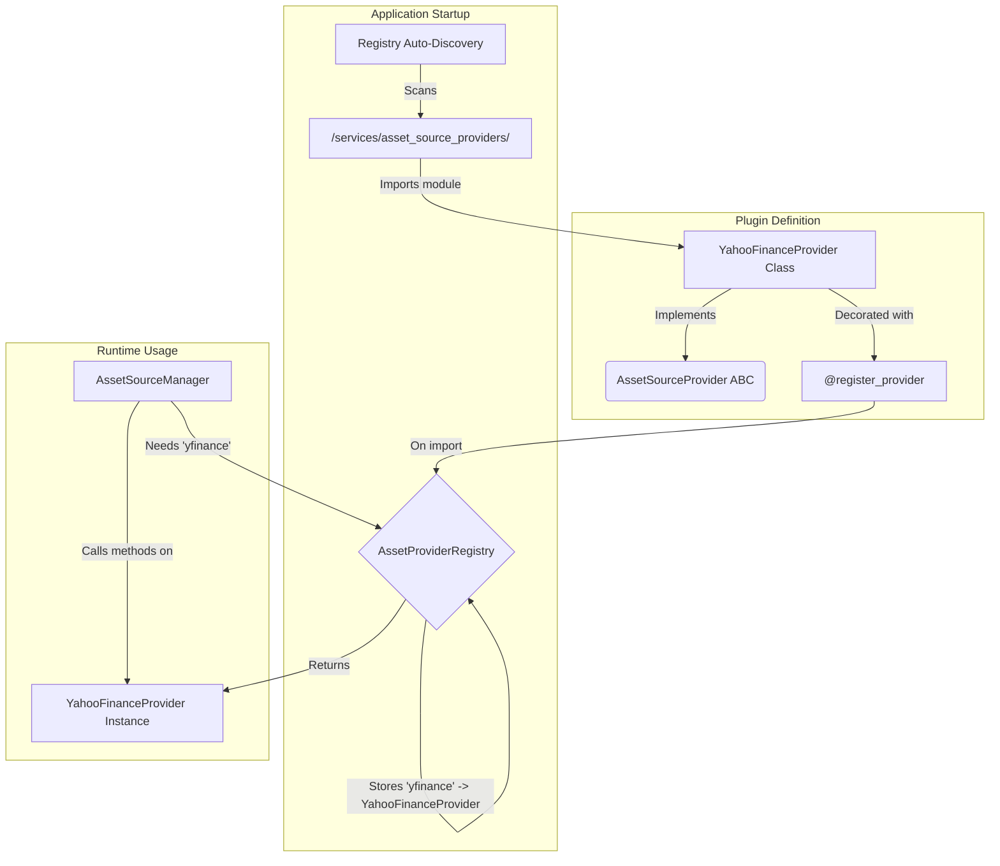

# 🧩 Registry Pattern and Plugin System

LibreFolio uses a **Registry Pattern** to create a flexible and extensible plugin system. This allows new functionality—such as support for new brokers, asset pricing sources, or FX providers—to be added without modifying the core application code.

## How it Works

The system is based on three key components:

1.  **Abstract Base Class (ABC)**: A template class that defines the interface a plugin must implement (e.g., `AssetSourceProvider`, `BRIMProvider`).
2.  **Provider Registry**: A central class that discovers and stores all available plugins (e.g., `AssetProviderRegistry`).
3.  **`@register_provider` Decorator**: A simple decorator that automatically registers a plugin with its corresponding registry.

### The Flow



1.  **Discovery**: When the application starts, the `ProviderRegistry` scans its designated plugin folder (e.g., `backend/app/services/brim_providers/`).
2.  **Registration**: As Python imports each plugin file, the `@register_provider` decorator is executed, adding the plugin class to the registry's internal dictionary, keyed by its unique `provider_code`.
3.  **Usage**: When the application needs a specific provider, it asks the registry for an instance of it. The registry finds the class by its code and returns an instantiated object.

## Guide: How to Create a New Plugin

This guide walks through creating a new **Asset Source Provider**. The process is nearly identical for **BRIM** and **FX** providers—just use the corresponding base class and registry.

### Step 1: Create the Plugin File

Create a new Python file in the appropriate directory:

-   **Asset Providers**: `backend/app/services/asset_source_providers/`
-   **BRIM Providers**: `backend/app/services/brim_providers/`
-   **FX Providers**: `backend/app/services/fx_providers/`

For this example, we'll create `my_new_provider.py` in `asset_source_providers/`.

### Step 2: Implement the Provider Class

In your new file, define a class that inherits from the correct base class and implement the required abstract methods.

```python
# backend/app/services/asset_source_providers/my_new_provider.py

from backend.app.services.asset_source import AssetSourceProvider
from backend.app.services.provider_registry import register_provider, AssetProviderRegistry
from backend.app.schemas.assets import FACurrentValue, FAHistoricalData

# The decorator that makes it all work!
@register_provider(AssetProviderRegistry)
class MyNewProvider(AssetSourceProvider):

    @property
    def provider_code(self) -> str:
        """A unique, lowercase identifier for your provider."""
        return "my_new_provider"

    @property
    def provider_name(self) -> str:
        """A human-readable name for the UI."""
        return "My New Awesome Provider"

    # --- Implement the required methods ---

    async def get_current_value(self, identifier: str, ...) -> FACurrentValue:
        # Your logic to fetch the current price
        # ...
        pass

    async def get_history_value(self, identifier: str, ...) -> FAHistoricalData:
        # Your logic to fetch historical prices
        # ...
        pass

    def validate_params(self, params: dict | None) -> None:
        # Your logic to validate provider-specific parameters
        # ...
        pass

    # ... and other abstract methods ...
```

### Step 3: Auto-Discovery

That's it! The next time you start the application, the `AssetProviderRegistry` will automatically discover and register `MyNewProvider`. It will then be available to be assigned to assets and used for fetching prices.

This plugin-based architecture makes LibreFolio highly extensible and easy to contribute to.
