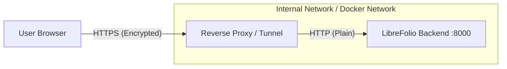

# Security Architecture

This document outlines the security model, boundaries, and deployment recommendations for LibreFolio.

## Threat Model and Scope

LibreFolio is a **self-hosted** application. The primary security assumption is that the **host system is secure**.

### In Scope

- **Session Security**: Preventing session hijacking via secure cookie attributes.
- **Data Segregation**: Ensuring strict isolation between users (RBAC).
- **Input Validation**: Preventing injection attacks via strict Pydantic schemas.
- **CSRF Protection**: Using `SameSite` cookie attributes to prevent Cross-Site Request Forgery.

### Out of Scope

- **Host System Compromise**: If an attacker gains shell access to the server, the database file is accessible. Encryption at rest is currently not implemented.
- **SSL/TLS Termination**: The application server (Uvicorn) speaks HTTP. HTTPS is the responsibility of the deployment environment (Reverse Proxy).

## Authentication & Session Management

LibreFolio uses **Stateful Session Authentication** instead of stateless tokens (JWT).

- **Mechanism**: Randomly generated 64-character Session ID stored in an `HttpOnly` cookie.
- **Storage**: Sessions are currently stored in-memory on the backend.
- **Cookie Attributes**:
    - `HttpOnly`: Prevents XSS attacks from reading the session ID.
    - `SameSite=Lax`: Mitigates CSRF attacks.
    - `Secure`: Enforced in production to ensure cookies are only sent over HTTPS.

## HTTPS & Deployment Architecture

**LibreFolio does not handle HTTPS directly.**

In a modern containerized environment, SSL/TLS termination is the responsibility of a **Reverse Proxy** or a **Tunneling Service**.

### The "Termination Proxy" Pattern

1. **The Client** connects securely to the Proxy (e.g., Nginx, Caddy, Traefik, Tailscale).
2. **The Proxy** handles the certificate handshake (Let's Encrypt) and decryption.
3. **The Proxy** forwards the request to LibreFolio over a private, internal network (Docker bridge).
4. **LibreFolio** processes the request and assumes the connection is secure.

### Why this approach?

- **Certificate Management**: Proxies like Caddy or Traefik handle automatic certificate renewal.
- **Performance**: Offloads encryption overhead from the application.
- **Simplicity**: Python code doesn't need to know about certificates or keys.

### Configuration

To ensure the application behaves correctly behind a proxy (e.g., generating correct redirect URLs), you must ensure the proxy sets the standard headers:

- `X-Forwarded-For`
- `X-Forwarded-Proto` (should be `https`)

In `production` mode, ensure the environment variable `SESSION_COOKIE_SECURE=True` is set in your `.env` file. This tells the backend to instruct the browser to *never* send the
cookie over plain HTTP.

## Reporting a Vulnerability

If you discover a security vulnerability, please report it by opening a **GitHub Issue** on the project repository.

Please provide a detailed description of the vulnerability, including:

- The steps to reproduce it.
- The potential impact.
- Any suggested mitigation.
