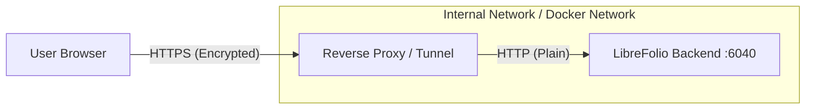

# 🔒 Security Architecture

This document outlines the security model, authentication system, and deployment recommendations for LibreFolio.

## 🎯 Threat Model and Scope

LibreFolio is a **self-hosted** application. The primary security assumption is that the **host system is secure**.

### ✅ In Scope

- **🔐 Authentication**: Stateless JWT-based authentication via HTTP-only session cookies with configurable expiration.
- **🛡️ Data Segregation**: Strict isolation between users via Role-Based Access Control (RBAC).
- **✏️ Input Validation**: Preventing injection attacks via strict Pydantic schemas.
- **🧼 Output Escaping**: User- and provider-supplied text is escaped or sanitized before the browser can render it as HTML.
- **📁 File Upload Security**: MIME type validation, executable blocking, size limits.
- **🚫 Endpoint Protection**: **All** data and file endpoints require a valid session cookie — including uploaded files and plugin assets.

### ⚠️ Out of Scope

- **💻 Host System Compromise**: If an attacker gains shell access to the server, the database file is accessible. Encryption at rest is currently not implemented.
- **🔗 SSL/TLS Termination**: The application server (Uvicorn) speaks HTTP. HTTPS is the responsibility of the deployment environment (Reverse Proxy).

## 🔑 Authentication — JWT Cookies

LibreFolio uses **stateless JWT (JSON Web Token)** authentication stored in **HTTP-only session cookies**.

### 🔄 How Login Works

1. User sends credentials to `POST /api/v1/auth/login`
2. Server validates credentials and sets an **HTTP-only cookie** containing the JWT
3. The browser **automatically includes** this cookie on all subsequent requests
4. `` tags, `fetch()` calls, and page navigations all send the cookie seamlessly

!!! success "Why cookies over Bearer headers?"

    HTTP-only cookies are **automatically sent** by the browser for all same-origin requests — including ``, `<link href>`, and AJAX calls. This means uploaded files and plugin assets are served securely without any special frontend handling.

### 🗝️ JWT Secret

The JWT signing key (`JWT_SECRET`) is:

- **🛠️ Development/`dev.py`**: Generated randomly at server start and passed to all Uvicorn workers via environment variable. This means all tokens are invalidated on server restart.
- **🐳 Production/Docker**: Can be set as a fixed environment variable (`JWT_SECRET=your-secret-here`) for persistence across restarts.

!!! warning "⚙️ Multi-worker support"

    On macOS, Uvicorn uses `spawn` (not `fork`) for worker processes. Each worker re-imports all modules, so the JWT secret **must** be shared via environment variable. `dev.py` handles this automatically by generating the secret before launching Uvicorn.

How the key is resolved:

- `backend/app/services/auth_service.py` reads `JWT_SECRET` once, at import, straight from
  `os.environ`: it is not a field of the Pydantic `Settings`. Tokens are signed with HS256. When
  the variable is unset or empty, each process falls back to its own
  `secrets.token_urlsafe(64)`.
- `dev.py` copies `.env` into the environment first, then calls
  `env.setdefault("JWT_SECRET", …)`, so an explicit value wins. An empty `JWT_SECRET=` line
  counts as set: `dev.py` keeps the empty string and every worker generates its own key, so a
  multi-worker server logs users out at random. Omit the line instead.
- The Docker image starts a single uvicorn worker (`CMD` in the `Dockerfile`): without the
  variable, every container start invalidates all sessions.

### ⏰ Token Expiration

- Configurable via [Global Settings](../../admin/settings.md): `session_ttl_hours` (default: 24 hours)
- Read at login, it sets both the token's `exp` and the cookie's `max_age`: a new value applies from the next login
- After expiration, the user must log in again
- There is no token refresh mechanism — a new login is required

### 🚪 Logout

- Frontend calls `POST /auth/logout` which clears the session cookie
- **No server-side blacklist** — the token remains technically valid until expiration
- This is acceptable for a self-hosted application with short TTL

### 💻 Using curl

```bash
# Login and save cookie
curl -s -c cookies.txt -X POST http://localhost:6040/api/v1/auth/login \
  -H "Content-Type: application/json" \
  -d '{"username": "admin", "password": "yourpassword"}'

# Use cookie for authenticated requests
curl -b cookies.txt http://localhost:6040/api/v1/auth/me

# List brokers
curl -b cookies.txt http://localhost:6040/api/v1/brokers

# Sync FX rates
curl -b cookies.txt -X POST \
  -H "Content-Type: application/json" \
  http://localhost:6040/api/v1/fx/currencies/sync
```

## 🛡️ Endpoint Protection

All endpoints that access or modify user data require a valid session cookie (`Depends(get_current_user)` in FastAPI).

### 🌐 Public Endpoints (no auth required)

| Endpoint | Method | Purpose |
|----------|--------|---------|
| `/auth/login` | POST | User login |
| `/auth/logout` | POST | Clear session cookie |
| `/auth/register` | POST | New user registration |
| `/system/health` | GET | Health check |
| `/system/info` | GET | System information |
| `/utilities/*` | GET | Reference data (countries, currencies, sectors) |
| `/ai-export/catalog` | GET | Static AI Export catalogue (no user data) |

### 🔒 Private Endpoints (auth required)

All other endpoints — including Auth (profile, password), Settings (including onboarding progress), System diagnostics (`/system/plugin-diagnostics`), Brokers, BRIM (files and plugins), Transactions, **Uploads** (CRUD + file serving + plugin assets), FX, Assets, Risk, Tools, Backup, and Users — require a valid session cookie.

!!! info "📁 Files are protected too"

    Uploaded files (`/uploads/file/{id}`) and plugin assets (`/uploads/plugin/{type}/{path}`) **require authentication**. Since auth uses HTTP-only cookies, the browser includes the session automatically for `` tags — no special handling needed.

For a complete endpoint reference, see the [API Overview](../api/overview.md).

## 🧼 Output Escaping

User- and provider-supplied text — asset, broker, and file names, notes, currency codes, icon
URLs — is rendered as text in tables, chart tooltips, notifications, and validation messages.
It never reaches `{@html}`, `innerHTML`, or a hand-built HTML string unescaped.

Svelte already escapes a plain `{expression}`. The risk lies wherever the frontend renders a
string as markup, and each of those places has one rule:

| Where markup is rendered | Rule | Helper |
|--------------------------|------|--------|
| Hand-built HTML strings: `html` table cells (rendered by `DataTable` with `{@html}`), ECharts tooltip formatters, validation-message parameters | Escape every user or provider value at the point where it is interpolated | `escapeHtml` (`frontend/src/lib/utils/core/escapeHtml.ts`) |
| `{@html}` sinks fed from many places: toasts (`ToastContainer.svelte`), `Tooltip.svelte`, the transaction modals and result banner | Sanitize the whole string at the sink. DOMPurify keeps the markup those strings are made of and drops event-handler attributes, `<script>`, and `javascript:` URLs | `sanitizeHtml` (`frontend/src/lib/utils/core/sanitizeHtml.ts`) |
| PAC planner explanations shown as tooltip HTML | Escape the text first, then add only the line breaks and bullet lists the helper itself produces | `tipHtml` (`frontend/src/lib/features/tools/pac-allocator/planner/shared/tipHtml.ts`) |

`escapeHtml` escapes `&`, `<`, `>`, `"`, and `'`, so its output is safe both as text and inside
a single- or double-quoted attribute. The `escapeHtml` exported by `$lib/utils/inlineMath`
deliberately leaves the apostrophe alone because its output feeds KaTeX, where `f'(x)` is prime
notation: do not use it for attribute values.

Two source gates keep the rule in force; both run in `./dev.py test front-utility core-unit`:

- `frontend/src/htmlInterpolation.gate.test.ts` parses every non-test `.svelte` and `.ts` file
  under `frontend/src` and fails when a user or provider text field reaches an HTML template
  without passing through `escapeHtml(…)`. Local escapers such as `esc(…)` are not accepted,
  because they leave `"` unescaped.
- `frontend/src/htmlSink.gate.test.ts` requires every `{@html X}` in a non-test `.svelte` file
  to be a `sanitizeHtml(…)` call or an entry of its reviewed list, which records a reason for
  each sink. An entry that no longer matches a sink fails the gate.

Neither gate sees a raw `innerHTML` assignment that involves no template: do not write one.
`./dev.py test front-asset asset-name-xss` (`frontend/e2e/assets/asset-name-xss.spec.ts`)
creates an asset whose name and icon URL carry markup, through the API, and checks in a real
browser that the table and card views of `/assets` show it as text and run nothing.

!!! warning "Fixed in 1.2: a stored XSS present since v1.1.0"

    In v1.1.0 the Name column of the Assets table interpolated the asset name raw into an
    `html` cell, which `DataTable` renders with `{@html}`. The backend stores any string as an
    asset name and assets are global, so a name containing markup ran as script in the browser
    of every user who opened the asset list — the administrator included. The same flaw sat in
    other `html` cells, chart tooltips, toasts, and validation messages. The 1.2 fix escapes
    user text where it enters an HTML string, sanitizes the sinks that receive mixed markup,
    and adds the two gates above.

## 🐳 Container Image Check

The automatic update check runs only for superusers, after login
(`frontend/src/routes/(app)/+layout.svelte`). Its release lookup is cached in `localStorage`
(`librefolio-update-check`) for one hour (`CHECK_INTERVAL_MS`), and **Skip this version** is
stored in the same entry. A manual **Check for updates** in the changelog modal bypasses both the
cache and the dismissal, and reports errors.

The update check reports a new release only once its Docker image can be pulled from GHCR.
GHCR's anonymous token handshake is not available to browsers through CORS, so the frontend
calls `GET /api/v1/system/container-image-status?tag=X.Y.Z` (authenticated) and the backend
performs it (`backend/app/services/container_registry.py`):

1. Accept only a stable `X.Y.Z` tag; both the route's query pattern and the service check it.
2. Send an anonymous `HEAD` for the tag's manifest on `ghcr.io/librefolio/librefolio`. Any
   answer other than `401` is final: success is `published`, `404` is `pending`, anything
   else is an `error`.
3. On `401`, parse the `WWW-Authenticate` Bearer challenge strictly (quoted parameters only,
   no duplicate keys). It is trusted only when `realm` is exactly `https://ghcr.io/token` —
   HTTPS, default port, no credentials, query, or fragment — `service` is `ghcr.io`, and
   `scope` is `repository:librefolio/librefolio:pull`.
4. Request an anonymous pull token from that realm; accept it only if it has bearer-token
   syntax (when both `token` and `access_token` are present, they must match).
5. Repeat the `HEAD` with that token in the `Authorization` header.

Every deviation fails closed with an `error` status (`image-auth-request-failed` for the
challenge and token steps, `image-request-failed` for the manifest requests). An untrusted
challenge is never followed, so the token request can only go to `https://ghcr.io/token`. The
HTTP client uses a 5 s timeout and does not follow redirects. The frontend keeps the gate
fail-closed as well (`frontend/src/lib/features/update-check/updateCheck.ts`): an error is
never shown as "up to date".

## 🌐 HTTPS & Deployment Architecture

**LibreFolio does not handle HTTPS directly.**

In a modern containerized environment, SSL/TLS termination is the responsibility of a **Reverse Proxy** or a **Tunneling Service**.

### 🔀 The "Termination Proxy" Pattern


```mermaid
graph LR
    Client[User Browser] -- "HTTPS (Encrypted)" --> Proxy[Reverse Proxy / Tunnel]
    
    subgraph "Internal Network / Docker Network"
        Proxy -- "HTTP (Plain)" --> Backend[LibreFolio Backend :6040]
    end
```

1. **The Client** connects securely to the Proxy (e.g., Nginx, Caddy, Traefik, Tailscale).
2. **The Proxy** handles the certificate handshake (Let's Encrypt) and decryption.
3. **The Proxy** forwards the request to LibreFolio over a private, internal network (Docker bridge).
4. **LibreFolio** processes the request and assumes the connection is secure.

### ❓ Why this approach?

- **📜 Certificate Management**: Proxies like Caddy or Traefik handle automatic certificate renewal.
- **⚡ Performance**: Offloads encryption overhead from the application.
- **🧹 Simplicity**: Python code doesn't need to know about certificates or keys.

### ⚙️ Configuration

To ensure the application behaves correctly behind a proxy (e.g., generating correct redirect URLs), you must ensure the proxy sets the standard headers:

- `X-Forwarded-For`
- `X-Forwarded-Proto` (the scheme the browser used: `$scheme` in Nginx). LibreFolio reads it to mark the session cookie `Secure`.

## 🐛 Reporting a Vulnerability

If you discover a security vulnerability, please report it by opening a **GitHub Issue** on the project repository.

Please provide a detailed description of the vulnerability, including:

- The steps to reproduce it.
- The potential impact.
- Any suggested mitigation.
