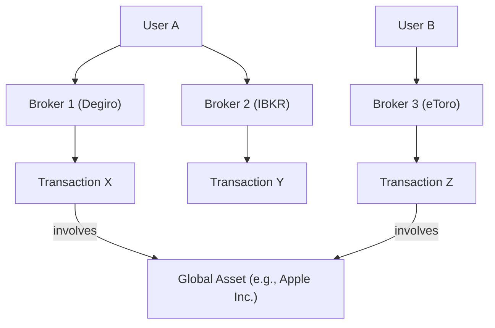

# Users, Authentication, and Brokers

This section explains the authentication model, user roles, and how data is segregated between users and brokers.

## Authentication Model

LibreFolio uses **JSON Web Tokens (JWT)** for authentication, following the OAuth2 `password` flow.

1.  **Login**: The user sends their `username` and `password` to the `/api/v1/auth/token` endpoint.
2.  **Token Issuance**: If the credentials are valid, the server generates a short-lived **access token** (JWT) and returns it to the client.
3.  **Authenticated Requests**: The client includes the access token in the `Authorization` header (`Bearer <token>`) for all subsequent API requests.
4.  **Token Validation**: The server validates the token's signature and expiration time on every request to ensure the user is authenticated.

This is a standard, stateless authentication mechanism that is secure and scalable.

## User Roles

There are two user roles in LibreFolio:

1.  **Normal User**:
    -   Can manage their own brokers, transactions, and settings.
    -   Can only access their own data.

2.  **Superuser (Admin)**:
    -   Has all the permissions of a normal user.
    -   Can access the administrative dashboard (future feature).
    -   Can manage all users and system-wide settings via the `user_cli.py` tool.

## User-Broker Mapping and Data Segregation

Data in LibreFolio is segregated based on a clear ownership hierarchy:

-   A **User** can have one or more **Brokers**.
-   A **Broker** belongs exclusively to one **User**.
-   A **Transaction** belongs exclusively to one **Broker**.

This structure ensures that a user can only ever access data that belongs to them. All API endpoints that return user-specific data (like transactions or portfolio summaries) are filtered by the `user_id` associated with the authenticated user.

### Global vs. User-Specific Data

-   **User-Specific**: `User`, `Broker`, `Transaction`, `UserSettings`.
-   **Global**: `Asset`, `PriceHistory`, `FxRate`, `GlobalSettings`.

**Assets** are global because the information about a financial instrument (like Apple stock) is the same for everyone. However, a user's *transactions* involving that asset are private.
