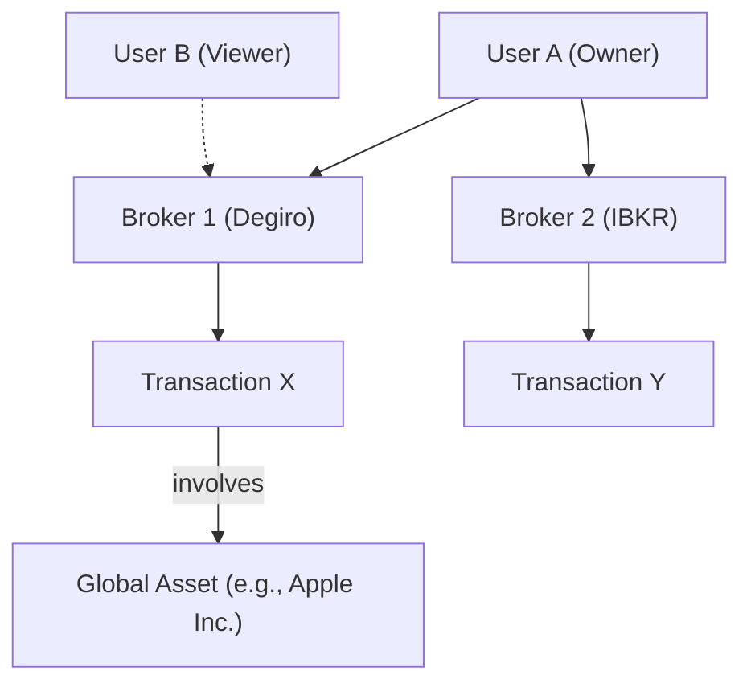

# 👥 Users, Authentication, and Brokers

This section explains the authentication model, user roles, and how data is segregated between users and brokers.

## 🔐 Authentication Model (Stateless JWT Cookie)

LibreFolio authenticates with a **signed JWT** kept in an HTTP-only cookie. The server stores no
session state, neither in memory nor in the database.

### 🔄 How it Works

1. **Login**: The user sends their `username` (or e-mail) and `password` to the `/api/v1/auth/login` endpoint.
2. **Token Creation**:
    - The server verifies the credentials (using `bcrypt` hashing).
    - If valid, it signs a JWT with `JWT_SECRET` (HS256) carrying the user ID (`sub`), the issue time (`iat`) and the expiry (`exp`): `create_jwt_token()` in `backend/app/services/auth_service.py`.
3. **Cookie Issuance**: The server responds with a `Set-Cookie` header for the `session` cookie, which holds the JWT; its `max_age` matches the token's lifetime.
    - **`HttpOnly`**: The cookie cannot be accessed by JavaScript (prevents XSS token theft).
    - **`SameSite=Lax`**: Provides protection against CSRF attacks.
    - **`Secure`**: decided by `session_cookie_secure()` in `backend/app/api/v1/auth.py` from `SESSION_COOKIE_SECURE`. `auto`, the default, sets it on HTTPS, seen directly or as the first `X-Forwarded-Proto` value of a reverse proxy; `always` and `never` force it. Login, logout and account deletion use the same rule. See [Configuration](../../admin/configuration.md).
4. **Authenticated Requests**: The browser automatically includes the session cookie in subsequent requests.
5. **Validation**: On every request, `get_current_user()` verifies the token's signature and expiry, then loads the user from the database: a missing or deactivated user gets `401` even with a valid token.

### 💾 Session State, Restarts & TTL

- 🧠 **Stateless**: Nothing is stored server-side, so any uvicorn worker can validate any token, provided all workers share the same `JWT_SECRET`.
- 🔑 **Restarts**: Sessions survive a restart only if `JWT_SECRET` is set to a fixed value. Without it, every start generates a new random key, existing tokens no longer verify, and everyone is signed out. See [JWT Secret](security.md#jwt-secret) for how the key is resolved.
- ⏱️ **TTL (Time To Live)**: The session duration is configurable via the `session_ttl_hours` Global Setting (default: 24 hours), read at login. There is no refresh: after expiry the user logs in again.
- 🚪 **Revocation**: Logout only deletes the cookie, and a password change leaves existing tokens valid until they expire. Deactivating or deleting the user cuts access at the next request; changing `JWT_SECRET` signs everyone out.

## 👤 User Roles

There are two system-level user roles in LibreFolio:

1. 👤 **Normal User**:
    - 📝 Can manage their own profile and settings.
    - 🏦 Can create and manage their own brokers.
    - 🤝 Can be granted access to other users' brokers.

2. 👑 **Superuser (Admin)**:
    - ✅ Has all permissions of a normal user.
    - ⚙️ Can manage system-wide **Global Settings**.
    - 🔧 Can manage other users (reset passwords, deactivate accounts) via CLI or API.
    - 🔍 Can access *any* broker and transaction in the system for support purposes.

## 🏗️ User-Broker Mapping and Data Segregation

Data in LibreFolio is segregated based on a clear ownership hierarchy, but allows for flexible sharing via the **Broker Access Control (RBAC)** system.

```mermaid
graph TD
    UserA["User A (Owner)"] --> BrokerA1["Broker 1 (Degiro)"]
    UserA --> BrokerA2["Broker 2 (IBKR)"]
    
    UserB["User B (Viewer)"] -.-> BrokerA1
    
    BrokerA1 --> TxA1["Transaction X"]
    BrokerA2 --> TxA2["Transaction Y"]

    Asset["Global Asset (e.g., Apple Inc.)"]
    TxA1 -- "involves" --> Asset
```

- 👑 **Ownership**: A **Broker** is created by a **User** (the Owner).
- 🤝 **Sharing**: The Owner can grant access to other users (e.g., User B) with specific roles (Viewer, Editor).
- 💰 **Transactions**: A **Transaction** belongs exclusively to one **Broker**.
- 🏷️ **Names**: Broker names are unique across the whole instance (`Broker.name` is a unique
  column), whoever owns them — see [Duplicate names](../frontend/components/features/brokers/forms.md#duplicate-broker-names).
- 🔍 **Discovery**: The brokers a user cannot access still appear by name on the Brokers page
  (`BrokerDiscoveryCard`, under *Other Existing Brokers*). Their sharing view is read-only:
  `GET /brokers/{id}/access` loads the broker with `as_user_id="all"` and answers any signed-in
  user, so the user can see whom to ask for access. This is by design (developer decision,
  2026-10-08): the users of one instance are not strangers, and seeing who has access lets them
  ask an Owner or choose whom to share with. The response carries each user's username, e-mail,
  role, share and avatar (`BrokerService.list_accesses()`); the frontend shows usernames and
  avatars, not e-mails.

### 🛡️ Broker Access Control (RBAC)

Access to brokers is granularly controlled via the `BrokerUserAccess` table.

> 🔗 **Deep Dive**: For a detailed explanation of roles (OWNER, EDITOR, VIEWER) and permissions, see the **[Access Control (RBAC)](access_control.md)** documentation.

### 🌐 Global vs. User-Specific Data

- 👤 **User-Specific**: `User`, `UserSettings`.
- 🏦 **Broker-Specific**: `Broker`, `Transaction`, `BrokerUserAccess`.
- 🌍 **Global**: `Asset`, `PriceHistory`, `FxRate`, `GlobalSettings`.

**Assets** are global because the information about a financial instrument (like Apple stock) is the same for everyone. However, a user's *transactions* involving that asset are
private (scoped to their Broker).
