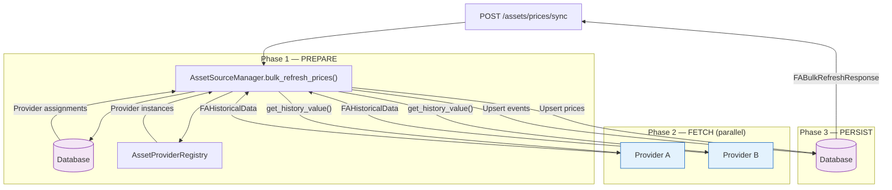
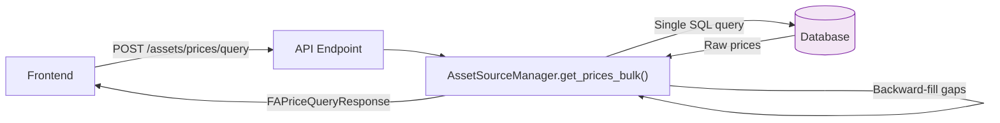

# 💰 Asset Pricing & Metadata Architecture

The Asset system in LibreFolio manages financial instruments (Stocks, ETFs, Bonds, Crypto, etc.), fetches their prices from external providers, and maintains their metadata.

## 🧱 Core Components

### 1️⃣ `AssetSourceProvider` (Plugin Base Class)

Abstract base class for all asset pricing plugins. Each provider auto-registers via `@register_provider(AssetProviderRegistry)`.

| Property / Method | Required | Default | Description |
|---|---|---|---|
| `provider_code` | ✅ | — | Unique identifier (e.g., `"yfinance"`) |
| `provider_name` | ✅ | — | Human-readable name |
| `test_cases` | ✅ | — | Test data for automated testing |
| `test_search_query` | ✅ | — | Search query for tests (`None` if search unsupported) |
| `get_current_value()` | ✅ | — | Fetch latest price → `FACurrentValue` |
| `get_history_value()` | ✅ | — | Fetch historical OHLCV → `FAHistoricalData` |
| `validate_params()` | ✅ | no-op | Validate provider-specific configuration |
| `params_schema` | — | `[]` | Schema for dynamic form generation in the frontend |
| `get_asset_url()` | — | `None` | URL to the provider's page for this asset |
| `accepted_identifier_types` | — | `[TICKER, ISIN]` | Input types accepted by this provider |
| `supports_history` | — | `True` | `False` for current-price-only providers |
| `search()` | — | raises `NOT_SUPPORTED` | Search for assets by name/ticker/ISIN |
| `fetch_asset_metadata()` | — | `None` | Fetch asset metadata (type, sector, identifiers) |
| `provider_help_url` | — | `None` | URL to the provider's documentation page |

!!! info "`supports_search` heuristic"

    The `list_providers` endpoint determines search support via `instance.test_search_query is not None` — a local property check, not an HTTP call. This avoids cold-start latency on `GET /assets/provider`.

### 2️⃣ `AssetSourceManager`

Central service that coordinates all asset-related operations:

- **Provider Assignment**: Link an asset to a provider (e.g., "AAPL" → "yfinance").
- **Price Sync**: 3-phase pipeline: PREPARE → FETCH → PERSIST (see [Data Flow](#data-flow-sync-pipeline) below).
- **Price Query**: DB-only bulk query with backward-fill via `POST /assets/prices/query`.
- **Current Price** *(new)*: Bulk live-price endpoint via `POST /assets/prices/current`. Calls each asset's provider `get_current_value()` with DB fallback. Used by the [LiveTicker](../../frontend/components/features/live-ticker.md) component.
- **Event Sync**: Persist asset events from providers into the `asset_events` table, filtered by `provider_assignment_id` (manual events survive sync).
- **Probe**: Dry-run provider config testing via `probe_provider_config()`.
- **Metadata**: Delegate to `AssetMetadataService` for classification merging.

### 3️⃣ `AssetMetadataService`

Manages descriptive information about assets:

- **Classification**: `sector_area` and `geographic_area` distributions.
- **Merging**: Merges metadata from providers with existing user-defined data.
- **Patching**: Supports partial updates to asset metadata.

### 4️⃣ `AssetProviderRegistry`

Uses the [Registry Pattern](../../architecture/patterns/registry_pattern.md) for auto-discovery of provider plugins.

### 5️⃣ `AssetEvent` Table

Stores asset-level events produced by providers or created manually by users. Events are distinct from portfolio transactions:

- **Events** describe what happens to the **asset globally** (DIVIDEND, INTEREST, SPLIT, etc.)
- **Transactions** describe what happens in a **user's portfolio** (BUY, SELL)

**Dedup strategy**: Events with a `provider_assignment_id` (auto-generated) are deduped via DELETE+INSERT filtered by `(asset_id, provider_assignment_id)` during sync. Events with `provider_assignment_id = NULL` are user-created manual events and are **never** auto-deleted.

See [Asset Events](events.md) for full details.

---

## 🔄 Data Flow: Sync Pipeline

When the user triggers a sync (or the scheduler does), `bulk_refresh_prices()` executes a 3-phase pipeline:

**Phase 2** uses `asyncio.Semaphore` to limit concurrent HTTP requests. Each provider fetch includes:

- Price points (OHLCV)
- Asset events (if `supports_events = True`)

**Phase 3** upserts prices and events in a single transaction. Event sync respects `provider_assignment_id` — only auto-generated events for that provider are replaced.

---

## 📊 Data Flow: Price Query

`POST /assets/prices/query` is the **primary read endpoint** for price data. It reads directly from the database (no provider calls) and applies backward-fill for gaps.

Each query item can request:

- `include_price: true` — price history with backward-fill
- `include_events: true` — asset events in the date range

---

## 🧪 Provider Probe

`POST /assets/provider/probe` allows **dry-run testing** of a provider configuration without persisting anything.

Operations (selectable per request):

| Operation | What it tests |
|---|---|
| `current_price` | Fetches latest price → validates provider can reach the asset |
| `history` | Fetches last 30 days of data → validates historical data availability |
| `metadata` | Fetches asset metadata → validates identifier resolution |

Each operation returns `success`, `execution_time_ms`, and operation-specific data. The probe is used by the frontend "Test Configuration" button in the provider assignment section.

---

## 📊 Backward Fill Logic

Financial markets are closed on weekends and holidays. To provide a continuous price series for charts, LibreFolio uses a **backward-fill** strategy.

If a price is requested for a date where no data exists (e.g., Sunday), the system looks back to find the most recent available price (e.g., Friday's close) and uses that. The `backward_fill_info` field in `FAPricePoint` indicates the actual date and staleness (`days_back`).

---

## ⚡ Cache & Performance

- **`NamedCache`**: generic TTL-based in-memory cache used across services. Each cache instance has a name, max TTL, and automatic eviction. Used by `_asset_current_cache` for current-price lookups.
- **`_asset_current_cache`**: caches `get_current_prices_bulk()` results keyed by `(asset_id, provider_id)`. Prevents redundant provider calls during UI refresh storms (e.g., scrolling through the asset list).
- **Provider Pre-warm**: `_prewarm_provider_caches()` runs asynchronously in `main.py` lifespan — instantiates all registered providers at startup to prime internal caches (JustETF ETF list, yfinance search cache, etc.).
- **`supports_search` check**: Uses `test_search_query is not None` (local property), avoiding cold-start HTTP calls on `GET /assets/provider`.
- **Bulk queries**: `get_prices_bulk()` uses a single SQL query for all requested assets, not N+1.

---

## 🌐 API Endpoints Summary

| Endpoint | Method | Description |
|---|---|---|
| `POST /api/v1/assets` | POST | Bulk create assets |
| `PATCH /api/v1/assets` | PATCH | Bulk update assets |
| `GET /api/v1/assets` | GET | Bulk read by IDs (with metadata) |
| `GET /api/v1/assets/all` | GET | All active assets |
| `GET /api/v1/assets/query` | GET | Filtered list (search, type, currency, active) |
| `DELETE /api/v1/assets` | DELETE | Bulk delete (cascade provider+prices) |
| `GET /api/v1/assets/provider` | GET | List providers (with `params_schema`) |
| `GET /api/v1/assets/provider/search` | GET | Multi-provider parallel search |
| `GET /api/v1/assets/provider/search/stream` | GET | SSE streaming search results |
| `POST /api/v1/assets/provider/probe` | POST | Dry-run provider config test |
| `POST /api/v1/assets/provider` | POST | Bulk assign providers |
| `DELETE /api/v1/assets/provider` | DELETE | Bulk remove providers |
| `GET /api/v1/assets/provider/assignments` | GET | Read provider assignments |
| `POST /api/v1/assets/provider/refresh` | POST | Refresh metadata from provider |
| `POST /api/v1/assets/prices` | POST | Bulk upsert prices |
| `DELETE /api/v1/assets/prices` | DELETE | Bulk delete price ranges |
| `POST /api/v1/assets/prices/query` | POST | Bulk price query (DB-only, backward-fill) |
| `POST /api/v1/assets/prices/sync` | POST | Bulk refresh prices from provider |

---

## 🔗 Related Documentation

- 📊 [Assets & Pricing ER Diagram](../../architecture/database/assets_pricing.md) — Database schema
- 📅 [Asset Events](events.md) — Event types, dedup strategy, auto-generation
- 🔌 [System Providers](system_providers.md) — CSS Scraper & Scheduled Investment
- 📦 [Providers Overview](system_providers.md) — All available providers
- 📈 [Asset Plugin Guide](../../architecture/patterns/asset_plugin_guide.md) — How to create a new provider
