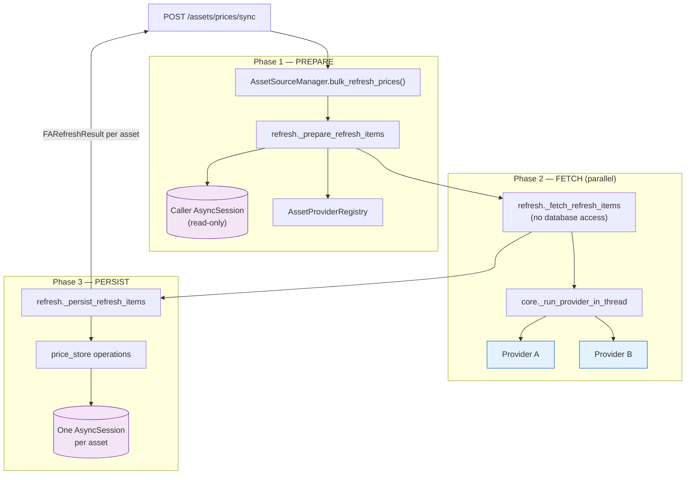
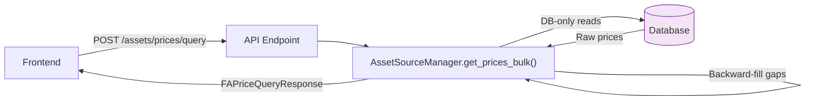

# 💰 Asset Pricing & Metadata Architecture

The Asset system in LibreFolio manages financial instruments (Stocks, ETFs, Bonds, Crypto, etc.), fetches their prices from external providers, and maintains their metadata.

## 📦 Canonical Package and Compatibility

Asset pricing services live in `backend/app/services/asset_sources/`. Each module owns one
responsibility:

| Module | Responsibility |
|--------|----------------|
| `core.py` | Provider contract and shared infrastructure: `AssetSourceProvider`, `AssetSourceError`, history start-date types, the five cache singletons, provider-parameter hashing, error sanitization, the OHLC guard, and `_run_provider_in_thread`. |
| `provider_management.py` | Provider assignment, removal and lookup; parametric-provider data invalidation; and the non-persisting provider probe. |
| `metadata.py` | Explicit provider metadata refresh, metadata caching, and application of returned patches through `AssetCRUDService`. |
| `price_store.py` | Price and event upserts/deletes, currency-change market-data wipes, OHLC integrity checks, and bounded write chunks. |
| `price_query.py` | DB-backed history/event queries, backward fill, FX and signal preparation, plus current-price lookup and today's OHLC write-back. |
| `refresh.py` | Provider-driven price refresh and its explicit PREPARE/FETCH/PERSIST phases. |
| `crud.py` | Asset create, list, patch, delete, and merge operations. |
| `search.py` | Cross-provider batch search, SSE search, query caching, link-finder fallback, and URL resolution. |
| `manager.py` | The single `AssetSourceManager` class, composed from the provider, metadata, store, query, and refresh operation mixins. |

These are behavioral boundaries, not only file boundaries: `refresh.py` orchestrates remote
acquisition, `price_store.py` owns reusable price/event persistence primitives, and
`price_query.py` owns database-backed reads plus the separate live-quote path.

`backend/app/services/asset_sources/__init__.py` exposes the canonical public objects.
`backend/app/services/asset_source.py` remains a thin Release 2 compatibility facade: it
re-exports those same class, error, type, and service objects rather than wrapping, copying, or
subclassing them.

!!! info "Canonical imports and legacy compatibility"

    New code should import the provider base class and error from
    `backend.app.services.asset_sources.core`. The thread runner and all cache patch points also
    belong to that module. Existing public imports from
    `backend.app.services.asset_source` remain supported during Release 2 and resolve to the
    identical objects.

## 🧱 Core Components

### 1️⃣ `AssetSourceProvider` (Plugin Base Class)

Abstract base class for all asset pricing plugins, canonically defined in
`backend/app/services/asset_sources/core.py`. Each provider auto-registers via
`@register_provider(AssetProviderRegistry)`.

| Property / Method | Required | Default | Description |
|---|---|---|---|
| `provider_code` | ✅ | — | Unique identifier (e.g., `"yfinance"`) |
| `provider_name` | ✅ | — | Human-readable name |
| `test_cases` | ✅ | — | Test data for automated testing |
| `test_search_query` | ✅ | — | Search query for tests (`None` if search unsupported) |
| `get_current_value()` | ✅ | — | Fetch latest price → `FACurrentValue` |
| `get_history_value()` | ✅ | — | Fetch historical OHLCV → `FAHistoricalData` |
| `validate_params()` | ✅ | no-op | Validate provider-specific configuration |
| `params_schema` | — | `[]` | Schema for dynamic form generation in the frontend |
| `get_asset_url()` | — | `None` | URL to the provider's page for this asset |
| `resolvable_url_domains` | — | `[]` | Domains accepted by `resolve_url`; non-empty means `supports_url_resolution = True` |
| `resolve_url(url)` | — | `None` | Interactive-search hook: provider page URL → one search-item dict, list of dicts, or `None` |
| `accepted_identifier_types` | — | `[TICKER, ISIN]` | Input types accepted by this provider |
| `supports_history` | — | `True` | `False` for current-price-only providers |
| `search()` | — | raises `NOT_SUPPORTED` | Search for assets by name/ticker/ISIN |
| `fetch_asset_metadata()` | — | `None` | Fetch asset metadata (type, sector, identifiers) |
| `provider_help_url` | — | `None` | URL to the provider's documentation page |

!!! info "`supports_search` heuristic"

    The `list_providers` endpoint determines search support via `instance.test_search_query is not None` — a local property check, not an HTTP call. This avoids cold-start latency on `GET /assets/provider`.

### 2️⃣ `AssetSourceManager`

The stable manager class in `asset_sources/manager.py` composes the responsibility-specific
operation mixins:

- **Provider Assignment**: Link an asset to a provider (e.g., "AAPL" → "yfinance").
- **Price Sync**: 3-phase pipeline: PREPARE → FETCH → PERSIST (see [Data Flow](#data-flow-sync-pipeline) below).
- **Price Query**: DB-only bulk query with backward-fill via `POST /assets/prices/query`.
- **Current Price**: Bulk live-price endpoint via `POST /assets/prices/current`. Calls each asset's provider `get_current_value()` with DB fallback. Used by the [LiveTicker](../../frontend/components/features/live-ticker.md) component.
- **Event Sync**: Persist asset events from providers into the `asset_events` table, filtered by `provider_assignment_id` (manual events survive sync).
- **Probe**: Dry-run provider config testing via `probe_provider_config()`.

### 3️⃣ `AssetProviderRegistry`

Uses the [Registry Pattern](../../architecture/patterns/registry_pattern.md) for auto-discovery of provider plugins.

### 4️⃣ `AssetEvent` Table

Stores asset-level events produced by providers or created manually by users. Events are distinct from portfolio transactions:

- **Events** describe what happens to the **asset globally** (DIVIDEND, INTEREST, SPLIT, etc.)
- **Transactions** describe what happens in a **user's portfolio** (BUY, SELL)

**Dedup strategy**: Events with a `provider_assignment_id` (auto-generated) are replaced per
`(asset_id, date, type, provider_assignment_id)` key during sync. Events with
`provider_assignment_id = NULL` are user-created manual events and are **never** replaced by a
provider upsert.

See [Asset Events](events.md) for full details.

---

## 🔄 Data Flow: Sync Pipeline

When the user triggers a sync (or the scheduler does), `bulk_refresh_prices()` executes a 3-phase pipeline:

```mermaid
graph TD
    API["POST /assets/prices/sync"] --> Manager["AssetSourceManager.bulk_refresh_prices()"]

    subgraph "Phase 1 — PREPARE"
        Manager --> Prepare["refresh._prepare_refresh_items"]
        Prepare --> DB1[("Caller AsyncSession<br/>(read-only)")]
        Prepare --> Registry["AssetProviderRegistry"]
    end

    subgraph "Phase 2 — FETCH (parallel)"
        Prepare --> Fetch["refresh._fetch_refresh_items<br/>(no database access)"]
        Fetch --> Thread["core._run_provider_in_thread"]
        Thread --> P1["Provider A"]
        Thread --> P2["Provider B"]
    end

    subgraph "Phase 3 — PERSIST"
        Fetch --> Persist["refresh._persist_refresh_items"]
        Persist --> Store["price_store operations"]
        Store --> DB2[("One AsyncSession<br/>per asset")]
    end

    Persist -- "FARefreshResult per asset" --> API

    style P1 fill:#e3f2fd,stroke:#1565c0
    style P2 fill:#e3f2fd,stroke:#1565c0
    style DB1 fill:#f3e5f5,stroke:#7b1fa2
    style DB2 fill:#f3e5f5,stroke:#7b1fa2
```

1. **PREPARE** uses the caller's `AsyncSession` for reads only. It resolves assets,
   assignments, provider instances, validated parameters, and `resume` dates into immutable
   prepared records. It performs no provider I/O and no writes.
2. **FETCH** receives no database session. It uses an `asyncio.Semaphore`, the core history and
   current caches, and `core._run_provider_in_thread()` for provider history/current calls.
   Price data and best-effort provider events remain in memory.
3. **PERSIST** creates a distinct `AsyncSession` for each asset. It compares fetched points with
   stored rows, then delegates price/event writes to `price_store.py`.

Persistence intentionally does **not** claim one atomic transaction for the whole refresh.
`bulk_upsert_prices()` commits bounded chunks of
`PRICE_UPSERT_CHUNK_SIZE = 1000`; event upserts commit their own bounded chunks; and
`last_fetch_at` is committed separately afterwards. This keeps SQLite writer-lock windows bounded
and preserves truthful partial results when one step fails. Provider-generated events remain
scoped by `provider_assignment_id`, so manual events are not replaced.

---

## 📊 Data Flow: Price Query

`POST /assets/prices/query` is the **primary read endpoint** for price data. It reads directly from the database (no provider calls) and applies backward-fill for gaps.

```mermaid
graph LR
    FE["Frontend"] -- "POST /assets/prices/query" --> API["API Endpoint"]
    API --> Manager["AssetSourceManager.get_prices_bulk()"]
    Manager -- "DB-only reads" --> DB[(Database)]
    DB -- "Raw prices" --> Manager
    Manager -- "Backward-fill gaps" --> Manager
    Manager -- "FAPriceQueryResponse" --> FE

    style DB fill:#f3e5f5,stroke:#7b1fa2
```

Each query item can request:

- `include_price: true` — price history with backward-fill
- `include_events: true` — asset events in the date range

`get_prices_bulk()` never invokes a provider. Provider acquisition belongs to
`refresh.py` through `POST /assets/prices/sync`; the query path remains DB-only while retaining
its warm-up, event, FX-conversion, signal-computation, and final response-slicing passes.

### 💹 Current Quotes and Today's OHLC

`get_current_prices_bulk()` is deliberately separate from the DB-only historical query. It checks
the core current-price cache, calls an assigned provider through
`core._run_provider_in_thread()`, and falls back to the latest `PriceHistory` row if the provider
fails or is absent.

A successful provider quote dated today is written back to today's OHLC row:

- a missing row is created with `open = high = low = close = value` and `volume = None`;
- an existing row keeps its volume, widens `low`/`high`, fills `open` only when it is missing,
  and overwrites `close` with the latest quote;
- a `db:last_known` fallback is never written as if it were a fresh quote.

The write-back is best-effort: a commit failure is rolled back and logged without discarding the
current-price response.

---

## 🧪 Provider Probe

`POST /assets/provider/probe` allows **dry-run testing** of a provider configuration without persisting anything.

Operations (selectable per request):

| Operation | What it tests |
|---|---|
| `current_price` | Fetches latest price → validates provider can reach the asset |
| `history` | Fetches last 30 days of data → validates historical data availability |
| `metadata` | Fetches asset metadata → validates identifier resolution |

Each operation returns `success`, `execution_time_ms`, and operation-specific data. The probe is used by the frontend "Test Configuration" button in the provider assignment section.

---

## 🔎 Interactive Search Stack

`GET /assets/provider/search` and `GET /assets/provider/search/stream` use a three-layer stack:

1. **On-site provider search** — `provider.search(query)` runs first.
2. **`web_link_finder`** — only if on-site search returns 0 items, the provider opts into
   `resolvable_url_domains`, and the finder is enabled. It uses the `ddgs` library by default to
   find provider-domain candidate URLs.
3. **`resolve_url`** — each candidate URL is resolved into one search-item dict, a list of dicts, or
   `None`. Lists are flattened and de-duplicated by `(identifier, language)`.

The identifier post-filter keeps only resolved items whose identifier matches a known hint/query
term when such a match exists. This is how a broad external result set is narrowed to an exact ISIN
from a broker report.

!!! warning "Interactive only"

    The link-finder and `resolve_url` run only during interactive search. Price sync, current-price
    fetches, and historical fetches never call external search; they use stored identifiers and
    `provider_params` only.

---

## 📊 Backward Fill Logic

Financial markets are closed on weekends and holidays. To provide a continuous price series for charts, LibreFolio uses a **backward-fill** strategy.

If a price is requested for a date where no data exists (e.g., Sunday), the system looks back to find the most recent available price (e.g., Friday's close) and uses that. The `backward_fill_info` field in `FAPricePoint` indicates the actual date and staleness (`days_back`).

---

## ⚡ Cache & Performance

- **Canonical cache ownership**: `asset_sources/core.py` owns the history, current, metadata,
  search-result, and search-query singleton caches. Responsibility modules dereference these
  objects through `core`, preserving one identity and one monkeypatch point.
- **`_asset_current_cache`**: caches provider current-value results. The live-query path keys by
  provider code, identifier, and identifier type; refresh keys also include the provider-parameter
  hash so parameter changes cannot reuse stale data.
- **Provider Pre-warm**: `_prewarm_provider_caches()` runs asynchronously in the application
  lifespan, instantiating registered providers and allowing providers with internal data caches
  to warm them.
- **`supports_search` check**: Uses `test_search_query is not None` (local property), avoiding cold-start HTTP calls on `GET /assets/provider`.
- **Bulk historical queries**: `get_prices_bulk()` reads only the database. It loads the main
  in-range price set in one query, then performs DB-only seed, event, FX, and signal work as
  requested.

---

## 🌐 API Endpoints Summary

| Endpoint | Method | Description |
|---|---|---|
| `POST /api/v1/assets` | POST | Bulk create assets |
| `PATCH /api/v1/assets` | PATCH | Bulk update assets |
| `GET /api/v1/assets` | GET | Bulk read by IDs (with metadata) |
| `GET /api/v1/assets/all` | GET | All active assets |
| `GET /api/v1/assets/query` | GET | Filtered list (search, type, currency, active) |
| `DELETE /api/v1/assets` | DELETE | Bulk delete (cascade provider+prices) |
| `GET /api/v1/assets/provider` | GET | List providers (with `params_schema`) |
| `GET /api/v1/assets/provider/search` | GET | Multi-provider parallel search |
| `GET /api/v1/assets/provider/search/stream` | GET | SSE streaming search results |
| `POST /api/v1/assets/provider/probe` | POST | Dry-run provider config test |
| `POST /api/v1/assets/provider` | POST | Bulk assign providers |
| `DELETE /api/v1/assets/provider` | DELETE | Bulk remove providers |
| `GET /api/v1/assets/provider/assignments` | GET | Read provider assignments |
| `POST /api/v1/assets/provider/refresh` | POST | Refresh metadata from provider |
| `POST /api/v1/assets/prices` | POST | Bulk upsert prices |
| `DELETE /api/v1/assets/prices` | DELETE | Bulk delete price ranges |
| `POST /api/v1/assets/prices/query` | POST | Bulk price query (DB-only, backward-fill) |
| `POST /api/v1/assets/prices/current` | POST | Bulk current quotes with DB fallback and today's OHLC write-back |
| `POST /api/v1/assets/prices/sync` | POST | Bulk refresh prices from provider |

!!! tip "Interactive search internals"

    The two `provider/search` endpoints are the entry point of a three-layer stack (on-site
    search → `ddgs` web link-finder → `resolve_url`). See
    **[Asset Search & Link-Finder](search_link_finder.md)** for the orchestration, the `hints`
    two-stage query, and the identifier post-filter.

---

## 🔗 Related Documentation

- 📊 [Assets & Pricing ER Diagram](../../architecture/database/assets_pricing.md) — Database schema
- 🔎 [Asset Search & Link-Finder](search_link_finder.md) — Three-layer interactive search (`ddgs` metasearch last resort)
- 📅 [Asset Events](events.md) — Event types, dedup strategy, auto-generation
- 🔌 [System Providers](system_providers.md) — CSS Scraper & Scheduled Investment
- 📦 [Providers Overview](system_providers.md) — All available providers
- 📈 [Asset Plugin Guide](../../architecture/patterns/asset_plugin_guide.md) — How to create a new provider
