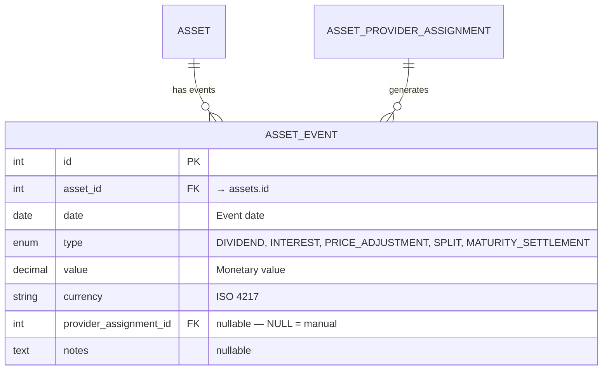

# 📅 Asset Events

Asset events represent significant occurrences that affect an asset's price or generate distributions. They live in the **asset domain**, not the portfolio/transaction domain.

## 📋 Event Types

| &nbsp; | Event Type                    | Effect on Price                    | Who Generates                                        | Description                                    |
|:------:|:------------------------------|:-----------------------------------|:-----------------------------------------------------|:-----------------------------------------------|
| 💰     | **DIVIDEND**                  | Price drops by event value (ex-date) | Provider (yfinance, justetf) or manual              | Cash distribution from equity/ETF              |
| 📈     | **INTEREST**                  | Price drops by event value         | Scheduled Investment (`generate_interest`) or manual | Interest payment from debt/loan. Resets accrued interest |
| 📊     | **PRICE_ADJUSTMENT**          | Algebraic change (+/−)             | Manual, or listed in a Scheduled Investment schedule | Non-cash value change (write-down, haircut)    |
| ✂️     | **SPLIT**                     | Changes quantity, not total value  | Provider (yfinance) or manual                        | Stock/unit split                               |
| 🏁     | **MATURITY_SETTLEMENT**       | Final capital return               | Scheduled Investment (`generate_interest`) or manual | Asset reaches maturity — no further calculations |

---

## 🗃️ Database Model



**No UniqueConstraint** on `(asset_id, date, type)` — auto-generated and manual events can coexist on the same date and type. Nothing forbids two rows of the **same** source on one key either: the upsert below collapses such legacy duplicates when a batch brings fewer events for that key.

**Indexes**: `(asset_id, date)`, `(asset_id, type, date)`, `(provider_assignment_id)`.

---

## 🔄 Dedup Strategy

`_upsert_asset_events()` (`asset_sources/price_store.py`) writes both kinds of events **in place**,
one source per call: a sync passes the assignment's id, the manual upsert passes `None`. It groups
the incoming events by `(date, type)` and matches each key against the stored rows of the **same**
source only (same `asset_id` and `provider_assignment_id`, `IS NULL` for manual events):

```python
# Simplified logic of _upsert_asset_events() and _write_event_group(), for each (date, type) key
stored = rows on the key with this asset_id and provider_assignment_id, ORDER BY id
for row, evt in zip(stored, incoming):  # paired lowest id first: updated, id kept
    row.value, row.currency = evt.value.amount, evt.value.code or default_currency
    row.notes, row.updated_at = evt.notes, now
session.add_all(incoming[len(stored):])  # extra incoming events are inserted
surplus = stored[len(incoming):]  # legacy same-key duplicates of this source
# UPDATE transactions SET asset_event_id = stored[0].id WHERE asset_event_id IN surplus
# DELETE FROM asset_events WHERE id IN surplus
```

A key thus ends with as many rows as the batch brings, the lowest ids kept, and the transactions of
a collapsed duplicate move to the row that stays. Rows of another source on that key are never
touched, and a stored key the batch does not mention is kept. Keys are committed in slices of
`PRICE_UPSERT_CHUNK_SIZE` (1,000).

The upsert used to DELETE the stored rows of each key and INSERT the new ones. But
`transactions.asset_event_id` is `ON DELETE RESTRICT`, so that failed as soon as a transaction
realised the event: a provider refresh of such an event reported *Event upsert failed*, and editing
a linked manual event answered HTTP 500. A row updated in place keeps its id, so the transactions
linked to it stay linked.

### 🤖 Auto-Generated Events (`provider_assignment_id IS NOT NULL`)

A sync passes the assignment's id. This ensures:

- An event the provider returns again updates the stored one of the same date and type, which keeps its id: a transaction linked to it stays linked
- Events from **different** providers for the same asset are independent, and manual events are never touched
- A stored event the provider no longer returns is kept: the upsert only touches the date and type pairs of its batch

A parametric provider (Scheduled Investment) derives its whole series from its parameters. When they
change, or when the asset leaves it for another provider, `provider_management.py` deletes the
asset's prices and that assignment's events, first unlinking the transactions that pointed to them
(`asset_event_id = NULL`); manual events stay.

The data editor shows these events read-only: the events of `POST /assets/prices/query` carry
`is_auto` (`provider_assignment_id IS NOT NULL`). An edit would be overwritten by the next sync, and
a deletion lasts only until the provider returns the event again.

### ✋ Manual Events (`provider_assignment_id IS NULL`)

`POST /api/v1/assets/events` (`bulk_upsert_events()`) takes a list of `FAEventUpsert` items,
`{asset_id, events}`, whose points are `FAEventUpsertPoint`: an `FAAssetEventPoint` with an
optional `id` (`schemas/prices.py`). For each item:

- An event with an explicit currency other than the asset's → HTTP 400 `EVENT_CURRENCY_MISMATCH`.
- An event **with `id`** edits that manual row in place, every field included (`date`, `type`,
  value and currency, `notes`), and the row keeps its id. The data editor sends the id of every
  saved row, so changing the Type of a saved event no longer adds a second event.
- Events **without `id`** go through `_upsert_asset_events(provider_assignment_id=None)`: matched
  on `(date, type)` among the manual rows and updated in place, so a manual event still replaces
  the manual event of the same date and type, now keeping its id.
- Each item is committed on its own: a refused item writes nothing and ends the request, while the
  items before it stay stored.

The whole item is checked before anything is written:

| Refused | Answer |
|---|---|
| The same `id` twice in the item | HTTP 422 *Duplicate event id in one upsert item*, from the `FAEventUpsert` validator: the whole request is refused |
| An `id` that is unknown, belongs to another asset, or names a provider event | HTTP 400 `EVENT_NOT_EDITABLE` |
| An edit that changes its date or type (a *mover*) landing on a key another edit of the item ends on, or on a key held by a manual row the item does not edit | HTTP 400 `EVENT_KEY_CONFLICT` |
| An event without `id` on a key an edit of the item ends on | HTTP 400 `EVENT_KEY_CONFLICT` |

Allowed: two edits swapping their keys, edits that keep a shared key (legacy duplicates stay
editable), and an event without `id` on a key a mover vacates. These checks only cover keys an
edit ends on: an event without `id` on the key of a manual row the item does not edit updates
that row, and two events without `id` on one key are both stored. `assets.py` maps the three codes
to HTTP 400; any other `AssetSourceError` is a 500.

A type change is allowed even when a transaction is linked to the event: the link stays, and the
transaction is then read according to the new type. `compute_wac_iterative()`
(`portfolio_service.py`) counts an `ADJUSTMENT` as split-linked only while its event is a `SPLIT`:
the type is joined live, and the split-linked set is part of the WAC cache fingerprint. Once the
event is retyped to `PRICE_ADJUSTMENT`, a +qty adjustment becomes an acquisition of unknown cost
(the pool cost turns incomplete, the numbers shown do not change) and a −qty one a plain reduction
that takes its share of the cost away (in the test, the total cost halves from 1,500 to 750). Both
cases are pinned by the `test_*_split_relabelled_as_price_adjustment_*` tests in
`test_scripts/test_api/test_portfolio_wac.py`.

Manual events are **never deleted** by the sync process. They survive provider re-syncs, provider
changes, and bulk refreshes. Only an explicit user deletion removes them
(`DELETE /api/v1/assets/events?ids=…`, which reports an event a transaction uses as `in_use`
instead of deleting it), or the market-data wipe of a currency change
(`POST /api/v1/assets/{asset_id}/market-data/wipe`), which deletes every event of the asset.

---

## 🔧 Auto-Generated Events

### 📈 Yahoo Finance: Dividends & Splits

During sync, the Yahoo Finance provider generates:

- **`DIVIDEND` events** from `ticker.dividends` — ex-dividend dates with the per-share payout value and currency.
- **`SPLIT` events** from `ticker.splits` — split dates with the split ratio as the event value (e.g., `4.0` for a 4:1 split).

Both are written by the standard `_upsert_asset_events()` pipeline, scoped by `provider_assignment_id`.

### 🔍 JustETF: Dividends from Chart Data

During sync, the JustETF provider parses dividend data from `load_chart()` response. Distribution dates and amounts are extracted and stored as **`DIVIDEND` events**.

### 📊 Scheduled Investment: `generate_interest`

When a schedule period has `generate_interest = True`, the Scheduled Investment provider auto-generates:

1. **`INTEREST` events** at each maturation date within the period
2. After each INTEREST event, accrued interest resets: `total_interest = 0`, `event_adjustment = 0` → value returns to `initial_value`

The maturation frequency is controlled by `maturation_frequency` on each interest rate period (DAILY, WEEKLY, MONTHLY, QUARTERLY, SEMIANNUAL, ANNUAL).

The events entered in the schedule itself (`asset_events` in the provider parameters, **Add Event**
in the asset form) travel the same way: `get_history_value()` returns them with the generated ones,
so the sync stores them under the assignment and the data editor shows them read-only.

### 🏁 `MATURITY_SETTLEMENT`

Auto-generated when:

- The schedule ends **and** `generate_interest = True` on the last period
- **Or** late interest is configured with `generate_interest = True`

After settlement, the engine is "off" — `get_current_value()` returns the settlement value for all future dates.

---

## 📐 Event Impact on Pricing

The Scheduled Investment engine's pricing formula incorporates events:

```
price(d) = initial_value + accrued_interest - Σ(INTEREST events) + Σ(PRICE_ADJUSTMENT events)
```

- Interest is always calculated on `initial_value` (not running value)
- INTEREST events **subtract** from the running price (coupon paid out)
- PRICE_ADJUSTMENT events are **algebraic** (can add or subtract)
- After `MATURITY_SETTLEMENT`, no further calculations occur

---

## 🔗 Related Documentation

- 📊 [Assets & Pricing ER Diagram](../../architecture/database/assets_pricing.md) — Database schema
- 💰 [Asset Architecture](architecture.md) — Sync pipeline and price queries
- 📅 [Scheduled Investment Provider](provider_scheduled_investment.md) — Interest schedule and auto-events
- 📐 [Day Count Conventions](../../../financial-theory/fundamentals/day-count.md) — ACT/365, ACT/360, 30/360
