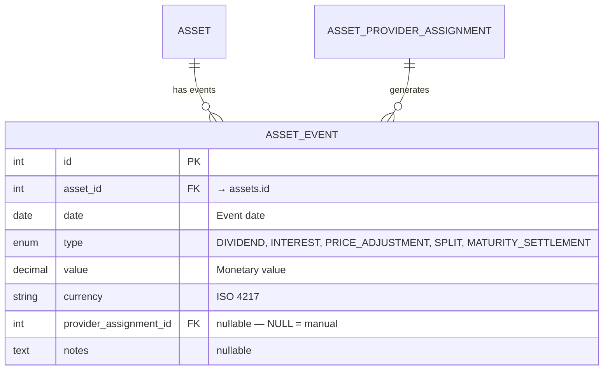

# 📅 Asset Events

Asset events represent significant occurrences that affect an asset's price or generate distributions. They live in the **asset domain**, not the portfolio/transaction domain.

## 📋 Event Types

| &nbsp; | Event Type                    | Effect on Price                    | Who Generates                                        | Description                                    |
|:------:|:------------------------------|:-----------------------------------|:-----------------------------------------------------|:-----------------------------------------------|
| 💰     | **DIVIDEND**                  | Price drops by event value (ex-date) | Provider (yfinance, justetf) or manual              | Cash distribution from equity/ETF              |
| 📈     | **INTEREST**                  | Price drops by event value         | Scheduled Investment (`generate_interest`) or manual | Interest payment from debt/loan. Resets accrued interest |
| 📊     | **PRICE_ADJUSTMENT**          | Algebraic change (+/−)             | Manual, or listed in a Scheduled Investment schedule | Non-cash value change (write-down, haircut)    |
| ✂️     | **SPLIT**                     | Changes quantity, not total value  | Provider (yfinance) or manual                        | Stock/unit split                               |
| 🏁     | **MATURITY_SETTLEMENT**       | Final capital return               | Scheduled Investment (`generate_interest`) or manual | Asset reaches maturity — no further calculations |

---

## 🗃️ Database Model



**No UniqueConstraint** on `(asset_id, date, type)` — auto-generated and manual events can coexist on the same date and type.

**Indexes**: `(asset_id, date)`, `(asset_id, type, date)`, `(provider_assignment_id)`.

---

## 🔄 Dedup Strategy

`_upsert_asset_events()` (`asset_sources/price_store.py`) persists both kinds of events with the
same DELETE + INSERT: for each incoming event it deletes the stored events with the same `asset_id`,
`date`, `type` **and** `provider_assignment_id`, then inserts the new ones, committing in slices of
`PRICE_UPSERT_CHUNK_SIZE` (1,000). The `provider_assignment_id` in the key keeps the two kinds apart.

### 🤖 Auto-Generated Events (`provider_assignment_id IS NOT NULL`)

A sync passes the assignment's id. This ensures:

- An event the provider returns again replaces the stored one of the same date and type
- Events from **different** providers for the same asset are independent, and manual events are never touched
- A stored event the provider no longer returns is kept: the upsert deletes only the date and type pairs it inserts

```python
# Simplified logic in _upsert_asset_events(), for each incoming event
DELETE FROM asset_events
WHERE asset_id = :asset_id
  AND date = :date
  AND type = :type
  AND provider_assignment_id = :provider_assignment_id  -- IS NULL for manual events

INSERT INTO asset_events (...)
VALUES (...new_events...)
```

A parametric provider (Scheduled Investment) derives its whole series from its parameters. When they
change, or when the asset leaves it for another provider, `provider_management.py` deletes the
asset's prices and that assignment's events, first unlinking the transactions that pointed to them
(`asset_event_id = NULL`); manual events stay.

The data editor shows these events read-only: the events of `POST /assets/prices/query` carry
`is_auto` (`provider_assignment_id IS NOT NULL`). An edit would be overwritten by the next sync, and
a deletion lasts only until the provider returns the event again.

### ✋ Manual Events (`provider_assignment_id IS NULL`)

`POST /api/v1/assets/events` calls the same upsert with `provider_assignment_id = None`, so a manual
event replaces the manual event of the same date and type. Manual events are **never deleted** by
the sync process. They survive provider re-syncs, provider changes, and bulk refreshes. Only an
explicit user deletion removes them, or the market-data wipe of a currency change
(`POST /api/v1/assets/{asset_id}/market-data/wipe`), which deletes every event of the asset.

---

## 🔧 Auto-Generated Events

### 📈 Yahoo Finance: Dividends & Splits

During sync, the Yahoo Finance provider generates:

- **`DIVIDEND` events** from `ticker.dividends` — ex-dividend dates with the per-share payout value and currency.
- **`SPLIT` events** from `ticker.splits` — split dates with the split ratio as the event value (e.g., `4.0` for a 4:1 split).

Both are inserted via the standard `_upsert_asset_events()` pipeline, keyed by `provider_assignment_id`.

### 🔍 JustETF: Dividends from Chart Data

During sync, the JustETF provider parses dividend data from `load_chart()` response. Distribution dates and amounts are extracted and stored as **`DIVIDEND` events**.

### 📊 Scheduled Investment: `generate_interest`

When a schedule period has `generate_interest = True`, the Scheduled Investment provider auto-generates:

1. **`INTEREST` events** at each maturation date within the period
2. After each INTEREST event, accrued interest resets: `total_interest = 0`, `event_adjustment = 0` → value returns to `initial_value`

The maturation frequency is controlled by `maturation_frequency` on each interest rate period (DAILY, WEEKLY, MONTHLY, QUARTERLY, SEMIANNUAL, ANNUAL).

The events entered in the schedule itself (`asset_events` in the provider parameters, **Add Event**
in the asset form) travel the same way: `get_history_value()` returns them with the generated ones,
so the sync stores them under the assignment and the data editor shows them read-only.

### 🏁 `MATURITY_SETTLEMENT`

Auto-generated when:

- The schedule ends **and** `generate_interest = True` on the last period
- **Or** late interest is configured with `generate_interest = True`

After settlement, the engine is "off" — `get_current_value()` returns the settlement value for all future dates.

---

## 📐 Event Impact on Pricing

The Scheduled Investment engine's pricing formula incorporates events:

```
price(d) = initial_value + accrued_interest - Σ(INTEREST events) + Σ(PRICE_ADJUSTMENT events)
```

- Interest is always calculated on `initial_value` (not running value)
- INTEREST events **subtract** from the running price (coupon paid out)
- PRICE_ADJUSTMENT events are **algebraic** (can add or subtract)
- After `MATURITY_SETTLEMENT`, no further calculations occur

---

## 🔗 Related Documentation

- 📊 [Assets & Pricing ER Diagram](../../architecture/database/assets_pricing.md) — Database schema
- 💰 [Asset Architecture](architecture.md) — Sync pipeline and price queries
- 📅 [Scheduled Investment Provider](provider_scheduled_investment.md) — Interest schedule and auto-events
- 📐 [Day Count Conventions](../../../financial-theory/fundamentals/day-count.md) — ACT/365, ACT/360, 30/360
