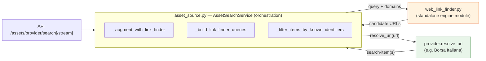
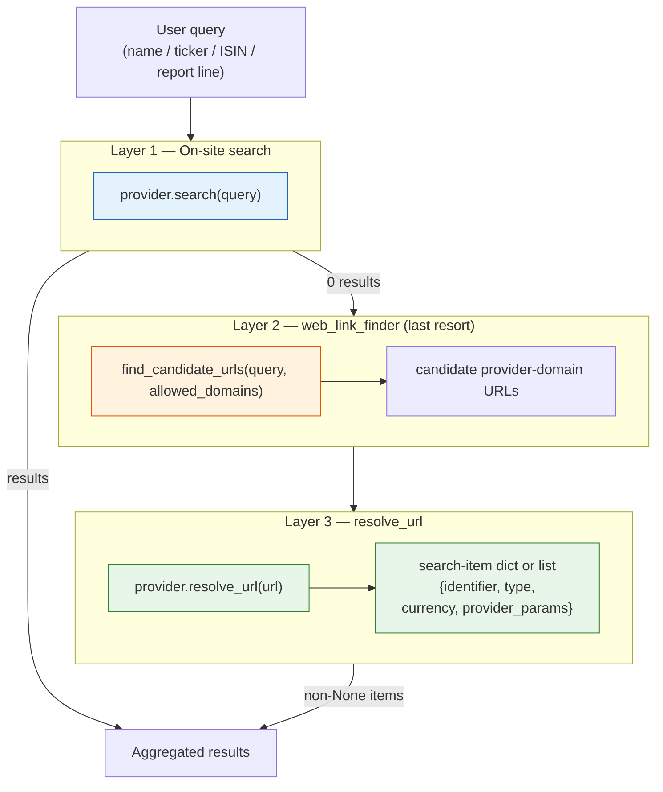

# 🔎 Asset Search & Link-Finder

LibreFolio resolves an interactive asset search through a **three-layer stack**. The goal is
to turn whatever the user types — a name, a ticker, an ISIN, or a whole line copied from a
broker report — into a concrete, priceable asset candidate, while keeping automated price
fetches completely free of any web search.

This page documents the **generic** machinery (the orchestration in `AssetSourceService`,
the `web_link_finder` module, the `resolve_url` capability, the `hints` mechanism, and the
identifier post-filter). Provider-specific behaviour lives on each provider page — see
[Borsa Italiana](provider_borsa_italiana.md), which is currently the only provider that opts
into layers 2 and 3.

---

## 📂 Where it lives

The system is **not** one function — it is a small **standalone module** (the engine) plus
**service-layer orchestration** plus a thin **per-provider hook**:

| Piece | File | Role |
|-------|------|------|
| **`web_link_finder` module** | `backend/app/services/web_link_finder.py` | Self-contained subsystem: the external-engine client (**ddgs** metasearch by default), config, TTL cache, domain filter. Knows nothing about providers or assets. |
| **Search orchestration** | `backend/app/services/asset_source.py` → `AssetSearchService` | Ties it together: `_augment_with_link_finder`, `_build_link_finder_queries`, `_filter_items_by_known_identifiers`, `_provider_url_for_item`. Decides *when* to fall back and *how* to narrow. |
| **Provider hook** | each provider's `resolve_url` / `resolvable_url_domains` | Turns a resolved URL back into search-item(s). Only Borsa Italiana implements it today. |
| **Endpoints** | `backend/app/api/v1/assets.py` | `/assets/provider/search[/stream]` accept the optional `hints` query param. |

So the answer to "is it its own subsystem or just a service function?" is **both**: a dedicated
module for the engine, orchestrated by the service layer, with a thin per-provider hook.



---

## 🧱 The three layers



| Layer | Where | When it runs | Purpose |
|-------|-------|--------------|---------|
| **L1 — on-site search** | `provider.search(query)` | Always | The provider's own search (e.g. `borsaitaliana.it` `cerca`, Yahoo, justETF). |
| **L2 — web link-finder** | `web_link_finder.find_candidate_urls()` | Only when L1 returns **0** items **and** the provider opts in **and** the finder is enabled | Uses an external **metasearch** engine (**ddgs** by default — bing / brave / google / DuckDuckGo / … aggregated) to find candidate **provider-domain** URLs for the query. |
| **L3 — URL resolver** | `provider.resolve_url(url)` | For each L2 candidate URL | Opens the page, extracts data, and returns one search-item dict, a list of search-item dicts, or `None` — the inverse of `get_asset_url`. |

!!! warning "Invariant — external search is interactive-only"

    Layers 2 and 3 are hit **only during interactive asset search**. Price fetches (frequent,
    automated) must **never** touch `web_link_finder`. Once an asset exists it is priced by its
    stored identifier and `provider_params` (for Borsa Italiana funds, `provider_params.codice_fondo`),
    never by re-searching. This keeps scheduled syncs deterministic and independent from external
    metasearch availability.

---

## 🎼 Orchestration (`AssetSourceService`)

Both `search()` (batch) and `search_stream()` (SSE) query every eligible provider in parallel.
After a provider yields its L1 results, the shared augment helper decides whether to fall back
to the external stack:

```python
# backend/app/services/asset_source.py
async def search(query: str, provider_codes=None, hints: Optional[list[str]] = None) -> FAProviderSearchResponse
async def search_stream(query: str, provider_codes=None, hints: Optional[list[str]] = None) -> AsyncGenerator[str]
```

- **`_augment_with_link_finder(code, provider, query, hints=None)`** — invoked when a provider
  returns 0 items **and** `provider.supports_url_resolution` **and** `web_link_finder.is_enabled()`.
  It builds the candidate queries (see [Hints](#hints-the-two-stage-stringone)), calls
  `find_candidate_urls`, then `resolve_url`s each hit (in a worker thread — `resolve_url` may do
  sync I/O). `resolve_url` may return one item or a canonical list; the helper flattens lists,
  de-duplicates by `(identifier, language)`, and returns the non-`None` items. Any failure is
  caught and yields `[]` — the search always completes and emits `done`.
- **`_provider_url_for_item(code, item)`** — DRY helper used during serialization so the
  `provider_url` display link is (re)computed from the item's `provider_params` on every request.
- Results are flagged as "found via web" for the UI.

!!! info "Why the fallback fixes the old \"searching… hangs\" bug"

    Because the augment path is fully time-boxed and best-effort, an SSE search always reaches a
    terminal `done` event even when the external engine is slow or blocked. A provider returning 0
    results no longer leaves the stream open with no No-Match state.

---

## 🌐 `web_link_finder` module

`backend/app/services/web_link_finder.py` is a **LibreFolio-level** module, deliberately kept
**out of** any scraping library — the choice of external engine is a LibreFolio concern, not a
provider's.

```python
async def find_candidate_urls(query: str, allowed_domains: list[str], *, max_results: int = 5, path_hint: str | None = None) -> list[str]
def is_enabled() -> bool
```

- **Best-effort**: any failure (rate-limit, network error, missing optional
  dependency) yields `[]` and is never fatal.
- **Async-safe**: the engine's synchronous `search()` runs inside `asyncio.to_thread`; short
  timeout, small TTL cache, domain-filtered hits, structured logs.
- **Pluggable engine**: the default `DdgsEngine` wraps the [`ddgs`](https://pypi.org/project/ddgs/)
  metasearch library (the maintained successor of `duckduckgo_search`), which aggregates ~10
  upstream engines (bing / brave / google / duckduckgo / startpage / …) behind one
  `text(query, backend="auto")` call. An `ApiKeyEngine` seam is in place for a paid API
  (Brave / Bing / SerpAPI) later; the `searxng` engine name is **reserved** for the deferred
  SearXNG adapter (see *Transport history* below).
- **Defensive import**: `ddgs` is imported behind a `_DDGS_OK` guard, so a missing dependency
  simply disables the module instead of breaking search.

### ⚙️ Configuration (env vars, all optional)

| Variable | Default | Meaning |
|----------|---------|---------|
| `LIBREFOLIO_WEB_LINK_FINDER_ENABLED` | `1` | `1`/`0` master switch. |
| `LIBREFOLIO_WEB_LINK_FINDER_ENGINE` | `ddgs` | `ddgs` \| `apikey` (`searxng` reserved for Fase B). |
| `LIBREFOLIO_WEB_LINK_FINDER_API_KEY` | `""` | Key for the `apikey` engine (engine self-disables if absent). |
| `LIBREFOLIO_WEB_LINK_FINDER_DDGS_REGION` | `wt-wt` | ddgs region (e.g. `wt-wt` worldwide, `it-it`). The worldwide default avoids US bias so IT pages aren't down-ranked. |
| `LIBREFOLIO_WEB_LINK_FINDER_DDGS_BACKEND` | `auto` | ddgs backend(s): `auto` rotates/aggregates, or a comma list (e.g. `google,bing`). |
| `LIBREFOLIO_WEB_LINK_FINDER_TIMEOUT` | `6` | Per-request timeout, seconds. |
| `LIBREFOLIO_WEB_LINK_FINDER_MAX` | `5` | Max candidate URLs returned. |

### 🕰️ Transport history (why `ddgs`)

The **original** transport was a hand-rolled `DuckDuckGoEngine` that scraped the
`html.duckduckgo.com` HTML endpoint. It proved fragile: under back-to-back backend queries DDG's
bot-detection returns an **HTTP 202 "anomaly" page with zero results** (the *same* query works in a
browser — a trusted human session). Because 202 is a 2xx, `raise_for_status()` never fired, so the
empty page was parsed as "no hits" and — worse — cached for 15 minutes. Net effect: a query that
Google/DDG resolve fine in a browser returned **nothing** from the backend.

The scraper was retired in favour of the **`ddgs`** metasearch library (2026-07-28). By rotating
and aggregating multiple upstream engines it sidesteps any single engine's rate-limiting, needs
**no extra infrastructure** (a pure pip dependency), and drops straight into the existing
synchronous `_SearchEngine` seam. DuckDuckGo remains *one* of its backends, so no coverage is lost.

!!! note "Deferred: SearXNG (Fase B)"

    A self-hosted, anonymized **SearXNG** metasearch container is planned as an optional
    power-user upgrade, sitting *in front of* `ddgs` as the runtime chain `[searxng → ddgs]`. It is
    **deferred** until search usage outgrows `ddgs`; the `searxng` engine name is already reserved
    in `_build_engine`. See the plan under `Release_2/Phase_0/04_webSearchEngine/` and the backlog
    note in `Release_2/todo_futuri.md`.

---

## 🔁 `resolve_url` — the generic URL → search-item capability

Any provider can opt into turning a page URL back into search-item(s) (the inverse of
`get_asset_url`). It is defined on the `AssetSourceProvider` base class:

| Member | Default | Description |
|--------|---------|-------------|
| `resolvable_url_domains: list[str]` | `[]` | Domains this provider can resolve. |
| `supports_url_resolution` | derived | `bool(resolvable_url_domains)`. |
| `async resolve_url(url) -> dict \| list[dict] \| None` | `None` | Open → extract → return search-item(s), or `None` when the URL is not a recognisable asset page for this provider. |

`resolve_url` is only an **alternative entry point** into search: it returns the **same shape
`search` would** for that instrument. When a single page maps to several canonical rows — e.g.
one item **per language** (Italian + English, with flags), exactly like an on-site `cerca` hit —
return them **all as a list**. The orchestration flattens the result and **de-duplicates by
`(identifier, language)`**, so sibling language-URLs of the same instrument don't pile up.

Each item must match the search-item shape
(`identifier`, `identifier_type`, `display_name`, `currency`, `type`, `provider_params`) so the
create-asset flow can consume it directly. `resolve_url` must be **best-effort** — parse/fetch
errors return `None`, never raise.

!!! note "Scope"

    The capability is generic in the base class, but **Borsa Italiana is the only provider that
    implements it** in the current pass: a fund detail page resolves to the **IT + EN pair**
    (Italian first, with flags), each carrying the fund's `codice_fondo`.

---

## 🧵 Hints — the two-stage "stringone"

When the caller holds extra technical identifiers and names (typically extracted from a broker
report during import), it passes them as **`hints`**. Hints do two things:

### 1️⃣ Two-stage candidate query

`_build_link_finder_queries(query, hints)` produces an ordered, de-duplicated candidate list:

1. **Rich string** — every hint plus the base query concatenated
   (whitespace-collapsed, not truncated or reordered). Example:
   `"LU2178929613 EURIZON NEXT 2.0 DIVERSIFICATO 40 P"`.
2. **Base query** — the bare query as a fallback.

`_augment_with_link_finder` tries them **in order** and returns items from the **first candidate
that resolves anything**. The rich query narrows the external engine when the bare query is too
ambiguous (a bare ISIN on a site-restricted external search often surfaces every sibling share class);
if it is over-constrained and finds nothing, the base query still runs. With no hints, the list is
just `[base]` (legacy behaviour).

!!! danger "Hints never touch the on-site `cerca`"

    The stringone lives **only** in the link-finder stage. It must not be fed to the provider's
    L1 on-site search, which is stricter and would return 0 for a concatenated blob — losing the
    on-site path when the name alone would have matched.

### 2️⃣ Identifier post-filter

Even with the rich query, the external engine can still return sibling instruments. So resolved
items are narrowed by `_filter_items_by_known_identifiers(items, [*hints, query])`:

- If **any** resolved item's `identifier` matches a known term (case-insensitive), only the
  matching items are kept.
- If **nothing** matches, **all** items are returned (the user chooses).

Free-text name hints are inert here — a name never equals an ISIN/ticker identifier — so only real
identifiers (ISIN, ticker) actually filter. This is what turns a bare-ISIN search that surfaced 5
sibling funds into the single exact match.

### 📥 Where hints come from

| Source | Hints passed |
|--------|--------------|
| Import wizard (create-asset) | Extracted ISIN + symbol + **all** candidate report names (`_createNames`). |
| Manual asset search | The query itself doubles as an identifier hint via the `[*hints, query]` merge in the filter. |

---

## 🌐 API

Both search endpoints accept an optional, repeatable `hints` query parameter:

```
GET /api/v1/assets/provider/search?q=LU2178929613&providers=borsa_italiana&hints=LU2178929613&hints=EURIZON+NEXT+2.0+DIVERSIFICATO+40+P
GET /api/v1/assets/provider/search/stream?q=...&hints=...&hints=...
```

`hints` is an optional nullable array in the generated client (`./dev.py api sync`). Omitting it
preserves the legacy single-query behaviour.

---

## 🖥️ Frontend wiring

| Component | Prop | Role |
|-----------|------|------|
| `AssetSearchAutocomplete.svelte` | `hints?: string[]` | Appended as repeated `&hints=` on the SSE fetch URL (deduped client-side). |
| `AssetModal.svelte` | `searchHints?: string[]` | Forwarded to the autocomplete. |
| `ImportWizardModal.svelte` | `searchHints` | Built from the extracted ISIN + symbol + all candidate report names. |

No UI change is required for the feature to work end-to-end — an asset created from a resolved
result already carries its `provider_params`, so it is priceable immediately.

---

## 🐞 Fragility & limits

- **External metasearch is keyless by default and best-effort** — treat L2 as a convenience, not a
  guarantee. The current transport uses the `ddgs` library, not LibreFolio HTML scraping; upstream
  engine failures, missing dependencies, or timeouts degrade to `[]`.
- **L2/L3 only trigger on a 0-result L1** — a provider that returns *any* on-site result never
  reaches the external stack (by design).
- **Site-restricted ranking is fuzzy** — the identifier post-filter, not the engine, is what
  guarantees precision when a known identifier is available.
- For a paid, reliable engine, implement the `ApiKeyEngine` and set `…_ENGINE=apikey` + `…_API_KEY`.

---

## 🔗 Related Documentation

- 🏗️ [Asset Architecture](architecture.md) — Sync pipeline, caching, search endpoints
- 📈 [Asset Plugin Guide](../../architecture/patterns/asset_plugin_guide.md) — How to build a provider (incl. `resolve_url`)
- 🇮🇹 [Borsa Italiana Provider](provider_borsa_italiana.md) — The reference implementer of L2/L3
