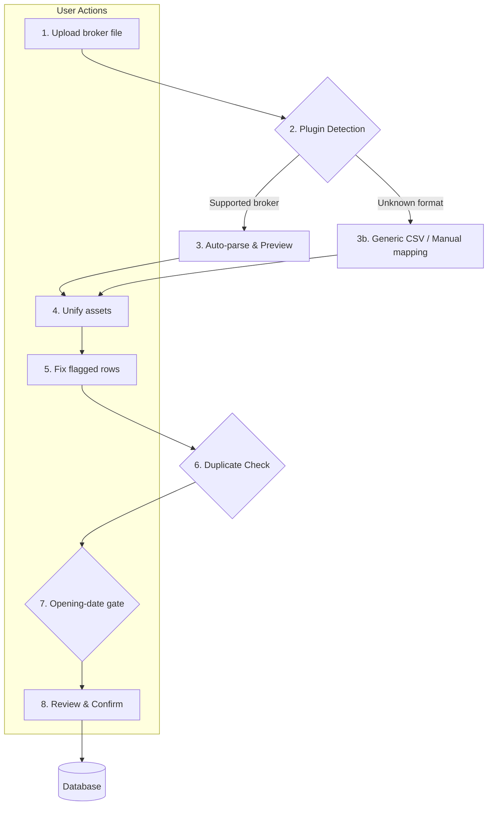

# 📥 BRIM Architecture

**BRIM (Broker Report Import Manager)** is the system responsible for importing transaction data from broker export files (CSV, XLSX, PDF, or another format supported by a plugin). It is designed to be robust, user-friendly, and extensible.

## 🔄 The BRIM Workflow

The import process follows a clear, multi-step wizard designed to give the user full control and visibility.



The wizard steps are `upload → select → analyze → assets → fix → duplicates → review`.
**`assets`, `fix` and `duplicates` are conditional**: each is skipped entirely when it has
nothing to ask (no merged extractions, no flagged rows, no cross-file collisions), so a clean
single-file import is still a three-click flow.

### 🪜 Step-by-step

1. **Upload** — The user uploads a broker export file. It can be dragged into the broker page or accessed from the Files tab.

2. **Plugin Detection** — BRIM auto-discovers `BRIMProvider` classes from `backend/app/services/brim_providers/`, sorts compatible plugins by `detection_priority` (highest first), and selects the first plugin whose `can_parse(file_path)` returns `True`. If no specific plugin matches, the Generic CSV provider is used as fallback.

3. **Parse & Preview** — The selected plugin's `parse()` method returns a `BRIMParseOutput` containing standardized `TXCreateItem` objects, warnings, extracted assets, optional field TODOs, and optional per-asset notices. **Nothing is saved yet.** The user sees a table of parsed transactions before proceeding.

4. **Unify assets** — When several files (or several rows) describe the same security under different spellings, the extractions are merged into one group with one elected primary identifier. Only shown when there is something to merge.

5. **Fix flagged rows** — The rows the plugin booked but could not fully understand: its `field_todos`. The user settles each one — correct it, split it, or keep it as read — grouped into three foldable panels by the nature of the question (misread trade / bundled amount / charge with no instrument).

    **This step runs before the duplicate check on purpose.** A purchase the plugin could only record as a cash withdrawal would be compared against cash withdrawals: a real duplicate is missed, an imaginary one invented. Correcting afterwards cannot repair that.

6. **Duplicate Detection** — Each parsed transaction is compared against existing rows by `(broker_id, date, type, amount, quantity)`. Matches are flagged with a confidence level so the user can skip or force-import them. Cross-file collisions (the same movement in two files being imported together) get their own arbitration step; database collisions simply arrive deselected at the review.

7. **Opening-date gate** — In the frontend wizard only, rows whose transaction date is strictly earlier than the broker `opened_at` date are classified with the status key `before_opening`, deselected, and made non-importable. The exact shipped comparison is `txDate < info.openedAt`, so the opening day itself is valid. There is no backend enum for this status.

8. **Review & Confirm** — The user reviews the final list. Importing is blocked while any selected row still points at an unresolved asset. On confirm, the standard `TransactionService` saves the transactions.

---

## 📂 File Lifecycle

```
backend/data/{prod|test}/broker_reports/
├── uploaded/    ← new files awaiting processing
├── parsed/      ← successfully parsed files, ready for review/import
└── failed/      ← files that failed parsing or were rejected
```

Each file is stored with a companion `.json` metadata sidecar recording status, original filename, and any errors encountered.

---

## ⚡ Concurrency & off-loading

Uploading and parsing are the two hottest paths in BRIM, and both used to do **blocking
synchronous work directly inside `async def` handlers**. While one file parsed, the whole
application — prices, FX, navigation — stood still, and concurrent requests from the browser were
serialised by the server no matter how parallel the client was.

| Layer | What runs where |
|---|---|
| **Upload** | `save_uploaded_file` runs in `asyncio.to_thread`. A thread is enough: the transfer itself is the OS's work; we only write the file and re-read it to sniff compatible plugins |
| **Parse** | `backend/app/services/brim_parse_pool.py` — a **lazy** `ProcessPoolExecutor`, `min(cpu_count, 4)` workers. Parsing is CPU work: a thread would leave it serialised by the GIL |
| **Candidate search** | `search_asset_candidates_bulk` issues **one** query per file instead of up to five per extracted asset, then applies the same five priorities in memory |
| **Frontend** | `lib/utils/core/requestConcurrency.ts` — `mapWithConcurrency` bounds the upload and parse loops instead of awaiting one file at a time |

### 🧵 Why `forkserver`/`spawn`, never `fork`

This process owns an event loop and a thread pool. Forking them is the classic way to produce
deadlocks that only appear in production. The pool prefers `forkserver` and falls back to
`spawn`; `parse_file` is DB-free (filesystem + registry only), so it is safe to run in a child.

!!! warning "Two decisions that look like bugs and are not"

    **The fallback is permanent.** If the pool cannot start — or a worker dies taking a
    segfaulting C parser with it — BRIM falls back to a thread *for the rest of the process
    lifetime*. A degraded parse is a slow parse; a failed one is a lost import. And an
    environment that cannot spawn workers will not start being able to halfway through an
    import: retrying per file would pay the start-up cost again for nothing.

    **A parser error is not a broken pool.** A failure at *submit* is always ours; while
    awaiting, **only** `BrokenProcessPool` counts. Everything else — `ValueError` for the wrong
    plugin, `FileNotFoundError`, `BRIMParseError` — propagates intact. Treating `OSError` as pool
    trouble would disable the pool forever on the first missing file, and turn the one useful
    message the user gets ("this layout is not supported") into a spinner.

!!! danger "`%` in bond names"

    The bulk search reproduces in Python predicates that were SQL, and `LIKE` reads `%` as a
    **wildcard**. Security names are full of them (`BTP Valore 3,35%`), so a naive Python `in`
    would be *stricter* than the SQL it replaces and would drop candidates silently.
    `_like_to_regex` translates `%`→`.*` and `_`→`.` with everything else escaped. It is the most
    likely way the two paths can diverge, and therefore the central case of the equivalence test.

The pool is shut down from the FastAPI `lifespan`, next to the other pools.

### 🌐 The browser connection limit

No web API exposes the per-host connection cap. `navigator.connection` describes link *quality*
(Chromium only); `navigator.hardwareConcurrency` counts CPU cores. HTTP/1.1 settles by convention
on 6 per host; HTTP/2 multiplexes over one connection. So the frontend limit is a **declared
heuristic, not a measurement**:

```ts
max(2, min(6 - 1, navigator.hardwareConcurrency ?? 4))
```

One slot is always left free: an import that starves the rest of the application of connections
looks like a freeze, and the user has no way to tell "busy" from "broken".

---

## 🔍 Deduplication Logic

Before final import, BRIM compares each parsed transaction against the database on:

| Field | Used in match |
|-------|--------------|
| `broker_id` | ✅ |
| `date` | ✅ |
| `type` | ✅ |
| `quantity` | ✅ |
| `amount` | ✅ |
| `description` | Used for confidence upgrade |
| `asset_id` | Used for confidence upgrade |

Confidence levels:

| Level | Meaning |
|-------|---------|
| `POSSIBLE` | Key fields match |
| `LIKELY` | Key fields + description match |
| `POSSIBLE_WITH_ASSET` | Key fields + asset resolved |
| `LIKELY_WITH_ASSET` | Key fields + description + asset all match |

---

## 🧩 Plugin System

Every BRIM plugin is a `BRIMProvider` subclass registered via the provider registry. Key contract:

```python
class MyBrokerProvider(BRIMProvider):
    @property
    def provider_code(self) -> str:
        return "broker_mybroker"

    @property
    def detection_priority(self) -> int:
        return 100  # Higher = tried first

    def can_parse(self, file_path) -> bool:
        """Return True when this file belongs to this broker."""
        ...

    def parse(self, file_path, broker_id) -> BRIMParseOutput:
        """Convert broker rows into TXCreateItem objects inside BRIMParseOutput."""
        ...
```

### 📤 What a parse returns

`BRIMParseOutput` has four channels, and choosing between them is what shapes the wizard:

| Channel | Meaning | Rendered as |
|---------|---------|-------------|
| `transactions` | rows the plugin read | review table |
| `validation_issues` | rows the schema refused | parse-detail modal, red |
| `warnings` (`BRIMNotice`) | a statement about the **file** — `info` (blue) or `warning` (amber) | parse-detail + confirmation modal |
| `field_todos` (`BRIMFieldTodo`) | a **field** of one accepted row is a guess | the *Fix flagged rows* step |
| `extracted_assets[].notices` (`BRIMAssetNotice`) | something about the **instrument** | amber banner in the asset-create modal |

Notices and todos can both carry `BRIMEvidence` — the source rows as a small table, with
1-based line numbers that render a jump into the file preview. `BRIMFieldTodo.context` also
carries a small set of keys the correction step reads directly (`split_hint`,
`split_suggestions`, `compare_nominal`, …).

The full contract, with worked examples from `broker_credit_agricole.py`, is in
[Talking to the import wizard](../../architecture/patterns/brim_plugin_guide.md#talking-to-the-import-wizard).

Plugins are auto-discovered at startup. See the [BRIM Plugin Guide](../../architecture/patterns/brim_plugin_guide.md) for a complete walkthrough of creating a new plugin.

---

## 🔗 Related

- **[Generic CSV Provider](generic_csv.md)** — Format reference + sign conventions + LLM tip
- **[Providers List](providers_list.md)** — All currently supported brokers
- **[BRIM Plugin Guide](../../architecture/patterns/brim_plugin_guide.md)** — How to write a new broker plugin
