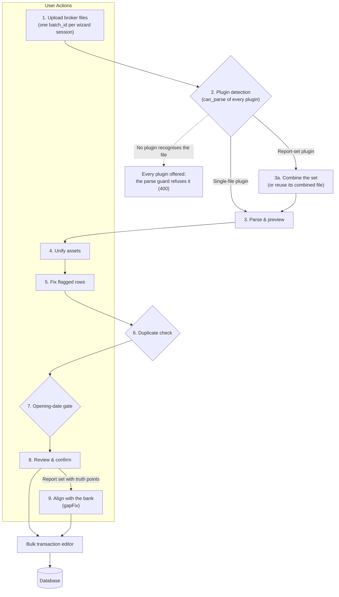

# 📥 BRIM Architecture

**BRIM (Broker Report Import Manager)** is the system responsible for importing transaction data from broker export files (CSV, XLSX, PDF, or another format supported by a plugin). It is designed to be robust, user-friendly, and extensible.

## 🔄 The BRIM Workflow

The import process follows a clear, multi-step wizard designed to give the user full control and visibility.


```mermaid
graph TD
    A["1. Upload broker files<br/>(one batch_id per wizard session)"] --> B{"2. Plugin detection<br/>(can_parse of every plugin)"}
    B -->|Single-file plugin| C["3. Parse & preview"]
    B -->|Report-set plugin| S["3a. Combine the set<br/>(or reuse its combined file)"]
    B -.->|No plugin recognises the file| R["Every plugin offered:<br/>the parse guard refuses it (400)"]
    S --> C
    C --> E["4. Unify assets"]
    E --> X["5. Fix flagged rows"]
    X --> I{"6. Duplicate check"}
    I --> F{"7. Opening-date gate"}
    F --> G["8. Review & confirm"]
    G -->|Report set with truth points| Z["9. Align with the bank<br/>(gapFix)"]
    G --> H["Bulk transaction editor"]
    Z --> H
    H --> DB[(Database)]

    subgraph User Actions
        A
        E
        X
        F
        G
        Z
    end
```

The wizard steps are `upload → select → analyze → assets → fix → duplicates → review → gapFix`.
**`assets`, `fix`, `duplicates` and `gapFix` are conditional**: each is skipped entirely when it has
nothing to ask (no merged extractions, no flagged rows, no cross-file collisions, no difference with
the bank's truth points), so a clean single-file import is still a three-click flow. `gapFix` is
reached only from the review's **Import**, and only for a [report set](#report-sets).

### 🪜 Step-by-step

1. **Upload** — The user uploads one or more broker export files. They can be dragged into the broker page or accessed from the Files tab. The wizard sends every file of one session with the same `batch_id`: the files uploaded together for one broker form a [report set](#report-sets) when a report-set plugin reads them.

2. **Plugin Detection** — BRIM auto-discovers `BRIMProvider` classes from `backend/app/services/brim_providers/` and asks every plugin's `can_parse(file_path)`; the plugins that accept the file are stored in its sidecar as `compatible_plugins`, highest `detection_priority` first. The wizard pre-selects a plugin per file: the report-set plugin that recognises it, else the broker's `default_import_plugin` when compatible, else the first compatible plugin. The Generic CSV provider (`broker_generic_csv`, `detection_priority` 0) is not a catch-all: it recognises columns from their header names and aliases (`HEADER_MAPPINGS`, no manual mapping), and its `can_parse` accepts only a `.csv` whose header row names both a date and a type column. A file that no plugin recognises is offered every plugin; parsing it with a single-file plugin re-runs that plugin's `can_parse`, whose refusal answers HTTP 400 with the plugin's reason ([`cannot_parse_reason`](../../architecture/patterns/brim_plugin_guide.md#cannot-parse-reason)) and moves the file to `failed/`. The file's list of compatible plugins is stored with the app version that detected it (`plugins_signature`): after an update, the first read of an original detected by another version detects it again and saves the new list, so a plugin added or changed since the upload is offered for older files (combined files are never detected again). See [The lifecycle of `compatible_plugins`](../../architecture/patterns/brim_plugin_guide.md#compatible-plugins-lifecycle).

3. **Parse & Preview** — The selected plugin's `parse()` method returns a `BRIMParseOutput` containing standardized `TXCreateItem` objects, warnings, extracted assets, optional field TODOs, and optional per-asset notices. **Nothing is saved yet.** The user sees a table of parsed transactions before proceeding. A report set is first combined into one file (step 3a, see [Report sets](#report-sets)), and that combined file is what gets parsed; its parse also returns the bank's truth points (`checkpoints`, `verifications`) and the broker's `history_start`.

4. **Unify assets** — When several files (or several rows) describe the same security under different spellings, the extractions are merged into one group with one elected primary identifier. Only shown when there is something to merge.

5. **Fix flagged rows** — The rows the plugin booked but could not fully understand: its `field_todos`. The user settles each one — correct it, split it, or keep it as read — grouped into three foldable panels by the nature of the question (misread trade / bundled amount / charge with no instrument).

    **This step runs before the duplicate check on purpose.** A purchase the plugin could only record as a cash withdrawal would be compared against cash withdrawals: a real duplicate is missed, an imaginary one invented. Correcting afterwards cannot repair that.

6. **Duplicate Detection** — Each parsed transaction is compared against existing rows by `(broker_id, date, type, amount, quantity)`. Matches are flagged with a confidence level so the user can skip or force-import them. Cross-file collisions (the same movement in two files being imported together) get their own arbitration step; database collisions simply arrive deselected at the review.

7. **Opening-date gate** — In the frontend wizard only, rows whose transaction date is strictly earlier than the broker `opened_at` date are classified with the status key `before_opening`, deselected, and made non-importable. The exact shipped comparison is `txDate < info.openedAt`, so the opening day itself is valid. There is no backend enum for this status.

8. **Review & Confirm** — The user reviews the final list. Importing is blocked while any selected row still points at an unresolved asset. On **Import**, the wizard hands the selected rows to the bulk transaction editor (`TransactionBulkModal`), whose save (`POST /api/v1/transactions/commit`) goes through the standard `TransactionService`.

9. **Align with the bank (`gapFix`)** — Report sets only. Before the hand-off, the wizard sends the truth points to `POST /api/v1/brokers/import/gap-fix` (`backend/app/services/brim_gap_fix.py`). For each checkpoint, in date order, the backend compares the cash balance and positions the bank states with what LibreFolio will know at that date — the saved transactions, minus the ones the bulk editor is deleting, plus its unsaved rows, the wizard's selection and the corrections of the earlier checkpoints — and proposes only the difference, as ordinary transactions tagged `gap_fix`. Verifications are compared, never corrected, and the endpoint writes nothing. The step opens only when there is something to show (a correction, a failed verification, an error); every correction starts selected, and the ones the user keeps join the review's rows in the editor.

### 🧺 Report sets {: #report-sets }

Some banks split one account across several exports — Danske Bank (`broker_danske_bank.py`) is read
from a custody export and a cash export. A **report-set plugin** declares the export roles it combines
(`report_roles`; `is_report_set_plugin` is true when the list is not empty), and its exports are
imported as one set:

- **Membership** — the set is the original files of one upload batch (`batch_id`) for one broker that
  the plugin can read (`collect_members` in `backend/app/services/brim_report_sets.py`). The plugin
  never parses an original on its own: that request answers 422 `set_required`, and the file is
  **not** moved to `failed/`.
- **Preview** — `POST /api/v1/brokers/import/sets/preview` reads the members through the plugin
  (`detect_role`, `describe_member`, `describe_set`) and reports roles, missing roles, coverage,
  segments, gaps and the broker history already in LibreFolio. It writes nothing.
- **Combine** — `POST /api/v1/brokers/import/sets/combine` refuses an incomplete set (422 with the
  missing roles), then reuses the combined file already built from exactly these members by this
  plugin version, or calls the plugin's pure `combine()` and saves the result next to the originals as
  an ordinary BRIM file with `kind = "combined"`. The analysis step then parses that combined file.
- **History and gap-fix** — the parse of a combined file applies the broker history already in
  LibreFolio (`apply_history`): checkpoints older than the eve of the history start are dropped,
  because what precedes the history is already represented; on a later import, a checkpoint from the
  history start on closes a gap ([The history start (H0)](../../architecture/patterns/brim_plugin_guide.md#report-set-history)).
  The review then continues to the `gapFix` step described above.

The plugin contract and the API payloads are in
[Multi-report plugins (report sets)](../../architecture/patterns/brim_plugin_guide.md#report-sets).

---

## 📂 File Lifecycle

```text
backend/data/{prod|test}/broker_reports/
├── .locks/      ← broker_<id>.lock — the cross-process metadata lock
├── uploaded/    ← new files awaiting processing
│   └── broker_<id>/   ← {file_id}.{ext} + {file_id}.json sidecar (same layout under parsed/ and failed/)
├── parsed/      ← successfully parsed files, ready for review/import
└── failed/      ← files that failed parsing or were rejected
```

Each file is stored with a companion `.json` metadata sidecar recording status, original filename, and any errors encountered. A file keeps its `broker_<id>/` folder for its whole life: a move changes only the status folder.

### 🗂️ Sidecar fields

| Field | Written by | Meaning |
|-------|------------|---------|
| `status`, `uploaded_at`, `processed_at`, `error_message` | Upload, moves | Where the file is in its lifecycle |
| `compatible_plugins`, `plugins_signature` | Upload; re-detection on read | The plugins whose `can_parse` accepted the file, and the app version that detected them (`detection_signature()`). A combined file lists only the plugin that built it and is never detected again |
| `batch_id` | Upload | The upload batch: the files of one wizard session, which a report-set plugin reads as one set |
| `kind` | Combine | `combined` for a file built by a report-set plugin; absent means `original` |
| `derived_from` | Combine | On a combined file: the originals it was built from (`file_id`, `role`, `filename`; `deleted: true` once the original is deleted) |
| `combined_into` | Combine | On an original: the combined files built from it |
| `combine_plugin_code`, `combine_plugin_version`, `combine_summary` | Combine | The plugin version that built a combined file, and its summary |
| `members_key` | Combine | SHA-256 of the sorted member ids: the order-insensitive identity of a set, used to find a reusable combined file |
| `last_parse_result`, `parsed_plugin_code`, `parsed_plugin_version` | Parse | The cached preview; a plugin version bump since then marks it stale (`parse_is_stale`) |

A combined file keeps working when one of its originals is deleted, because it carries the values it
was built from; deleting a combined file removes it from its originals' `combined_into`.

---

## ⚡ Concurrency & off-loading

Uploading and parsing are the two hottest paths in BRIM, and both used to do **blocking
synchronous work directly inside `async def` handlers**. While one file parsed, the whole
application — prices, FX, navigation — stood still, and concurrent requests from the browser were
serialised by the server no matter how parallel the client was.

| Layer | What runs where |
|---|---|
| **Upload** | `save_uploaded_file` runs in `asyncio.to_thread`. A thread is enough: the transfer itself is the OS's work; we only write the file and re-read it to sniff compatible plugins |
| **Plugin discovery** | `auto_discover()` (`backend/app/services/provider_registry.py`) imports the plugin modules once, under the registry's own `RLock`, and marks discovery done only after every module has run. The first uploads after a start run on worker threads: one that arrives mid-discovery waits for the full catalogue instead of detecting against a half-filled one |
| **Parse** | `backend/app/services/brim_parse_pool.py` — a **lazy** `ProcessPoolExecutor`, `min(cpu_count, 4)` workers. Parsing is CPU work: a thread would leave it serialised by the GIL |
| **Sidecar writes** | Every write of a broker's sidecars holds that broker's lock (`broker_metadata_lock`: a re-entrant thread lock plus an advisory `flock` on `broker_reports/.locks/broker_<id>.lock`). `combine_set` holds it, in a worker thread, from the reuse check to the save of the combined file: analysing the same set twice — a double click, two tabs — reuses the first combined file instead of building a second one. See [The broker metadata lock](../../architecture/patterns/brim_plugin_guide.md#broker-metadata-lock) |
| **Candidate search** | `search_asset_candidates_bulk` issues **one** query per file instead of up to five per extracted asset, then applies the same five priorities in memory |
| **Frontend** | `lib/utils/core/requestConcurrency.ts` — `mapWithConcurrency` bounds the upload and parse loops instead of awaiting one file at a time |

### 🧵 Why `forkserver`/`spawn`, never `fork`

This process owns an event loop and a thread pool. Forking them is the classic way to produce
deadlocks that only appear in production. The pool prefers `forkserver` and falls back to
`spawn`; `parse_file` is DB-free (filesystem + registry only), so it is safe to run in a child.

!!! warning "Two decisions that look like bugs and are not"

    **The fallback is permanent.** If the pool cannot start — or a worker dies taking a
    segfaulting C parser with it — BRIM falls back to a thread *for the rest of the process
    lifetime*. A degraded parse is a slow parse; a failed one is a lost import. And an
    environment that cannot spawn workers will not start being able to halfway through an
    import: retrying per file would pay the start-up cost again for nothing.

    **A parser error is not a broken pool.** A failure at *submit* is always ours; while
    awaiting, **only** `BrokenProcessPool` counts. Everything else — `ValueError` for the wrong
    plugin, `FileNotFoundError`, `BRIMParseError` — propagates intact. Treating `OSError` as pool
    trouble would disable the pool forever on the first missing file, and turn the one useful
    message the user gets ("this layout is not supported") into a spinner.

!!! danger "`%` in bond names"

    The bulk search reproduces in Python predicates that were SQL, and `LIKE` reads `%` as a
    **wildcard**. Security names are full of them (`BTP Valore 3,35%`), so a naive Python `in`
    would be *stricter* than the SQL it replaces and would drop candidates silently.
    `_like_to_regex` translates `%`→`.*` and `_`→`.` with everything else escaped. It is the most
    likely way the two paths can diverge, and therefore the central case of the equivalence test.

The pool is shut down from the FastAPI `lifespan`, next to the other pools.

### 🌐 The browser connection limit

No web API exposes the per-host connection cap. `navigator.connection` describes link *quality*
(Chromium only); `navigator.hardwareConcurrency` counts CPU cores. HTTP/1.1 settles by convention
on 6 per host; HTTP/2 multiplexes over one connection. So the frontend limit is a **declared
heuristic, not a measurement**:

```ts
max(2, min(6 - 1, navigator.hardwareConcurrency ?? 4))
```

One slot is always left free: an import that starves the rest of the application of connections
looks like a freeze, and the user has no way to tell "busy" from "broken".

---

## 🔍 Deduplication Logic

Before final import, BRIM compares each parsed transaction against the database on:

| Field | Used in match |
|-------|--------------|
| `broker_id` | ✅ |
| `date` | ✅ |
| `type` | ✅ |
| `quantity` | ✅ |
| `amount` | ✅ |
| `description` | Used for confidence upgrade |
| `asset_id` | Used for confidence upgrade |

Confidence levels:

| Level | Meaning |
|-------|---------|
| `POSSIBLE` | Key fields match |
| `LIKELY` | Key fields + description match |
| `POSSIBLE_WITH_ASSET` | Key fields + asset resolved |
| `LIKELY_WITH_ASSET` | Key fields + description + asset all match |

---

## 🧩 Plugin System

Every BRIM plugin is a `BRIMProvider` subclass registered via the provider registry. Key contract:

```python
class MyBrokerProvider(BRIMProvider):
    @property
    def provider_code(self) -> str:
        return "broker_mybroker"

    @property
    def detection_priority(self) -> int:
        return 100  # Higher = tried first

    def can_parse(self, file_path) -> bool:
        """Return True when this file belongs to this broker."""
        ...

    def parse(self, file_path, broker_id) -> BRIMParseOutput:
        """Convert broker rows into TXCreateItem objects inside BRIMParseOutput."""
        ...
```

### 📤 What a parse returns

`BRIMParseOutput` has four channels, and choosing between them is what shapes the wizard:

| Channel | Meaning | Rendered as |
|---------|---------|-------------|
| `transactions` | rows the plugin read | review table |
| `validation_issues` | rows the schema refused | parse-detail modal, red |
| `warnings` (`BRIMNotice`) | a statement about the **file** — `info` (blue) or `warning` (amber) | parse-detail + confirmation modal |
| `field_todos` (`BRIMFieldTodo`) | a **field** of one accepted row is a guess | the *Fix flagged rows* step |
| `extracted_assets[].notices` (`BRIMAssetNotice`) | something about the **instrument** | amber banner in the asset-create modal |

Notices and todos can both carry `BRIMEvidence` — the source rows as a small table, with
1-based line numbers that render a jump into the file preview. `BRIMFieldTodo.context` also
carries a small set of keys the correction step reads directly (`split_hint`,
`split_suggestions`, `compare_nominal`, …).

The full contract, with worked examples from `broker_credit_agricole.py`, is in
[Talking to the import wizard](../../architecture/patterns/brim_plugin_guide.md#talking-to-the-import-wizard).

Plugins are auto-discovered once per process, the first time the registry is used (see *Plugin discovery* under *Concurrency & off-loading* above). See the [BRIM Plugin Guide](../../architecture/patterns/brim_plugin_guide.md) for a complete walkthrough of creating a new plugin.

---

## 🔗 Related

- **[Generic CSV Provider](generic_csv.md)** — Format reference + sign conventions + LLM tip
- **[Providers List](providers_list.md)** — All currently supported brokers
- **[BRIM Plugin Guide](../../architecture/patterns/brim_plugin_guide.md)** — How to write a new broker plugin
- **[Multi-report plugins (report sets)](../../architecture/patterns/brim_plugin_guide.md#report-sets)** — The report-set contract, its API and the gap-fix
