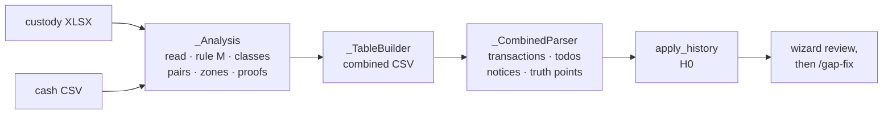

# 🏦 Danske Bank Importer

`broker_danske_bank` imports the **equity savings account** (*osakesäästötili*) of Danske Bank
Finland from two exports that only make sense together: the custody transactions (XLSX) and the
cash statement (CSV). It lives in `backend/app/services/brim_providers/broker_danske_bank.py`
(`plugin_version` 1.0.0, 🔬 Alpha — built from the exports of one account, shared in
[issue #26](https://github.com/Librefolio/LibreFolio/issues/26)) and is LibreFolio's reference
**report-set plugin**.

This page covers what is specific to Danske Bank. The generic machinery — membership by upload
batch, `/sets/preview` and `/sets/combine`, the history start (H0), `/gap-fix` — is described in
[BRIM Architecture → Report sets](architecture.md#report-sets) and
[BRIM Plugin Guide → Multi-report plugins](../../architecture/patterns/brim_plugin_guide.md#report-sets),
the wizard side in
[Import Wizard → Report sets](../../frontend/components/features/import-wizard.md#report-sets).
The user's view is [Danske Bank](../../../user/transactions/import/danske-bank.md): the plugin's
`docs_url` points there, and so do the set card's *How to export it* links.

`describe_set` and `combine` both build an `_Analysis` of the members; `combine` writes it out
through `_TableBuilder`, and `parse` reads back only the combined file (`_CombinedParser`). A
custody or cash file parsed alone raises `BRIMSetRequiredError`, naming the other role.

---

## 🗂️ Exports, roles and detection

| Role | Export (wizard name) | Extension | `max_history` | Coverage axis | `must_cover` |
|---|---|---|---|---|---|
| `custody` | *Securities transactions* — eBanking **Sijoitukset → Tapahtumat** | `.xlsx` | `P1Y` | trade date (`Kauppapäivä`) | — |
| `cash` | *Cash statement* — the account transactions of the account's cash account | `.csv` | `P5Y` | value date (`Pvm`) | `custody` |

Both roles are `required` and `multiple`. The plugin sets `settlement_lag_business_days` to 5 and
`pre_checkpoint_policy` to `summarize`, and keeps the default history tag, `danske_bank`.

**Detection.** `_file_kind()`, behind `can_parse` and `detect_role`, answers `custody`, `cash`,
`combined` or `None`:

- `.xlsx` (and `.xlsm`) — the first worksheet with data, read with `openpyxl` (values only), is
  `custody` when one of its first 20 rows (`_HEADER_SCAN_ROWS`) names every required custody column.
- `.csv` — decoded with the shared `TEXT_ENCODINGS` fallback (UTF-8 with or without BOM,
  Windows-1252, Latin-1) and split on `;`. A first row holding `lf_row_kind`, `lf_source`,
  `custody:Toimeksiantotyyppi` and `cash:Saaja/Maksaja` is `combined`; otherwise a header among the
  first 20 rows naming every required cash column makes it `cash`.
- Headers match case- and space-insensitively, a literal ` ` counting as a space (`_norm`). Any
  read error means «not ours».

`can_parse` accepts the three kinds, `detect_role` only the first two (`detection_priority` 100). A
downloaded combined file uploaded again is therefore an original without a role: the preview
reports it as `unknown_role`. No other plugin's `can_parse` accepts the sample exports, so the
wizard never offers *Read alone with ‹plugin›* for them.

| Export | Required columns | Also read |
|---|---|---|
| custody | `Kauppapäivä`, `Arvopäivä`, `Sijoituskohde`, `Määrä`, `Kurssi`, `Summa`, `Tila`, `Toimeksiantotyyppi` | `Palkkio sis. Alv`; the currency of `Summa` — `Valuutta`, or the unnamed column right after `Summa` (default EUR); `Säilytystili`, the custody account, read for the account check only and never copied |
| cash | `Pvm`, `Saaja/Maksaja`, `Määrä`, `Saldo`, `Tila` | `Tarkastus`. There is no currency column: the account is in euro |

Dates are `d.m.yyyy`. Numbers may use a space, NBSP or narrow NBSP as thousands separator, a comma
or a dot as decimal separator, and a Unicode minus (`_to_decimal`).

`describe_member()` reports rows and coverage. A custody file also gets an `account_fingerprint`,
the SHA-256 of its sorted `Säilytystili` values: custody files of different accounts make the
preview's `mixed_accounts`, and the set cannot be combined. Several accounts inside one custody
file only raise `mixed_accounts_in_file`.

---

## 🏷️ Row classes

### 📈 Custody rows

`_classify_custody()`: a `Tila` other than `Toteutettu` is `status`; a row without trade date,
value date, name or a non-zero quantity, or valued before its trade date, is `invalid`. Then the
order type decides:

| `Toimeksiantotyyppi` | Signs | Class |
|---|---|---|
| `Rajakurssi`, `Päivän kurssi`, `Pikakauppa` | `Määrä` > 0 and `Summa` < 0, or `Määrä` < 0 and `Summa` > 0; a `Kurssi` is required | `buy`, `sell` |
| `Tuotto` | `Määrä` > 0 and `Summa` > 0 | `income` |
| `Jakautuminen, vanha` | `Määrä` < 0, no `Summa` | `demerger_old` |
| `Jakautuminen, uusi` | `Määrä` > 0, no `Summa` | `demerger_new` |
| anything else | — | `unknown_type` |

A known order type with other signs is `invalid`.

### 💳 Cash rows

`_classify_cash()`: a `Tila` other than `Toteutunut`, or the label `Varaus` (a reservation), is
`status`; a row without a date, or with a zero or missing amount, is `invalid`. Then the label
(`Saaja/Maksaja`) and the sign decide (`_cash_label_class`):

| Label | Sign | Class | Becomes |
|---|---|---|---|
| `Osto <name>` | − | `buy` | half of a pair |
| `Myynti <name>` | + | `sell` | half of a pair |
| `<name> <10-digit reference>` | + | `income` | half of a pair |
| first word `Nosto` | − | `withdrawal` | `WITHDRAWAL` |
| first word `Vero` | − | `tax` | `TAX` |
| first word starting with `Palvelumaksu` | − | `fee` | `FEE` |
| first word `Korko` or `Hyvityskorko` | + | `interest` | `INTEREST` |
| any other credit | + | `deposit` | `DEPOSIT`, listed by the `deposit_assumed` notice: only the holder can pay into an equity savings account |
| any other debit, or a known word with the wrong sign | | `unknown_type` | excluded |

### 🧾 What the parse writes

| Combined line | Transaction | Date | Quantity | Cash |
|---|---|---|---|---|
| `pair` of a trade | `BUY` or `SELL` | cash `Pvm` | custody `Määrä` | cash `Määrä` |
| `pair` of a `Tuotto` | `DIVIDEND` | cash `Pvm` | 0 | cash `Määrä` |
| `standalone` cash row | `DEPOSIT`, `WITHDRAWAL`, `TAX`, `FEE` or `INTEREST` | `Pvm` | — | `Määrä` |
| `standalone` demerger line | `ADJUSTMENT` | custody `Arvopäivä` | custody `Määrä` | — |

Cash is always EUR, taken as written. Every transaction is tagged `import` and `danske_bank`,
demerger lines also `demerger`. Each security gets one fake asset id per normalised name, with the
name as its only identifier (`extracted_name`): the exports carry no ISIN and no ticker.

`summarized`, `deferred` and `excluded` lines write no transaction (the last two feed the notices).
On a first import, the `standalone` rows of the `before` zone are written but dated before H0, so
the review hides them
([Import Wizard → Rows before H0](../../frontend/components/features/import-wizard.md#rows-before-history)).

---

## 🔗 Pairing trades with their cash

`_pair_rows()` pairs `buy`, `sell` and `income` rows only, on a key of **value date, amount to the
cent, currency and class** — `Arvopäivä`, `Summa` and the custody currency against `Pvm`, `Määrä`
and EUR. The class carries the direction.

- One custody row and one cash row on a key pair.
- More than 8 candidates on either side (`MAX_MATCH_CANDIDATES`) are all `ambiguous`.
- Interchangeable candidates — the same name, quantity, price, trade date and order type on the
  custody side, one label on the cash side — pair in file order, so identical partial fills stay
  two trades.
- Otherwise `_best_assignment()` keeps the assignment with the most compatible names, but only when
  every best assignment imports the same trades; if not, every candidate of the key is `ambiguous`.
  The plugin never guesses.

Two names are compatible when one normalised name is a prefix of the other, because the cash
statement truncates its labels. The name is a check, not a key: a pair whose names differ still
pairs, and the parse lists it in the `name_mismatch` notice.

**Several files of one role** (rule M, `_RoleMerge`): each day belongs to the file with the latest
coverage covering it — custody files by trade date, cash files by value date. The other files' rows
of that day count once when identical, and become `excluded` (`superseded`) when they differ;
`describe_set` then warns `overlap_mismatch`.

---

## 🗺️ Segments, zones and outcomes

- **Segments** — the custody files' trade-date spans, merged when they overlap or touch
  (`_raw_segments`). Two spans with a hole between them stay apart only when the cash statement
  proves trades in the hole: an unmatched cash trade valued after the first span and no later than
  5 business days after the eve of the second (`_proven_segments`). Otherwise they merge, hole
  included. Each hole left between two segments is a **gap** (`gaps()`, the preview's `gap`
  warning).
- **Checkpoint** — the eve of each segment; for the first one, the eve of the first booked cash day
  when the cash statement starts later (`_timeline`).
- **Window** — from the day after the checkpoint to the segment's last day plus 5 business days
  (`LAG_BUSINESS_DAYS`), capped at the next checkpoint. Its **border** is the first 5 business days
  after the checkpoint. Business days skip weekends only: holidays are not known.
- **Zones** of a value date (`_zone`): `before` (up to the first checkpoint), `window`, `gap` (after
  a window, up to the next checkpoint) and `after` (beyond the last window).

Every row gets exactly one outcome (`_Analysis._settle`):

| Row | Outcome |
|---|---|
| Custody row and cash row on one key | `pair` |
| Deposit, withdrawal, tax, fee or interest | `standalone`, imported with its own date |
| Demerger line | `standalone` |
| Cash trade or income without counterpart | `summarized` in the zone's checkpoint in `before` and `gap`, and in its own segment's checkpoint inside the border; valued after the segment's last day, `summarized` in the next segment's checkpoint, or `deferred` when there is none; `deferred` in `after`; elsewhere `excluded` (`no_counterpart`) |
| Custody trade or income without counterpart | `excluded`: `not_yet_settled` (valued after the cash statement's last day), `outside_cash_coverage` (outside the statement's spans), else `no_counterpart` |
| Ambiguous; superseded; `status`, `unknown_type`, `invalid` | `excluded` with that reason |

The cash rows of the `before` zone — standalone, `ambiguous` or `unknown_type` — are also absorbed
by the first checkpoint. The full matrix, zone by zone, is in the plugin guide, under *Zones and
outcomes*.

The wizard's **Matching securities ↔ cash** reads the combined summary: the outcomes as chips
(*pairs*, *standalone rows*, *summarised in a checkpoint*, *with the next import*, *excluded*) and
one row per reason
([Import Wizard → Step analyze](../../frontend/components/features/import-wizard.md#set-analysis)):

| `lf_reason` | Wizard label | For Danske |
|---|---|---|
| `no_counterpart` | no counterpart | a trade or income in one file only, inside a window |
| `ambiguous` | ambiguous | candidates that cannot be told apart |
| `not_yet_settled` | not settled yet | a custody trade valued after the cash statement's last day |
| `outside_cash_coverage` | settled before the cash statement starts | a custody trade valued outside the cash statement's spans |
| `status` | not executed or not booked | `Tila` other than `Toteutettu` / `Toteutunut`, or a `Varaus` |
| `unknown_type` | unknown type | an order type or a label the plugin does not know |
| `invalid` | invalid | missing or inconsistent values |
| `superseded` | replaced by a newer file | rule M |

---

## 📄 The combined file

`_TableBuilder` writes one line per source row — a pair is one line — plus the truth rows
(`truth_cash`, `truth_position`, `verification`), sorted by day, the data lines before the truth
rows of the same day. The columns are the nine `lf_*` columns, then the verbatim `custody:<column>`
and `cash:<column>` values; the custody account (`Säilytystili`) is never copied.

The core writes the file (`write_combined_csv`: UTF-8 with BOM, `;`) under a generated name,
`Danske Bank — combined <first day>…<last day>.csv`, because the cash statement's own file name may
carry an account number. What each `lf_*` column holds is in the plugin guide, under *`combine` is
pure*.

`summary`, kept in the sidecar as `combine_summary`, holds `rows` per role, `outcomes`, `zones`,
`reasons`, `segments`, `gaps`, `checkpoints`, `verifications`, `balance_chain` (`ok` or `broken`)
and `overlap_mismatch_days`. `combine` refuses custody files without a dated row
(`BRIMParseError`, so a 422 `combine_failed`).

`plugin_version` covers `combine` and `parse` alike: bump it whenever either output changes for the
same files. The existing combined files then show **To re-combine**, and the next analysis rebuilds
them.

---

## 📍 Truth points

### 🏁 Starting point and «After the gap»

One checkpoint per segment, on its eve: the first is `opening`, the others `gap`. The wizard titles
them *Starting point · ‹date›* and *After the gap · ‹date›*. On a later import, `apply_history()`
drops the checkpoints before the eve of H0, turns the ones from H0 on into `gap` checkpoints and
removes what H0 already represents
([The history start (H0)](../../architecture/patterns/brim_plugin_guide.md#report-set-history)).

- **Cash** — the cash statement's running balance at the end of the checkpoint day, plus the cash
  of the border rows summarised in it: trades made before the custody export and settled after the
  checkpoint (`border_cash`). A day the statement does not cover gets no cash (`not_covered`).
- **Absorbed rows** — every cash row the checkpoint summarises (`lf_checkpoint`), with date, amount
  and label. For the opening checkpoint, `opening_cash` is the checkpoint's cash minus their total:
  the balance before them. The gap-fix explanation reads both.

**Positions** come from proofs inside the segment's window, each brought back to the checkpoint by
removing the movements imported in between — at most one per security:

- **E1** — a `Tuotto` states the shares that earned it: exact. Discarded when another movement of
  the security falls in the 30 days up to its trade date (`recent_trades`), when those 30 days start
  before both the segment and the cash statement (`window_not_covered`), or when an excluded row of
  the security lies between the checkpoint and the proof (`excluded_rows`).
- **E2** — the old line of a demerger states the whole holding: exact. Discarded on a same-day
  movement of the security (`same_day_movement`) or on excluded rows.
- **E3** — when no exact proof holds, selling more than was bought since the checkpoint proves
  **at least** the largest shortfall (`at_least`). Discarded on excluded rows.
- Exact proofs that disagree, or that give a negative quantity, are all discarded (`conflict`), and
  E3 is tried instead.

A discarded proof is written `discarded:<rule>:<reason>` in `lf_proof` and listed by the
`proof_discarded` notice. Danske never states a `unit_cost`.

### ✅ End-of-period check

One `verification`, on the last day of the last segment — or on the cash statement's last day when
it ends first — provided the running balance covers that day. Its cash is the plain running
balance, and the wizard titles it *End-of-period check · ‹date›*. It is never a checkpoint: the next
import brings the `not_yet_settled` and `deferred` trades one by one, and a correction there would
count them twice (the safety rule of the plugin guide).

The running balance (`_chain`) takes the booked rows by value date — within a day in reverse file
order, since the statement lists the newest rows first — and checks each day against `Saldo`, row
by row or at least as a day total. A day that does not add up is a break: the chain goes on from
that day's last `Saldo`, and the cash of every checkpoint becomes a verification instead
(`balance_chain_broken`, warned by both `describe_set` and the parse).

---

## 🧮 The `gap_fix` corrections

`compute_gap_fix()` (`backend/app/services/brim_gap_fix.py`) is generic
([Plugin Guide → report sets](../../architecture/patterns/brim_plugin_guide.md#report-sets),
[Import Wizard → Step gapFix](../../frontend/components/features/import-wizard.md#gapfix-step));
with this plugin's truth points it gives:

- For each checkpoint in date order, LibreFolio's state at the end of the day: the broker's saved
  transactions (without pending deletions) plus the editor's unsaved rows, the wizard's selection
  and the corrections proposed at the earlier checkpoints. Transactions entered by hand count like
  imported ones.
- **Cash** — a difference above 0.01 € becomes a **Deposit** or a **Withdrawal** that brings the
  cash to the balance of the cash statement (`DEPOSIT` when the bank holds more, `WITHDRAWAL` when
  it holds less), dated on the checkpoint.
- **Positions** — an `exact` position gets an `ADJUSTMENT` of the difference, positive or negative;
  an `at_least` one only the missing part. With no `unit_cost` from Danske, every positive
  adjustment carries the blocker todo `gap_fix_cost` on `cost_basis_override`: the wizard tags it
  *cost to enter*, and the bulk editor waits for the cost. A negative adjustment carries no cost. A
  position whose security is still unresolved is left out (`unresolved_asset`).
- Tags `import`, `danske_bank` and `gap_fix`; description
  `Gap-fix <date> — Danske Bank: <what> at the end of the day, as stated by the bank`.
- The end-of-period verification is compared (`ok` within 0.01 €), never corrected.

Once saved, a correction counts in H0 from the day after its date. A later set whose segment covers
its date gets the preview warning `covers_gap_fix` (delete the correction after the import, or the
cash counts twice); a segment that ends before H0 gets `before_history_segment` and is not
imported.

---

## 💶 The commission estimate

The exports give one total per trade: the fee column (`Palkkio sis. Alv`) is always 0, and the
commission is inside `Summa`. Every paired purchase and sale therefore gets the `warning` todo
`danske_trade_charges_included` on `cash` (`_charges_todo`); dividends get none.

- **Context** — `split_hint: "trade_charges"`, so the **Corrections** step owns the row
  (`isCashSplitWarning`) and every trade needs a decision; `compare_nominal: false`; `cash` (the
  absolute amount), `currency`, `row`, `split_suggestions`, and `charges` when the estimate is
  plausible.
- **Estimate** — gross = absolute quantity × `Kurssi`, rounded to the cent; charges = absolute
  amount − gross for a purchase, gross − absolute amount for a sale. It is plausible when
  0 ≤ charges ≤ max(15 €, gross ÷ 100): the first suggestion then gives both figures, valid if the
  price is in euro. Otherwise it says the price may be quoted in another currency, so the
  commission cannot be computed from the file.
- The second suggestion always points to the trade confirmation in eBanking.

---

## ✂️ Demergers

`Jakautuminen, vanha` and `Jakautuminen, uusi` lines are never paired: booked, with the right
signs, they become cashless `ADJUSTMENT`s in any zone, dated on `Arvopäivä` and tagged `demerger`.

- **New line** — blocker todo `demerger` on `cost_basis_override`: the file gives no acquisition
  cost. A demerger is tax-neutral in Finland, and the old cost is split among the new shares in the
  ratio the Tax Administration publishes. The bulk editor's **Save All** waits for it.
- **Old line** — warning todo `demerger_old_leg` on `quantity`: it removes the whole holding without
  moving its cost to the new lines, so invested capital does not drop by itself.

Neither todo enters the **Corrections** step: a cost-basis blocker belongs to the bulk editor, and
the old-line warning has no `split_hint`. The old line is also proof E2 of the holding.

---

## 🇫🇮 Finnish notices

The parse speaks the language of the files: notice messages, todo messages and evidence comments
are in Finnish. Evidence tables are titled `Arvopaperitapahtumat` (custody columns) and
`Tilitapahtumat` (cash columns), with the line numbers of the combined file.

| Notice | Severity | Says |
|---|---|---|
| `excluded_<reason>` | warning | One per exclusion reason, with its rows: they are not imported (`not_yet_settled`: they come with the next import) |
| `deferred_rows` | info | Cash trades after the last custody day come with the next import |
| `name_mismatch` | warning | Paired trades whose names differ: check them |
| `proof_discarded` | info | Holdings the files could not prove reliably (`context.proofs`) |
| `balance_chain_broken` | warning | The statement's balances are only compared, never used for corrections |
| `deposit_assumed` | info | Credits read as deposits: check them |

The todo codes — `danske_trade_charges_included`, `demerger`, `demerger_old_leg` — are in the
contract suite's `KNOWN_REASON_CODES`. The set warnings of `describe_set` (`empty_member`,
`mixed_accounts_in_file`, `overlap_mismatch`, `gap`, `balance_chain_broken`) and the gap-fix todo
`gap_fix_cost` are written in English and localised by the wizard
(`importWizard.reportSet.warning.<code>`, `importWizard.reportSet.gapFix.todo.<code>`).

---

## 🚦 Set statuses

| Where | Status | For a Danske set |
|---|---|---|
| `/sets/preview`, per role | `present`, `missing`, `excess` | `excess` never occurs: both roles are `multiple` |
| `/sets/preview`, `complete` | every required role present, no excess, no mixed accounts | mixed accounts can only come from custody files |
| `/sets/preview`, `missing` | the period a missing export must cover | a missing cash statement: from the eve of the first custody trade date to the last one; a missing custody export: no period |
| Step `upload` | after an upload, **Next** stays once on `upload` while a set of the session is incomplete | names the missing export, its extension and its period |
| Set card (`data-set-status`) | `loading` *Checking…*, `complete` *Complete*, `incomplete` *A file is missing* or *Cannot be combined*, `error` *Check failed* | *Cannot be combined* means mixed accounts; *Already analysed* is added when a parsed combined file of exactly these members exists |
| Files table | **Set of ‹date›**, **Incomplete**, **Combined**, **Used in a combined file**, **To re-combine** | [Import Wizard → Badges](../../frontend/components/features/import-wizard.md#report-set-badges) |

The cash role's coverage warnings (`must_cover: custody`) — `coverage_starts_late` when the
statement starts after the eve of the first custody trade date, `coverage_ends_early` when it ends
before the last one — never block the set. How the user changes a set (*Read as*, *Remove from the
set*) is generic:
[Import Wizard → How a set is read](../../frontend/components/features/import-wizard.md#set-read-as).

---

## 🧪 Samples and tests

- `backend/app/services/brim_providers/sample_reports/` holds the **main** set
  (`danske_bank-custody.xlsx`, `danske_bank-cash.csv`) and the **gap** set
  (`danske_bank-gap-custody-1.xlsx`, `danske_bank-gap-custody-2.xlsx`, `danske_bank-gap-cash.csv`):
  synthetic values on the real column layout, declared in `test_sample_sets` and described in the
  folder's `README.md`.
- `./dev.py test external brim-danske-bank` (`test_external/test_brim_danske_bank.py`) pins the
  plugin's own rules; the generic suites are listed in
  [Testing a report-set plugin](../../architecture/patterns/brim_plugin_guide.md#report-set-tests).

## 🔗 Related

- [Danske Bank — user guide](../../../user/transactions/import/danske-bank.md)
- [BRIM Architecture → Report sets](architecture.md#report-sets)
- [BRIM Plugin Guide → Multi-report plugins (report sets)](../../architecture/patterns/brim_plugin_guide.md#report-sets)
- [Import Wizard → Report sets](../../frontend/components/features/import-wizard.md#report-sets)
- [BRIM Providers List](providers_list.md)
