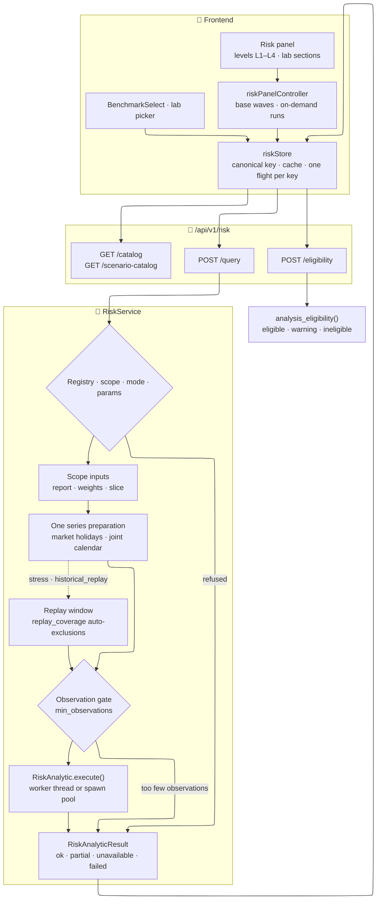

# 📉 Risk Engine

The risk engine measures how a portfolio, a broker, a single asset or a hand-picked selection of
assets has behaved, and how it could behave: drawdowns, Value at Risk, correlations, risk
contributions, benchmark comparisons, stress scenarios and simulations. It is a **bulk,
plugin-based** service behind `/api/v1/risk`. One request names one scope, one period, one target
currency and one mode, and asks up to 32 analytics about them. The engine resolves the scope and
prepares the price series **once**, then runs every analytic in isolation: a refusal or a crash in
one analytic never takes the others down.

This page is for developers who change the engine, add an analytic or build a surface on top of
it. The mathematics lives in the [Risk Metrics](../../../financial-theory/technical-analysis/risk-metrics/index.md)
theory section. What users see is described on the [Dashboard](../../../user/dashboard/index.md)
page (its **Risk** tab), on the [Correlation tab](../../../user/assets/correlation.md) page of the
Assets list, and on the [asset detail](../../../user/assets/detail/index.md) page.

---

## 🧭 Who Calls It {: #callers }

| Caller | Scope it sends | Entry point |
|---|---|---|
| Dashboard, **Risk** tab | `{kind: "portfolio"}`: every broker the user can access | `levels/RiskLevelsPanel.svelte` |
| Broker Detail, **Risk** tab | `{kind: "portfolio", broker_ids: [id]}` | `levels/RiskLevelsPanel.svelte` |
| Assets page, **Correlation** tab (the *Asset Global* lab) | `{kind: "asset_set", asset_ids: [...]}` | `AssetSetRiskPanel.svelte` |
| Asset Detail, **Risk & Scenarios** tab | `{kind: "asset", asset_id}` | `AssetRiskScenariosView.svelte` → `RiskAnalysisPanel.svelte` |
| AI Export drawdown context | Portfolio, broker or asset; `drawdown_summary` only | `RiskService.execute()`, called in-process by `backend/app/services/ai_export/components/drawdown_context.py` |

The Svelte paths are relative to `frontend/src/lib/components/risk/`. The AI Export side is
described in [AI Export Composition](../../architecture/patterns/ai_export_composition.md).

---

## 🗺️ Source Map {: #source-map }

| Source | Responsibility |
|---|---|
| `backend/app/api/v1/risk.py` | The four routes; maps scope errors to 403 and 404. |
| `backend/app/schemas/risk.py` | Request, scope, result, metadata and output contracts, and every enum (`RiskMode`, `RiskResultStatus`, `RiskErrorCode`, `RiskOutputKind`, …). |
| `backend/app/schemas/risk_scenarios.py` | Typed scenario catalogue contracts. |
| `backend/app/services/risk/service.py` | `RiskService`: scope resolution, one series preparation, gates, per-analytic isolation, statuses, warning enrichment, eligibility verdicts. |
| `backend/app/services/risk/base.py` | The plugin contract: `RiskAnalytic`, `RiskExecutionContext`, `RiskComputation`, `RiskUnavailableError`, `RiskSeriesInputs`. |
| `backend/app/services/risk/eligibility.py` | Per-asset window facts, analysis eligibility, replay coverage, common and suggested periods. |
| `backend/app/services/risk/metrics.py` | Pure numeric primitives: volatility, Sharpe and Sortino, drawdown episodes, VaR/CVaR, correlation, risk contributions, buy-and-hold replay. |
| `backend/app/services/risk/acquired.py` | Measures re-implemented from the Riskfolio-Lib catalogue in the project's sign conventions; the library is their test oracle, never a runtime dependency. |
| `backend/app/services/risk/analytic_helpers.py` | Extraction helpers that turn a missing input into a declared refusal (`require_primary_returns`, `prepared_scope_series`, …). |
| `backend/app/services/risk/signal_helpers.py` | Adapters reused by the five risk-family [signal plugins](../../architecture/patterns/signal_plugin_guide.md) (drawdown and rolling return, volatility, Sharpe, beta). |
| `backend/app/services/risk/quant/` | The simulation and optimization boundary: engine request and result models, content-keyed caches, spawn worker pools, the QuantLib and Riskfolio workers, the NumPy block bootstrap. |
| `backend/app/services/risk/scenario_catalog/` | Built-in YAML scenarios and the loader that runs at startup. |
| `backend/app/services/risk_plugins/` | The analytics, one module each. |
| `backend/app/services/provider_registry.py` | `RiskAnalyticRegistry` and the `register_plugin` decorator. |
| `backend/app/services/series_preparation.py` | Joint calendar, target-currency conversion, simple returns, carried points. |
| `backend/app/services/market_calendar.py` | The market holiday table and the rule that tells a stored carry from a quote. |
| `backend/app/services/data_quality_thresholds.py` | Thresholds shared with the portfolio's data-quality banner. |
| `backend/app/config.py` | `RISK_SIMULATION_*` and `RISK_OPTIMIZATION_*` worker settings. |
| `frontend/src/lib/risk/riskRequest.ts` | Request builders and canonicalization. |
| `frontend/src/lib/stores/risk/` | `riskStore` (session cache), `riskPanelController` (the plumbing behind every panel), `riskBenchmarkStore` (the shared benchmark). |
| `frontend/src/lib/components/risk/` | Panels, levels, the lab, `BenchmarkSelect`, eligibility wording. |

---

## 🔄 Request Flow {: #request-flow }



`RiskService.execute()` runs these steps for every `POST /query`:

1. **Pre-flight, per analytic.** Each requested `analytic_code` is looked up in the registry and
   checked against the plugin's `supported_scopes`, `supported_modes` and `params_model`. A miss is
   not an HTTP error: that item comes back `unavailable` with `analytic_not_found`,
   `incompatible_scope`, `incompatible_mode` or `invalid_parameters` (the Pydantic messages go in
   `details.validation_errors`), and the other analytics still run.
2. **Scope inputs** (`_load_scope_inputs`). An `asset` or `asset_set` scope is just its ids, with no
   weights. A `portfolio` scope checks a requested `broker_ids` subset against the user's access
   rows (an inaccessible broker → **403**), then reads one `PortfolioService.get_report()` for the
   holdings, today's weights and the zero-return cash residual. `asset_ids` narrows a portfolio to
   a *slice*: weights are renormalized to 100 % of the slice and no cash residual remains;
   requested assets that are not held are dropped with a `slice_assets_not_held` warning, and a
   slice that holds none of them → **404**. Negative asset values, a scope value that is not
   positive, or holdings worth more than the scope (negative cash) are recorded as a composition
   error.
3. **Existence check.** A scope asset id that does not exist → **404**. A benchmark named by
   `comparison_asset_id` that does not exist only makes its own analytic `invalid_parameters`.
4. **One preparation.** The market holiday table is awaited once; the prices of the scope assets
   **plus every comparison benchmark of the request** are loaded in bulk
   (`AssetSourceManager.get_prices_bulk`, from the day before the start) and handed to
   `prepare_asset_series_set()`, which converts them to the target currency and aligns them on one
   joint calendar. Every analytic of the request reads that same set, so their figures are
   commensurable; a benchmark joins that calendar too.
5. **Execution context** (`_build_context`). A frozen, DB-free `RiskExecutionContext` carries the
   prepared set, the scope's *primary* series and its basis (table below), the observed
   annualization factor, coverage, data quality, exclusions, weights and cash weight.
6. **Per-analytic gates.** A current-composition portfolio analytic that needs valid weights
   (`risk_contribution`, `stress`, `comparison`, `historical_var`, `simulation`) is refused with
   `data_unavailable` when the composition is invalid. A historical replay prepares its own window
   ([Replay Coverage](#replay-coverage)). Then the observation gate refuses with
   `insufficient_history` any analytic below its `min_observations`.
7. **Execution.** `await analytic.execute(params, context)`. The default `execute()` runs the
   synchronous `compute()` in a worker thread (`asyncio.to_thread`); `simulation` and
   `portfolio_optimization` override it to submit a job to a spawn worker pool
   ([Simulation and Optimization Workers](#quant)).
8. **Result assembly** (`_success`). Context and plugin warnings are merged and deduplicated,
   data-quality warnings are added, the status is chosen and the metadata built. The service then
   names the assets every warning mentions and, for an `asset_set` scope, builds the data-quality
   banner issues the lab shows.

### 📈 The Primary Series {: #primary-series }

| Scope · mode | Primary series in the context | `return_basis` |
|---|---|---|
| `portfolio` · `historical`, no slice | The portfolio's own TWRR from the report, kept on the days some held asset has a quote of its own and chain-linked across the days dropped | `twrr` |
| `portfolio` · `current_composition`, or any sliced portfolio | Today's weights replayed buy-and-hold over the assets' returns | `current_composition_backtest` |
| `asset` | The asset's own returns | `price_only` |
| `asset_set` | None: a selection has no weights, so there is no whole; analytics read each prepared series | `price_only` |

A portfolio TWRR cannot be sliced (the portfolio report filters by broker only), which is why a
sliced portfolio takes the backtest branch even in historical mode, and says so through
`return_basis`.

Each analytic declares the series it reads in `series_inputs`: `PRIMARY` (`historical_kpi`,
`historical_var`, `drawdown_summary`), `PRIMARY_AND_BENCHMARK` (`comparison`) or the default
`SCOPE_ASSETS`. On the TWRR basis, the first two lose nothing when a holding has no series of its
own (the TWRR already values every holding), so they do not inherit the scope's exclusions, and
their data-quality report is the one of the series they actually consumed.

### 🚦 The Observation Gate {: #observation-gate }

`_available_observations()` decides what is counted against `min_observations`:

- `correlation` is not gated here: the plugin applies its own per-pair floor and coverage
  (`min_observations` and `min_coverage` parameters) and marks the cells `insufficient`;
- `risk_contribution`, `portfolio_optimization` and the five `asset_set_*` analytics count the
  prepared set's observations;
- `stress` is not gated for a hypothetical shock, and counts the replay window's observations for
  a historical replay;
- every other analytic counts the primary series.

---

## 📊 Result Statuses {: #statuses }

Every item of `RiskQueryResponse.items` is one `RiskAnalyticResult`, in request order.

| Status | When | Payload |
|---|---|---|
| `ok` | The analytic computed and nothing degraded it. | `output`, `metadata`, `data_quality`, `warnings` |
| `partial` | It computed, but a warning has `degrades_result: true`, an asset was excluded (by the scope or by the plugin), or the data-quality status is not `ok`. | Same as `ok` |
| `unavailable` | It was refused with a **declared** code: a pre-flight or service gate, or the plugin raised `RiskUnavailableError`. | `error`, usually `metadata` and `data_quality`; never `output` |
| `failed` | The plugin raised an exception it did not declare. | `error.code = execution_failed`, a generic message, `details.error_type` only |

The pairing is enforced by the `RiskAnalyticResult` validator: a successful status requires
`output`, `metadata` and `data_quality` and forbids `error`; the other two require `error` and
forbid `output`.

!!! note "Undefined is a value, not a failure"

    A metric that is genuinely undefined for well-formed data is never raised. A Sharpe ratio over
    a series with zero volatility comes back as `None` with a `sharpe_undefined` warning
    (`historical_kpi`); a correlation cell over a flat series is marked `RiskValueStatus.UNDEFINED`
    (`correlation`). The rest of the result stays usable.

    The generic `except Exception` branch of `RiskService.execute()` exists for bugs. It logs the
    exception with `logger.exception` (analytic code and error type) and answers
    `failed` / `execution_failed`. It deliberately does **not** put `str(exc)` on the wire: the
    detail belongs in the log, and only the code reaches the client. `undefined_metric` stays in
    the enum for a plugin that declares it through `RiskUnavailableError`; no shipped analytic
    raises it.

| `error.code` | Typical origin |
|---|---|
| `analytic_not_found`, `incompatible_scope`, `incompatible_mode` | Pre-flight: an unknown code, or a scope or mode the plugin does not declare. |
| `invalid_parameters` | `params_model` rejects the parameters; a benchmark or replay proxy that does not exist; replay options naming assets outside the scope; a bootstrap block longer than the history. |
| `insufficient_history` | The observation gate, or a plugin (for example an optimization with fewer than two usable assets). |
| `data_unavailable` | No usable series, or an invalid current composition. |
| `invalid_covariance` | The GBM simulation worker rejected the estimated covariance. |
| `resource_limit` | Every size limit of `simulation` ([Budgets](#budgets)): a request over one of the three engine budgets, more than `MAX_SIMULATION_ASSETS` assets with a usable return series, a bootstrap window over `MAX_HISTORY_OBSERVATIONS` observations, or QMC needing more Sobol dimensions than `MAX_SOBOL_DIMENSION`; the optimization return matrix exceeds its budget. |
| `worker_busy`, `execution_timeout` | The spawn pool and its queue are full; the job exceeded the pool's timeout. |
| `optimization_infeasible` | Riskfolio-Lib found no feasible portfolio. |
| `execution_failed` | Status `failed` for an undeclared exception. `simulation` and `portfolio_optimization` also return it, as `unavailable`, when the worker's handler raised an unexpected exception type. |

The HTTP status is reserved for what concerns the whole request:

| HTTP | When |
|---|---|
| 401 | No authenticated user: every route depends on `get_current_user`. |
| 403 | `POST /query`: the requested `broker_ids` include a broker the user cannot access. |
| 404 | `POST /query`: a scope asset id does not exist, or a slice holds none of its assets. |
| 422 | Request validation, before the service runs: an unknown scope `kind`, duplicate `instance_id`s, a `composition_policy` inconsistent with `mode`, … |
| 503 | `GET /scenario-catalog` before the catalogue is loaded. |

---

## 🧩 The Plugin Contract {: #plugin-contract }

An analytic is one class in `backend/app/services/risk_plugins/` that extends `RiskAnalytic`
(`backend/app/services/risk/base.py`). It receives validated parameters and a prepared,
**DB-free** `RiskExecutionContext`, and returns a `RiskComputation`. It does not open a database
session or fetch prices: the service did that before calling it.

### 🏷️ Class Attributes {: #class-attributes }

| Attribute | Meaning |
|---|---|
| `analytic_code` | Stable id matching `^[a-z][a-z0-9_]*$`: the registry key and the `analytic_code` of requests and results. |
| `algorithm_version` | Non-empty string copied into every result's `metadata.algorithm_version`; the simulation and optimization caches key on it. Bump it when the numbers change. |
| `name_i18n_key`, `description_i18n_key` | Frontend catalogue keys published by `GET /catalog` (by convention `risk.analytics.<name>.name` and `.description`). |
| `output_kind` | The `RiskOutputKind` of the output model it returns. |
| `supported_scopes`, `supported_modes` | Non-empty, unique tuples of `RiskScopeKind` and `RiskMode`; the service refuses any other combination before running. |
| `params_model` | A Pydantic model with `ConfigDict(extra="forbid")`; its JSON Schema is published as `parameters_schema`. |
| `min_observations` | Positive integer, the observation gate's floor. Statistical analytics use `RISK_MIN_OBSERVATIONS`. |
| `series_inputs` | Which series it reads ([The Primary Series](#primary-series)); defaults to `SCOPE_ASSETS`. |

### ⚙️ Compute or Execute {: #compute-or-execute }

- Implement `compute(params, context) -> RiskComputation` for anything light. The default
  `execute()` runs it with `asyncio.to_thread`, so it never blocks the event loop.
- Override `async execute(params, context)` for work that must leave the process, as `simulation`
  and `portfolio_optimization` do.

To refuse, raise `RiskUnavailableError(message, code=RiskErrorCode..., details={...})`. The message
stays in English for the payload and the logs; the client words the result from `error.code`.

`RiskComputation` carries the `output` (one member of the `RiskAnalyticOutput` union, discriminated
on `kind`), a free-form `method` label copied to `metadata.method`, the plugin's own `warnings` and
`excluded_assets`, and optional metadata fields (`analyzed_range`, `n_observations`,
`calendar_days`, `annualization_factor`, `coverage`, `return_basis`, `comparison_asset_id`,
`risk_free`, the simulation's sampling fields, `historical_replay_audit`). The first six fall back
to the context's values when left at `None`.

### 🔌 Registration and Discovery {: #registry }

`RiskAnalyticRegistry` (`backend/app/services/provider_registry.py`) specializes the shared plugin
registry described in [Registry Pattern](../../architecture/patterns/registry_pattern.md):

- **Discovery** imports every `risk_plugins/*.py` once, on first use, under the registry's lock;
  `__init__.py`, files starting with `_` and a module named `base` are skipped.
- **Registration** is the `@register_plugin(RiskAnalyticRegistry)` decorator. It runs
  `validate_definition()`, so an incomplete declaration fails when the module is imported: every
  attribute present, a canonical lowercase code, non-empty version and i18n keys, enum-typed kind,
  scopes and modes, `extra="forbid"` parameters, a positive integer floor, `compute()` or
  `execute()` implemented, a class instantiable without arguments.
- **Strict.** A duplicate `analytic_code` raises `DuplicatePluginCodeError`, and a plugin module
  that fails to import makes the registry raise `PluginDiscoveryError` instead of serving a partial
  catalogue.
- **Lookup** strips and lower-cases the code. `list_definitions()` returns the catalogue sorted by
  code; that list is `GET /api/v1/risk/catalog`.

### 📚 The Analytics {: #analytics }

| `analytic_code` | Output kind | Scopes | Modes | Floor | Reads |
|---|---|---|---|---|---|
| `historical_kpi` | `kpi` | asset, portfolio | historical, current_composition | 20 | primary |
| `historical_var` | `var_cvar` | asset, portfolio | historical, current_composition | 20 | primary |
| `drawdown_summary` | `drawdown` | asset, portfolio | historical | 2 | primary |
| `correlation` | `matrix` | asset_set, portfolio | historical, current_composition | per pair, 20 by default | scope assets |
| `risk_contribution` | `contribution` | portfolio | current_composition | 20 | scope assets |
| `asset_risk_return` | `risk_return` | portfolio | current_composition | 20 | scope assets |
| `comparison` | `comparison` | asset, portfolio | historical, current_composition | 20 | primary + benchmark |
| `stress` | `stress` | asset, asset_set, portfolio | current_composition | 1 | scope assets |
| `simulation` | `simulation` | asset, portfolio | current_composition | 30 | scope assets |
| `portfolio_optimization` | `optimization` | asset_set, portfolio | historical | 30 | scope assets |
| `asset_set_kpi` | `kpi_set` | asset_set | historical | 20 | scope assets |
| `asset_set_var` | `var_cvar_set` | asset_set | historical | 20 | scope assets |
| `asset_set_drawdown` | `drawdown_set` | asset_set | historical | 2 | scope assets |
| `asset_set_risk_return` | `risk_return_set` | asset_set | historical | 20 | scope assets |
| `asset_set_comparison` | `comparison_set` | asset_set | historical | 20 | scope assets |

"20" is `RISK_MIN_OBSERVATIONS`. `stress` covers two methods: `hypothetical` (bucket shocks along
one dimension) and `historical_replay` (a crisis window, with proxies and exclusions). The five
`*_set` output kinds are lists of per-asset rows with no set-level figure: a selection has no
weights, so there is nothing to aggregate.

### 🔢 By Level {: #by-level }

The frontend asks the four questions of the Dashboard and Broker Detail as levels L1–L4, and the
lab on the Assets page as its own sections. Which component renders which result is presentation
and may move; the request side is the contract: `buildBaseAnalytics()` in
`frontend/src/lib/components/risk/riskAnalysisHelpers.ts` (the base waves) and
`LEVEL_ON_DEMAND_ANALYSES` in `riskPanelController.svelte.ts` (L3: `comparison`; L4: `stress`,
`replay`, `simulation`).

| Surface | Level | Analytics | How it is asked |
|---|---|---|---|
| Dashboard, Broker Detail (`portfolio`) | L1 *How much can it hurt?* | `historical_var` (1-day and 30-day instances), `drawdown_summary`, `historical_kpi` | Historical base wave |
| | L2 *Am I as diversified as I think?* | `risk_contribution`, `correlation` | Current-composition and historical base waves |
| | L3 *Am I being paid for this risk?* | `historical_kpi` and `asset_risk_return` on the current composition; `comparison` against the shared benchmark | Base wave; comparison on demand |
| | L4 *What if…?* | `stress` (historical replay and hypothetical shock), `simulation` | On demand |
| Assets, **Correlation** tab (`asset_set`) | Correlation | `correlation` | Historical base wave |
| | L1° *How much did each of these hurt?* | `asset_set_var` (1-day and 30-day), `asset_set_drawdown` | Historical base wave, never with the benchmark |
| | L3° *What did each of these pay for its risk?* | `asset_set_kpi`, `asset_set_risk_return`, and `asset_set_comparison` when a benchmark is chosen | Historical base wave |
| | L4° *What if…?* | `stress`, historical replay only | On demand |
| Asset Detail (`asset`) | Risk & Scenarios | `historical_kpi`, `historical_var`, `comparison`, `stress`, `simulation` (`process: "gbm"`) | Base wave; the rest on demand |
| None | — | `portfolio_optimization` | API only: no panel requests it |

---

## 🗓️ Data Quality and Eligibility {: #data-quality }

### 📐 Shared Thresholds {: #thresholds }

`backend/app/services/data_quality_thresholds.py` holds the numbers that the portfolio's
data-quality banner, the risk engine and the eligibility check must agree on:

| Constant | Value | Used for |
|---|---|---|
| `STALE_PRICE_THRESHOLD_DAYS` | 7 calendar days | A price older than this is stale; the same distance makes a start "late" or an end "stale" in eligibility and replay coverage. |
| `RISK_MIN_OBSERVATIONS` | 20 | Floor of the statistical analytics and of analysis eligibility. |
| `REPLAY_EXCLUDED_WEIGHT_WARNING_SHARE` | 0.5 | A weighted historical replay warns (`historical_replay_mostly_excluded`) when the excluded holdings weigh more than this. |

`test_data_quality_thresholds.py` fails when a module redefines one of them, or writes a literal
floor of 20 instead of importing `RISK_MIN_OBSERVATIONS`. The reasoning behind the threshold and
behind stored carries is in [Data Quality](../../../financial-theory/technical-analysis/risk-metrics/data-quality.md#staleness-threshold).

### 📅 Market Calendar {: #market-calendar }

Some price sources store a row for every calendar day, repeating Friday's close on weekends and
on exchange holidays. Read as quotes, those rows would add zero-return observations to every
joint calendar. `backend/app/services/market_calendar.py` defines the rule once, for risk and
signals alike: **a row dated on a weekend or on a market holiday whose close equals exactly the
close of the row before it is a carry, not a quote** (`is_market_closed_repeat`). A crypto asset
that moves on a Saturday, or a genuinely flat weekday, stays a quote.

- The holiday table is the union of the weekday holidays of seven QuantLib calendars (`TARGET`,
  `Italy.Exchange`, `Germany.Xetra`, `France.Exchange`, `UnitedKingdom.Exchange`, `Switzerland`,
  `UnitedStates.NYSE`) for 1970–2100. The union is safe because the rule also requires the exact
  repeat.
- The web process never imports QuantLib. The table is built in a separate `spawn` process
  started in the background by the application lifespan (`start_market_holiday_prewarm`) and
  awaited by the first computation that needs it (`ensure_market_holidays`). A build has 120 s;
  after a failure, weekends alone apply for 10 minutes before the next attempt.
- `RiskService` awaits the table once per request and passes it to every preparation.
  `series_preparation.mark_market_closed_carries()` turns stored carries into carried points,
  `eligibility.load_price_window_facts()` applies the same rule in SQL, and the signal price query
  (`backend/app/services/asset_sources/price_query.py`) applies it when signals are requested.

### ✅ Analysis Eligibility {: #eligibility }

`POST /api/v1/risk/eligibility` says, for each asset, whether it can take part in an analysis of
a period (`RiskService.asset_eligibility`). Each asset is judged on **its own quotes**, not on a
joint calendar (one aggregate query, plus one FX probe per currency at both ends of the period),
so the verdict on one asset never depends on what else is selected.

| Level | Reason | Rule (`analysis_eligibility`) |
|---|---|---|
| `ineligible` | `no_price_history` | Never quoted. |
| | `no_prices` | Quoted, but not in the period: another period can help. |
| | `too_few_quotes` | Fewer than `RISK_MIN_OBSERVATIONS` quotes in the period. |
| | `missing_fx` | Its currency does not convert to the target at both ends of the period. |
| `warning` | `starts_late` | First quote more than 7 days after the start. |
| | `stale_at_end` | Last quote more than 7 days before the end. |
| `eligible` | — | None of the above. |

The response also carries `min_quotes` and `stale_days`, so the client quotes the thresholds
instead of copying them; `common_range`, from the latest first quote to the earliest last quote of
the quoted assets; and, only when the chosen period is what troubles a quoted asset, a
`suggested_range` that a second reading of the facts has verified to make every quoted asset
eligible without warnings. The quote floor is necessary, not sufficient: the analytics count
returns on the joint calendar of the whole selection.

### ⏮️ Replay Coverage {: #replay-coverage }

A [historical replay](../../../financial-theory/technical-analysis/risk-metrics/historical-replay.md)
compares values at the two ends of a crisis window, so it prepares its **own** series over
`replay_range` (`_prepare_historical_replay_context`). Before that preparation, every scope asset
the user neither proxied nor excluded is checked with `replay_coverage()`. An asset that is not
priced at both ends within the staleness threshold is excluded automatically
(`no_prices_in_window`, `starts_after_window_start`, `stale_at_window_start`,
`stale_at_window_end`, `missing_fx`) instead of blocking the replay, or of moving the joint
baseline and shortening the replay of every other asset. When a shorter window would bring back
the assets its edges exclude, the service proposes it (`suggested_replay_range`, verified by a
second reading) and never applies it. `proxy_assets` and `excluded_assets` must belong to the
scope, and every proxy must exist, or the replay is `invalid_parameters`.

### 🚫 Exclusions and Warnings {: #exclusions }

A scope asset left without a usable return series is listed in `metadata.excluded_assets` with
its reason (`missing_price`; `no_price_source` for an asset nothing will ever price, with no
provider assigned and no stored price; `missing_fx`; `invalid_currency`; `insufficient_history`)
and announced by one `assets_excluded` warning per reason. A degraded data-quality report adds
one `data_quality_degraded` warning per cause: stale prices, stale or missing FX rates, missing
prices, incomplete dates. Which results inherit an exclusion is described in
[Exclusions](../../../financial-theory/technical-analysis/risk-metrics/data-quality.md#exclusions).

For an `asset_set` scope the service also builds the `data_quality.issues` that the lab's
data-quality banner renders with its *Sync* actions: one issue per category, with the same
categories and actions as the Dashboard's banner. See [Data Quality Banner](../../frontend/data-quality-banner.md).

### 🗂️ Scenario Catalogue {: #scenario-catalog }

`GET /api/v1/risk/scenario-catalog` serves the typed scenarios the stress editors start from. The
built-in YAML files under `backend/app/services/risk/scenario_catalog/built_in/` (`historical/`,
`hypothetical/` and the `geography/` groups) are loaded at startup, and an invalid one stops the
application. Host files placed under `scenario_catalog/historical/` or
`scenario_catalog/hypothetical/` in the data directory are optional: a rejected one only adds a
`host_scenario_rejected` warning to the catalogue.

---

## 🎲 Simulation and Optimization Workers {: #quant }

The two heavy analytics never compute in the web process. QuantLib and Riskfolio-Lib are imported
only inside spawned workers, whose handlers are named by string in `quant/workers.py`. In this
section, `quant/` paths are under `backend/app/services/risk/` and `risk_plugins/` paths under
`backend/app/services/`.

### 🎛️ Simulation Parameters {: #simulation-parameters }

`SimulationParams` (`risk_plugins/simulation.py`):

| Parameter | Default | Rule |
|---|---|---|
| `process` | `block_bootstrap` | Or `gbm`. |
| `regime` | `none` | `calm`, `prolonged_crisis`, `shock_recovery`: block bootstrap only. |
| `sampling_method` | `mc` | `qmc` is GBM only, with a power-of-two `path_count`. |
| `horizon_days` | 365 | 1 to 3 650 calendar days. |
| `path_count` | 8 192 | 256 to 100 000. |
| `bootstrap_seed`, `random_seed`, `sobol_start_index` | 123456 on the one the engine needs | Mutually exclusive by process and sampling. |
| `block_length_days` | Automatic | 1 to 5 000 calendar days; block bootstrap only. |

The five modes of the UI are pairs of `process` and `regime` (the block bootstrap with each regime,
then GBM), listed in `frontend/src/lib/components/risk/levels/l4/simulationModes.ts` so that an
invalid pair cannot be built. A payload that names no `process` is read as `gbm` when it still uses
the legacy names `sampling`, `paths` or `seed`, asks for `qmc` or carries a parametric seed, and as
the block bootstrap otherwise.

The **block bootstrap** resamples whole rows of the aligned historical return matrix with NumPy
(`quant/resampling.py`), so the dependence between assets travels by construction and no
covariance is estimated. **GBM** evolves a correlated geometric Brownian motion with QuantLib from
the drift and covariance estimated on the same window (`quant/estimation.py`,
`quant/quantlib_worker.py`). Both run in the `risk-simulation` pool. The mathematics — calendar
days and steps, the block length, the regimes, the drift uncertainty — is in
[Simulation Modes](../../../financial-theory/technical-analysis/risk-metrics/simulation-modes.md),
and the refusals users meet are listed in its
[Limits](../../../financial-theory/technical-analysis/risk-metrics/simulation-modes.md#limits).

### 📏 Budgets {: #budgets }

The `simulation` rows follow the order of its checks, and the first limit exceeded refuses the
request: every check raises, so the ones after it never run. A scope over two limits is told only
the first: at the defaults, 101 holdings with a usable return series get the remedy `positions`, not
`paths_or_horizon`. The request builder of the chosen process runs its checks before a request
exists; `run_simulation()` then starts with `validate_resource_budget()`, before its cache lookup.
All these checks run after the service's parameter validation and observation gate
([Request Flow](#request-flow)), which are not size limits.

| Limit | Value | Where | Answer |
|---|---|---|---|
| Assets with a usable return series, both processes (excluded holdings do not count) | `MAX_SIMULATION_ASSETS = 100` | `quant/models.py`, checked by the plugin before the request is built | `unavailable` · `resource_limit` |
| Bootstrap window: aligned observations | `MAX_HISTORY_OBSERVATIONS = 5_000` | `quant/models.py`, checked by the plugin | `unavailable` · `resource_limit` |
| Bootstrap block longer than the window | Block, converted to observations, above the history's count | `risk_plugins/simulation.py` | `unavailable` · `invalid_parameters` |
| Sobol dimension, QMC only: assets × horizon days | `MAX_SOBOL_DIMENSION = 21_201` | `quant/models.py`, checked by the GBM builder `_build_parametric_request()` | `unavailable` · `resource_limit` |
| Percentile matrix: paths × (horizon + 1) | 20 000 000 | `quant/engine.py` | `unavailable` · `resource_limit` |
| Stochastic workload: paths × horizon × assets | 200 000 000 | `quant/engine.py` | `unavailable` · `resource_limit` |
| Bootstrap history: observations × assets | 250 000 | `quant/engine.py` | `unavailable` · `resource_limit` |
| Optimization returns: observations × assets | 2 000 000 | `quant/optimization_engine.py` | `unavailable` · `resource_limit` |

`simulation` builds every `resource_limit` with `_resource_limit()` (`risk_plugins/simulation.py`).
The builders call it directly; the three engine budgets raise `SimulationResourceLimitError` in
`quant/engine.py`, which the plugin catches around `run_simulation()` and re-raises through
`_resource_limit()` with its `metric`, `actual` and `limit`. The refusal's `details` carry these
three, plus the `remedy` that one table, `_REMEDY_BY_METRIC`, maps the metric to (`portfolio_cells`
and `stochastic_cells` → `paths_or_horizon`, `history_cells` and `observations` → `period`,
`assets` → `positions`, `sobol_dimension` → `horizon_or_sampling`). A metric missing from the table
still answers `resource_limit`, with no `remedy`. The plugin checks the assets and the observations
itself, before it builds the request: the request's `asset_ids` and `historical_returns` carry the
same ceilings as their `max_length`, but a pydantic `ValidationError` raised while the builder
constructs it lands outside the plugin's `try`, where the service can only log a traceback and
answer `failed` · `execution_failed` ([Result Statuses](#statuses)).

The optimization row belongs to `portfolio_optimization`, a separate analytic: `run_optimization()`
checks observations × assets against `MAX_OPTIMIZATION_CELLS` as its first step, before the cache
lookup. The plugin answers `resource_limit` with only `actual` and `limit` in `details`, copied from
`OptimizationResourceLimitError`: no `metric` and no `remedy`, so its wording is the generic
`risk.errors.resource_limit`.

The engine request models (`SimulationEngineRequest`, `OptimizationEngineRequest`) are
library-neutral and validated again inside the worker. `SimulationEngineRequest` keeps the two
simulation contracts apart: the bootstrap carries the history and its digest and cannot express a
covariance; GBM carries estimated drifts and covariance and cannot carry history.

### 🧵 Pools and Caches {: #pools }

`run_simulation()` and `run_optimization()` check the budget, look the request up in a
content-keyed TTL cache (`risk_simulation` and `risk_optimization`: 32 entries, 30 minutes; see
[Cache Registry & Admin](../../architecture/settings_cache.md)), let identical concurrent requests
share one in-flight job, and otherwise submit the job to a `SpawnWorkerPool`. The cache key covers
every input that can change the result (for the bootstrap, the history through its digest) plus
`analytic_code@algorithm_version`. Pools are created lazily on first use and shut down by the
application lifespan.

| Setting (`backend/app/config.py`, environment variable of the same name) | Default | Effect |
|---|---|---|
| `RISK_SIMULATION_WORKERS`, `RISK_OPTIMIZATION_WORKERS` | 1 (1–8) | Spawned processes per pool. |
| `RISK_SIMULATION_QUEUE_CAPACITY`, `RISK_OPTIMIZATION_QUEUE_CAPACITY` | 2 (0–64) | Jobs that may wait; beyond workers + queue the answer is `worker_busy`. |
| `RISK_SIMULATION_TIMEOUT_SECONDS`, `RISK_OPTIMIZATION_TIMEOUT_SECONDS` | 120 / 60 | Hard per-job timeout; beyond it the answer is `execution_timeout`. |
| `RISK_SIMULATION_IDLE_TIMEOUT_SECONDS`, `RISK_OPTIMIZATION_IDLE_TIMEOUT_SECONDS` | 600 | Idle workers are stopped after this many seconds. |

---

## 🌐 API {: #api }

The four routes live in `backend/app/api/v1/risk.py`, under `/api/v1/risk`, and all require an
authenticated user.

| Route | Request → response | Notes |
|---|---|---|
| `GET /catalog` | → `RiskCatalogResponse` | One `RiskCatalogDefinition` per analytic, sorted by code: i18n keys, output kind, scopes, modes, `parameters_schema`, `min_observations`, `algorithm_version`. |
| `GET /scenario-catalog` | → `RiskScenarioCatalogResponse` | Typed scenarios and geography groups. |
| `POST /query` | `RiskQueryRequest` → `RiskQueryResponse` | One result per requested analytic, in request order. |
| `POST /eligibility` | `RiskEligibilityRequest` → `RiskEligibilityResponse` | 1 to 500 asset ids, a period and a target currency. |

`RiskQueryRequest`:

- `scope`, discriminated on `kind`: `asset` (`asset_id`), `asset_set` (1 to 100 unique
  `asset_ids`), `portfolio` (optional `broker_ids` and `asset_ids`, each unique and at most 100;
  without `broker_ids`, every broker the user can access);
- `date_range` and `target_currency`;
- `mode`: `historical`, or `current_composition`, which requires
  `composition_policy: "current_buy_and_hold"` (the historical mode forbids a policy);
- `analytics`: 1 to 32 items `{instance_id, analytic_code, parameters}` with unique `instance_id`s.
  The same analytic may appear twice with different parameters, as the 1-day and 30-day VaR do.

```json
{
  "scope": {"kind": "portfolio", "broker_ids": [3]},
  "date_range": {"start": "2025-10-01", "end": "2026-09-30"},
  "target_currency": "EUR",
  "mode": "historical",
  "analytics": [
    {"instance_id": "kpi", "analytic_code": "historical_kpi", "parameters": {"risk_free_annual_rate": 0.02}},
    {"instance_id": "var-1d", "analytic_code": "historical_var", "parameters": {"confidence_level": 0.95, "horizon_days": 1}}
  ]
}
```

Each result's `metadata` is its provenance: the analyzed range, `n_observations`, `calendar_days`,
the [observed annualization factor](../../../financial-theory/technical-analysis/risk-metrics/observed-annualization.md)
(the schema enforces n × 365 / calendar days), `coverage`, `return_basis`, `excluded_assets`, the
validated `params`, `method`, `algorithm_version`, `computed_at`, and the seeds and path count of a
simulation.

---

## 🌍 Warnings, Errors and Localization {: #localization }

The backend sends machine-readable codes plus an English fallback; the frontend owns the wording
in its four catalogues (`frontend/src/lib/i18n/{en,it,fr,es}.json`, see
[Internationalization](../../frontend/i18n.md)).

- **Warnings.** A `RiskWarning` has a stable `code`, an English `message`, `details`,
  `degrades_result` (default `true`) and a translatable `message_i18n_key` (pattern
  `risk.warnings.*`) with `message_params`. For every warning whose `details` carry `asset_ids`
  (or a single `asset_id`), the service adds the display names as `names` and their `count` to the
  parameters. On the client, `warningSentence()`
  (`frontend/src/lib/components/risk/levels/warningSentence.ts`) translates the key with those
  parameters, and falls back to the English `message` when the catalogue lacks the key or the ICU
  format fails: never a raw key, never a placeholder.
- **Errors.** The UI words a refusal or a failure from `error.code` alone, except for a size
  limit: `errorDisplayCode()` (`frontend/src/lib/components/risk/levels/errorDisplayCode.ts`,
  re-exported from `levelHelpers.ts`) also reads `details.remedy`, and turns a `resource_limit`
  whose remedy it knows into the display code `resource_limit_<remedy>`. Any other code stays as
  it is, and an unknown remedy keeps the generic `risk.errors.resource_limit`. It has two
  callers: `resultErrorCodes()` in `levelHelpers.ts` (the four levels and the lab sections) and
  `RiskResultFrame.svelte` (Asset Detail). `translateErrorCode()`
  (`frontend/src/lib/components/risk/levels/levelHelpers.ts`) reads `risk.errors.<code>` and falls
  back to a generic sentence (`risk.errors.unknown` in the levels). The client-side
  `answer_discarded` code is worded the same way.
- **Gate.** `test_risk_warnings_i18n.py` scans `backend/app/services/risk/` and
  `backend/app/services/risk_plugins/`. It fails when a `RiskWarning` is built without a
  **literal** `message_i18n_key` (a key assembled at runtime would also escape the i18n audit),
  and when a key has no sentence in one of the four catalogues.

---

## 🎨 Frontend Contract {: #frontend }

Panels change; the plumbing below them is the stable part.

### 🧾 Requests and the Session Cache {: #risk-store }

- `frontend/src/lib/risk/riskRequest.ts` builds every request with `buildRiskQueryRequest()` and
  `buildRiskAnalyticRequest()`. Requests are canonicalized — sorted scope ids, upper-case currency,
  sorted replay proxies and exclusions — and parsed with the generated Zod schema, so equivalent
  questions serialize identically.
- `frontend/src/lib/stores/risk/riskStore.svelte.ts` caches the two catalogues, the query answers
  and the eligibility verdicts for the session. A query key is the user id plus the canonical
  request, with one flight per key shared by every caller. `queryRisk()` answers in three ways: a
  response; a rejection, remembered only while there is no answer to fall back on; or `null`, a
  **discard**, when the session or the cache generation moved while the request was in flight.
- There are two ways to let go of answers. `markRiskStale()`, registered as a portfolio-mutation
  listener, marks query and eligibility answers stale and **keeps** them, so a panel shows them
  while it asks again; the catalogues are left alone. `invalidateRisk()`, registered as a
  client-session reset, forgets everything and discards every answer in flight.
- `queryEligibility()` splits the ids into batches of 500, merges the verdicts and caches them per
  user, period, currency and id set.

How this store sits among the other caches is described in
[Domain State](../../frontend/state/domain-state.md).

### 🕹️ The Panel Controller {: #panel-controller }

`createRiskPanelController(inputs, options)`
(`frontend/src/lib/stores/risk/riskPanelController.svelte.ts`) is the plumbing behind every risk
panel; it has no markup.

- **Base waves.** It loads the analytics catalogue, then sends up to two requests, a `historical`
  wave and a `current_composition` wave, whose analytics come from `buildBaseAnalytics()`. Every
  code is gated on the capabilities the catalogue advertises for the scope and mode, so an
  analytic the scope does not support is simply not asked. Options opt a surface into more codes
  (`includeDrawdownSummary`, `includeMonthlyVar`, `includeCurrentCompositionRiskReturn`,
  `includeAssetSetLevels`, `includeAssetSetLossLevels`, `includeAssetSetPaidLevels`).
- **On-demand runs.** `comparison`, `stress`, `replay` and `simulation` run through
  `runGuarded()`, each under its own generation counter, so a stale answer can never overwrite a
  fresh one.
- **Signature.** `baseSignature()` — canonical scope, dates, currency, risk-free rate and the lab's
  benchmark — decides when answers stop being valid. When it moves, the controller discards the
  answers, reloads the base waves and relaunches exactly the on-demand runs that were in flight,
  through the launchers the hosts register.
- **Discards.** A discarded answer is asked again, up to `RISK_DISCARD_ATTEMPTS` (3) attempts in
  all, the same bound the catalogue fetches use. After the last one the controller reports it —
  `loadDiscarded` for the base waves, `discarded[analysis]` for an on-demand run — and the levels
  word it as `risk.errors.answer_discarded`: distinct from a failure and from an empty result.
- **Page cache.** When the store still holds every base wave the panel needs, fresh or stale, the
  answers go on screen at once (`hydratedFromCache` on a first load) while the refresh runs. If the
  refresh of the very question on screen fails and the host passed `onrefreshfailed`, the figures
  stay and that callback runs; in every other case `loadError` is set, and the panels render it in
  place of the levels. `handleSynced()` marks answers stale instead of forgetting them.
- **Data quality.** `mergeQualityIssues()` merges the results' banner issues on
  `code + group_key`, so several controllers — the lab runs several — can feed one banner.

### 🎯 Benchmark and Eligibility {: #benchmark }

- `riskBenchmarkStore.svelte.ts` holds **one** benchmark for every surface, persisted in
  `localStorage` under a user-scoped key (`lf_<userId>_risk_benchmark_asset`) and reset on a
  session change.
- `BenchmarkSelect.svelte` is the one benchmark picker every risk surface mounts (Dashboard and
  Broker L3, the lab, Asset Detail). It writes the shared store; it lists apart, with the engine's
  reasons, the assets that cannot be measured over the page's period, asking `queryEligibility()`
  itself when it is given a period; and it publishes a stored choice that cannot be measured as
  `blocked`, so no page asks a comparison it would then have to drop.
- `frontend/src/lib/components/risk/eligibility.ts` only reads and words the engine's verdicts. An
  asset with no verdict — not asked yet, or the request failed — stays selectable.

### 🧱 Component Families {: #components }

All under `frontend/src/lib/components/risk/`:

| Family | Entry | Mounted by |
|---|---|---|
| Four levels | `levels/RiskLevelsPanel.svelte`, with the L1–L4 components and the L4 steps in `levels/l4/`; pure helpers sit next to them | Dashboard and Broker Detail, **Risk** tab |
| *Asset Global* lab | `AssetSetRiskPanel.svelte`, with `AssetSetCorrelationSection`, `AssetSetComparisonLevels` (the L1° and L3° levels), `AssetSetReplaySection` and `LabAssetPicker` | Assets page, **Correlation** tab |
| Legacy panel | `RiskAnalysisPanel.svelte`, through `AssetRiskScenariosView.svelte` | Asset Detail, **Risk & Scenarios** tab |

Each lab section owns its controller; since requests are canonical, identical questions share one
flight in the store. The lab never shows an amount of money: an asset set has no weights.

---

## ➕ Adding a Risk Analytic {: #adding-an-analytic }

```python
from pydantic import BaseModel, ConfigDict

from backend.app.schemas.risk import RiskMode, RiskOutputKind, RiskScopeKind
from backend.app.services.data_quality_thresholds import RISK_MIN_OBSERVATIONS
from backend.app.services.provider_registry import RiskAnalyticRegistry, register_plugin
from backend.app.services.risk.analytic_helpers import require_primary_returns
from backend.app.services.risk.base import RiskAnalytic, RiskComputation, RiskExecutionContext, RiskSeriesInputs


class MyAnalyticParams(BaseModel):
    model_config = ConfigDict(extra="forbid")  # validate_definition() refuses anything else


@register_plugin(RiskAnalyticRegistry)
class MyAnalytic(RiskAnalytic):
    analytic_code = "my_analytic"
    algorithm_version = "1.0.0"
    name_i18n_key = "risk.analytics.myAnalytic.name"
    description_i18n_key = "risk.analytics.myAnalytic.description"
    output_kind = RiskOutputKind.KPI
    supported_scopes = (RiskScopeKind.ASSET, RiskScopeKind.PORTFOLIO)
    supported_modes = (RiskMode.HISTORICAL,)
    params_model = MyAnalyticParams
    min_observations = RISK_MIN_OBSERVATIONS
    series_inputs = RiskSeriesInputs.PRIMARY  # reads the scope's primary series only

    def compute(self, params: MyAnalyticParams, context: RiskExecutionContext) -> RiskComputation:
        dates, returns = require_primary_returns(context)  # raises RiskUnavailableError(DATA_UNAVAILABLE)
        output = ...  # an instance of the output model of output_kind
        return RiskComputation(output=output, method="my_method")
```

1. **Module.** Create `backend/app/services/risk_plugins/<analytic_code>.py`. Its name must not
   start with `_` and must not be `base.py`. Discovery imports it; there is nothing else to
   register.
2. **Declaration.** A parameters model with `ConfigDict(extra="forbid")`, every
   [class attribute](#class-attributes), and the `@register_plugin(RiskAnalyticRegistry)`
   decorator. A statistical analytic takes `min_observations = RISK_MIN_OBSERVATIONS`, never a
   literal.
3. **Inputs.** Read only the context: `require_primary_returns()` for the scope's aggregate
   series, `prepared_scope_series()` for one series per asset (the weightless family),
   `prepared_asset_returns()` for a single asset such as a benchmark. Declare `series_inputs` when
   the analytic reads the primary series alone (`PRIMARY`) or with a benchmark
   (`PRIMARY_AND_BENCHMARK`).
4. **Refuse, don't crash.** Raise `RiskUnavailableError(code=...)` for anything that is a property
   of the data or of the user's choice, and express an undefined value as `None` plus a warning, or
   as `RiskValueStatus.UNDEFINED`. Anything else that reaches the service is logged and answered
   `failed`.
5. **Output.** Reuse an output model when its shape fits. A new one needs a `RiskOutputKind`
   member, a model whose `kind` is a `Literal` carrying `json_schema_extra={"enum": [...]}`, a
   place in the `RiskAnalyticOutput` union, its name in `discriminatedSchemas` of
   `frontend/scripts/fix-openapi-discriminators.mjs`, and `./dev.py api sync`; see
   [API & Frontend Communication](../../api/overview.md).
6. **Heavy work.** Anything that needs QuantLib, Riskfolio-Lib or long CPU time overrides
   `execute()` and goes through a spawn worker pool, like `simulation` and
   `portfolio_optimization`. Never import those libraries in the web process.
7. **Words.** Add `risk.analytics.<name>.name` and `.description`, and every `risk.warnings.*` key
   the analytic emits, to the four frontend catalogues. Build each `RiskWarning` with a literal
   `message_i18n_key` and an English `message`, and put asset ids in `details.asset_ids` so the
   service can name them.
8. **Tests** (paths under `backend/test_scripts/`):
    - pure plugin tests next to the existing ones: `test_services/test_risk_analytics.py` builds
      contexts with `make_context()` and `make_prepared_set()`;
      `test_services/test_risk_asset_set.py` covers the weightless family;
    - add the code to the two pinned catalogue lists, `test_registry_discovers_all_deterministic_analytics`
      in `test_services/test_risk_analytics.py` and `test_risk_catalog_requires_auth_and_lists_plugins`
      in `test_api/test_risk_api.py`. A `PRIMARY` or `PRIMARY_AND_BENCHMARK` reader also goes into
      `PRIMARY_READERS` or `PRIMARY_AND_BENCHMARK_READERS` in `test_risk_analytics.py`, and a
      statistical analytic into `FLOOR_ANALYTICS` (its module into `CONSUMERS`) in
      `test_services/test_data_quality_thresholds.py`;
    - a new service test file goes into `RISK_SERVICE_TEST_PATHS` in
      `scripts/test_runner/_backend_services.py`; `./dev.py test check-orphans` lists the test
      files no runner registers;
    - run `./dev.py test services risk-all`, `./dev.py test schemas risk` and
      `./dev.py test api risk`.
9. **Surface it** (optional). A panel asks for it through `buildBaseAnalytics()` — capability-gated,
   so the code is inert on scopes it does not support — or through an on-demand `runGuarded()`.
   Co-located Vitest files and the `frontend/e2e/portfolio/risk-*.spec.ts` specs cover the UI.
10. **Document it.** A theory page under `financial-theory/technical-analysis/risk-metrics/`, the
    user page of the surface that shows it, and the [analytics table](#analytics) above.

!!! warning "Code-keyed decisions in the service"

    `RiskService` still keys a few decisions on `analytic_code`. `_available_observations()` lists
    the analytics that count the prepared set: an analytic that reads one series per asset must be
    added there, or an `asset_set` scope, which has no primary series, is refused for insufficient
    history before `compute()` ever runs. `_requires_valid_composition()` lists the
    current-composition portfolio analytics that need valid weights. `stress` has its own branches
    for the replay window and the hypothetical shock. Review all three for a new code.

### 🧪 Where the Tests Are {: #tests }

| Area | Files | `./dev.py test …` |
|---|---|---|
| Registry and contract | `test_services/test_risk_registry.py` | `services risk-all` |
| Plugins | `test_services/test_risk_analytics.py`, `test_services/test_risk_asset_set.py` | `services risk-all`, `services risk-asset-set` |
| Orchestration | `test_services/test_risk_service.py` | `services risk-all` |
| Eligibility and exclusions | `test_services/test_risk_eligibility.py`, `test_services/test_risk_exclusion_reasons.py` | `services risk-all` |
| Calendar and series | `test_services/test_market_calendar.py`, `test_services/test_series_preparation.py` | `services risk-all` |
| Simulation, optimization, workers | `test_services/test_risk_simulation.py`, `test_services/test_risk_optimization.py`, `test_services/test_risk_spawn_worker.py` | `services risk-simulation`, `services risk-optimization`, `services risk-workers` |
| Metrics against references | `test_services/test_risk_metrics.py`, `test_services/test_risk_metrics_oracle.py` | `services risk-all`, `services risk-oracle` |
| Thresholds and warning wording | `test_services/test_data_quality_thresholds.py`, `test_services/test_risk_warnings_i18n.py` | `services risk-all` |
| Schemas | `test_schemas/test_risk_schemas.py` | `schemas risk` |
| API | `test_api/test_risk_api.py` | `api risk` |
| End-to-end | `frontend/e2e/portfolio/risk-analysis.spec.ts`, `risk-lab.spec.ts`, `risk-asset-detail.spec.ts`, `risk-benchmark-shared.spec.ts` | `front-portfolio risk`, `front-portfolio risk-lab`, `front-portfolio risk-asset-detail`, `front-portfolio risk-benchmark-shared` |

The backend paths are relative to `backend/test_scripts/`.

---

## 🔗 Related {: #related }

- 📊 [Risk Metrics](../../../financial-theory/technical-analysis/risk-metrics/index.md) — the theory behind every analytic
- 🎲 [Simulation Modes](../../../financial-theory/technical-analysis/risk-metrics/simulation-modes.md) · 🧪 [Data Quality](../../../financial-theory/technical-analysis/risk-metrics/data-quality.md) · ⏮️ [Historical Replay](../../../financial-theory/technical-analysis/risk-metrics/historical-replay.md) · ⚡ [Hypothetical Shock](../../../financial-theory/technical-analysis/risk-metrics/hypothetical-shock.md)
- 🔌 [Registry Pattern](../../architecture/patterns/registry_pattern.md) — the shared plugin discovery
- 🧹 [Cache Registry & Admin](../../architecture/settings_cache.md) — the `risk_simulation` and `risk_optimization` caches
- 🗃️ [Domain State](../../frontend/state/domain-state.md) — `riskStore` among the frontend caches
- 🛡️ [Data Quality Banner](../../frontend/data-quality-banner.md) — the banner the lab feeds
- 📘 User manual: [Dashboard](../../../user/dashboard/index.md) · [Correlation tab](../../../user/assets/correlation.md) · [Asset detail](../../../user/assets/detail/index.md)
