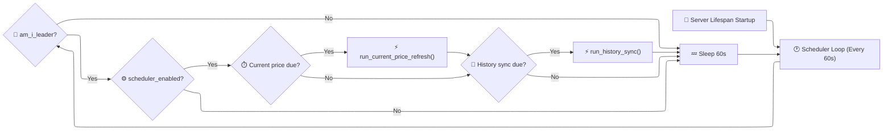

# 🕐 Market Data Scheduler

LibreFolio embeds an automatic background daemon to fetch current prices, historical pricing, and exchange rates without requiring external scheduler systems (like crontab or Celery).

---

## 🏗️ Overview

The scheduler runs as an independent `asyncio.Task` inside the FastAPI lifespan loop. It periodically evaluates whether configured data sync jobs are due.

---

## 🔄 Async Loop Daemon (`scheduler.py`)

The main entry point is `scheduler_loop()` located in `backend/app/services/scheduler/scheduler.py`.

* **Lifespan Task:** It is spawned during FastAPI startup in `backend/app/main.py` using `asyncio.create_task()`.
* **Shutdown Event:** The loop listens to `shutdown_event: asyncio.Event`. When the event is set, it gracefully breaks the loop and completes.
* **Tick:** After an initial 5-second delay, the leader re-reads the scheduler settings on every tick and skips both jobs while `scheduler_enabled` is false; the loop then sleeps 60 seconds in 5-second steps, so a shutdown is noticed quickly.
* **Environment Bypass:** Any non-empty value of `LIBREFOLIO_NO_SCHEDULER` keeps the loop from starting. `./dev.py server --no-scheduler` and the gallery screenshot generation set it to `1`.

---

## 👑 Leader Election (`leader.py`)

To prevent multiple processes from running duplicate sync jobs when uvicorn runs several workers, only one process — the leader — executes the jobs. `am_i_leader()` decides on every tick with `psutil`, without any lock file:

* Among the running, non-zombie children of the uvicorn master, the process with the **lowest PID** is the leader. If it dies, the next tick promotes the new lowest PID.
* Fast paths return `True`: no parent process (e.g. PID 1 in a container), a parent started with `--reload` (one logical worker), a single sibling, or any introspection error — safe because the jobs are idempotent.

---

## 💼 Job Definitions (`jobs.py`)

The scheduler runs two types of background synchronization jobs defined in `backend/app/services/scheduler/jobs.py`:

### ⏱️ 1. Current Price Refresh

* **Purpose:** Keeps the current prices of all active assets that have a price provider up-to-date. This updates the local pricing cache, feeding the frontend's [live prices](../frontend/components/features/live-ticker.md#polling) on the Assets list and the asset detail page.
* **Frequency:** Defined by `scheduler_current_price_frequency_minutes` (default: every 10 minutes).
* **Execution:** Calls `AssetSourceManager.get_current_prices_bulk()` (concurrency 3) on every active asset that has a provider assignment.

### 📅 2. History Sync

* **Purpose:** Synchronizes historical price series (closing prices) for assets and FX rates.
* **Frequency:** Configured for specific days of the week (e.g., `mon,tue,wed,thu,fri,sat`) and times of the day (e.g., `06:00` and `23:00`), as local wall-clock values in `scheduler_timezone` (see [Configuration Integration](#configuration-integration)).
* **Execution:** Calls `AssetSourceManager.bulk_refresh_prices()` for the same assets over `[today − horizon, today]` (`scheduler_history_sync_horizon_days`, default: 14 days), then `sync_pairs_bulk()` for every FX conversion route except those with a `MANUAL` step.

Both jobs classify their run as `ok` (every item succeeded, or there was nothing to process), `partial`, or `error` (no item succeeded).

---

## 📜 Execution Logs (`joblog.py`)

All executions are appended to `logs/scheduler_jobs.jsonl` in the data directory, one JSON object per run:

* **Header fields:** `ts` (ISO timestamp with offset), `job` (`current_price` or `history_sync`), `duration_s`, and `status` (`ok`, `partial` or `error`).
* **`summary`:** `ok`/`err` counts for the current-price refresh; `assets_ok`, `assets_err`, `fx_ok` and `fx_err` for the history sync.
* **Per-item detail:** `items` for the current-price refresh (asset, `ok`, `error`); `assets` and `fx` for the history sync (status, `provider`, `errors`, and `prices_changed`/`events_changed` or `points_changed`).
* **Rotation:** after each append, the file is trimmed to its last 500 entries (`MAX_ENTRIES`).

The last run of each job is also kept in `scheduler_state.json` at the root of the data directory (`state.py`, atomic write-then-rename). The admin UI reads both through admin-only endpoints: `GET /api/v1/settings/scheduler/state` (last runs, `scheduler_timezone`, the server's UTC clock) and `GET /api/v1/settings/scheduler/log?since=ISO` (newest first).

---

## ⚙️ Configuration Integration

Scheduler options are fully integrated into LibreFolio's database-backed Global Settings system. When an administrator modifies settings in the UI:

1. Settings are saved to the `GlobalSetting` table.
2. The frontend triggers a settings reload.
3. The backend scheduler loop loads the settings dynamically on the next loop iteration (every 60 seconds), adapting the polling frequency and execution times instantly without requiring a server restart.

History-sync times and days are stored as local wall-clock values in `scheduler_timezone`. `due_history_sync()` builds each slot in that timezone on the current local date and converts it to a UTC instant only when deciding whether it is due, so the slots follow daylight saving time. A slot is due once its instant has passed and the last history run is older than it. An unknown timezone falls back to UTC; an empty or invalid day list falls back to Monday–Saturday. The backend does not validate these values: the configuration dialog enforces the ranges (1–1440 minutes, 1–365 days, at least one time and one day).

---

## 🔗 Related

* 📡 **[Live Prices](../frontend/components/features/live-ticker.md)** — How the Assets list and the asset detail page poll current prices
* 💰 **[Asset Architecture](assets/architecture.md)** — Pricing provider pipelines and sync steps
* ⚙️ **[Settings System](../architecture/settings.md)** — Dynamic global configuration variables
