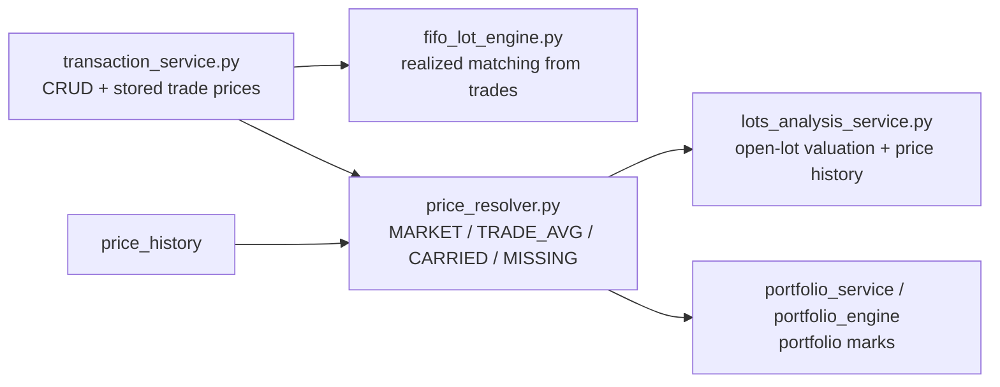

# 🧾 Transaction Service Architecture

`backend/app/services/transaction_service.py` — 1600+ lines — is the **central engine** for all transaction operations in LibreFolio. It handles CRUD, validation, WAC, balance tracking, linked-pair logic, split/promote, and multi-broker batch execution as a single unified pipeline.

---

## 🧰 Responsibilities

| Area | Description |
|------|-------------|
| **CRUD** | Create, read, update, delete transactions via `execute_batch()` |
| **Access Control** | Per-broker EDITOR/OWNER checks before any mutation |
| **Linked Pairs** | Validation and resolution of TRANSFER / FX_CONVERSION pairs |
| **Balance Validation** | Chronological cash+asset balance walk after every mutation |
| **WAC** | Delegated to `portfolio_service.compute_wac_iterative()` inline |
| **Split** | Decompose a composite pair into two independent transactions |
| **Promote** | Merge two independent transactions into a linked composite |
| **Batch Semantics** | Full-session rollback on any error; per-item status reporting |

---

## 🚪 Entry Point — `execute_batch()`

All mutations (REST endpoints `/validate` and `/commit`) funnel through **one method**:

```python
async def execute_batch(
    self,
    creates_raw: List[dict],
    updates_raw: List[dict],
    deletes: List[int],
    splits_raw: List[dict] | None = None,
    promotes_raw: List[dict] | None = None,
    user_id: Optional[int] = None,
    commit: bool = False,
) -> TXBatchResponse:
```

The pipeline runs in strict order:

```text
1. Lenient per-row parse (collect ALL parse errors, never fail-fast)
2. Collect touched broker IDs from all operations
3. Access check: EDITOR on each distinct broker
4. Process deletes
5. Process updates
6. Process creates
7. Process splits
8. Process promotes
9. Link resolution (pair TRANSFER/FX_CONVERSION legs via link_uuid)
10. Balance walk (chronological cash + asset balance validation)
11. Commit or rollback
```

!!! important "Never fail-fast"

    Every step collects errors into `issues: List[TXValidationIssue]` and continues. The final response always contains the **full set of issues** so the frontend can highlight every invalid row at once.

---

## 🔁 Batch Semantics

```text
commit=False  →  validation-only run (dry run, never persists)
commit=True   →  persist if issues is empty, otherwise rollback
```

Response shape (`TXBatchResponse`):

| Field | Description |
|-------|-------------|
| `rolled_back` | `True` if the session was rolled back |
| `results` | Per-operation result items (operation, ids, status) |
| `issues` | All validation errors collected across all rows |

**Multi-broker atomicity**: a batch can span multiple brokers (e.g., a TRANSFER between broker A and broker B). Access is checked once per distinct broker ID. If any broker check fails, the entire batch is rolled back.

---

## 🔐 Access Control

```python
# Single broker check
await svc._check_broker_access_or_raise(broker_id, user_id, min_role=UserRole.EDITOR)

# Batch check (all brokers touched by the batch)
await svc._enforce_batch_access(touched_broker_ids, user_id, min_role=UserRole.EDITOR)
```

Role hierarchy: `OWNER > EDITOR > VIEWER`. Any mutation requires at least `EDITOR`.

---

## 🔗 Linked Pairs

`TRANSFER` and `FX_CONVERSION` are **composite types** — they consist of two legs identified by a shared `link_uuid` (a UUID stored on both `Transaction` rows).

Validation rules enforced in `_validate_linked_pair()`:

- Both legs must share the **same type** (no mixing)
- `TRANSFER` requires **distinct broker IDs** (same-broker transfer is a no-op)
- `FX_CONVERSION` allows same-broker (multi-currency account)
- `CASH_TRANSFER` requires distinct brokers

The legs must also share the same `description` and `tags` (validated by `_validate_pair_description_tags()`).

---

## ✂️ Split Type Map

When splitting a composite pair, the legs are re-typed deterministically:

| Paired type | From-leg → | To-leg → |
|-------------|-----------|---------|
| `CASH_TRANSFER` | `WITHDRAWAL` | `DEPOSIT` |
| `TRANSFER` | `ADJUSTMENT` | `ADJUSTMENT` |
| `FX_CONVERSION` | `WITHDRAWAL` | `DEPOSIT` |

---

## ⚖️ Balance Queries

The service exposes three public query methods used by the broker summary:

```python
await svc.get_cash_balances(broker_id)   # Dict[currency, Decimal]
await svc.get_asset_holdings(broker_id)  # Dict[asset_id, Decimal]
await svc.get_cost_basis(broker_id, asset_id)  # Decimal
```

---

## 🧭 Valuation Boundary

`TransactionService` does **not** build market marks, portfolio NAV, or lot valuation. Its transaction prices are persisted facts; valuation consumers later feed those facts into `build_asset_price_series()` together with `price_history`.

Current flow:



So the transaction layer can affect marks only by storing transaction facts (BUY/SELL amounts, priced ADJUSTMENT cost basis). It never reads current prices and never performs estimated-at-cost valuation.

---

## 🔗 Related

- ⚖️ **[WAC & Cost Basis](wac.md)** — Cost basis computation engine
- ✂️ **[Split & Promote](split_promote.md)** — Composite transaction operations
- 🔒 **[Balance Validation](balance_validation.md)** — Cash/asset balance enforcement
- 📖 **[Access Control (RBAC)](../../architecture/access_control.md)** — Role model
