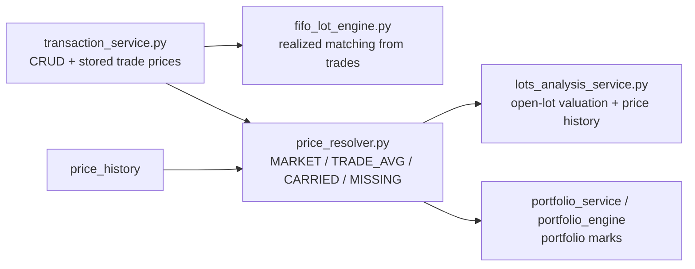

# 🧾 Transaction Service Architecture

Transaction batch execution is split across three source modules:

| File | Responsibility |
|------|----------------|
| `backend/app/services/transaction_service.py` | Public service methods, shared validation helpers, WAC dispatch, and the `execute_batch()` orchestrator |
| `backend/app/services/transaction_batch_context.py` | `TransactionBatchContext` and the balance-replay exception shared across stages |
| `backend/app/services/transaction_batch_stages.py` | Ordered parse, preload/access, mutation, linking, WAC, cost-basis, balance, and response stages |

The former 637-line `execute_batch()` C901 hotspot has been decomposed. The public
orchestrator is now approximately 50 source lines and makes the execution order
explicit.

---

## 🧰 Responsibilities

| Area | Current owner |
|------|---------------|
| **CRUD and pair helpers** | `TransactionService` |
| **Batch inputs and cross-stage state** | `TransactionBatchContext` |
| **Access scope and ordered mutations** | `transaction_batch_stages.py` |
| **Linked-pair persistence** | Stage code writes reciprocal `related_transaction_id` values |
| **WAC** | `_compute_wac_for_auto_items()` delegates to `compute_wac_iterative()` |
| **Balance validation** | The final mutation stage flushes, then replays each affected broker from its earliest affected date |
| **Transaction completion** | The API caller commits or rolls back; the service does neither |

---

## 🚪 Entry Point — `execute_batch()`

The `/transactions/validate` and `/transactions/commit` routes call the same method:

```python
async def execute_batch(
    self,
    creates_raw: List[dict],
    updates_raw: List[dict],
    deletes: List[int],
    splits_raw: List[dict] | None = None,
    promotes_raw: List[dict] | None = None,
    user_id: Optional[int] = None,
    commit: bool = False,
) -> TXBatchResponse:
```

Its order is contractual:

| # | Stage call | Purpose |
|---|------------|---------|
| 1 | `parse_inputs()` | Parse create, update, split, and promote rows independently |
| 2 | `preload_and_authorize()` | Load referenced rows, collect touched brokers, and require `EDITOR` access |
| 3 | `apply_deletes()` | Stage valid deletions |
| 4 | `apply_splits()` | Split linked pairs before any dependent update |
| 5 | `apply_updates()` | Apply and validate merged update state |
| 6 | `validate_updated_pairs()` | Re-check shared description/tags on updated linked pairs |
| 7 | `apply_creates()` | Add and flush valid creates so generated IDs are available |
| 8 | `apply_promotes()` | Resolve saved or same-batch rows and promote them in place |
| 9 | `resolve_create_links()` | Resolve unconsumed create correlation groups into reciprocal database links |
| 10 | `compute_wac_and_fx_issues()` | Run create/update auto-WAC and convert missing FX data into issues |
| 11 | `validate_cost_basis()` | Flush and enforce required cost basis after WAC and promote handling |
| 12 | `validate_balances()` | Flush and replay end-of-day balances from each broker's earliest affected date |
| 13 | `finalize_response()` | Derive `committed`, result statuses, counts, and WAC output |

### 🧳 Shared batch context

`TransactionBatchContext.from_inputs()` normalizes optional split/promote lists and
stores all state that must survive across stages. This includes:

- parsed rows with their original per-operation indices;
- `issues` and per-operation `results`;
- preloaded transactions and the touched-broker set;
- the earliest affected date per broker;
- transient create-correlation groups and the groups consumed by promote;
- optional inline `wac_results`; and
- `commit_requested`, which affects only final response semantics.

Keeping this state explicit lets each stage remain independently readable without
changing the single-session behavior of the old implementation.

### 🧯 Error collection boundaries

Raw create, update, split, and promote rows are parsed leniently, and the mutation
loops append row-level failures while continuing with other rows. This is not a
promise that every possible error is collected:

- any `accessDenied` issue causes an early response before mutation stages run;
- inline WAC is skipped when a non-balance issue already exists; and
- balance replay catches the first balance exception and does not continue through
  the remaining broker/date replays.

---

## 🔁 Session and Response Semantics

`execute_batch()` mutates and flushes the `AsyncSession` supplied to
`TransactionService`. It never calls `commit()`, `rollback()`, `begin()`, creates a
savepoint, or opens a replacement session. The `commit` argument only selects the
response that `finalize_response()` builds.

| Caller | Service response | Caller action |
|--------|------------------|---------------|
| `/transactions/validate` (`commit=False`) | `committed=False`, whether clean or not | Always `session.rollback()` |
| `/transactions/commit` (`commit=True`), no issues | `committed=True` | `session.commit()` |
| `/transactions/commit` (`commit=True`), any issue | `committed=False`; successfully staged results become `simulated` | `session.rollback()` |

`TXBatchResponse` has no `rolled_back` field. Its transaction-specific contract is:

| Field | Meaning |
|-------|---------|
| `committed` | Whether the commit route is allowed to commit this batch |
| `issues` | Structured `TXValidationIssue` entries |
| `results` | Per-operation `operation`, original `index`, affected `ids`, optional create `link_uuid`, and `status` |
| `success_count` | Number of operations staged successfully; this is not proof that their rows persisted |
| `wac_results` | Optional WAC output for create/update rows using `auto` or `auto-detail` |

The response also inherits `errors` from `BaseBulkResponse`; transaction validation
failures are reported through `issues`. On a dry run, a successfully staged result
keeps status `success` even though the route rolls back. On a failed commit request,
those same staged results are marked `simulated`.

**Multi-broker atomicity at the route boundary** means a batch may span brokers, but
the commit route persists none of it when `committed=False`.

---

## 🔐 Access Control

`preload_and_authorize()` derives the access scope from parsed creates and from
database rows referenced by updates, deletes, splits, and saved promote references.
It calls `_check_broker_access(..., min_role=UserRole.EDITOR)` once per distinct
touched broker. A denied broker adds an `accessDenied` issue and returns before any
delete, split, update, create, or promote is applied.

Role hierarchy is `OWNER > EDITOR > VIEWER`; mutation requires at least `EDITOR`.

---

## 🔗 Linked Pairs

`TRANSFER`, `FX_CONVERSION`, and `CASH_TRANSFER` are two-row composite
transactions. A create request uses `link_uuid` only as transient correlation:

1. `apply_creates()` records each flushed row in `context.link_uuid_map`;
2. `resolve_create_links()` validates each unconsumed two-row group; and
3. the stage writes reciprocal `related_transaction_id` values.

`Transaction` has no persisted `link_uuid` column. The durable relationship is
`A.related_transaction_id = B.id` and `B.related_transaction_id = A.id`.

`_validate_linked_pair()` requires equal pair types, distinct brokers for
`TRANSFER` and `CASH_TRANSFER`, and allows an intra-broker `FX_CONVERSION`. Pair
description and tags are checked separately by
`_validate_pair_description_tags()`.

---

## ✂️ Split Type Map

The split stage re-types the negative/source and positive/destination legs
deterministically:

| Paired type | From leg | To leg |
|-------------|----------|--------|
| `CASH_TRANSFER` | `WITHDRAWAL` | `DEPOSIT` |
| `TRANSFER` | `ADJUSTMENT` | `ADJUSTMENT` |
| `FX_CONVERSION` | `WITHDRAWAL` | `DEPOSIT` |

See [Split & Promote](split_promote.md) for the in-place mutation rules and the
separate legacy promote endpoint.

---

## ⚖️ Balance Queries

The service exposes three public query methods used by the broker summary:

```python
await svc.get_cash_balances(broker_id)   # Dict[currency, Decimal]
await svc.get_asset_holdings(broker_id)  # Dict[asset_id, Decimal]
await svc.get_cost_basis(broker_id, asset_id)  # Decimal
```

---

## 🧭 Valuation Boundary

`TransactionService` does **not** build market marks, portfolio NAV, or lot valuation. Its transaction prices are persisted facts; valuation consumers later feed those facts into `build_asset_price_series()` together with `price_history`.

Current flow:



So the transaction layer can affect marks only by storing transaction facts (BUY/SELL amounts, priced ADJUSTMENT cost basis). It never reads current prices and never performs estimated-at-cost valuation.

---

## 🔗 Related

- ⚖️ **[WAC & Cost Basis](wac.md)** — Cost basis computation engine
- ✂️ **[Split & Promote](split_promote.md)** — Composite transaction operations
- 🔒 **[Balance Validation](balance_validation.md)** — Cash/asset balance enforcement
- 📖 **[Access Control (RBAC)](../../architecture/access_control.md)** — Role model
