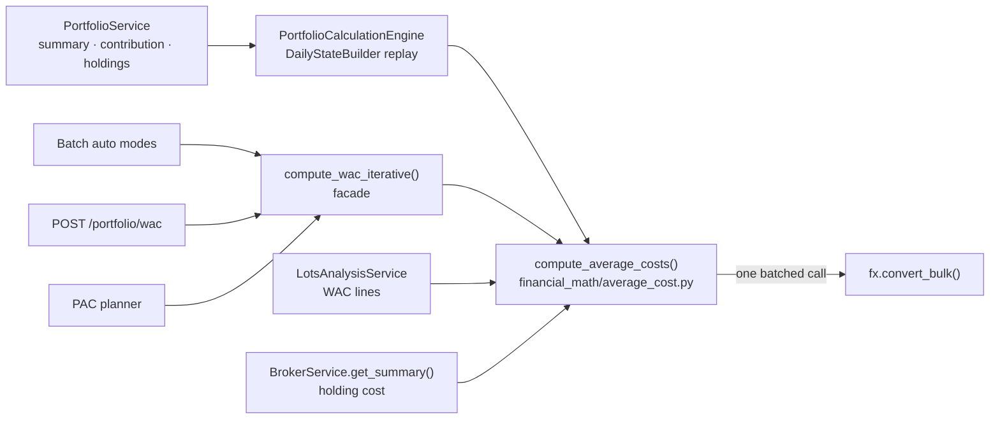

# ⚖️ WAC & Cost Basis

**WAC (Weighted Average Cost)** — also called *PMC* (*Prezzo Medio di
Carico*) — is LibreFolio's blended, per-unit cost-basis method. It has **one
implementation**: `compute_average_costs()` in
`backend/app/services/financial_math/average_cost.py`. The Dashboard's purchase
cost, realized sales and unrealized P&L, the Holdings table's average cost and
Yield on Cost, the WAC lines of the lots analysis, the broker summary, the
transaction preview, the automatic cost basis, `POST /portfolio/wac` and the PAC
planner all read it.

The cost it returns is **historical**: each acquisition costs what was actually
paid, converted into the requested currency at the rate of its own date. It never
moves with today's exchange rate.



!!! info "What it replaced"

    `backend/app/utils/financial/wac_utils.py` (`compute_wac_from_txlist()`), the
    portfolio engine's own WAC pools (`_buy_unit_cost()`, `_apply_split_rescale()`,
    `_compute_open_cost_basis_inline()`) and `TransactionService.get_cost_basis()`
    no longer exist. The engine used to keep each pool in the asset currency and
    convert it at the valuation date, the lots analysis fell back to the unconverted
    cost when a rate was missing, and the broker summary summed BUY amounts. They now
    share the rules below.

---

## 🧱 The Financial Math Layer {: #financial-math-layer }

`backend/app/services/financial_math/` is the home of LibreFolio's financial
calculations. Its package docstring (`__init__.py`) sets the rule:

- **A calculation owns its whole problem.** It takes the plain data of the problem
  — movements, currencies, dates — and calls the services it needs to complete it,
  such as the FX service for conversions, instead of receiving values its caller
  prepared.
- **Callers depend on the layer, not the reverse.** Engines, services and API
  handlers call it; it does not depend on them.
- **New financial calculations are born here.** The existing pure helpers in
  `backend/app/utils/financial/` (`roi_utils.py`, `valuation_utils.py`) will move
  into this layer in a later refactor, not as part of the work that created it.

| Module | Calculation |
|--------|-------------|
| `average_cost.py` | Average cost of positions: historical cost in the report and asset currencies, the pool after every movement, and the conversions that could not be made |

The layer's tests are pure — no database, no server, every test replaces
`convert_bulk` with a double — and live in
`backend/test_scripts/test_services/test_financial_math/`:

```bash
./dev.py test services financial-math
```

---

## 🧮 The Average-Cost Function {: #compute-average-costs }

```python
async def compute_average_costs(
    session: Any,
    positions: Sequence[CostPosition],
    *,
    report_currency: str,
    asset_leg: bool = True,
) -> dict[Hashable, AverageCost]:
```

Below, **T** is `report_currency` and **A** is a position's asset currency.

### 📥 Input: plain data

| Type | Fields | Meaning |
|------|--------|---------|
| `CostPosition` | `key`, `asset_currency`, `movements` | One position. `key` is any hashable the caller chooses — `(asset_id, broker_id)`, a broker id, a string; a duplicate key raises `ValueError` |
| `CostMovement` | `movement_id`, `transaction_type`, `date`, `kind`, `quantity`, `cost_amount`, `cost_currency` | One movement of the position's quantity, in the order the caller recorded them |

`CostMovementKind` says what a movement does to the pool:

| Kind | Quantity | Cost |
|------|----------|------|
| `ACQUISITION` | `> 0` | `cost_amount` is the **total actually paid**, in `cost_currency`; `None` means the cost is not known, `0` a free acquisition |
| `REDUCTION` | `< 0` | None: the pool decides what leaves |
| `SPLIT` | `> 0` or `< 0` | None: a split moves quantity, never cost |

`CostMovement` rejects a zero quantity, an acquisition that removes quantity, a
reduction that adds it, a cost on anything but an acquisition, and a cost without
its currency.

### 💱 Conversions

The function converts each acquisition itself, at the acquisition's own date `d`:

| Leg | Rate needed when | Cost of the acquisition |
|-----|------------------|-------------------------|
| Report (T) | paid currency ≠ T | `c_T = paid × r(paid→T, d)`. An amount already in T is taken as it is, so a purchase paid in the report currency never needs a rate |
| Asset (A), only with `asset_leg=True` | A ≠ T and paid currency ≠ A | `c_A = c_T × r(T→A, d)`, the same day's rate. Paid in A: `c_A` is the amount paid. A = T: `c_A = c_T` |

Since `c_A` and `c_T` describe the same purchase at the same day's rate, a
position's exchange-rate effect is zero on the day it is bought.

All the conversions of all the positions go to the FX service in **one**
`convert_bulk(..., raise_on_error=False)` call, each requested once. When every
amount is already in the currency it is needed in, no call is made and `session`
is not used. `convert_bulk` backfills without limit (the latest rate on or before
the date), so a conversion is missing only when the pair has no rate at all on or
before that date, or no route.

!!! warning "A missing rate never becomes a zero"

    The acquisition's quantity still enters the pool, its cost does not: the pool is
    marked incomplete and the pair is reported as a `MissingConversion` with every
    date it was needed on. A report-leg gap is named `FROM/TO` (`GBP/EUR` for a
    purchase paid in pounds, T = EUR) with `leg="report"`; an asset-leg gap is named
    `A/T` (`USD/EUR`) with `leg="asset"`, whichever direction the rate was requested
    in.

### 🔁 Pool rules

The fold keeps, for each position, the quantity `Q` and the total cost `C` on each
leg:

| Movement | Effect on the pool | `CostEffect` |
|----------|--------------------|--------------|
| Same-day ordering | Movements that add quantity first, then those that remove it; within each group the caller's order is kept | — |
| Acquisition with a known cost | `Q += q`, `C += c` | `ADD` |
| Acquisition at zero cost | `Q += q`, `C` unchanged, completeness unchanged | `ADD_ZERO_COST` |
| Acquisition of unknown cost | `Q += q`, `C` unchanged, pool incomplete on both legs; the id is listed in `unknown_cost_movement_ids` | `ADD_UNKNOWN_COST` |
| Acquisition whose rate is missing | `Q += q`, `C` unchanged, pool incomplete on the report leg (and on the asset leg, unless paid in A); pair and date reported | `ADD_MISSING_FX` |
| Reduction | Removes `C × q / Q` on both legs — the **whole** `C` when it empties the pool, so cost is conserved exactly. Quantity beyond the pool is clamped and the id is listed in `oversold_movement_ids` | `REDUCE` |
| Split | `Q` changes, `C` is kept | `SPLIT_RESCALE` |
| Pool emptied | `C = 0` and the pool is complete again: a gap before a full closure does not follow later purchases | — |

### 📤 Output

`compute_average_costs()` returns one `AverageCost` per key:

| Field | Meaning |
|-------|---------|
| `steps` | One `CostStep` per movement: the pool after it, in pool order |
| `missing` | `MissingConversion(pair, dates, leg)` for every conversion that could not be made |
| `unknown_cost_movement_ids` | Acquisitions with no known cost |
| `oversold_movement_ids` | Reductions larger than the pool (no caller surfaces them yet) |
| `quantity`, `cost_report`, `cost_asset`, `report_complete`, `asset_complete`, `unit_cost_report`, `unit_cost_asset`, `has_missing_report_fx` | Properties that read the last step |
| `state_at(day)` | The pool after the last movement dated on or before `day`; `None` before the first one |
| `step_for(movement_id)` | The step of one movement |

| `CostStep` field | Meaning |
|------------------|---------|
| `movement`, `effect` | The movement and what it did to the pool |
| `quantity`, `cost_report`, `cost_asset` | The pool after the movement; `cost_asset` is `None` without the asset leg |
| `cost_report_change`, `cost_asset_change` | Cost added (positive) or removed (negative) by this movement |
| `report_complete`, `asset_complete` | `False` while part of the pool's cost is unknown on that leg |
| `conversion` | `CostConversion` of a converted acquisition: original amount and currency, converted amount, `rate` (converted / original), `rate_date`, `days_back` |
| `unit_cost_report`, `unit_cost_asset`, `cost_report_for(q)`, `cost_asset_for(q)` | Per-unit cost, and the cost of `q` units of the pool |

!!! note "Known part vs. complete cost"

    While a pool is incomplete, `cost_report` holds only its known part: the unknown
    part counts at zero. Aggregates use it as it is — the portfolio's open cost basis
    includes it — while per-position figures (a WAC, an unrealized P&L, a point of a
    lots-analysis WAC line) are withheld rather than shown as a partial average.

### 🔌 Adapters

`cost_movement_from_transaction(tx, *, asset_currency, split_linked, share=1)` maps
a `Transaction` to its movement:

| Transaction | Movement |
|-------------|----------|
| Quantity `None` or `0` (also once scaled by `share`) | `None`: not a movement |
| Split-linked (`ADJUSTMENT` linked to a `SPLIT` `AssetEvent`) | `SPLIT`, whatever its sign |
| Quantity `< 0`, any type | `REDUCTION` |
| `BUY` | `ACQUISITION` costing `abs(amount) × share` in its cash currency `tx.currency` (the asset currency when unset); no amount means a free acquisition |
| Any other type adding quantity (`TRANSFER`, `ADJUSTMENT`) with `cost_basis_override` | `ACQUISITION` costing `cost_basis_override × quantity` in `cost_basis_currency` (the asset currency when unset) |
| The same without `cost_basis_override` | `ACQUISITION` of unknown cost |

`share` — the owner's share of the broker — scales quantity and cost alike.

`determine_target_currency(movements, asset_currency)` returns the currency of the
most recent movement that adds quantity; on a date tie the first one in input
order wins. A split, an acquisition of unknown cost, or no addition at all falls
back to the asset currency.

---

## 🔌 Callers {: #callers }

| Caller | Positions | `report_currency` | `asset_leg` |
|--------|-----------|-------------------|-------------|
| `PortfolioCalculationEngine.calculate()` (`portfolio_engine.py`) | `build_cost_positions()`: one per `(asset_id, broker_id)` | The report's target currency | `True` |
| `compute_wac_iterative()` (`portfolio_service.py`) | The one `(broker, asset)` asked for | The override, or `determine_target_currency()` | `False` |
| `LotsAnalysisService` (`lots_analysis_service.py`) | One per broker, plus `"__all__"` pooling every broker in scope | The analysis `target_currency` | `False` |
| `BrokerService.get_summary()` (`broker_service.py`) | One per asset held at the broker | The asset's own currency, one call per currency | `False` |

### ⚙️ Portfolio engine

1. `build_cost_positions(classified_txs, asset_currencies, target_currency, split_linked_tx_ids, date_to)`
   turns the classified transactions into one `CostPosition` per
   `(asset_id, broker_id)`: quantity and cost scaled by the owner's share, in
   classification order (date, then id) — the order the replay visits them —
   and without the transactions after `date_to`.
2. `PortfolioCalculationEngine.calculate()` makes **one** `compute_average_costs()`
   call for the whole scope before the daily replay and hands the result to
   `DailyStateBuilder(average_costs=...)`.
3. `DailyStateBuilder` replays each position's steps through `_next_cost_step()`.
   The step must belong to the transaction being replayed (same movement id and
   date): a mismatch is a bug, never data, and raises `RuntimeError`. No cost is
   converted in the daily loop, and `_preload_fx_rates()` no longer asks for
   acquisition-date rates.

What the replay takes from the steps:

| Output | Source |
|--------|--------|
| `DailyPortfolioState.open_cost_basis` | Σ `cost_report_for(qty)` over the held positions: historical cost in the target currency (its known part) |
| `DailyPositionState` | `wac` per unit in the target currency (`None` while the cost is incomplete), `wac_currency` (the target currency), `cost_basis`, `unrealized_pnl` (`None` without a market value or with an incomplete cost), `asset_currency`, `wac_asset`, `cost_complete` |
| `PortfolioCalculationResult.realized_sales` | One `RealizedSale` per SELL: `proceeds` converted at the sale date and scaled by the share (`None` when they cannot be converted), `cost` = the historical cost the step removed, `cost_complete` = completeness of the pool before the sale |
| Capital baseline of priced in-kind `ADJUSTMENT`s | In: the cost the step added (`ADD` steps only). Out: the cost the step removed |
| `DailyPortfolioState.unrealized_by_currency` | `UnrealizedSplit(asset, fx, unsplit)` per asset currency, see below |
| `EngineEndState.wac_pool_qty` / `wac_pool_cost` | Quantity and historical cost of the last replayed step |
| `PortfolioCalculationResult.average_costs` | The whole `AverageCost` map, for the services that read it |

In-transit assets with a frozen cost (`cost_basis_amount`) are converted at the
**arrival date**, as the destination pool books them, instead of every day of the
transit.

#### 💱 Unrealized split by currency {: #unrealized-split }

For the positions in assets priced in currency A, reported in T, with `r(t)` the
A→T rate of the day and `C_A`, `C_T` their historical cost in A and in T, every
daily state holds in `unrealized_by_currency[A]` the sum over those positions of:

| Part | Formula | Meaning |
|------|---------|---------|
| `asset` | `MV − C_A × r(t)` | What the assets did in their own currency, at the day's rate |
| `fx` | `C_A × r(t) − C_T` | What the exchange rate did to their cost |
| `unsplit` | `MV − C_T` | Positions that cannot be split that day: no market value, no rate, or a cost incomplete on either leg |

For A = T the whole `MV − C_T` goes to `asset`: `fx` is always zero. Summed over
the currencies, the parts equal `market_value − open_cost_basis` exactly.

`PortfolioService` turns two of these states into
`PortfolioSummary.period_unrealized_breakdown` (`_unrealized_breakdown_rows()`):
`UnrealizedBreakdownRow(kind, asset_currency, period_delta)` holds the change
between the last state on or before `date_from` (zero without one) and the state
at the end date — the same two states as `period_unrealized_gain_loss_delta`, so
the rows add up to it exactly. Order: an `asset` row for every currency (the report
currency first, then alphabetical), an `fx` row for every other currency, then an
`unsplit` row only for a currency whose unsplit part is non-zero at either
boundary. The list is empty when there is no unrealized delta.

#### 🩺 Movement-level FX channel

`PortfolioCalculationResult.missing_fx` (`{"FROM/TO": {dates}}`) collects every
conversion a movement needed and could not get, at the date the movement happened:
the average costs' `missing` (both legs), cash amounts, external cash flows and
the in-transit asset cost. Valuation failures stay per day in
`DailyPortfolioState.missing_fx_pairs`. The
[Data Quality Banner](../../frontend/data-quality-banner.md#where-missing-fx-pairs-come-from)
page explains how both reach the Dashboard.

### 📊 PortfolioService

- **Realized of the period.** `_period_realized_sales()` keeps the engine's
  `realized_sales` dated in `(date_from, date_to]` whose proceeds and cost are both
  known; realized = Σ (proceeds − cost). A sale left out is reported instead (its
  pair, or the cost basis its pool lacks). There is no per-sale WAC query.
- **Period-boundary cost** (positions contribution). `_boundary_cost()` reads
  `state_at(day).cost_report_for(qty)` and returns `None` while the pool is
  incomplete that day, so no partial cost enters an unrealized figure.
- **Holdings.** `wac_per_unit` is the historical WAC already in the report currency
  (`None` while incomplete). It is also the Yield on Cost denominator, which
  therefore needs no conversion at the end date.
- **Data quality.** `_engine_missing_fx_pairs()` and `_missing_cost_basis_assets()`
  feed `build_data_quality_report()`: missing pairs and `MISSING_COST_BASIS`.

### 🔬 Lots analysis

`LotsAnalysisService` draws its broker and cumulative WAC lines from one
`compute_average_costs()` call and reports their gaps (missing rates, unknown costs); see
[Lots Analysis Service — WAC lines](lots_analysis_service.md#wac-lines).

### 🏦 Broker summary {: #broker-summary }

`GET /brokers/{broker_id}/summary` (`BrokerService.get_summary()`):

- `_holding_average_costs()` loads the broker's quantity-moving transactions of
  the held assets, ordered by date then id, detects the split-linked adjustments,
  and calls `compute_average_costs()` once per asset currency, with that currency
  as report currency.
- `BRAssetHolding.total_cost` is the historical cost of the quantity held, **in the
  asset currency**: each purchase converted at its own date, sales removing their
  share of the average. It is `None` when part of it is unknown (a missing rate, or
  a transfer without cost basis); `average_cost_per_unit` and the unrealized P&L
  are then `None` too.
- `BRSummary.missing_fx_pairs` lists the pairs the holdings' cost needed, with the
  purchase dates.

---

## 🩺 Diagnostics {: #diagnostics }

What each caller does when part of a cost is missing:

| Gap | Engine and Dashboard | Facade | Lots analysis | Broker summary |
|-----|----------------------|--------|---------------|----------------|
| No rate on or before a purchase date | The position's `wac` and `unrealized_pnl` are `None`, the open cost basis keeps the known part; the pair and dates reach `summary.missing_fx_pairs` and a `MISSING_FX_MARKET` / `MISSING_FX_RATES` issue | `wac=None` and `wac_missing_pairs`; in a batch, a `wacFxUnavailable` issue | No point on the days the pool is incomplete; the pair reaches `data_quality`, status `DEGRADED` | `total_cost=None`; the pair is in `missing_fx_pairs` |
| `TRANSFER` / `ADJUSTMENT` adding quantity without `cost_basis_override` | `MISSING_COST_BASIS` warning; the position's `wac` and `unrealized_pnl` are `None`; the units count at zero in the open cost basis | Counted at zero: an `add_zero_cost` row dilutes the WAC | No point while the pool is incomplete; `MISSING_COST_BASIS` for the analysed asset, status `DEGRADED` | `total_cost=None` |

A reduction larger than the pool is clamped everywhere: the pool empties and the
movement id is listed in `oversold_movement_ids`.

---

## 🧾 The WAC Facade {: #wac-facade }

`compute_wac_iterative()` in `backend/app/services/portfolio_service.py` serves
the callers that need one position's WAC with its qualifying rows. Its contract did
not change with the single implementation.

```python
async def compute_wac_iterative(
    session: AsyncSession,
    broker_id: int,
    asset_id: int,
    as_of_date: date,
    asset_currency: str,
    excluded_tx_ids: list[int] | None = None,
    target_currency_override: str | None = None,
    use_cache: bool = True,
) -> WACPreviewResultItem:
```

The facade:

1. queries the non-zero-quantity transactions of the broker and asset through
   `as_of_date`;
2. identifies the `ADJUSTMENT` rows linked to a `SPLIT` `AssetEvent`;
3. fingerprints the rows (id and `updated_at`) and the split linkage for the WAC
   cache, keyed together with the broker, asset, date, asset currency, override and
   excluded ids; `use_cache=False` bypasses the cache;
4. drops the excluded ids and sorts the rest by `(date, id)`; with no rows left it
   returns a zero WAC in the asset currency;
5. maps the rows with `cost_movement_from_transaction()`;
6. chooses the target currency: `target_currency_override`, or
   `determine_target_currency()` — the currency of the last acquisition;
7. calls `compute_average_costs()` for that one position, with
   `asset_leg=False`;
8. returns `wac=None`, no qualifying rows and the missing pairs with their dates
   when a report-leg conversion is missing — that result is not cached;
9. otherwise returns the WAC (`unit_cost_report`, in the target currency) and one
   `WACQualifyingTX` per step, and caches the result.

Each step becomes a qualifying row:

| `CostEffect` | `WACQualifyingTX.effect` | `unit_cost` |
|--------------|--------------------------|-------------|
| `ADD` | `add` | Cost added ÷ quantity, in the target currency |
| `ADD_ZERO_COST` | `add_zero_cost` | `0` |
| `ADD_UNKNOWN_COST` | `add_zero_cost` | `0`: the preview counts an unknown cost at zero |
| `REDUCE` | `reduce` | The running WAC before the reduction |
| `SPLIT_RESCALE` | `split_rescale` | The running WAC after the split |

`running_wac` is the WAC after the step. A converted acquisition also carries its
provenance: `fx_info` (rate date and days back), `original_unit_cost`,
`original_currency` and `fx_rate_used`.

| Caller | `as_of_date` | Target currency |
|--------|--------------|-----------------|
| Batch auto modes (`TransactionService._compute_wac_for_auto_items()`) | The row's date; the partner's date for the receiving side of a `TRANSFER` | The `cost_basis_override.code` sent as a hint, or the last acquisition's currency |
| `POST /portfolio/wac` (`portfolio_api.py`) | The query's end date, or today | The last acquisition's currency |
| PAC planner (`portfolio_allocation_source.py`) | The planner's date | The planner's target currency, as override, with `use_cache=False` |

!!! note "Two target-currency rules"

    The documented decision *WAC target currency = last acquisition's currency*
    (devWiki: `decisions/wac-target-currency-last-acquisition`) still holds for the
    transaction preview, the automatic cost basis and `POST /portfolio/wac`. The
    Dashboard and everything the portfolio engine produces use the report currency.

---

## 🧾 Persisted Cost Basis

`transactions.cost_basis_override` is a **per-unit** amount, not a total
acquisition cost. Its currency is stored in `cost_basis_currency`; the two values
are written and cleared together by the transaction flows.

| Field | Meaning |
|-------|---------|
| `cost_basis_override` | Frozen WAC for one unit |
| `cost_basis_currency` | ISO currency code for that per-unit amount |

A `BUY` costs the absolute cash amount, in its cash currency. A `TRANSFER` or
`ADJUSTMENT` adding quantity costs `cost_basis_override × quantity`, in
`cost_basis_currency`, converted at its own date like any other acquisition. A
`BUY` without amount is a free acquisition; a `TRANSFER` or `ADJUSTMENT` without
override has an unknown cost (see [Diagnostics](#diagnostics)). The batch rejects
such a row without an override (`costBasisRequired`) whether it is created,
updated, or made the receiving side of a promoted pair (see
[Promote boundary](#promote-boundary)); a row in Auto is given the computed WAC
instead. An acquisition of unknown cost therefore comes from:

- data the batch never checked: written outside it, or promoted by an earlier
  version, which did not check promoted pairs; or
- an `ADJUSTMENT` linked to a `SPLIT` event that is later retyped. Auto stores no
  cost on a split-linked row (see
  [Split-linked adjustment skip](#split-linked-adjustment-skip)), so once the
  event is no longer a `SPLIT` its units have an unknown cost
  (`test_forward_split_relabelled_as_price_adjustment_becomes_an_unknown_cost_acquisition`
  in `backend/test_scripts/test_api/test_portfolio_wac.py`).

---

## 🔄 Inline Batch Auto Modes

`cost_basis_mode` is a request-only instruction on `TXCreateItem` and
`TXUpdateItem`; it is not a database column.

| Mode | Batch behavior |
|------|----------------|
| `auto` | Compute and persist the per-unit WAC; return a compact WAC result |
| `auto-detail` | Compute the same value and also return qualifying transactions and price detail |
| `manual` | Use the submitted `cost_basis_override`; do not add the row to the auto-WAC worklist |

The ordered batch flow is:

```text
create → promote → link resolution → compute_wac_and_fx_issues()
       → validate required cost basis → balance replay
```

`compute_wac_and_fx_issues()` calls
`TransactionService._compute_wac_for_auto_items()` only when no non-balance issue
already exists. That helper scans only `parsed_creates` and `parsed_updates` for
`auto` or `auto-detail`.

For each selected row:

- `_auto_cost_source()` chooses the pool to average. The receiving side of a
  `TRANSFER` — a `TRANSFER` row with `related_transaction_id` — averages its
  partner's broker as of the partner's date, when the units left, leaving out the
  partner's outgoing leg and the row itself;
- any other row — an incoming `ADJUSTMENT` — averages its own broker as of its
  own date, leaving itself out;
- a supplied `cost_basis_override.code` acts as the target-currency hint; and
- a calculated `wac` is written to `cost_basis_override` and
  `cost_basis_currency` on the staged ORM row.

`related_transaction_id` is in place before the WAC step whatever the origin of
the pair: `resolve_create_links()` sets it for a pair created in the same batch,
`apply_promotes()` for a pair formed by a promote, and a saved pair being updated
brings it from the database (`TXUpdateItem` has no `link_uuid`). Since
`cost_basis_mode` is accepted only on a `TRANSFER` or `ADJUSTMENT` adding quantity
(`costBasisModeIncompatible` otherwise), a `TRANSFER` in Auto is always the
receiving side.

Reading the source pool as it was when the units left keeps their cost: a
transfer of the whole position keeps the source's average, where counting the
outgoing leg would empty the pool and give 0; a partial transfer gets the same
value with or without that leg, since a reduction does not move the unit cost;
and purchases made on the source broker while the units are in transit stay out.

The create stage has already flushed new rows for generated IDs, and all of this
work remains in the caller's session. Neither the WAC helper nor the surrounding
batch stages commit.

### 🧬 Split-linked adjustment skip {: #split-linked-adjustment-skip }

If the selected row references an `AssetEvent` of type `SPLIT`, auto mode clears
both stored cost-basis fields and emits a batch WAC result with `wac=None` and no
missing pairs. The average cost rescales the live pool when it meets the
split-linked adjustment; storing the pre-split WAC would double-count the economic
cost.

### 💱 Missing FX behavior

If `compute_wac_iterative()` returns no WAC and reports missing FX pairs, the
batch stage appends a `TXValidationIssue` with:

- code `wacFxUnavailable`;
- the originating create/update operation and index;
- field `cost_basis_override`; and
- pair names plus required dates in `params`.

The response may still include `wac_results`, but the issue makes
`committed=False`; the route that owns the session then rolls back.

### 🔗 Promote boundary {: #promote-boundary }

`TXPromoteBatchItem` has no `cost_basis_mode`, and `apply_promotes()` no longer
performs an automatic WAC calculation. A promote-specific resolved value arrives
as `resolved_fields.cost_basis_override` from the frontend merge flow (or another
API client). The promote stage applies it to the positive-quantity transfer leg
and clears it from the sender; without that key, the receiver keeps the cost basis
it already has.

Rows that are also present in `creates[]` or `updates[]` enter auto-WAC only
because that create/update item requested an auto mode, never because of the
promote item itself.

`validate_cost_basis()` checks the receiving side of a promoted pair like any
other row:

- a new row is checked as a create, unless it is in Auto: `costBasisRequired` on
  operation `create`, with its index;
- a saved row also present in `updates[]` is checked as that update, unless it is
  in Auto; and
- any other saved row without a cost basis gets `costBasisRequired` on operation
  `promote`, with the promote's index and `ref_id` set to that row
  (`_check_promoted_saved_cost_basis()`).

---

## 🔍 Preview and Response Data

Committed WAC analytics are exposed through:

```text
POST /portfolio/wac
```

Inline batch results use the same `WACPreviewResultItem` schema and additionally
populate `operation`, `index`, and `source_broker_id`. The main fields are:

```python
class WACPreviewResultItem:
    wac: Currency | None
    wac_qualifying_txs: list[WACQualifyingTX]
    wac_missing_pairs: list[WACMissingPairInfo]
    asset_price: Currency | None
    asset_price_stale: BackwardFillInfo | None
    asset_price_missing: bool
    operation: Literal["create", "update"] | None
    index: int | None
    source_broker_id: int | None
```

---

## 🔗 Related

- 🏗️ **[Transaction Service](service.md)** — Ordered batch stages and caller-owned transaction boundary
- ✂️ **[Split & Promote](split_promote.md)** — Promote's resolved cost-basis contract
- 📊 **[Lots Analysis Service](lots_analysis_service.md)** — WAC lines and their gaps
- 🛡️ **[Data Quality Banner](../../frontend/data-quality-banner.md)** — How missing pairs and missing cost bases reach the Dashboard
- 📖 **[Weighted Average Cost Theory](../../../financial-theory/technical-analysis/performance-metrics/weighted-average-cost.md)** — Financial methodology
- 🧠 **[FIFO Lot Engine](fifo_lot_engine.md)** — Per-lot alternative to a blended average
