# 🚀 Release & CI/CD Pipeline

This page describes the design, execution flow and automation logic of the LibreFolio release pipeline: the GitHub Actions workflow `.github/workflows/release.yml`, a single job (`release-pipeline`) that:

- builds the SvelteKit frontend;
- checks and builds the documentation, including the gallery screenshots that Playwright captures in a real browser;
- builds the two Docker image variants, light first and then full, and pushes them to the GitHub Container Registry (GHCR);
- deploys the documentation site to GitHub Pages, on a stable release or a manual run from `main`;
- appends the Docker pull commands to the release notes, on releases.

The workflow runs no test suite: apart from the builds themselves, its gates are the [release tag guard](#prereleases), the documentation checks and the gallery. The tests have their own manual workflow, `.github/workflows/manual-test-run.yml`. The job's permissions are `contents: write` (the `gh-pages` push and the release-notes edit) and `packages: write` (the GHCR push).

---

## 🛠️ Triggers & Workflow Events

The workflow has three triggers:

1. **`push` to `dev`**: every push to `dev` runs the nightly build, which publishes the `nightly` and `nightly-light` images. The documentation checks and the gallery are tolerant there (see [Release gate and nightly tolerance](#release-gate-and-nightly-tolerance)), and the documentation site is not deployed.
2. **`workflow_dispatch`**: a manual run from the Actions tab, without inputs. It behaves according to the branch it is started on: on `dev` like a push to `dev`, on any other branch with the hard gates of a release. A run from `main`, which has no push trigger, pushes only the light `latest` image and deploys the documentation site; a run from any other branch pushes no image (see [Docker Images and Tags](#docker-images-and-tags)).
3. **`release` (`published`)**: publishing a GitHub release, which must be tagged with a plain `vX.Y.Z` (see [Release Tag Convention](#release-tag-convention)), runs the official release path: hard gates, the `X.Y.Z-light`, `latest` and `X.Y.Z` images, the documentation deploy and the release-notes update. GitHub fires `published` for prereleases too: a prerelease, which must be tagged `vX.Y.Z-rc.N`, runs the same path, but publishes only its own version tags, without moving `latest` or deploying the site (see [Docker Images and Tags](#docker-images-and-tags)). The job's first step enforces both tag forms (see [Release Tags and Publishing](#prereleases)).

Runs are named by `run-name`: `Release vX.Y.Z` for a release, `Manual run (<branch>)` for a manual run, and `Nightly (dev)` for a push to `dev`.

### 🔖 Release Tags and Publishing {: #prereleases }

A release's tag must match its kind; the leading `v` is optional in both:

| Release kind | Tag | Example | On any other tag |
|--------------|-----|---------|------------------|
| Prerelease («Set as a pre-release» checked) | `vX.Y.Z-rc.N` | `v1.2.0-rc.1` | `::error title=Prerelease tag`, exit 1 |
| Stable release | Plain `vX.Y.Z`, no suffix | `v1.2.0` | `::error title=Release tag`, exit 1 |

The job's first step, «Release tag must match the release kind», enforces both forms before the checkout. It runs for every release, prerelease or stable (`if: github.event_name == 'release'`), and is skipped on nightlies and manual runs. The release's prerelease flag selects the form the tag must have, and any other form fails the pipeline at once, with the table's `::error` annotation: for example `v1.2.0`, `v1.2.0-beta.1` or `v1.2.0-rc` on a prerelease, `v1.2.0-rc.1` on a stable release. Nothing is built or pushed, the site is not deployed, and the release notes are not updated; the GitHub release itself stays published.

The tag and the flag reach the check only through `env`, so neither is interpolated into the script, and bash matches the tag as a whole string, not line by line as `grep` would:

```yaml
if: github.event_name == 'release'
env:
  TAG_NAME: ${{ github.event.release.tag_name }}
  PRERELEASE: ${{ github.event.release.prerelease }}
run: |
  if [ "$PRERELEASE" = "true" ]; then
    if ! [[ "$TAG_NAME" =~ ^v?[0-9]+\.[0-9]+\.[0-9]+-rc\.[0-9]+$ ]]; then
      echo "::error title=Prerelease tag::…"   # the tag, and how to publish instead
      exit 1
    fi
    echo "Prerelease tag OK: $TAG_NAME"
  else
    if ! [[ "$TAG_NAME" =~ ^v?[0-9]+\.[0-9]+\.[0-9]+$ ]]; then
      echo "::error title=Release tag::…"      # the tag, and how to publish instead
      exit 1
    fi
    echo "Release tag OK: $TAG_NAME"
  fi
```

Each branch closes one mismatch between the flag and the tag:

- **A prerelease carries `-rc.N`.** The suffix puts the candidate status in the tag itself, not only in the prerelease flag, which can be edited: with it, neither `latest` nor the in-app update prompt can mistake the prerelease for a release. Under `auto`, metadata-action skips semver pre-releases (see [Docker Images and Tags](#docker-images-and-tags)), and the prompt accepts only a stable `vX.Y.Z` tag (see [Release Tag Convention](#release-tag-convention)).
- **A stable release carries a plain `vX.Y.Z`.** The deploy and the release notes follow the flag; `latest` and the update prompt also read the tag. An `-rc.N` tag published as a stable release would therefore deploy the documentation site and announce `:latest` in its release notes, while `latest` stays in place (metadata-action skips the semver pre-release) and the prompt rejects the tag (it accepts only a plain `vX.Y.Z`).

**A prerelease is never promoted.** The stable release is always published as a new GitHub release, on a new plain `vX.Y.Z` tag. Of the release events, the workflow listens only to `published`, and promoting a prerelease publishes nothing new (GitHub reports the change as `released`), so the pipeline would not run for it: `latest` would not move, the documentation site would not be deployed, and the release notes would get no Docker section for the stable release.

How to publish:

- **Prerelease**: a new GitHub release with «Set as a pre-release» checked, on a new `vX.Y.Z-rc.N` tag.
- **Stable release**: a new GitHub release with «Set as a pre-release» unchecked, on a new plain `vX.Y.Z` tag, without `-rc.N` or any other suffix.
- **Never promote** a prerelease: publish the stable release from scratch, on its own tag.

---

## 🔄 Execution Flow Diagram

The diagram follows the job's steps in order. Dashed boxes are `continue-on-error` on `dev` only; thick boxes run under `!cancelled()`, so after a failed step too.

```mermaid
graph TD
    A([GitHub Actions trigger]) --> B{Event}
    B -->|push to dev| C
    B -->|workflow_dispatch| C
    B -->|release published| R1{"Tag matches its kind? (rc / plain)"}
    R1 -->|"prerelease on -rc.N, or stable on plain vX.Y.Z"| C
    R1 -->|"any other tag"| R2["Run fails with an ::error annotation"]

    C["Checkout, Python 3.13, Pipenv, Node.js 24"] --> D["Expose the runner image: ImageOS to RUNNER_IMAGE_OS"]
    D --> E["Restore caches: Pipenv venv, npm, Playwright browsers"]
    E --> F["pipenv install --dev, then write VERSION"]
    F --> G["dev.py install"]
    G --> H["dev.py front build"]

    H --> I1["translate-diff --issues-only"]
    I1 --> I2["translate-validate --hide-localized"]
    I2 --> I3["check-links"]
    I3 --> I4["mkdocs build"]
    I4 --> I5["mkdocs gallery --workers 4"]
    I5 --> J["front build: production rebuild"]
    J --> K["mkdocs build: rebuild with the screenshots"]

    K --> L{"Ref is dev?"}
    L -->|yes| M["Report soft-failed steps in the job summary"]
    L -->|no| N
    M --> N["Generate requirements.txt"]

    N --> O["QEMU, Buildx, GHCR login"]
    O --> P["Docker metadata: full and light tags"]
    P --> Q1{"Light tags?"}
    Q1 -->|yes| Q2["Build and push the light image, DOCS_VARIANT=light"]
    Q1 -->|none| Q3
    Q2 --> Q3{"Full tags?"}
    Q3 -->|yes| Q4["Build and push the full image"]
    Q3 -->|none| S
    Q4 --> S{"main, or a stable release?"}

    S -->|yes| T["dev.py mkdocs deploy to gh-pages"]
    S -->|no| U[Skip deploy]
    T & U --> V["Upload the playwright-screenshots artifact, 1 day"]

    V --> V1{"Gallery failed?"}
    V1 -->|yes| V2["Upload the playwright-gallery-report artifact, 3 days"]
    V1 -->|no| W
    V2 --> W{"Release event?"}
    W -->|yes| X["Append Docker pull commands to the release notes"]
    W -->|no| Y([End])
    X --> Y

    classDef soft stroke-dasharray: 5 5
    classDef always stroke-width:3px
    class I1,I2,I3,I4,I5,K soft
    class V,V2 always
```



---

## 🏷️ Release Tag Convention (F14 update prompt) {: #release-tag-convention }

The in-app "new version available" prompt reads **`GET /repos/Librefolio/LibreFolio/releases/latest`** (GitHub Releases API) and compares `tag_name` numerically against the running version. It runs automatically for administrators after login, and on demand from the changelog modal. Rules for any new release:

- **Tag the release `vX.Y.Z`** — the leading `v` is optional (`1.2.0` works too), but the tag must be exactly three numbers. Anything else, a pre-release suffix such as `-rc.1` included, is rejected as an invalid release: the automatic check stays silent, and a manual check reports an error.
- **Not a draft, not a prerelease** — `releases/latest` never returns those, so a prerelease never triggers the prompt (by design: it prompts only for *stable* updates).
- **Numerically greater than the version users run** — the comparison is per segment (major, minor, patch). A suffix on the running version is ignored: a build made five commits after `v1.2.0` reports `v1.2.0-5-g<sha>` and counts as `1.2.0`.
- **The release *name* is free-form** — the prompt never reads it: the comparison uses `tag_name`, and the modal shows the tag.
- **The image must be on GHCR** — images carry the version without the `v`: release `v1.2.0` publishes `1.2.0` (full), plus `1.2.0-light` and `latest` (light), see [Docker Images and Tags](#docker-images-and-tags). Before prompting, the frontend asks the backend, through the authenticated endpoint `GET /api/v1/system/container-image-status?tag=1.2.0`, whether the release's `X.Y.Z` image is published. The backend performs GHCR's anonymous token handshake, which a browser cannot complete through CORS, then sends a manifest `HEAD` request for `ghcr.io/librefolio/librefolio:X.Y.Z`. A `404` means `pending`: no prompt yet, and a manual check reports the image as pending. Any other failure is an `error`, and the check fails closed. The full `X.Y.Z` image is the pipeline's last push, after `X.Y.Z-light` and `latest`: no administrator is prompted while the release run is still building, or when it fails before that push (a failed light build included), and when the prompt does appear, every tag of the release already exists.

See also `.github/copilot-instructions.md` → "Changelog Rules" for the CHANGELOG.md conventions the in-app changelog modal renders.

---

## 📂 Core Commands & Implementation Details

### 🧰 1. Runner, Caches and Setup

The job runs on `ubuntu-latest`, deliberately left unpinned. It checks out the full history (`fetch-depth: 0`: `mkdocs gh-deploy` needs the branches, and the version stamp needs the tags), then sets up Python 3.13, Pipenv and Node.js 24.

Three caches are restored before anything is installed:

| Cache | Path | Key, after the `<runner.os>-<RUNNER_IMAGE_OS>-` prefix |
|-------|------|--------------------------------------------------------|
| Pipenv virtualenv | `~/.local/share/virtualenvs` | `pipenv-` and the hash of `Pipfile.lock`; the restore key falls back to the newest `pipenv-` entry |
| npm | `~/.npm` | `node-` and the hash of the `package-lock.json` files; the restore key falls back to the newest `node-` entry |
| Playwright browsers | `~/.cache/ms-playwright` | `playwright-` and the `@playwright/test` version of `frontend/package.json`; exact match only |

The Pipenv key, for example:

```yaml
key: ${{ runner.os }}-${{ env.RUNNER_IMAGE_OS }}-pipenv-${{ hashFiles('**/Pipfile.lock') }}
```

Every key includes `RUNNER_IMAGE_OS` because `ubuntu-latest` changes Ubuntu release over time (24.04 → 26.04, see `actions/runner-images#14748`), while `runner.os` is `Linux` on both: keyed on it alone, a virtualenv or a browser build made on one image would be restored on the other. The step «Expose the runner image for cache keys» exports the runner's `ImageOS` variable (for example `ubuntu24`) as `RUNNER_IMAGE_OS` through `$GITHUB_ENV`, with `unknown` as fallback: `ImageOS` is an environment variable of the runner, not part of the expression `env` context.

The installation then runs:

```bash
pipenv install --dev
# «Generate VERSION file for Docker», see below
pipenv run ./dev.py install        # root npm install, npm ci in frontend/, Playwright Chromium
pipenv run ./dev.py front build
```

The VERSION step writes `VERSION` with the function the app itself uses, `get_git_version()` in `backend/app/utils/version.py` (`git describe --tags --always --dirty`). The image has no `.git/`, so the `Dockerfile` copies this file to report the version at runtime. The step runs before any step that could write tracked files, so `--dirty` cannot stamp the image version with a spurious `-dirty`.

### 🧪 2. Documentation Checks, Gallery and Rebuilds

The documentation steps run in this order:

```bash
pipenv run ./dev.py mkdocs translate-diff --issues-only
pipenv run ./dev.py mkdocs translate-validate --hide-localized
pipenv run ./dev.py mkdocs check-links
pipenv run ./dev.py mkdocs build                # mkdocs build --strict
pipenv run ./dev.py mkdocs gallery --workers 4
pipenv run ./dev.py front build                 # production rebuild, for the images
pipenv run ./dev.py mkdocs build                # rebuild, with the screenshots
```

- **The site is built before the gallery.** The gallery's Playwright webServer, `dev.py server --test`, serves `/mkdocs` and builds the site at startup when `mkdocs_src/site/` is missing. With the site already built, the server starts in seconds; building it inside the webServer's startup window once made the gallery time out.
- **The gallery always runs.** There is no screenshot cache, and no input to skip or force the step: every run regenerates the screenshots. `dev.py mkdocs gallery` populates the test database, runs `frontend/e2e/gallery.spec.ts` for the `desktop` and `mobile` Playwright projects, and writes the PNGs under `mkdocs_src/docs/gallery/`, where they are gitignored. `--workers 4` matches the 4 vCPUs of the `ubuntu-latest` runners for public repositories: 8 workers oversubscribed them, and the CPU contention made a different test time out on each run. The step's timeout is 120 minutes.
- **The frontend is rebuilt for production.** The gallery's webServer rebuilds `frontend/build/` in debug mode (no minification, sourcemaps). The images copy `frontend/build/`, so `dev.py front build` runs again. The `Dockerfile`'s `frontend` stage refuses anything else: `scripts/docker/check_frontend_build.sh` fails the image build on a debug build, a coverage-instrumented build or any sourcemap.
- **The site is rebuilt with the screenshots.** The first build had none. The full image ships the rebuilt `mkdocs_src/site/` as is; the light image's docs stage deletes the screenshots again.

The ordering is pinned by `./dev.py test utils release-image-contract` (`backend/test_scripts/test_utilities/test_release_image_contract.py`): a production frontend build and a docs build between the gallery and both image builds, a nightly report that reads every soft-gated step, and a `Dockerfile` that takes `frontend/build/` only through the checked stage. The same test also pins the `RUNNER_IMAGE_OS` cache keys, the gallery's release gate and its failure-report upload, the release, nightly and manual-from-`main` tags of [Docker Images and Tags](#docker-images-and-tags), the prerelease rule (no `latest`, no deploy, no `:latest` line), the [release tag guard](#prereleases) (`-rc.N` for prereleases, plain `vX.Y.Z` for stable releases), the image-build guards, the light-before-full build order, and the tags the release notes pull, which it checks by running the step's script in bash with a stand-in `gh`.

#### Release gate and nightly tolerance {: #release-gate-and-nightly-tolerance }

Six steps carry `continue-on-error: ${{ github.ref_name == 'dev' }}`:

| Step | Command (`pipenv run ./dev.py …`) |
|------|-----------------------------------|
| Check MkDocs translation structure consistency | `mkdocs translate-diff --issues-only` |
| Validate broken MkDocs translation links | `mkdocs translate-validate --hide-localized` |
| Validate cross-boundary links | `mkdocs check-links` |
| Build MkDocs Documentation | `mkdocs build` |
| Generate Screenshots with Playwright | `mkdocs gallery --workers 4` |
| Rebuild MkDocs Documentation (with the gallery screenshots) | `mkdocs build` |

- **On `dev`**, the nightly continues past a failure. The step «Report soft-failed steps (nightly)», which runs on `dev` only and with `always()`, lists the failed steps in a "⚠️ Soft-failed steps" section of the job summary and raises a warning annotation. After a failed gallery, the nightly ships the screenshots that succeeded; the documentation loads the missing ones from the public site (`mkdocs_src/docs/javascripts/gallery-img-loader.js`).
- **On any other run**, a published release included, a failure stops the pipeline: no image is pushed, the site is not deployed, and the release notes are not updated; only the [artifact steps](#artifacts) still run. On a release, `github.ref_name` is the tag (for example `v1.2.0`), so the expression is false. The reason: the full image bundles the gallery and a release deploys the documentation site, so a release must not ship missing or broken screenshots. The GitHub release itself is already published at that point, but the in-app update prompt stays silent, because the image tag never reaches GHCR (see [Release Tag Convention](#release-tag-convention)).

### 🐳 3. Docker Images and Tags {: #docker-images-and-tags }

`pipenv requirements > requirements.txt` generates the requirements the `Dockerfile` installs. The job then sets up QEMU and Buildx, and logs in to GHCR with the workflow's `GITHUB_TOKEN`. Two `docker/metadata-action` steps compute the tags, and two `docker/build-push-action` steps build `ghcr.io/librefolio/librefolio` from the repository root and push it, sharing the GitHub Actions layer cache (`type=gha`, `mode=max`). The light variant is built and pushed first:

1. **Light variant** — the build with `DOCS_VARIANT=light`: the `Dockerfile`'s `docs-light` stage deletes the documentation images before they reach the final image.
2. **Full variant** — the default `Dockerfile` build, with the documentation screenshots.

The order serves the in-app update prompt, which checks the plain `X.Y.Z` tag, the full variant's (see [Release Tag Convention](#release-tag-convention)). Pushed last, that tag appears only once `X.Y.Z-light` and `latest` exist. If the light build fails, the full build does not run (an `if:` without a status function implies `success()`), so `X.Y.Z` is never pushed and no one is prompted.

Each build runs only when its own metadata step yields a tag: `if: steps.meta-light.outputs.tags != ''` for the light build, `if: steps.meta.outputs.tags != ''` for the full one. A push without a tag can only fail (buildx: `tag is needed when pushing to registry`), so a variant with nothing to publish is skipped instead.

Neither build sets `platforms`, so each image is built for the runner's platform (linux/amd64).

What the two variants contain, and which tag users should pick, is specified for users in [Installation → Image Variants](../../user/installation.md#image-variants-full-and-light). The tags the two metadata steps compute:

| Run | Light variant (pushed first) | Full variant (pushed last) |
|-----|------------------------------|----------------------------|
| Stable release `vX.Y.Z` published | `X.Y.Z-light`, `latest` | `X.Y.Z` |
| Prerelease `vX.Y.Z-rc.N` published, e.g. `v1.2.0-rc.1` | `X.Y.Z-rc.N-light` | `X.Y.Z-rc.N` |
| Push to `dev`, or manual run from `dev` | `nightly-light` | `nightly` |
| Manual run from `main` | `latest` | none: build skipped |
| Manual run from any other branch | none: build skipped | none: build skipped |

- **No `v` in image tags.** The version tags are `docker/metadata-action`'s `{{version}}`: release `v1.2.0` publishes `1.2.0`, not `v1.2.0`. Only the GitHub release tag has the `v`, and the in-app update prompt accepts both forms.
- **`latest` is the light variant, moved only by a stable release or a manual run from `main`.** `docker/metadata-action` adds `latest` on its own whenever a `type=semver` tag matches a stable version, if the flavor is `latest=auto`. The full-variant step sets `flavor: latest=false`. The light step uses `auto` only for a release that is not a GitHub prerelease, and `false` for every other run; its raw `latest` tag is enabled only on `main`. Hence:
    - a GitHub prerelease publishes only its own version tags, `X.Y.Z-rc.N` and `X.Y.Z-rc.N-light`: the [release tag guard](#prereleases) lets no other tag through, and the `false` flavor would keep `latest` in place on any tag;
    - a stable release reaches these steps only on a plain `vX.Y.Z` tag, which the same guard enforces: on a tag such as `v1.3.0-rc.1`, `latest` would stay in place, since under `auto` metadata-action skips semver pre-releases;
    - the flavor is never `latest=true`, which would add `latest` to every raw tag as well, `nightly-light` included.

    `latest-light` is no longer published: `latest` itself is the light variant.

```yaml
# Extract Docker Metadata (Version): full variant
flavor: |
  latest=false
tags: |
  type=semver,pattern={{version}}
  type=raw,value=nightly,enable=${{ github.ref_name == 'dev' }}

# Extract Docker Metadata (Light Variant)
flavor: |
  latest=${{ (github.event_name == 'release' && !github.event.release.prerelease) && 'auto' || 'false' }}
tags: |
  type=semver,pattern={{version}},suffix=-light
  type=raw,value=latest,enable=${{ github.ref_name == 'main' }}
  type=raw,value=nightly-light,enable=${{ github.ref_name == 'dev' }}
```

!!! note "Why the full variant turns `latest` off"

    Before this setting, both variants pushed `latest`, and the light one won only because it was pushed second. With `latest=false` on the full variant, `latest` no longer depends on the push order, which now puts the light variant first.

### 🌍 4. Documentation Deployment

```yaml
if: github.ref_name == 'main' || (github.event_name == 'release' && !github.event.release.prerelease)
run: pipenv run ./dev.py mkdocs deploy
```

`dev.py mkdocs deploy` copies the documentation assets and runs `mkdocs gh-deploy --force -f mkdocs_src/mkdocs.yml`, which builds the site again and force-pushes it to the `gh-pages` branch as `github-actions[bot]` (configured by the «Setup Git User» step). The step comes after the image builds. Its condition keeps both `dev` changes and GitHub prereleases off the public site: only a stable release or a manual run from `main` deploys it. A manual run from `main` reaches the step after pushing only the light `latest` image, the full build being skipped.

### 🗂️ 5. Artifacts {: #artifacts }

Two steps archive the gallery's output:

| Artifact | Content | Kept | Uploaded |
|----------|---------|------|----------|
| `playwright-screenshots` | The gallery PNGs, `mkdocs_src/docs/gallery/**/*.png` (not the gallery's Markdown pages) | 1 day | On every run that is not cancelled, a failed one included |
| `playwright-gallery-report` | `frontend/playwright-report/` (the HTML report) and `frontend/test-results/` | 3 days | Only when the gallery step failed, on `dev` too, where that failure is soft |

Both steps run under `!cancelled()`, so a failed step earlier in the job does not skip them: the gallery fails a release, and a failed run is when the screenshots and the report are most useful. Both also set `if-no-files-found: ignore`. The report step adds `steps.gallery.outcome == 'failure'`, which also holds on `dev`, where `continue-on-error` keeps the job going. On CI, Playwright retries a failed test twice and records a trace and a video on the first retry, plus a screenshot on failure: the report carries them. No later run restores either artifact: they are for inspection.

### 📝 6. Release Notes

On a release (`github.event.release.tag_name` is set), the last step appends a "📦 Docker Installation" section to the release notes. `gh release edit` has no option to append, so the step reads the current notes and writes them back with the section added:

```bash
TAG_NAME="${{ github.event.release.tag_name }}"
IMAGE_TAG="${TAG_NAME#v}"   # image tags have no leading "v"
# DOCKER_CMD: the "📦 Docker Installation" section, built with printf from IMAGE_TAG;
# the :latest line only when PRERELEASE (github.event.release.prerelease) is not "true"
CURRENT_NOTES=$(gh release view "$TAG_NAME" --json body -q .body)
gh release edit "$TAG_NAME" --notes "${CURRENT_NOTES}${DOCKER_CMD}"
```

For the stable release `v1.2.0`, the appended commands are:

```bash
# Latest release, light variant (documentation screenshots load from the online docs site)
docker pull ghcr.io/librefolio/librefolio:latest

# This release, full variant (documentation fully offline)
docker pull ghcr.io/librefolio/librefolio:1.2.0

# This release, light variant
docker pull ghcr.io/librefolio/librefolio:1.2.0-light
```

A prerelease's section has only the last two commands, with its own version: a prerelease does not move `latest`, so its notes have no `:latest` line.
