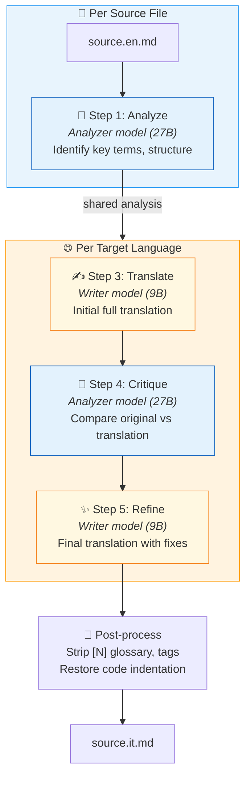
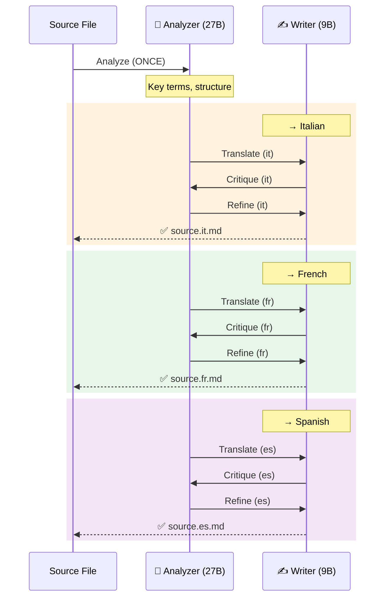
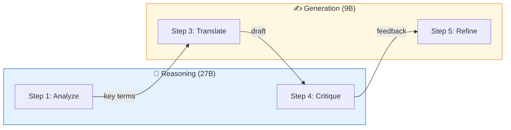
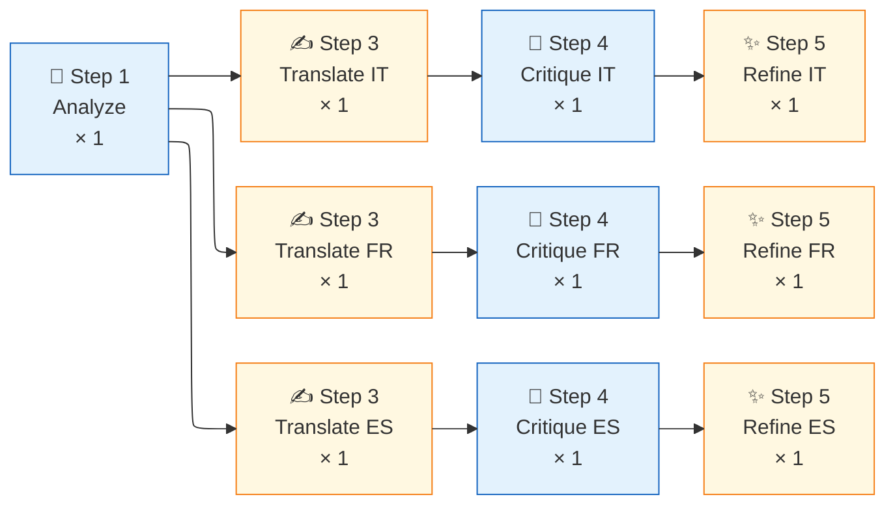

# 🌐 Translation Pipeline

Automated translation of LibreFolio MkDocs documentation into multiple languages using [Aphra](https://github.com/DavidLMS/aphra) — an LLM-based agentic translation workflow. Supports both **cloud** (OpenRouter) and **local** (Ollama) LLM backends.

---

## Overview

The pipeline translates `*.en.md` source files into `it`, `fr`, `es`. The translated files (`*.it.md`, `*.fr.md`, `*.es.md`) are picked up by `mkdocs-static-i18n` (suffix strategy) to build a multilingual documentation site.

| Scope | Files | Translated? |
|-------|-------|:-----------:|
| User Manual | 17 files | ✅ |
| Admin Manual | 6 files | ✅ |
| Financial Theory | 7 files (LaTeX) | ✅ |
| Gallery | 3 files | ✅ |
| Root (Home, FAQ, Credits) | 3 files | ✅ |
| Developer Manual | ~45 files | ❌ EN-only |
| POC UX | 1 file | ❌ EN-only |

**Total**: ~36 source files → ~108 translated files (3 languages)

---

## Architecture

```
mkdocs_src/aphra-pipeline/
├── .env                    # API key + model config (gitignored)
├── .env.example            # Template for contributors
├── .gitignore              # Ignores .env, config.toml, Python caches
├── .translate-hashes.json  # Translation cache, tracked in git (see Caching)
├── README.md               # Quick-start guide
├── code_blocks.py          # Fenced-block pairing + code indentation restore (shared helper)
├── glossaries/             # glossary.json: term mappings per language (Critique + Refine)
├── prompts/short_article/  # Aphra prompt overrides (see 7. Prompt overrides)
├── translate_docs.py       # Orchestration script (integrated with dev.py)
└── validate_translations.py # translate-validate checks (integrated with dev.py)
```

The script integrates with `dev.py` via `register_subparser()`, adding:

- `./dev.py mkdocs translate` — run translations
- `./dev.py mkdocs translate-check` — verify setup

---

## Workflow: Shared Analysis

The key optimization over vanilla Aphra: **Step 1 (Analyze) runs once per source file** and its result is shared across all target languages. This saves ~25% of LLM calls when translating to 3 languages.



!!! note "Step 2 (Search) skipped by default"

    Aphra's optional web search step adds cost ($4/1000 queries via OpenRouter `:online` plugin) and latency. It's disabled by default for technical documentation where terms are well-known.

### Multi-language flow

When translating to 3 languages, the full flow for one file is:



**Savings**: 1 Analyze call instead of 3 = **−67% analyze calls** across 3 languages.

---

## Model Roles

The pipeline splits LLM work into two categories, allowing different models for different tasks:

| Category | Steps | Env Variable | Recommended |
|----------|-------|-------------|-------------|
| **Reasoning** | Analyze + Critique | `APHRA_ANALYZER` | Larger model (27B) |
| **Generation** | Translate + Refine | `APHRA_MODEL` / `APHRA_WRITER` | Faster model (9B) |



### Priority hierarchy

```
APHRA_ANALYZER  → defaults to APHRA_WRITER → APHRA_MODEL → hardcoded default
APHRA_WRITER    → defaults to APHRA_MODEL → hardcoded default
APHRA_CRITIQUER → defaults to APHRA_ANALYZER (reasoning task)
APHRA_SEARCHER  → defaults to APHRA_MODEL → hardcoded default
```

---

## How We Customized Aphra

Aphra is used as a library, not via its CLI. We bypass `aphra.translate()` to gain control over several aspects:

### 1. Config path injection

Aphra's `translate()` passes `config.toml` to `LLMModelClient` (API key) but **not** to `workflow.load_config()`. Without our fix, the workflow loads its internal `default.toml` with expensive defaults (Claude Sonnet 4 + Perplexity Sonar).

**Fix**: Call `workflow.load_config(global_config_path=config_path)` directly.

### 2. Base URL override (Ollama support)

`LLMModelClient.__init__` hardcodes `base_url="https://openrouter.ai/api/v1"`. We patch `model_client.client.base_url` after construction to point to Ollama or any OpenAI-compatible endpoint.

### 3. Shared analysis across languages

Vanilla Aphra analyzes the source text once per translation call. We extract the Analyze step and reuse its result across all target languages for the same file.

### 4. Per-step model swapping

We modify `workflow_config['writer']` at runtime between steps:

- Before **Analyze**: set to `models['analyzer']` (27B reasoning)
- Before **Translate/Refine**: set to `models['writer']` (9B generation)
- **Critique** uses `models['critiquer']` (defaults to analyzer)

### 5. Web search bypass

Step 2 (Search) uses OpenRouter's `:online` plugin which costs $4/1000 results. We skip it entirely for technical docs via `APHRA_WEB_SEARCH=false`.

### 6. Post-processing cleanup

Aphra's output contains artifacts we strip automatically:

- `<translation>` / `</translation>` wrapper tags
- Inline glossary markers `[N]` (preserving markdown links)
- Glossary definition blocks at the end of the file
- Translator notes the LLM adds on its own (a trailing "Translator's Notes" section, `[^N]` footnotes)

Removing an inline marker leaves a double space behind. The cleanup collapses runs of two
or more spaces to one only **between non-space characters** and only **outside fenced code
blocks**: leading indentation (nested lists, admonition and content-tab bodies), Markdown
hard breaks (two trailing spaces) and every line of a code block stay as they are. An
earlier version collapsed every run of spaces in the whole document, which flattened code
indentation to 0–1 space (a `docker-compose` example in the IT/FR/ES admin manual was no
longer a valid compose file), pushed nested fences out of their list items and content
tabs (numbered lists split, tabs rendered empty) and removed hard breaks. The step that
re-pads `!!!` admonition bodies from 1 to 4 spaces stays as a safety net.

The file written by `_translate_one_lang()` is the output of `_finalize_translation()`:
`_clean_translation()` followed by `restore_code_indent()`, which gives every translated
code block the indentation of its English block back (see below). When something was
restored, the run log shows `🧹 Restored the source indentation on N code line(s)`.

#### Code block indentation

Translation never has a reason to move code, so the English indentation of every fenced
block is the reference. The helpers live in `mkdocs_src/aphra-pipeline/code_blocks.py`
(standard library only) and are shared by the pipeline and the validator. They see
backtick and tilde fences at any indentation (list items, content tabs, admonitions):

- `pair_blocks()` pairs each translated block with its English block **by content**: the
  same code pairs even when its `#`/`//` comments or `<placeholders>` are translated, so a
  block added or missing on one side does not shift the others. Blocks left over in a
  stretch that differs (e.g. Mermaid with translated labels) pair in order when language
  and line count match.
- `restore_code_indent()` gives each paired block the English leading whitespace back, line
  by line, fences included. A line whose tokens equal the English line becomes the English
  line; any other line keeps its translated text (comments, labels) behind the English
  indentation, and gets the English gap before an inline comment back when its code part
  is identical. Blank lines, prose, unpaired blocks, blocks with a different line count
  and unclosed fences are left alone.
- `code_indent_issues()` lists the translated lines whose indentation still differs from
  the English block.

`./dev.py mkdocs translate-validate` re-checks every translation with the
`code-block-indent` check (❌ ERROR, non-zero exit). It pairs blocks the same way and
reports each drifted block once: first drifted line, line range of the translated block,
how many of its lines are off, and the relative indentation levels of the English block
versus the translation. The positional `code-block-modified` notice (🌐 LOCALIZED)
attributes a changed code line to translated comments only: indentation drift is never
treated as an intentional localization.

In the release workflow (`.github/workflows/release.yml`, step *Validate broken MkDocs
translation links*) the command runs with `--hide-localized`. The step is
`continue-on-error` only on `dev`, where the nightly run lists it as a soft failure in the
job summary; on any other run, a published release included, an ERROR fails the pipeline.

Tests: `./dev.py test utils translation-code-blocks`
(`backend/test_scripts/test_utilities/test_translation_code_blocks.py`). Besides the unit
cases, a corpus guard checks that every up-to-date translation (English MD5 equal to the
cached one and language in `langs_done`, the rule `translate` uses to skip a page) keeps
the English code indentation.

### 💬 7. Prompt overrides

The generated `config.toml` points Aphra's `prompts_dir` at
`mkdocs_src/aphra-pipeline/prompts/short_article/`. A file there named like an Aphra prompt
replaces it (`step1_system.txt` and the system and user prompts of steps 3, 4 and 5), and
`step1_user_append.txt` is added after Aphra's own Step 1 user prompt.

For HTML, the three prompts that write or judge the translation share one rule:

- tags, attribute names and technical attribute values (`src`, `href`, `class`, `id`,
  `style`, and `data-*` other than `data-title`, such as `data-category` or `data-name`)
  are copied character for character;
- the human-readable values of `alt`, `title`, `aria-label` and `data-title` (the carousel
  caption) are prose: Translate (`step3_user.txt`) and Refine (`step5_user.txt`) translate
  them, keeping any HTML inside a `data-title` unchanged, and Critique (`step4_user.txt`)
  checks that they were not left in English.

The earlier wording asked to copy every HTML attribute, which left image descriptions in
English. The `text-untranslated` check ([Validation Checks](#validation-checks)) reports the
values of three words or more still in English.

---

## Configuration

### Local mode (Ollama)

```env
APHRA_BASE_URL=http://localhost:11434/v1
APHRA_ANALYZER=kwangsuklee/Qwen3.5-27B-Claude-4.6-Opus-Reasoning-Distilled-GGUF
APHRA_MODEL=kwangsuklee/Qwen3.5-9B-Claude-4.6-Opus-Reasoning-Distilled-GGUF
APHRA_WEB_SEARCH=false
```

Install Ollama and pull models:

```bash
brew install ollama   # macOS
ollama pull kwangsuklee/Qwen3.5-27B-Claude-4.6-Opus-Reasoning-Distilled-GGUF
ollama pull kwangsuklee/Qwen3.5-9B-Claude-4.6-Opus-Reasoning-Distilled-GGUF
```

### Cloud mode (OpenRouter)

```env
# APHRA_BASE_URL=        ← commented out = cloud mode
OPENROUTER_API_KEY=sk-or-v1-your-key-here
APHRA_MODEL=google/gemini-2.5-flash
```

### Usage

```bash
# Check setup
./dev.py mkdocs translate-check

# Dry run (shows plan + estimated tokens)
./dev.py mkdocs translate --dry-run

# Translate specific files
./dev.py mkdocs translate --file faq.en.md --lang it

# Translate entire folder (glob)
./dev.py mkdocs translate --file 'user/**/*.en.md' --lang it fr es

# Translate all (skips cached)
./dev.py mkdocs translate
```

### 🦋 Cloud mode — Doubleword.ai (Autobatcher / Flex Queue)

[Doubleword.ai](https://app.doubleword.ai) provides an OpenAI-compatible API with a
**flex queue** pricing model: requests are batched and processed at reduced rates during
off-peak periods, making it significantly cheaper than synchronous cloud inference.

Configure `.env`:

```env
APHRA_BASE_URL=https://api.doubleword.ai/v1
DOUBLEWORD_API_KEY=dw-your-key-here
APHRA_MODEL=google/gemma-4-31B-it

# Optional: lower from 4h default if you prefer faster failure + retry
# DOUBLEWORD_QUEUE_TIMEOUT=14400
```

Run with parallel language branches for maximum throughput:

```bash
./dev.py mkdocs translate --workers 3
```

!!! info "Model recommendation"

    `google/gemma-4-31B-it` is the recommended model for Doubleword — it balances
    translation quality and cost. Because Doubleword uses flex pricing, you can use a
    single model for all 4 roles without worrying about per-step cost differences.

#### How queue scheduling works with the 4-step pipeline

Aphra's workflow makes **one LLM call per step**. Each call to `DoublewordClient.call_model()`
becomes one independent request submitted to Doubleword's flex queue via `autobatcher`.

For a single file translated into 3 languages, the pipeline submits **10 requests total**:



!!! tip "Greedy parallel execution with `--workers`"

    Use `--workers 3` to translate IT, FR, ES **in parallel** via independent threads.
    Each language branch advances to its next step as soon as it finishes the current
    one — without waiting for the other languages:

    ```
    Thread IT: [Translate]──→[Critique]──→[Refine]     ← finishes first
    Thread FR:    [Translate]────→[Critique]──→[Refine]
    Thread ES:       [Translate]──────→[Critique]──→[Refine]
    ```

    Each step is a **new, independent conversation** — Doubleword has no context window
    continuity between steps. This is by design: Aphra's prompts are self-contained and
    include all necessary context (source text, analysis, prior translation) in each
    individual request.

#### Technical: sync shim over async autobatcher (thread-safe)

Aphra's `call_model()` interface is fully synchronous. `autobatcher.AsyncOpenAI` is async.
`DoublewordClient` bridges both while remaining thread-safe for `--workers`:

```python
# In translate_docs.py — DoublewordClient.call_model()
# A new AsyncOpenAI client is created per call so each thread
# gets its own event loop + client (httpx.AsyncClient is not
# safe to share across asyncio.run() boundaries).
async def _call() -> str:
    client = AsyncOpenAI(api_key=api_key, base_url=base_url)  # per-call
    response = await client.chat.completions.create(
        model=writer_model,
        messages=[{"role": "user", "content": prompt}],
    )
    return response.choices[0].message.content or ""

# asyncio.wait_for enforces DOUBLEWORD_QUEUE_TIMEOUT (default 4h)
result = asyncio.run(asyncio.wait_for(_call(), timeout=timeout_s))

```

`asyncio.run()` creates a fresh event loop per call, which is safe in Python 3.10+.
The `autobatcher` library handles queue submission and polling transparently.

---

## Caching

`mkdocs_src/aphra-pipeline/.translate-hashes.json` (tracked in git) records which languages
of each English page are up to date, and for which version of the English. Only the English
side is hashed: translated files never enter the decision, so a manual repair of a
translation (a whitespace-only fix, for example) neither triggers a re-translation nor needs
a stamp.

### 🗃️ Entries and the skip rule

One entry per English page, keyed by its path under `mkdocs_src/docs/` (for example
`user/assets/create-edit.en.md`):

| Field | Content |
|-------|---------|
| `md5` | MD5 of the English version the languages in `langs_done` were translated or stamped from |
| `langs_done` | The languages up to date for that version |
| `langs.<lang>` | The language's record: `translated_at` with the run's `models`, `critique`, `structural_diff`, `structural_issues` and `elapsed_s` after a translation (plus `final_structural_diff` and `final_structural_issues` when the written file has structural issues); `stamped_at` and `stamped_by` after a stamp; `failed`, `failed_at`, `failure_reason` and `failed_models` after a failure |
| `last_translated` | Time of the last successful translation; a stamp that creates the entry sets it to the stamp time |
| `analysis`, `analysis_model` | The Step 1 (Analyze) output shared by the languages, and the model that wrote it |

`translate` plans each page and language for which `_needs_translation()` holds: a language
is skipped only when the English MD5 equals the entry's `md5` **and** the language is in
`langs_done`. The records under `langs` are history: the skip rule reads only those two
fields. Use `--force` to ignore the cache and re-translate every page and language in scope
(`--file`, `--lang`).

### 🔄 Transitions

Every write to an entry goes through one of four functions of `translate_docs.py`, so a
language counts as done only for the English text it was translated or stamped from.
Before them, an analysis moved `md5` to the new English and kept `langs_done`, so a language
that then failed, or was never reached, stayed done and its stale translation was never
offered again.

| Event | Function | Effect on the entry |
|-------|----------|---------------------|
| The analysis of the page succeeds (a failed one writes nothing) | `_cache_mark_analyzed()` | Sets `md5` to the analyzed version, with `analysis` and `analysis_model`. A changed `md5` empties `langs_done`, the same `md5` keeps it. The `langs` records stay: they still describe the files on disk |
| A language succeeds | `_cache_mark_translated()` | Adds the language to `langs_done`, sets `last_translated` and replaces the language's record with a fresh one (`translated_at`, `models`, …), which drops any failure or stamp fields |
| A language fails | `_cache_mark_failed()` | Never marks the language done. Adds `failed`, `failed_at`, `failure_reason` and `failed_models` to its record and keeps its last `translated_at`: a translation file is written only on success, so the old file is left as it was |
| `./dev.py mkdocs translate-stamp` | `_cache_stamp()` | Moves `md5` to the current English and adds the stamped languages to `langs_done`. The other languages stay done only if `md5` did not change; otherwise the command lists them as `pending again`. Records `stamped_at` and `stamped_by` and clears the failure fields of the stamped languages |

A failed `--force` retry of an up-to-date page leaves the language done, since its file
still translates that version. `translate-stamp` skips an entry already current for the
stamped languages (`Already stamped, skipping`), so it does not clear that failure record;
the next successful translation does.

The MD5 recorded is the one of the text translated: `_read_source()` reads the English page
once and returns its text with the MD5 of the same bytes, and the analysis records that MD5.
An English edit saved after that read, while the analysis or the translation steps run (on
the Doubleword flex queue a step can wait hours), is therefore translated by the next run
instead of being recorded as done.

So after a failure, an interruption or a `--lang` subset, the next run, and
`translate --dry-run`, which prints the same plan, offer exactly the page and language pairs
not yet done for the current English.

Tests: `./dev.py test utils translation-cache`
(`backend/test_scripts/test_utilities/test_translation_cache.py`), next to
`translation-code-blocks` ([Code block indentation](#code-block-indentation)). It drives the
real `run_translate` and `run_stamp`, on the parallel (`--workers 3`) and the sequential
path, over a docs tree and a cache in a temporary directory with the LLM calls faked, and
checks `_needs_translation()` and the four transitions directly.

---

## 🔎 Validation Checks {: #validation-checks }

`./dev.py mkdocs translate-validate` (`validate_translations.py`) compares each translation
with its English page, for every target language, and exits non-zero on any ❌ ERROR, which
fails the release workflow outside `dev` (see
[Code block indentation](#code-block-indentation)). Among its checks (`code-block-indent` is
described above, `admonition-empty-line` under
[Prettier Compatibility](#prettier-compatibility)), three catch what a translation can break
while the structure stays intact:

- `text-untranslated` (⚠️ WARN): an `alt`, `title`, `aria-label` or `data-title` value (in
  double quotes), or the alt text of a Markdown image, of at least three words (two letters
  or more each) that is identical to one of the English page's values, so left in English.
  Code is ignored, and the name "Buy Me a Coffee" is allowed. The `html-attrs` check skips
  these attributes, whose translation is expected; this one checks that it happened.
- `anchor-missing` (❌ ERROR): a Markdown link to `page.md#anchor` or `#anchor` in a
  translation (code ignored) must land on an anchor of the page it opens: the translated
  target `page.<lang>.md`, or the English page when no translation exists. Anchors are the
  explicit `{: #id }` ids, the heading slugs (Python-Markdown's default slugify; a repeated
  slug gets `_1`, `_2`, …) and HTML `id`s. `mkdocs build --strict` stops at the first
  language with a warning, so it surfaces these links one language at a time; this check
  reports every language in one pass.
- `inline-code-missing` (⚠️ WARN): every inline code span of the English must appear
  verbatim in the translation, as many times; digit grouping is ignored, so `1,000.50`
  matches `1.000,50`. Identifiers, enum values and parameters are never translated.

The HTML checks (`html-tag-mismatch`, `html-attr-missing`, `html-attr-mismatch`) read only
rendered HTML: fenced code (any fence, found by `code_line_mask()` in `code_blocks.py`) and
inline code are removed first, so inline code such as `EUR<USD` is no longer taken for a
tag.

The structural diff, `_structural_diff()` in `translate_docs.py`, runs on each draft before
the Critique step (its report goes to Critique and Refine), on every file a run writes, and
in `./dev.py mkdocs translate-diff`, which exits non-zero on any issue or missing
translation. Its `LINE_COUNT` check compares blank-line-separated blocks, not lines, and
flags a difference of more than max(3, 15% of the English blocks): the English wraps at
about 80 columns while a translation often keeps a paragraph on one line, but a dropped or
truncated section still removes blocks.

---

## Prettier Compatibility

### The Problem

Prettier uses the **remark** parser (CommonMark). In CommonMark, `!!! info "title"` is an unknown construct — admonitions don't exist. Prettier treats the 4-space indented body as "continuation text" and **strips the indentation**, breaking the admonition box:

```markdown
<!-- BEFORE Prettier -->
!!! note "Title"
    Content inside the box.     ← 4 spaces (INSIDE the box)

<!-- AFTER Prettier — BROKEN -->
!!! note "Title"
Content inside the box.         ← 0 spaces (OUTSIDE the box)
```

`tabWidth: 4` does NOT fix this — it only controls tab→space conversion, not paragraph indentation preservation.

### The Solution

Add an **empty line** between the directive and the indented body. With the empty line, Prettier leaves the block completely untouched, and MkDocs renders identically:

```markdown
<!-- ✅ CORRECT — survives Prettier unchanged -->
!!! note "Title"

    Content inside the box.
    Second line.

<!-- ❌ WRONG — Prettier will strip indentation -->
!!! note "Title"
    Content inside the box.
    Second line.
```

This applies to both `!!!` (admonitions) and `???` (collapsible details).

### Automated Checks

The empty-line rule is enforced at three levels:

| Check | Where | Severity | Description |
|-------|-------|----------|-------------|
| **Pre-build warning** | `dev.py` → `_check_admonition_empty_lines()` | ⚠️ Warning | Runs before every `./dev.py mkdocs build`. Scans all `.md` files and warns if any admonition is missing the empty line. |
| **Translation validation** | `validate_translations.py` → `admonition-empty-line` | ⚠️ WARN | Checks translated files during `./dev.py mkdocs translate-validate`. |
| **Structural diff (critic)** | `translate_docs.py` → `_structural_diff()` → `ADMONITION_EMPTY_LINE` | Info to LLM | Injected into the Step 4 (Critique) context so the critic LLM can flag and fix the issue during refinement. |

