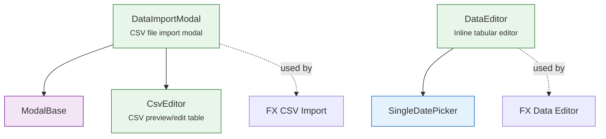

# ✏️ Datapoint Editor Components

Inline editing and CSV import components for financial datapoints. Located in `lib/components/ui/data-editor/`.

---

## ✏️ DataEditor

An **inline tabular editor** for structured data (add, edit, delete rows).

- Editable cells with type-aware inputs (text, number, date)
- Add row button with empty row template
- Delete row: the row is only marked deleted, and its **Undo** action restores a deleted or edited
  row and removes a new one; selected rows can be deleted together. Nothing is written until the
  owner saves
- Validation per cell with error highlighting
- Toolbar counters: *N modified*, *N deleted*, *N new*
- Rows carry a `staleDays` count (backward-filled points); when any exist, a switch with a `⚠️ N`
  counter hides them (`dataEditor.staleTooltip`)
- `readonly` rows (with a `readonlyReason` tooltip) can be deleted but not edited
- Optional numeric columns flagged `erasable` render `ErasableNumberCell`: its eraser (or `Delete`
  in an empty input) sets the sentinel `-1` without a confirmation, since the row's **Undo** covers
  a slip; the backend price upsert turns `-1` into `NULL`
- **Import CSV** merges each parsed line into the row with the same date and the same values for
  the `importMatchKeys` columns (prop, default `[]`: the date alone, as for prices and FX rates; the
  asset events editor passes `['type']`). Among several matches an editable row wins over a
  read-only one, and a line whose every match is read-only is skipped; only non-empty values are
  merged. An unmatched line is appended under a unique `rowId`, the date then `date#2`,
  `date#3`…, so two new rows can share a date
- `scrollToDate(date)` scrolls to a row

**Used by**: the FX detail page (`fx/FxDataEditorSection.svelte`) and the asset detail page
(`assets/AssetDataEditorSection.svelte`), below.

### 💾 Saving: the FX and asset wrappers

`DataEditor` never writes: its wrapper collects the dirty rows and saves them on **Save**.

| | FX (`FxDataEditorSection`) | Asset (`AssetDataEditorSection`) |
|---|---|---|
| Tables and columns | one table: `rate` | **Prices**: `close` (required), `open`, `high`, `low`, `volume` (erasable). **Events**: `type` (one of the five event types) and `amount` (required), `notes` |
| Written through | `POST /api/v1/fx/currencies/rate`; a pair shown inverted (its base after its quote in alphabetical order) stores `1 / rate` under the alphabetical pair | `POST /api/v1/assets/prices`; `POST /api/v1/assets/events`, a saved event with its `id` (edited in place, type included), a new one without |
| Deleted through | `DELETE /api/v1/fx/currencies/rate` | `DELETE /api/v1/assets/prices`; `DELETE /api/v1/assets/events` by id, whose per-item `in_use` result (an event a transaction uses) is reported, not deleted. An event row never saved sends no DELETE |
| Rows not sent | A rate that is not a number above 0, counted as *skipped (invalid)*. When every row is invalid and none is deleted, the save stops with *Rate must be strictly greater than zero (0 is not allowed).* | A price whose close is not a number above 0, counted as *skipped (invalid)*; an event without a type or a numeric amount |

Both wrappers:

- merge consecutive deleted dates into ranges;
- draw the pending values as a purple preview line (`__preview__`, `#a855f7`) until saved or
  cancelled; the FX one draws only rates above 0;
- after a save that appended rows outside the loaded range, hand the page the widened range
  through `onsave`, and the page moves its period there;
- expose `scrollToDate(date)`: with the editor open, a double-click on the chart (a long press of
  about 0.8 s on touch) scrolls to that date.

Asset only:

- **Two tabs**, **Prices** and **Events**, whose badges count the dirty rows, share one
  **Save (n)** / **Cancel** bar. The chart jump picks the Events tab when the date has an event
  marker, the Prices tab otherwise.
- **No currency column.** The backend rejects a price or event in a currency other than the
  asset's (HTTP 400); the editor sends no currency with prices and the asset's with events, and a
  label beside the tabs reads *Prices in USD* / *Events in USD*.
- **Auto events** (`is_auto`) are `readonly`: a provider rewrites them at its next sync (see
  [Asset Events](../../../backend/assets/events.md#dedup-strategy)).
- **Saved events travel with their id.** A saved event row's `rowId` is its DB id, read back by
  `dbEventId(row)` (`null` for a row never saved, whose `rowId` is a date: `2026-03-15`,
  `2026-03-15#2`). The upsert sends that `id`, so the server edits the row in place, its type
  included: changing the Type of a saved event no longer adds an event and leaves the old one. A
  row deleted before its first save sends no DELETE. The events `DataEditor` gets
  `importMatchKeys={['type']}`: an imported line merges into the row of the same date and type,
  under the Import CSV rules above, and a line of another type on that date is added.
- **A refused save** (HTTP 400, such as `EVENT_KEY_CONFLICT`) shows *Save failed: …* and does not
  call `onsave`: the editor stays open with the pending rows. Prices are sent before events, so
  the prices of that save may already be stored.
- **Refresh while editing**: a `chartData` or `events` refresh that lands while a tab has dirty
  rows is held back until it is clean, so pending edits are never discarded. The FX wrapper
  rebuilds its rows on every refresh.

The asset import modals wrap `DataImportModal`, each with a format banner and a 📖 button that
opens the user page (`user/assets/detail/data-editor/` and `user/assets/detail/events/`, with the
locale prefix):

- `PriceDataImportModal` — header `date;currency;close`, optional `open;high;low;volume`.
  `currency` is a required column for the parser but is not sent: the save uses the asset's.
- `EventDataImportModal` — header `date;currency;type;amount;notes`, with `currency` and `notes`
  optional. `amount` also reads a `value` column (an alias), the name the events export
  (`GET /api/v1/backup/asset/{id}/events?format=csv`) gives it, so an exported events file imports
  back with its other columns ignored. Its `source` column is not read (every row becomes a manual
  event), and rows sharing a date are still duplicates.

---

## 📄 CsvEditor

A **CSV preview and editor** with column detection and per-row validation.

- Parses CSV content and displays as table
- Detects the separator, `;` or `,`, from the first non-empty line (a line starting with `date;`
  or `date,` decides at once, otherwise the first of the two to appear), and reads quoted fields
  RFC 4180-style. No other separator is recognised
- Requires a header on the first non-empty line and matches it **by column name**,
  case-insensitively and in any order: extra columns are ignored, missing required ones produce
  one consolidated error. A column may list `aliases` (`CsvColumnDef.aliases`), tried after its
  label: with both present, the label wins. A token `A<B` reads as `B>A`, so an FX header can name
  its direction either way
- The identity column is `date` (`YYYY-MM-DD`) unless the caller passes another, such as a
  distribution's `name`
- Numbers (`parseNumber`): `_` is dropped as a thousands separator; with both `.` and `,`, the
  last one is the decimal separator and the other is dropped; a lone `,` is the decimal separator
  (a second one makes the value invalid). What remains must be a plain number (sign, digits,
  optional decimals and exponent), so an inner space or a letter is invalid. A column may also
  pass its own `parse` and `validate`
- Highlights rows with errors (red) or warnings (yellow), such as a duplicate date
- Editable cells for manual correction

Its messages, one per invalid line:

| Where | Message |
|---|---|
| Header | `Missing required columns: <labels>`, or `Expected header: <identity>;<labels…>` when the first line has no identity column; every data row then reads `Fix header first` |
| Row | `Invalid quoted CSV field` |
| Row | `Invalid date format: "<value>". Use YYYY-MM-DD`, `Invalid date: "<value>"`, or `Invalid <identity>: "<value>"` for another identity column |
| Row | `Required column "<label>" is empty` |
| Row | `Invalid number in "<label>": "<value>"`, or `Invalid value in "<label>": "<value>"` when a column's `parse` rejects it |
| Row | The column's own `validate` message, such as *Weight must be between 0 and 100* |
| Duplicates | `Duplicate <identity>: <value>` on every row sharing that value; none of them is imported |

**Used by**: `DataImportModal` (FX CSV import preview and the asset price, event and distribution
imports).

---

## 📥 DataImportModal

A **modal for importing data from CSV files**. Extends [ModalBase](modals.md).

- Drag & drop file upload zone
- Direction bar for FX pair direction (with swap button)
- Uses `CsvEditor` for preview
- Validation summary before import: *N valid row(s)*, the error count, and *duplicates*
- **Import (N)** imports the valid rows only, by default: rows with errors and every duplicated
  row stay out. A `strict` caller (the distribution import) allows the import only with no error
  and no duplicate, and a `validateRows` check on the whole set (the distribution total) blocks it
  with its message
- Closing after typing, pasting or dropping data asks to confirm (*Discard import?*)

**Used by**: FX detail page — "Import CSV" action, and the asset wrappers `PriceDataImportModal`,
`EventDataImportModal` and `DistributionDataImportModal`. See
[FX CSV Import](../../../../user/fx/detail/data-editor.md) and
[Asset Data Editor](../../../../user/assets/detail/data-editor.md) for user documentation.
