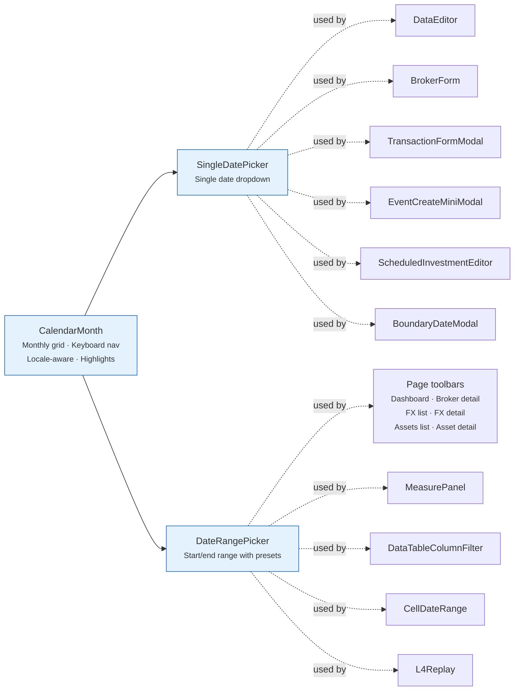

# 📅 Date Picker Components

Date selection components built on a shared `CalendarMonth` grid.

---

## 📅 CalendarMonth

A **monthly calendar grid** component — the visual building block for date pickers.

- Displays a single month with day cells
- Highlights today, selected date, and date range
- Keyboard navigation within the grid
- Locale-aware (week starts on Monday for most locales)

**Used by**: `SingleDatePicker`, `DateRangePicker`.

---

## 📆 SingleDatePicker { #singledatepicker }

A **single-date picker** dropdown with calendar.

- Opens a `CalendarMonth` in a dropdown
- Manual text input with date parsing
- Month/year navigation with arrows
- Formats date according to locale

**Used by**:

- [DataEditor](data-editor.md) — the date of a newly added row; the dates already in the series
  are disabled
- [BrokerForm](../features/brokers/forms.md#brokerform) — **Account Opened**, never in the future
- [TransactionFormModal](../features/transaction-form.md) — the transaction date and, for a pair,
  the **To** side's own date
- EventCreateMiniModal — the date of an asset event created inline from the
  [transaction form](../features/transaction-form.md)
- [ScheduledInvestmentEditor](../../../backend/assets/provider_scheduled_investment.md) — the date
  of each event row of the schedule
- BoundaryDateModal — the boundary date(s) that ScheduledInvestmentEditor asks for when it deletes
  or splits a period

---

## 📅 DateRangePicker

A **date range picker** with start and end dates.

- Two `CalendarMonth` grids side by side (current + next month)
- Visual highlight of selected range
- Quick presets: **1W**, **1M**, **3M**, **6M**, **1Y**, **2Y**, **YTD** and **MAX**, plus a custom window (an amount
  and a granularity). **3Y**, **5Y**, **10Y**, **MTD**, **QTD** and **WTD** fill the toolbar only when a JS
  measurement finds room to spare, never at the cost of an extra line (`DateRangePicker.svelte:36,216-251`)
- Start and end date text inputs

**Used by**:

- **Page toolbars** — the period of the Dashboard, broker detail, FX list, FX detail, Assets list
  and asset detail pages ([Pages](../../pages/index.md))
- [MeasurePanel](../charts.md) — the two dates of a measure, without presets, while its row is
  expanded
- [DataTableColumnFilter](data-table.md) — the filter of a `date` column
- CellDateRange — the **Period** cell of each row in ScheduledInvestmentEditor's period table
  ([Scheduled Investment Provider](../../../backend/assets/provider_scheduled_investment.md))
- [L4Replay](../features/risk-lab.md#replay) — the replay period, with quick ranges but no `MAX`

