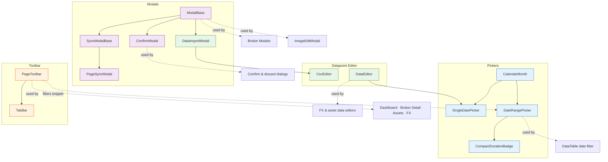

# 🧱 Core UI Components

Generic, reusable components — in `lib/components/ui/`, plus the DataTable in `lib/components/table/` — that serve as building blocks for all composite components.

## 🗺️ Dependency Map

`PageToolbar` does not import the date picker: the page renders a `DateRangePicker` inside the
toolbar's `filters` snippet.

## 📑 Sub-sections

| Section | Components | Description |
|---------|-----------|-------------|
| **[Modals](modals.md)** | ModalBase, ConfirmModal, SyncModalBase, PageSyncModal | Foundation for all modal dialogs, confirmations and provider syncs |
| **[Feedback](feedback.md)** | ToastContainer, InfoBanner, DataQualityBanner, LoadingSpinner, Tooltip | Notifications and user feedback |
| **[Pickers](datePickers.md)** | CalendarMonth, SingleDatePicker, DateRangePicker | Date selection components |
| **[Toolbar & Responsive Layout](toolbar.md)** | PageToolbar, TabBar, `responsiveLayout.svelte.ts` | Container-width-driven responsive page toolbar shell |
| **[Atoms](atoms.md)** | ThemeToggle, PrivacyToggle, DocsLink, AnimatedBackground, OrderableList, PasswordInput, PasswordStrength, ExactDecimalInput, ExactQuantityInput, CompactDurationBadge, display blocks (KpiMetricBar, KpiDivergingFlowBar, RiskMetricCard, RiskCardGrid, CurrencyAmount, …) | Small standalone UI primitives, inputs and display blocks |
| **[Datapoint Editor](data-editor.md)** | DataEditor, CsvEditor, DataImportModal | Inline editing and CSV import for financial datapoints |
| **[DataTable](data-table.md)** | DataTable, DataTablePagination, ColumnVisibilityToggle | Sortable, filterable, paginated data grid |
| **[File Upload & Media](file-upload.md)** | FileUploader, ImageCropper, ImageEditModal, AssetPickerModal, LazyImage | Uploads and image handling |
| **[Select & Dropdowns](select.md)** | SimpleSelect, SearchSelect, TreeSelect, AssetTypeSelect, AssetPickerPanel, SelectPopover, CheckMenu, … | Selects; a typed search ranks [name matches first](select.md#ranking-the-matches) |
