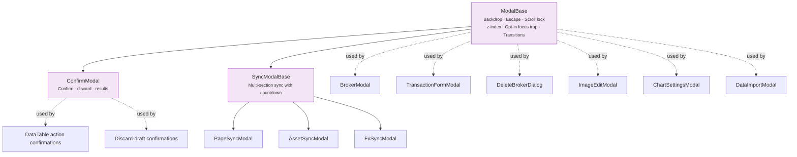

# 🪟 Modals

The modal system in LibreFolio. Every modal is built on `ModalBase`, directly or through
`ConfirmModal` and `SyncModalBase`. All three live in `lib/components/ui/modals/`.



---

## 🏗️ ModalBase

The **foundation for all modals** in LibreFolio. It renders nothing while `open` is false; when
open it draws a backdrop (`role="dialog"`, `aria-modal="true"`) and the content box, and injects
the caller's content as `children`.

### 📋 Props {: #modalbase-props }

| Prop | Type | Default | Description |
|---|---|---|---|
| `open` | `boolean` | `false` | Shows the modal. |
| `onRequestClose` | `() => void` | no-op | Called when the user asks to close: backdrop click or Escape. The modal never closes itself — the parent decides and sets `open` to `false`. |
| `closeOnBackdropClick` | `boolean` | `true` | Whether a backdrop click calls `onRequestClose`. |
| `closeOnEscape` | `boolean` | `true` | Whether Escape calls `onRequestClose`. |
| `trapFocus` | `boolean` | `false` | Opt-in: focus moves to the first focusable control and Tab / Shift+Tab wrap inside the modal. |
| `restoreFocus` | `boolean` | `false` | Opt-in: focus returns to the element that had it when the modal opened, once it closes. |
| `labelledBy` | `string` | — | Id of the title element, set as `aria-labelledby`. |
| `zIndex` | `number` | `50` | Stacking level: 50 first-level, 60 second-level, 70 third-level. |
| `maxWidth` | `string` | `'lg'` | A preset (`sm`…`6xl`, also as `max-w-*`, or `none`) or any CSS length. |
| `allowOverflow` | `boolean` | `false` | Lets the content box overflow, for dropdowns inside compact modals. |
| `noTransition` | `boolean` | `false` | Skips the fade (backdrop, 150 ms) and scale (content, 200 ms) transitions. |
| `contentClass` | `string` | `''` | Extra classes on the content box. |
| `testId` | `string` | `''` | `data-testid` of the backdrop element. |

### ⚙️ Behaviour

- **Backdrop click** closes only when both the press and the release land on the backdrop, so a
  text selection dragged out of the content does not close the modal.
- **Escape** is handled on the modal's own backdrop element and stops propagating: in a stack,
  only the topmost modal reacts.
- **Focus**: on open the backdrop itself takes focus, so keyboard events reach the modal. Focus
  trapping and focus restoration are **opt-in** (`trapFocus`, `restoreFocus`), off by default
  for the existing callers; `PlannerDialog` (PAC planner) and `SocialShareModal` turn both on.
  `ModalBase.test.ts` pins the two behaviours.
- **Scroll lock**: the page is frozen at its scroll position (`position: fixed` plus a negative
  `top`) while any modal is open. A counter on `document.body.dataset.modalScrollLockCount`
  makes stacked modals share one lock; the last one to close restores the scroll position. The
  [app header](../index.md#app-header) watches the same counter to stay visible while a modal is
  open.

```svelte
<ModalBase {open} onRequestClose={() => (open = false)} maxWidth="2xl" labelledBy="my-title" trapFocus restoreFocus>
    <h2 id="my-title">…</h2>
</ModalBase>
```

---

## ⚠️ ConfirmModal {: #confirmmodal }

A confirmation dialog on `ModalBase`, for destructive actions, discard flows and operation results.
It is exported from `$lib/components/table` as well.

### 🎨 Variants {: #confirmmodal-variants }

The confirm button takes one of three colours; the header shows a warning icon in the same tone for
the last two.

| Props | Confirm button | Use it for |
|---|---|---|
| default (`danger={false}`, `warning={false}`) | Primary (brand green) | Plain confirmations |
| `danger` | Red | Destructive actions: deletions |
| `warning` | Amber | Non-destructive but attention-worthy actions: discarding a draft |

`danger` wins when both are set.

### 📋 Props {: #confirmmodal-props }

| Prop | Type | Default | Description |
|---|---|---|---|
| `open` | `boolean` | **Required** | Shows the modal. |
| `title`, `message` | `string` | **Required** | Header and body text. |
| `description` | `string` | `''` | Secondary text under the message; `descriptionItalic` sets it in italics. |
| `items`, `itemsLabel` | `string[]`, `string` | `[]`, `''` | Collapsible list of the affected items; a single item is always shown. |
| `confirmText`, `cancelText` | `string` | `common.confirm`, `common.cancel` | Button labels. |
| `danger`, `warning` | `boolean` | `false` | See [Variants](#confirmmodal-variants). |
| `onConfirm` | `() => void` | **Required** | Confirm button. |
| `onCancel` | `() => void` | **Required** | Cancel button, the ✕ in the header, Escape and backdrop click. |
| `zIndex` | `number` | `60` | Above a first-level modal. |
| `results` | `{label, success, detail?, action?}[]` | `[]` | Results mode, see below. |
| `testId` | `string` | `''` | Identifies which confirmation is on screen (on the header). |

The buttons carry stable test ids: `confirm-modal-confirm`, `confirm-modal-cancel` and, in results
mode, `confirm-modal-close`.

### 📊 Results mode

When `results` is not empty, the body lists one row per item — ✅ or ❌, the `label`, then the
`detail` — and the footer keeps a single **Close** button, which calls `onCancel`.

- `detail` is rendered as **text**: markup coming from the backend stays inert.
- `action` (`{href, label, testId?}`) adds a link at the end of the row. Deleting an asset that
  still has transactions uses it: the ❌ row links to the Transactions page filtered on that asset.

### 🗑️ Discard-draft flows {: #discard-draft-flows }

A modal or panel holding unsaved edits asks before throwing them away: it opens a `ConfirmModal` with
`warning` (amber), and `confirmText` set to *Discard*. The global settings tab
(`lib/components/settings/tabs/GlobalSettingsTab.svelte`) is the reference: locking the panel with
pending edits opens the confirmation.

- **Confirm** discards the draft and completes the action (closes the parent, locks the panel).
- **Cancel, ✕, Escape and backdrop click** all reach `onCancel`, which only closes the confirmation:
  the draft is **kept** and the parent stays as it was. `GlobalSettingsTab.test.ts` checks the four
  paths, and that a second request still finds the same draft.

Implement `onCancel` as "close this dialog" and nothing else — never as "discard".

**Used by**: `DataTable` (row and bulk actions with `requireConfirm`), the discard confirmations of
`GlobalSettingsTab`, `BrokerSharingModal`, `FxPairAddModal`, `ChartSettingsModal`,
`DataImportModal` and `ImportWizardModal`, and the delete flows of the Assets and FX pages.

---

## 🔄 Sync modals

`SyncModalBase.svelte` is the shared shell of the provider-sync dialogs: header, date-range bar,
timeout setting, progress bar with countdown, one result list per section, per-item and
retry-all-failed actions, and a summary. Each specialization passes `SyncSection[]` with its own
sync function and result-row snippet; sections without targets are hidden, and all sections run in
parallel under one countdown. Closing the modal does not cancel the backend request, but each
opening is a new session: a late answer from an abandoned run is not shown in the next one.

The **Timeout** field (default `max(20, item count)` s) drives the countdown and the limit of every
request, retries included: `syncRequestTimeoutMs()` (`utils/sync/syncHelpers.ts`) hands each
section's sync function `max(120 s, field + 5 s)`, and the timeout message names that limit, which can
be longer than the field.

| Component | Syncs | Used by |
|---|---|---|
| `AssetSyncModal` (`components/assets/`) | Asset prices | Assets list |
| `FxSyncModal` (`components/fx/`) | FX rates | FX list, transaction form, PAC planner |
| `PageSyncModal` (`ui/modals/`) | Asset prices **and** the FX pairs they need, in parallel | Asset detail, FX detail, risk panels |

`PageSyncModal` reports `onsynced({accepted})`: `accepted` is true when at least one item of the
current run came back `ok` or `partial`, so callers refresh only after a run that changed something.
`SyncResultRow.svelte` renders one result line for the three modals.
