# 🔽 Select & Dropdown Components

This section documents the reusable dropdown and select components in `lib/components/ui/select/`.

There is **no shared base component**: `SimpleSelect`, `SearchSelect` and `TreeSelect` each
self-contain their open/close state, click-outside dismissal, keyboard navigation, and dropdown
positioning (`position: fixed`, so the dropdown is never clipped by `overflow` parents). The shared
logic that exists lives in plain TypeScript — `optionFilter.ts` (filtering, ranking and
keyboard-step helpers: `SearchSelect` uses all of them, `SimpleSelect` the step helpers), `types.ts`
(`SelectOption`) and `treeSelect.ts` (the tree shapes of `TreeSelect`). Every specialized select
composes one of the generic ones — except `FxProviderSelect`, a self-contained route picker, and
`AssetPickerPanel`, built on `SelectPopover`.

## 🏗️ Component Hierarchy

```mermaid
graph TD
    SS["<b>SimpleSelect</b><br/><small>Fixed option list · Checkmark active<br/>Custom rendering via snippets</small>"]

    SrS["<b>SearchSelect</b><br/><small>+ Substring search, ranked matches<br/>+ Section titles · Inline search · Create footer</small>"]

    TS["<b>TreeSelect</b><br/><small>Two levels · Groups open and close<br/>Search across both levels · Full keyboard model</small>"]

    SrS --> CSS["<b>CurrencySearchSelect</b><br/><small>+ Flag emoji · ISO code + name<br/>📡 <code>/utilities/currencies</code></small>"]

    SrS --> IPS["<b>ImportPluginSelect</b><br/><small>+ Broker icon · Plugin description<br/>📡 <code>/brokers/import/plugins</code></small>"]

    SrS --> BSS["<b>BrokerSearchSelect</b><br/><small>+ BrokerIcon · Role icon<br/>Brokers passed by the caller</small>"]

    SrS --> MORE["<b>More specialized selects</b><br/><small>Asset · Country · Sector · User<br/>(same <code>SearchSelect</code> composition)</small>"]

    TS --> ATS["<b>AssetTypeSelect</b><br/><small>+ Base types at the root · ETF and Crowdfunding families<br/>+ Composite type icons · <code>buildAssetTypeTree()</code></small>"]

    TS --> STS["<b>SignalTreeSelect</b><br/><small>charts/ · signals panel picker<br/>Thin adapter since D-K1 · prefix <code>signal-tree</code></small>"]

    FPS["<b>FxProviderSelect</b><br/><small>Self-contained FX route picker<br/>📡 <code>/fx/providers</code></small>"]

    APP["<b>AssetPickerPanel</b><br/><small>Portfolio assets · single or multi choice<br/>On <code>SelectPopover</code> + <code>CheckMenu</code></small>"]

    style SS fill:#e8f5e9,stroke:#2e7d32
    style SrS fill:#e8f5e9,stroke:#2e7d32
    style TS fill:#e8f5e9,stroke:#2e7d32
    style CSS fill:#fff3e0,stroke:#e65100
    style IPS fill:#fff3e0,stroke:#e65100
    style BSS fill:#fff3e0,stroke:#e65100
    style MORE fill:#fff3e0,stroke:#e65100
    style ATS fill:#fff3e0,stroke:#e65100
    style FPS fill:#fff3e0,stroke:#e65100,stroke-dasharray: 5 5
    style APP fill:#fff3e0,stroke:#e65100,stroke-dasharray: 5 5
    style STS fill:#f5f5f5,stroke:#9e9e9e
```



Generic selects, then domain-specific wrappers:

- 🟢 **SimpleSelect / SearchSelect / TreeSelect** — generic, self-contained selects with rendering
- 🟠 **Specialized selects** — domain data and rendering on top of a generic one; the dashed
  `FxProviderSelect` and `AssetPickerPanel` compose none of them
- ⚪ **SignalTreeSelect** — lives in `charts/`; `TreeSelect` was generalized from it, and it is now a
  thin adapter over `TreeSelect`

!!! note "BaseDropdown is gone"

    `BaseDropdown.svelte` was deleted (03/09) as an orphaned abstraction — the generic selects
    now own their open/close and positioning logic directly. Docs or code that present
    BaseDropdown as the foundation of this hierarchy are stale.

---

## 📋 SimpleSelect

A basic dropdown for selecting from a fixed list of options, similar to a native `<select>`.

- Renders a button trigger showing the selected value
- Displays options in a dropdown with checkmark on the active item
- Supports disabled state and custom item rendering via snippets
- Keyboard navigable

**Used in**: Filter dropdowns, form fields with small option sets (e.g., theme selector, page size).

---

## 🔎 SearchSelect

A dropdown with an integrated search box. Typing narrows the options, and the options that survive
are **ranked**, best match first.

- **Matching** is a case-insensitive **substring** test — not a fuzzy one — on `value`, `label` and
  `searchText`, and on the `icon` only when the icon *is* the symbol (an emoji or a flag the user
  can paste). A URL or a file path never matches: its characters are ours, not the user's, and a
  one-letter query would match every `/icons/…` path.
- **Section titles** (`SelectOption.header`) never match a query, are skipped by the keyboard, and
  are dropped when the search empties their section.
- Configurable `maxVisibleItems` (default: 8) with a scrollable list; `dropdownPosition` is `top`,
  `bottom` or `auto`.
- `inlineSearch` mode — the search input replaces the trigger while open (every `SearchSelect`
  wrapper on this page uses it); otherwise a separate search box with a clear (✕) button heads the
  list.
- `loading` shows a loading row; the `item` and `selectedItem` snippets customise the rows and the
  trigger.
- `createLabel` + `onCreateNew` add a sticky **Create new** footer that receives the typed query;
  `createLabelFor(query)` lets the footer name what it will create.
- Keyboard: ↑/↓ skip titles and disabled rows and stop at the ends (no wrap-around), Enter picks the
  highlighted row, Escape closes; a printable key on the closed trigger opens it and starts the
  search.

**Used in**: the `SearchSelect`-based wrappers below, plus direct uses such as the import wizard's
`ImportAssetPicker`.

### 🏅 Ranking the matches {: #ranking-the-matches }

The query decides **which** options survive; **how** each one matched decides their order (R13).
Every survivor gets a tier, and the list is sorted by tier:

| Tier | The query… | Query `csv` against the import plugins |
|:---:|---|---|
| 0 | starts the `value` or the `label` | — |
| 1 | starts a **word** inside the `value` or the `label` | **Generic CSV** (`broker_generic_csv`) |
| 2 | appears inside the `value` or the `label`, mid-word | — |
| 3 | was found only in `searchText` or in the emoji icon | Avanza, DEGIRO, … — their descriptions say "CSV export" |

- An option's tier is the better of what its `value` and its `label` say. A word starts after any
  character that is not a letter or a digit, in any script — a space, `_`, `-`, `/`, `.`, `(` — and
  every occurrence counts, not only the first one.
- `searchText` and the icon can widen the result set but never promote an option — a match found
  only there is always tier 3 — because descriptions share vocabulary: the import plugins'
  descriptions all mention CSV, so before the ranking a `CSV` query kept the whole list in source
  order — **Generic CSV** sixteenth, below the fold, with the highlight (the row Enter picks) on the
  first plugin of the list.
- The sort is **stable** (ties keep the caller's order) and runs **inside each section**: rows are
  reordered between two titles — the rows ahead of the first title form a section of their own —
  and titles never move, so a row never leaves its section. The caller's structure — the sections
  of `AssetSelect` or `ImportAssetPicker` — stays as decided.
- Only the order depends on the tier, never the set. An empty (or blank) query keeps the source
  order, and the caller's array is never reordered in place.

**A new query starts at the top.** On every change of the query — typing, deleting, or the clear
(✕) button — the highlight returns to the first selectable row and the list scrolls back to the
top. The effect is keyed on the query value rather than on input events, precisely so that the clear
button, which changes the query without typing, behaves the same way.

The rules live in `optionFilter.ts` (`filterOptions()`) and are unit-tested in
`optionFilter.test.ts` and `SearchSelect.test.ts`; `e2e/select-components.spec.ts` reproduces the
CSV case end to end on `ImportPluginSelect`.

---

## 🌳 TreeSelect

A two-level searchable select: **groups** that open and close, **items** inside them, a search box
that crosses both levels, and a full keyboard model. It was generalized from the signals panel's
indicator picker, `charts/SignalTreeSelect.svelte`, by decision **D-K1** (workstream K, R15): the
mechanics moved as they were, and the four things that tied them to signals became props — the row
content (`item` and `groupLabel` snippets), the test ids (`testIdPrefix`), the model (`inline`
groups) and the trigger (`showSelected` + `selectedItem`).

The data shapes live in `treeSelect.ts`, so data builders can describe a tree without importing a
component:

```ts
interface TreeSelectItem {
    value: string;
    searchText: string; // matched as given: callers pass it lower-cased
}

interface TreeSelectGroup<T extends TreeSelectItem = TreeSelectItem> {
    key: string;
    label: string;
    subtitle: string;
    items: T[];
    inline?: boolean; // items sit at the root: no group row, nothing to open or close
    icon?: string; // for a custom groupLabel snippet; the default group row ignores it
}
```

Groups themselves are never selectable.

| Prop | Default | Purpose |
|---|---|---|
| `value` | `''` | Selected value (bindable) |
| `groups` | — | The tree |
| `item` | — | Snippet rendering a row (required) |
| `groupLabel` | label + subtitle | Snippet for the content of a group row; the chevron and the count badge stay the component's |
| `showSelected` | `false` | `true` makes it a **form field**: the closed trigger shows the value through `selectedItem`. `false` keeps it an **action picker** that always shows its placeholder |
| `selectedItem` | — | Snippet for the closed trigger; used only with `showSelected` |
| `placeholder` | `''` | Text of the closed trigger (falls back to *Select*) |
| `testId` | — | Root test id; the trigger is `${testId}-button` |
| `testIdPrefix` | `'tree-select'` | Rows are `${prefix}-option-{value}`, group rows `${prefix}-group-{key}` |
| `flat` | `false` | Ignore the grouping and render one flat listbox |
| `defaultExpanded` | `'first'` | Which group opens by itself: the first collapsible one (only while none is open), the one holding the value (`'selected'`), or none (`'none'`) |
| `searchPlaceholder`, `noMatchesText` | *Search*, *No data available* | Texts of the search box and of an empty result |
| `minDropdownWidth` | `390` | Lower bound of the dropdown width in px; it never shrinks below the trigger nor grows past the viewport |
| `triggerBorderClass` | the signals panel's strong border | Border of the closed trigger; a form field passes the border of its neighbours |
| `onchange` | — | Called with the chosen value |

Behaviour worth knowing:

- **Search** is a case-insensitive substring test on `searchText` alone, in source order — the tier
  ranking of `SearchSelect` does not apply here. Groups left without matches disappear; while a
  query is active every surviving group is shown open, and the keyboard walks the items only. Each
  keystroke, and the clear button, move the highlight back to the first entry.
- **Keyboard**: ↑/↓ move and wrap around at the ends (inherited from the signals picker —
  `SearchSelect` stops instead), Home/End jump, Enter toggles a group or selects an item, → opens a
  closed group, ← closes an open one, Escape closes. On the closed trigger a printable key opens the
  dropdown and seeds the search, and ↑ opens it on the last entry.
- **Opening** expands the `defaultExpanded` group and, with `showSelected`, highlights the selected
  item.
- **ARIA**: the trigger is a `combobox` that announces a `tree` (a `listbox` when `flat`); rows are
  `treeitem`s (`option`s), driven through `aria-activedescendant`.
- **Dropdown**: `position: fixed`, at most 420 px tall, opening upwards when less than 360 px remain
  below the trigger and more room is available above it.

**The signals panel.** `charts/SignalTreeSelect.svelte`, where these mechanics were born, is now a
thin adapter over `TreeSelect`: it supplies only `SignalOptionContent` as row content, the
`signal-tree` test-id prefix and the `signals.selector.*` texts, and stays an action picker whose
first family opens by itself. Its props and exported types did not change, so neither did
`ChartSignalsSection`. The panel's contract — `${testId}-button`, `signal-tree-group-*` rows
publishing `aria-expanded`, `signal-tree-option-*`, the first group opening by itself, which
`e2e/gallery.spec.ts` relies on — is pinned by the characterization net
`charts/SignalTreeSelect.test.ts`, written against the pre-move baseline and required to stay green
**unedited**.

**Used in**: `AssetTypeSelect` and `SignalTreeSelect`.

---

## 💰 CurrencySearchSelect

A specialized `SearchSelect` for currency selection.

- Shows the **flag emoji** (or the symbol), the ISO code with its symbol, and the currency name
- Loads the list through the shared `currencyStore` (session cache, reloaded when the language
  changes)
- Searchable by code, name, symbol (€, $, £), ISO-2 country codes and localized country names
- Optional shortcuts at the top of the list — *All currencies* (`includeAll`), *Back to default*
  (`defaultCurrency`), *Original value* (`originalCurrency`) — and `configuredOnly`, which keeps only
  the currencies reachable through a configured FX route

**Used in**: currency fields across the app — FX pair creation (base/quote), broker form, asset
modal, dashboard and asset detail target currency, settings.
**Data source**: `GET /api/v1/utilities/currencies` — ISO 4217 reference list.

---

## 🔌 FxProviderSelect

Despite its name and its folder, not a `SearchSelect`: a self-contained **FX route picker** for
currency pairs, which composes none of the generic selects.

- **Selected routes** in an `OrderableList` — drag & drop sets their priority
- **Picker**: routes found by DFS over the currency graph — a section of direct (1-step) routes and
  chain routes in collapsible sections by step count — with its own full-text search, where every
  space-separated token must match
- **Provider info bar** with icons, tooltips and a link to each provider's `docs_url`
- The `MANUAL` provider is never offered (backend-only sentinel)

**Used in**: `FxPairAddModal` — creating and editing a currency pair.
**Data source**: `GET /api/v1/fx/providers`, through `currencyGraphStore`.

---

## 📥 ImportPluginSelect

A `SearchSelect` for BRIM import plugins.

- Shows each plugin with its broker icon, name and description
- Searches the plugin code and name — and the description, which only ever earns the lowest tier
  (see [ranking](#ranking-the-matches))
- `compatiblePlugins` restricts and orders the list: the plugins compatible with an uploaded file, by
  backend priority
- The plugin list is fetched once and cached at module level, shared by every instance

**Used in**: the import wizard (one parser per file) and the broker form (default import plugin).
**Data source**: `GET /api/v1/brokers/import/plugins` — registered BRIM provider plugins.

---

## 🏦 BrokerSearchSelect

A `SearchSelect` specialized for broker selection.

- Shows `BrokerIcon` + broker name for each option, with the user's role icon
- `inlineSearch` mode — type directly in the trigger to filter
- The caller passes the `brokers` list; `disabledIds` greys out rows, and `createLabel` +
  `onCreateNew` add a **Create new** footer

**Used in**: the transaction form (broker, and source/destination brokers of transfers), the import
wizard (global broker) and the files page (broker assignment).
**Data source**: none of its own — the list comes from the caller.

---

## 🏷️ AssetTypeSelect

The **Type** field of the asset modal (R14 + R15): a `TreeSelect` over the two-level asset type
taxonomy — base types at the root, the **ETF** and **Crowdfunding** families as groups, each listing
its generic member first. Props: `value` (bindable), `testId`, `placeholder`, `onchange`.

- **The tree** comes from `buildAssetTypeTree(t)` in `utils/assetTypes.ts`, which walks
  `ASSET_TYPE_MENU_ORDER` — hand-written: the enum's own order, with each family placed where its
  container sits. Runs of standalone types become `inline` groups (keys `__root-N`), so they sit at
  the root with no group row; each family becomes a group keyed by its container type (`ETF`,
  `CROWDFUND`), labelled `assets.typeSections.<FAMILY>` and drawn with the container's icon.
  `ASSET_TYPE_FAMILY` maps each subtype to its container.
- **The generic member** stays an ordinary, selectable row, first in its group. Groups are never
  selectable, so the group row *ETF* opens the family, while the row *ETF* inside it *is* the choice
  "an ETF of mixed or unstated content". It carries the hint `assets.typeHints.<FAMILY>` —
  *Mixed or unstated content*, *P2P and business lending*.
- **Search** runs on the enum value, the label and the hint, lower-cased: a code-minded user can type
  `etf_bond`, everybody else the label.
- **TreeSelect settings**: `showSelected` (it is a form field), `defaultExpanded="selected"` (the
  family holding the current value opens by itself), `minDropdownWidth={300}`, the form-field border
  and the `assets.typeSelect.*` search and empty texts.
- **Rows** show the type icon from `getAssetTypeIconUrl()`, the label and the hint; members of a
  family are indented.
- **Test ids**: trigger `${testId}-button` — `asset-modal-type-button` in `AssetModal` — group rows
  `asset-type-tree-group-{FAMILY}`, options `asset-type-tree-option-{TYPE}`.

It replaced the `SimpleSelect` fed by `buildAssetTypeOptions()`, which no longer exists. The type
filters of the asset list keep their own flat lists.

!!! note "The menu is complete because a test says so"

    `ASSET_TYPE_MENU_ORDER` is written by hand to group the families, so it is no longer complete by
    construction: a type added to the backend enum and forgotten here would silently be missing from
    the dialog. `utils/__tests__/assetTypeTables.test.ts` reads the array — as text, because
    `generated.ts` is gitignored — together with the Python enum, and fails when they differ. The
    same gate covers `PNG_MAP`, the icon files on disk, the badge colours (each one the colour of
    what the asset contains), the type filter of `AssetTable`, the families (every one contiguous
    in the menu, its container first) and the tree `buildAssetTypeTree()` builds from them.

### 🖼️ Composite type icons

A subtype is drawn with a **composite**: its family's icon, whole, with a small pastille in the
bottom-right corner showing what it contains (decision D52, delivered as R16) — `ETF_STOCK` is the
ETF tag with the stock pastille. The container keeps saying what the instrument *is*, the pastille
says what it *holds*.

The pastille is the icon of the base type the subtype contains — `PNG_MAP[primaryAssetType(x)]` —
with one exception: `ETF_MONETARY` contains no base type and borrows `liquidity`. The mapping is
written out in `ASSET_TYPE_CONTENT_ICON`, next to `PNG_MAP` and `ASSET_TYPE_FAMILY` in
`utils/assetTypes.ts`, so that the exception stays visible.

The composites are static PNG files, not an overlay drawn at runtime: some twenty call sites draw
the type icon with three different technologies (Svelte ``, hand-built HTML table cells,
ECharts rich text), and all of them go through `getAssetTypeIconUrl()` — so one file per subtype
reaches every one of them unchanged. An asset with a custom icon keeps its own.

`scripts/compose_asset_type_icons.py` generates them. It reads the three maps from `assetTypes.ts`
**as text**, refuses to run when `PNG_MAP` does not name the composite
`{container file}-{content file}` or when a base icon is missing, and writes every composite into
both `frontend/static/icons/asset-types/` and `mkdocs_src/docs/static/icons/asset-types/`:

```bash
pipenv run python scripts/compose_asset_type_icons.py          # regenerate the composites
pipenv run python scripts/compose_asset_type_icons.py --check  # compare with the files on disk, write nothing
```

Rerun it whenever a base icon or one of the three maps changes. The same gate test holds the naming
convention, checks that every composite ships to both folders, and holds every pastille to the
content rule, `ETF_MONETARY` being the declared exception. There are seven composites today:
`etf-stock`, `etf-bond`, `etf-commodity`, `etf-real-estate`, `etf-crypto`, `etf-liquidity`
(`ETF_MONETARY`) and `crowdfunding-real-estate`.

---

## 🧺 AssetPickerPanel

A picker of **portfolio assets**: instruments out of the user's asset catalogue. Not to be confused
with `ui/media/AssetPickerModal.svelte`, which picks an image file. One panel, two modes:

- **`mode="multi"`** — the Asset Global lab's **+**. Rows are checked, and one press adds them all
  (`onadd`, in the order they were checked). The `selected` assets are left out of the list, `room`
  caps how many rows can be checked, `fullLabel` is the note shown once they fill it, and the caller
  supplies the `trigger` snippet. **Select visible** checks the visible rows up to `room`, or
  unchecks them when there is nothing left to check. The search wants every word of the query,
  accents aside (`pickerRows()`).
- **`mode="single"`** — a drop-in for `SearchSelect`: the same test ids (the root `${testId}`,
  `${testId}-trigger`, `${testId}-search`, `search-select-option-{id}`,
  `search-select-header-__section:{key}`), the same search (`filterOptions()`, with its
  [ranking](#ranking-the-matches)) and the same keyboard (`stepSelectable()`). One click chooses and
  closes. `sections` and `restLabel` work as in `AssetSelect`; it also takes `placeholder`,
  `loading`, `disabled`, `dropdownPosition` (default: `auto`) and `dropdownMinWidth` (default: 280).
  The trigger is one line at a fixed height: the `w-4 h-4` icon, `ticker · name` and, for an
  inactive asset, the inactive badge.

Both modes share:

- A search box, and the **Type** and **Currency** filters (two `CheckMenu`s).
- `verdicts`, a map of `PickerVerdict`s, read and never computed: an `ineligible` asset is listed
  read-only, with its reasons, in the `${testId}-blocked` section titled `blockedLabel`; a `warning`
  one can be chosen and shows ⚠. An asset without a verdict is selectable.
- The caller's order: the panel never sorts the rows (in single mode, a query ranks the matches, as
  `SearchSelect` does).
- `searchText`, what a query matches besides the name. The default, `assetSearchText()`, is the
  ISIN, the ticker and the other codes — never the currency or the type (P3/A6).
- No amounts: a row shows the icon, the name, the type and the currency.

In single mode the current value is never dropped: the trigger shows it whatever its verdict or the
filters.

It is built on three files beside it:

- `SelectPopover.svelte` — the dropdown shell, moved from the lab. It closes on a **completed**
  click outside, not on the press, and on Escape. An optional `placement` places it in viewport
  coordinates through `dropdownPlacement()`.
- `CheckMenu.svelte` — a compact multi-choice filter menu (nothing chosen means every value), with
  the test ids `${testId}-button`, `${testId}-panel`, `${testId}-clear` and `${testId}-{value}`.
- `assetPicker.ts` — the pure helpers `applyFilters()`, `foldForSearch()`, `pickerRows()`,
  `toggleVisibleRows()`, `visibleRowsAllChecked()`, `assetSearchText()`, `assetSelectOrder()`
  (`AssetSelect`'s order: active assets first, then by name with `localeCompare`) and
  `dropdownPlacement()`, and the types `PickerAsset`, `PickerVerdict`, `PickerSection` and
  `SelectionFilters`.

No production file of `ui/select/` imports from `components/risk/`: the last block of
`AssetPickerPanel.test.ts` reads every source of the folder, tests aside, and fails on such an
import.

**Used in**: `risk/LabAssetPicker.svelte` (multi mode), on the **Correlation** tab of the Assets
page. Planned, not done yet: `BenchmarkSelect`, and later the **Asset Comparison** chart signal, are
to adopt the single mode.
**Data source**: none of its own — the caller passes `assets` and `verdicts`; the currency menu
takes its flags from `currencyStore`.
