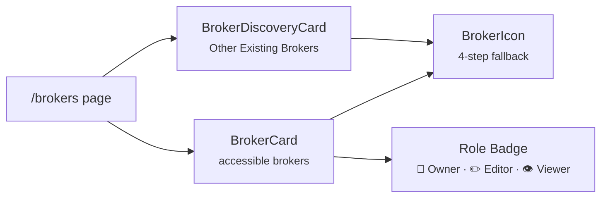

# 🃏 Broker Cards

The two card components of the `/brokers` list page (`routes/(app)/brokers/+page.svelte`): one
card for each broker the user can access, and a smaller one for each broker of the instance they
cannot open.

---

## 🏦 BrokerCard

`BrokerCard.svelte` shows one accessible broker. The whole card is a link to its detail page
(`<a href="/brokers/{id}">`).

    

### ⚡ Features

- **Header** — [BrokerIcon](forms.md#brokericon) (`md`), the role badge when `user_role` is set
  (👑 Owner, ✏️ Editor, 👁️ Viewer, named in its tooltip), the name, and a one-line description
- **Actions** — Share (`share`), Edit (`edit`), Delete (`delete`) and, when `portal_url` is set,
  a button that opens the portal in a new tab (a greyed icon otherwise). Each button stops the
  click, so it never follows the card link. They show for every role: the server enforces the
  rules (edit: Owner or Editor; delete: Owner), and the list page opens the sharing modal
  read-only for a non-Owner
- **Figures** — from `summary`: **NAV** (`net_worth`) and **Gain/Loss** (`gain_loss` in
  `targetCurrency`, with `gain_loss_percent`; red when negative), or `—` while `summary` is `null`
- **Cash Balances** — one chip per currency of `summary.cash_balances`, largest first, or
  *No cash positions*
- **Footer** — *{n} asset(s)* (`assetCount`) and *{n} currency(ies)* (the number of cash balances)
- **Closed accounts**: a broker whose `is_active` is `false` (**Account Active** off) is dimmed
  (`class:opacity-60`). The portfolio figures still include it; the PAC allocator flags it with
  `allocation.broker_inactive` (`portfolio_allocation_source.py`)

### 📋 Props

| Prop | Type | Description |
|------|------|-------------|
| `broker` | object | `id`, `name`, `description`, `portal_url`, `icon_url`, `default_import_plugin`, `allow_cash_overdraft`, `allow_asset_shorting`, `is_active`, `user_role`, `user_share_percentage` |
| `summary` | `BrokerBreakdownCard \| null` | The broker's row of the portfolio report's `summary.by_broker`: `net_worth`, `gain_loss`, `gain_loss_percent`, `cash_balances`. Default `null` |
| `assetCount` | `number` | The broker's rows in the report's `summary.holdings`. Default `0` |
| `targetCurrency` | `string` | The page's **Currency** choice, used for the gain/loss amount. Default `'EUR'` |

**Events**: `edit` `{id}`, `delete` `{id, name}`, `share` `{id}`.

The list page asks one report for all the accessible brokers (`fetchReport(brokerIds, …,
targetCurrency, …)`, without the history series), so the figures follow the portfolio engine's
Owner-share scaling: see [Access Control](../../../../architecture/access_control.md).

---

## 🔍 BrokerDiscoveryCard

`BrokerDiscoveryCard.svelte` shows a broker that the user cannot access (`user_role` is `null`
in `brokerStore`), under *Other Existing Brokers*. It is not a link: it shows only the icon, the
name, and a share button.

### 📋 Props

| Prop | Type | Description |
|------|------|-------------|
| `broker` | `{id, name, icon_url?}` | The broker to show |

**Event**: `share` `{id}` — the list page opens the sharing modal on it, read-only (see
[Users and Brokers](../../../../architecture/users_and_brokers.md)).
