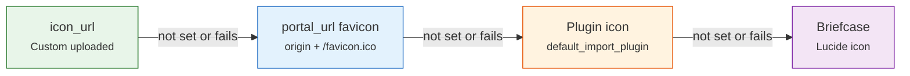

# 📝 Broker Forms

Form and input components for broker creation and editing.

---

## 📝 BrokerForm

The create/edit form for a broker (`BrokerForm.svelte`), used inside
[BrokerModal](modals.md#brokermodal). It dispatches `submit` with the trimmed values, and `cancel`;
the modal makes the API calls.

    

### 📋 Fields

| Field | Component | Required | Description |
|-------|-----------|----------|-------------|
| **Name** | Text input (max 100) | ✅ | Broker display name; unique among all brokers of the instance |
| **Description** | Textarea (max 500) | ❌ | Optional description |
| **Default Import Plugin** | [ImportPluginSelect](../../core-ui/select.md#importpluginselect) | ❌ | BRIM parser proposed for this broker's files |
| **Portal URL** | URL input | ❌ | Broker website; its `/favicon.ico` is an icon fallback |
| **Icon** | [ImagePickerWrapper](../../core-ui/file-upload.md) (`preset="broker-icon"`) | ❌ | Custom broker icon, previewed with [BrokerIcon](#brokericon) |
| **Opened at** | [SingleDatePicker](../../core-ui/datePickers.md#singledatepicker) | ❌ | Account opening date, never in the future (`allowFuture={false}`); today for a new broker |
| **Active** | Toggle | ❌ | `is_active`, on by default |
| **Allow Overdraft** | Checkbox | ❌ | Allow a negative cash balance |
| **Allow Shorting** | Checkbox | ❌ | Allow a negative asset quantity |
| **Initial Balances** | Amount + [CurrencySearchSelect](../../core-ui/select.md#currencysearchselect) rows | ❌ | Create mode only: opening cash per currency; the first row uses the user's base currency |

In edit mode a cleared optional text field is sent as `''`, which clears it on the server; in
create mode it is left out.

### ✅ Validation

Client side, the submit button stays disabled while a save is running or while:

- **Name** is empty after trimming, or longer than 100 characters (`isValid`);
- **Initial balances** repeat a currency (`hasDuplicateCurrencies`, with a warning under the rows).

Balance rows whose amount is zero or negative are dropped on submit. The form has no base-currency
field: currencies appear only in the initial balance rows.

On the server, `BrokerService.create_bulk()` turns each remaining balance row into a `DEPOSIT`
dated **today** (`today_date()`, not `opened_at`), written through
`execute_batch(creates_raw=…)`; a deposit refused by validation adds its issue to the broker's
create errors.

#### Duplicate names {: #duplicate-broker-names }

Broker names are unique across the instance (`Broker.name` is a unique column), so the server
rejects a create whose name is taken. `BrokerModal` turns the backend's English message into a
localized one (`localizeDuplicateName`), chosen by who owns the existing broker, and appends the
recovery guidance:

| Backend message | Key (`en.json`) | English text |
|---|---|---|
| `You already have a broker named '<name>'` | `brokers.duplicateNameOwn` | You already have a broker named "{name}". |
| `Broker '<name>' already exists (owned by '<owner>')` | `brokers.duplicateNameOwned` | Broker "{name}" already exists (owned by "{owner}"). |
| `Broker with name '<name>' already exists`, or the 409 `A broker with that name already exists` | `brokers.duplicateNameExists` | A broker named "{name}" already exists. |
| appended to each of the above | `brokers.duplicateNameRecovery` | To resolve this, rename the existing broker or choose a different name for the broker you are adding. |

The message fills the dialog's error banner. The 409 comes from a creation that lost a race on
the unique name; it also raises an error toast. Any other error is shown as received. The error is
reset whenever a new dialog opens, so it never carries over into the next create or edit.

### 🔔 Feedback {: #broker-feedback }

- **Create** — a success toast, *Broker "{name}" created.* (`brokers.created`), from `BrokerModal`
  once the new broker is merged into `brokerStore`.
- **Delete** — a success toast, *Broker "{name}" deleted.* or *Broker "{name}" and {count}
  transactions deleted.* (`brokers.deleted`, `brokers.deletedWithTransactions`), from the broker
  list page once `DELETE /brokers` succeeds — see [DeleteBrokerDialog](modals.md#deletebrokerdialog).
- **Edit** — the dialog closes without a toast.

---

## 🖼️ BrokerIcon

A smart icon component (`BrokerIcon.svelte`) with a **4-step fallback chain**. The chain itself
lives in `lib/utils/broker/brokerIconChain.svelte.ts`: it lists the candidate URLs in order and
moves to the next one when an image fails to load.

When a `brokerId` is given but none of the three fields is, the icon asks `brokerStore` for them
(`ensureBrokerIconFieldsLoaded`), which reads `GET /brokers/{id}` at most once per broker until the
cache is refreshed or the broker invalidated — see
[Reference State](../../../state/reference-state.md#broker-icon-hydration).

### 📏 Sizes

| Size | Dimensions | Used in |
|------|-----------|---------|
| `sm` | 24×24 px | Select options (`BrokerSearchSelect`), inline badges |
| `md` | 40×40 px | `BrokerCard` |
| `lg` | 64×64 px | Broker detail page header, `BrokerForm` icon preview |
| a number | that many px | Custom size; the briefcase takes 60% of it (at least 12 px) |

### 📋 Key Props

| Prop | Type | Description |
|------|------|-------------|
| `brokerId` | `number \| null` | Lets the icon fetch missing icon fields from `brokerStore` |
| `iconUrl` | `string \| null` | Custom icon URL (step 1) |
| `portalUrl` | `string \| null` | Broker website for favicon (step 2) |
| `pluginCode` | `string \| null` | BRIM plugin code for icon (step 3) |
| `size` | `'sm' \| 'md' \| 'lg' \| number` | Icon size (default `md`) |
| `altText` | `string` | Accessible alt text |

**Used by**: [BrokerCard](cards.md), [BrokerSearchSelect](../../core-ui/select.md#brokersearchselect), broker detail page.
