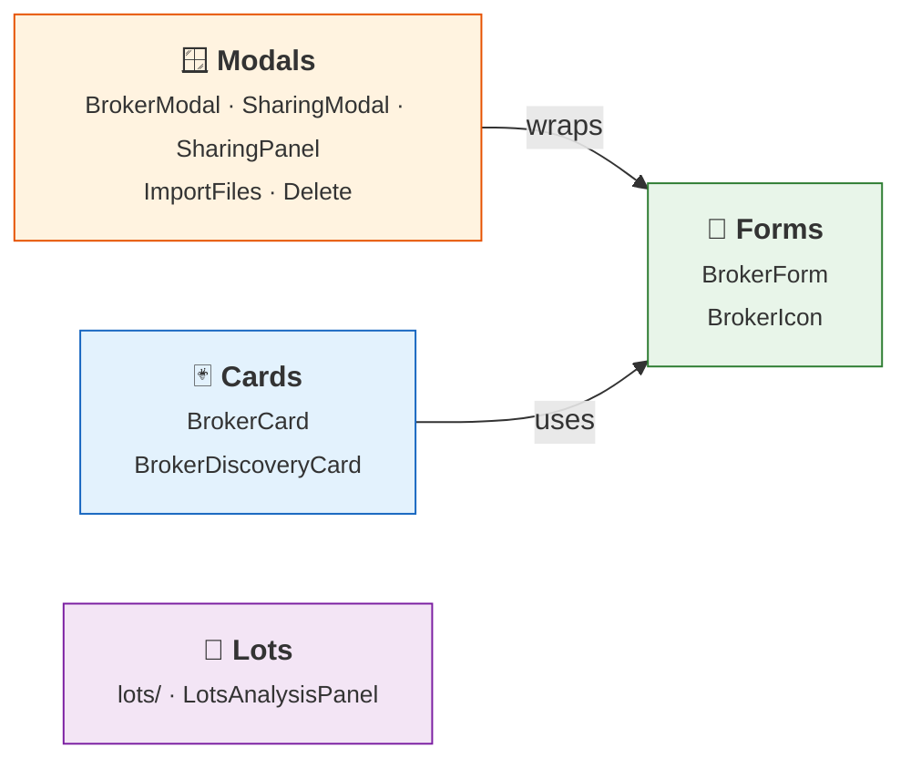

# 🏦 Broker Components

Components in `lib/components/brokers/` that power the broker management UI.

## 📖 Overview

Each sub-section has its own detailed composition diagram. See the pages below.

## 📑 Sub-sections

| Section | Components | Description |
|---------|-----------|-------------|
| **[Cards](cards.md)** | BrokerCard, BrokerDiscoveryCard | The cards of the `/brokers` list page |
| **[Forms](forms.md)** | BrokerForm, BrokerIcon | Create/edit form and smart icon with fallback |
| **[Modals](modals.md)** | BrokerModal, BrokerSharingModal, BrokerSharingPanel, BrokerImportFilesModal, DeleteBrokerDialog | The broker dialogs, and the sharing panel that the Info tab embeds |
| **[Lots Analysis](../lots-analysis.md)** | `lots/` (LotsAnalysisPanel, UnifiedLotsTable, …) | The FIFO lots panel of the Positions views |

The dialogs are built on [ModalBase](../../core-ui/modals.md) from the UI Base components.
BrokerSharingPanel is a plain panel — wrapped by BrokerSharingModal, or embedded in the broker's
Info tab — whose add-user and edit-user dialogs are ModalBase too.
