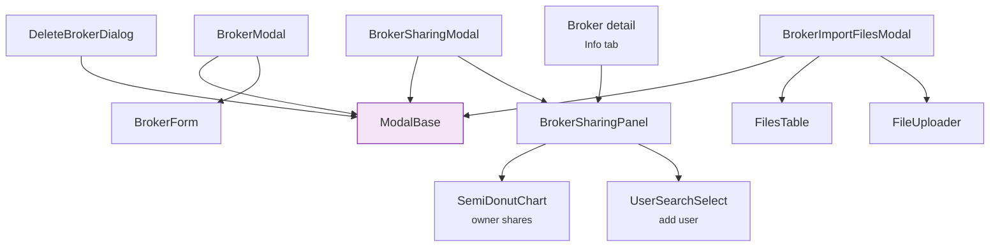

# 🪟 Broker Modals

All broker-related modal dialogs. Each is built on [ModalBase](../../core-ui/modals.md).

---

## ✏️ BrokerModal

Modal wrapper (`BrokerModal.svelte`) around [BrokerForm](forms.md) for creating or editing a
broker. The broker list and detail pages, the Files page, the Import Wizard and the transaction
form (to create a broker inline) all mount it.

- **Create** — `POST /brokers` with a one-item list. On success the new broker is merged into
  `brokerStore` (`mergeBrokers`), a success toast reads *Broker "{name}" created.*, then
  `oncreated({id})` and `onclose()` run.
- **Edit** — `PATCH /brokers/{id}` with the form values. On success the patched fields are merged
  into `brokerStore`, then `onupdated({id})` and `onclose()` run; there is no toast.
- **Errors** appear in the dialog's [InfoBanner](../../core-ui/feedback.md#infobanner). When a
  create fails on a duplicate name, the message is localized and carries recovery guidance
  ([Duplicate names](forms.md#duplicate-broker-names)). The error, the touched flag and the discard
  prompt are reset whenever a new dialog opens, and the answer to a request from an earlier dialog
  is ignored.
- **Closing** with unsaved edits asks *Discard Changes?* (**Continue Editing** /
  **Discard & Close**); nothing closes while a save is running.

### 📋 Props

| Prop | Type | Description |
|------|------|-------------|
| `isOpen` | `boolean` | Modal visibility |
| `mode` | `'create' \| 'edit'` | Defaults to `'create'` |
| `brokerId` | `number \| null` | Broker updated in edit mode |
| `initialData` | object | Values pre-filled in the form (`name`, `description`, `portal_url`, `icon_url`, `default_import_plugin`, `allow_cash_overdraft`, `allow_asset_shorting`, `is_active`, `opened_at`) |
| `zIndex` | `number` | Defaults to `50`; raised when the modal is stacked over another one |
| `tourPreview` | `boolean` | Non-writing preview: the form is inert, has no submit button, and the dialog closes without the discard prompt |
| `onclose`, `oncreated`, `onupdated` | callbacks | `oncreated` and `onupdated` receive `{id}` |

---

## 🤝 BrokerSharingModal

Sharing a broker with other users, with RBAC roles and ownership shares.

    

The sharing UI is one component, `BrokerSharingPanel.svelte`, mounted in two places:

| Host | Mounted as | Read-only when |
|---|---|---|
| Broker list (`routes/(app)/brokers/+page.svelte`) | `BrokerSharingModal`: the panel inside `ModalBase`, opened from a broker card's share action | the user is not the broker's `OWNER`; always for a discovery card (a broker the user has no access to) |
| Broker detail, **Info** tab (`routes/(app)/brokers/[id]/+page.svelte`) | the panel itself, without modal chrome | the user is not the broker's `OWNER` |

`BrokerSharingModal` adds only the title (*Share Broker — {name}*), the **X** button and the
unsaved-changes prompt.

### 🧩 BrokerSharingPanel {: #broker-sharing-panel }

| Prop | Type | Description |
|---|---|---|
| `brokerId` | `number` | Broker whose access list is loaded; changing it reloads the list |
| `readOnly` | `boolean` | Shows the list without any editing control |
| `onChanged` | `() => void` | Called after a successful save or self-service action, so the host can reload |
| `onCancel` | `() => void` | Optional. Renders **Cancel** next to Save and is called after a successful save. The modal passes its close handler; the Info tab passes nothing |
| `hasChanges` | `boolean`, `$bindable` | `true` while the staged list differs from the loaded one |

### ⚡ Features

- **Ownership chart** — a `SemiDonutChart` of the owners' shares with the *Allocated* and
  *Available* totals. When the owners' shares exceed 100% a warning banner appears; Save stays
  available and the server refuses the list.
- **Owners, Editors, Viewers** — three columns, one chip per user with role and share.
- **Add user** (the **+** under the chart) — the candidates come from `GET /users/search`
  (excluding users who already have access) and are picked with `UserSearchSelect`, built on
  [SearchSelect](../../core-ui/select.md#searchselect). The role defaults to Viewer; only an Owner
  gets a share, capped at what is still unallocated.
- **Edit and remove** — a chip opens the role and share editor, which also removes the user after
  a confirmation. The last Owner can be neither removed nor demoted.
- **Your access** — the user's own row offers **Leave broker** (**Leave and delete broker** for the
  last Owner) and, for an Editor, **Switch to viewer**. Both ask for confirmation and then act at
  once — they are not staged — and both stay available in read-only mode.

### 💾 Staged save, Reset and closing {: #sharing-save }

Adding, editing and removing users only change the panel's local list; nothing is written before
**Save Configuration**.

- **Save Configuration** sends the whole list in one `PUT /brokers/{id}/access`, shares as 0–1
  fractions. It is disabled while nothing changed, during a save, and until the current list has
  loaded: a failed load shows a blocking error with **Retry** instead of an empty, editable list.
  On success the saved list becomes the new baseline, `onChanged` runs, a toast reads
  *Access configuration saved*, and `onCancel` is called. A refused save is shown inline in the
  panel and keeps the draft.
- **Reset** (the ↺ button, shown only with unsaved changes) puts back the list as loaded.
- **After a save, the two hosts differ.** The panel awaits a `tick()` before calling `onCancel`,
  so the bound `hasChanges` is already `false`: in the list-page modal a successful save closes
  the dialog without the discard prompt. The Info tab passes no `onCancel`, so the panel stays
  open and editable after saving.
- **Closing with unsaved changes.** The modal asks *Discard Changes?* (**Discard & Close**) on
  **X**, **Cancel**, Escape or a backdrop click. The Info tab binds `hasChanges` but does not use it
  yet: switching tab unmounts the panel and drops unsaved changes without a prompt.
- **Read-only** (non-owners): the chips are disabled, and there is no add button, Reset, Save or
  Cancel.

### 🌐 API Calls

- `GET /brokers/{id}/access` — load the current access list
- `PUT /brokers/{id}/access` — replace it with the staged list
- `PATCH /brokers/{id}/access/me` — switch the current user from Editor to Viewer
- `DELETE /brokers/{id}/access/me` — leave the broker; when the last Owner leaves, the broker is
  deleted
- `GET /users/search` — candidates for **Add user**

See [Broker Sharing (User Guide)](../../../../../user/brokers/sharing.md) and [Access Control (RBAC)](../../../../architecture/access_control.md) for details.

---

## 📥 BrokerImportFilesModal

Modal for the BRIM report files of one broker, opened from the broker detail page (*Uploaded
Reports* in its Transactions tab). It stores and manages files; parsing them is the job of the
[Import Wizard](../import-wizard.md).

### ⚡ Features

- Lists the broker's files in a `FilesTable` (`type="brim"`, without the broker column), with
  preview (`FilePreviewModal`) and single or bulk delete; a bulk delete asks for confirmation.
- Uploads through [FileUploader](../../core-ui/file-upload.md) (`.csv`, `.xlsx`, `.xls`, several
  at once). A pending file can be renamed before upload (`FileEditModal`). The files of one upload
  share a `batch_id` (`generateUUID()`), so a report-set plugin can read them as one
  [report set](../import-wizard.md#report-sets). The upload stops at the first failing file and
  names it in the error banner.
- Closing with files picked but not uploaded asks for confirmation (*Pending Uploads*).
- A link opens the Files page filtered on this broker (`/files?tab=brim&broker=<id>`).

### 🌐 API Calls

- `GET /brokers/import/files?broker_ids=<id>` — list the broker's files
- `POST /brokers/import/upload` — upload one file (multipart: `file`, `broker_id`, `batch_id`)
- `DELETE /brokers/import/files/{file_id}` — delete one file

For details on the BRIM plugin system, see [Registry & Plugin System](../../../../architecture/patterns/registry_pattern.md).

---

## 🗑️ DeleteBrokerDialog

A `ModalBase` dialog (`DeleteBrokerDialog.svelte`) driven by the broker list page
(`confirmDelete` in `routes/(app)/brokers/+page.svelte`):

- It first asks to confirm the deletion of the named broker. **Delete** dispatches `confirm` with
  `{force: false}`, and the page calls `DELETE /brokers?ids=<id>&force=false`.
- When the broker still has transactions, the server refuses and the dialog switches to its
  **blocked** state (`blocked`, `transactionCount`): it says how many transactions the broker
  holds and offers **Go to transactions** (`viewTransactions`, which opens
  `/transactions?broker_id=<id>`) or **Delete broker and transactions** (`confirm` with
  `{force: true}`).
- On success the page evicts the broker from `brokerStore` (`invalidateBroker`), closes the dialog,
  shows a success toast — *Broker "{name}" deleted.*, or *Broker "{name}" and {count} transactions
  deleted.* after a force delete — and reloads the list. A failure ends in an error toast
  (*Could not delete broker*).

!!! note "No cash-operation modal"

    Deposits and withdrawals have no dialog of their own: they are ordinary transactions. The
    broker detail page opens the bulk transaction workspace (`TransactionBulkModal`, intent
    `{action: 'create'}`) with the broker pre-selected through `defaultBrokerId`.
