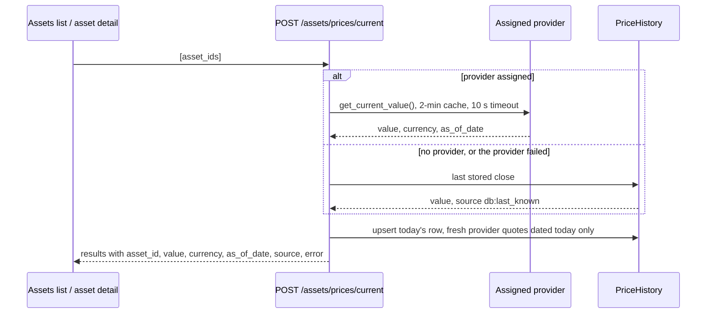

# 📡 Live Prices

LibreFolio shows **live current prices** on the Assets list and on the asset detail page. Both
pages poll the bulk current-price endpoint themselves; there is no ticker component. The Assets
list and the asset-detail price summary go through one small service, `livePriceService`; the
asset-detail chart head calls the generated API client directly.

!!! note "No `LiveTicker` component"

    The `LiveTicker` badge strip this page used to describe was removed in August 2026 (commit
    `52c8d0d70`); the page keeps its address for the existing links. The dashboard shows no live
    prices: it never calls the endpoint.

## 🧩 The shared service {: #live-price-service }

`lib/services/livePriceService.ts` holds the two helpers both pages use:

| Export | Description |
|---|---|
| `fetchCurrentPrices(ids)` | Wraps `POST /api/v1/assets/prices/current` and returns `LivePriceResult[]`: `{assetId, value, currency, source, error}`, with `value` parsed to a number (`null` when the asset has no price). An empty `ids` list sends nothing. |
| `computeDirection(current, prev)` | `'up'`, `'down'` or `'neutral'` — neutral when either value is missing or both are equal. |

Callers never block on it: they fire the request, keep what they show until the answer arrives,
and on an error keep the last known value.

## 🔁 Where prices are polled {: #polling }

| Poll | Interval | Runs while | Asks for | Feeds |
|---|---|---|---|---|
| Assets list (`routes/(app)/assets/+page.svelte`) | at once, then every 30 s | the date range ends today or later, and the list is not empty | every asset of the list, in one request | `livePriceMap` → `AssetCard`, `AssetTable` |
| Asset detail, price summary (`routes/(app)/assets/[id]/+page.svelte`) | at once, then every 30 s | the date range ends today or later | the asset | `AssetPriceSummary` |
| Asset detail, chart head (same page) | every 60 s, first after 5 s | the asset has a provider assigned | the asset | today's point of the price chart |

"The date range ends today or later" is the `isHeadToday` flag of both pages: `dateEnd` compared
with today's ISO date. When it is false, both pages show the last close of the selected range
instead.

### 📋 Assets list: one poll per set of assets {: #assets-list-polling }

The polling `$effect` does not read the `assets` array. It depends on `isHeadToday` and on
`liveAssetIdsKey` — the asset ids, sorted and joined into one string — so it restarts only when
the **set** of assets changes: an asset created or deleted restarts it (immediate poll, new
interval); the price reloads, which reassign the same assets, do not. The explicit refreshes —
**Refresh all** and the end of a sync — call `refreshLivePricesNow()`, one immediate poll per user
action.

This matters because the endpoint is a write (see [Backend](#backend)): every successful call is
a portfolio mutation (`isPortfolioAffectingMutation`, `lib/stores/portfolio/portfolioMutation.ts`)
that marks the report, risk and lots caches stale — see
[Domain state](../../state/domain-state.md). Before 1.2 the effect read `assets` itself, so every
reassignment of the list — several per refresh — fired an extra request, and each of those
mutations could cost the correlation tab on the same page the risk answers it was waiting for.

Each poll rebuilds `livePriceMap` (`Map<assetId, {value, direction}>`), the direction comparing
the new value with the previous poll's:

- `AssetCard` shows the live price (or the asset's last price) with emerald or red text and border
  while the last tick went up or down; the tint lasts until the next poll.
- `AssetTable` uses the live value in the **Last price** column, coloured the same way. A market
  quote is formatted with `sensitivity: 'public'`: the same figure for every user, it is not hidden
  by the privacy toggle.

### 🔎 Asset detail: summary and flash {: #asset-detail }

The summary poll replaces the last chart close with the live price in `AssetPriceSummary`. When
the display currency differs from the asset's, the price is converted for today through
`POST /api/v1/fx/currencies/convert`; if that fails, the native price is shown with the asset's
currency and a ⚠ tooltip (`livePriceConversionFailed`).

The direction compares the **native** values of two consecutive polls, so switching the display
currency never fakes a tick, and the first poll after a (re)mount is neutral.

#### ✨ Price flash {: #price-flash }

On an up or down tick the page sets `livePriceDirection` and increments `livePriceFlashToken`.
`AssetPriceSummary` re-keys the price element on the token (`{#key}`), so the animation restarts
even on two ticks in the same direction, and applies `.lf-price-flash-up` or
`.lf-price-flash-down` (`src/app.css`): the number jumps to emerald or red and eases back to its
resting colour in 1.3 s. `LIVE_PRICE_FLASH_DECAY_MS` (1300 ms) then resets the direction to
neutral. Under `prefers-reduced-motion` the colour swaps without the animation and the same timer
clears it. Test hooks: `data-testid="asset-detail-live-price"` and `data-live-price-direction`.

#### 📈 Chart head poll

Independently, the page asks for the current price every minute when the asset has a provider,
and merges today's close into the chart data (`mergeChartPointsIncremental`) when it changed — no
reload, no flicker. A tick is skipped while the browser tab is hidden, while a full chart reload is
running, or when the user has moved to another asset. In a chart converted to another currency,
or in calendar-return mode, it reloads the chart silently instead of merging.

## ⚙️ Backend {: #backend }

`POST /api/v1/assets/prices/current` takes a list of asset ids and answers
`FACurrentPriceResponse` (`results`, `success_count`). `get_current_prices_bulk`
(`backend/app/services/asset_sources/price_query.py`) resolves every asset in parallel:

- A provider answer has `source: "provider:<code>"` and is cached for two minutes
  (`_asset_current_cache`, `backend/app/services/asset_sources/core.py`).
- An asset with no price at all comes back with `value: null` and an `error`.
- **Side effect**: a provider quote dated today creates or extends today's `PriceHistory` row. A
  database fallback is never written back. This write is why the frontend treats the call as a
  portfolio mutation.

## 🔗 Related

- 📡 [Bulk Current Price Endpoint](../../../api/overview.md#post-apiv1assetspricescurrent-bulk-current-price)
- 💰 [Asset Architecture](../../../backend/assets/architecture.md) — Sync pipeline and pricing
- 🧠 [Domain state](../../state/domain-state.md) — The portfolio caches and the mutation signal
- 🎨 [Styling](../../styling.md#utility-classes) — The `.lf-price-flash-*` classes

