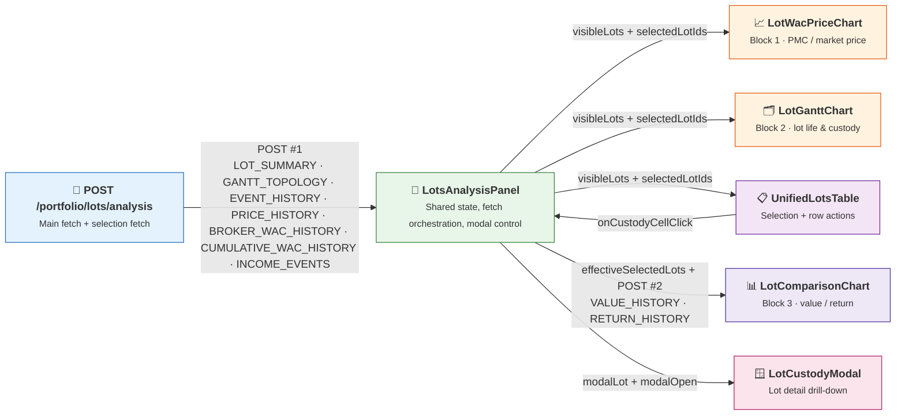

# 🔬 Lots Analysis

The **FIFO Lots Analysis** feature group is the frontend drill-down for the FIFO v3 subsystem. It is mounted from the **Dashboard Positions** tab and the **Broker detail Positions** tab, and complements the aggregate portfolio and WAC views with a per-lot perspective: **price vs WAC**, **custody topology**, **tabular inspection**, **value/return comparison**, and **lot-level chronology**.

---

## 🏗️ Architecture

## 🧩 Component composition

| Component | Role | Key inputs / outputs |
|---|---|---|
| `LotsAnalysisPanel` | Orchestrating parent | Owns fetch lifecycle, shared selection, shared zoom, open/closed lot filter, and custody modal state. |
| `LotWacPriceChart` | **Block 1**: PMC / market price | Consumes `visibleLots`, WAC histories, market price history, lot events, income events, `quoteBaseQuantity`, and shared zoom. Emits `onSelectionChange`, `onZoomChange`, and `onEventDoubleClick`. |
| `LotGanttChart` | **Block 2**: lot life & custody | Consumes `visibleLots`, `ganttSegments`, lot events, shared zoom, and open/closed toggle state. Emits `onSelectionChange`, `onZoomChange`, and `onRowDoubleClick`. |
| `UnifiedLotsTable` | Tabular lot inspection | Consumes `visibleLots`, `selectedLotIds`, brokers, and currency. Emits `onSelectionChange`, `onCustodyCellClick`, `onViewGanttLot`, and `onGotoOpeningTransaction`. |
| `LotComparisonChart` | **Block 3**: value / return comparison | Consumes `effectiveSelectedLots`, `valueHistory`, `returnHistory`, `incomeEvents`, `currency`, and `xAxisRange`. |
| `LotCustodyModal` | Lot drill-down modal | Renders only when `modalOpen` is true and `modalLot` is set. Receives the selected lot plus its filtered `lotEvents` timeline. |

### Render order inside `LotsAnalysisPanel`

The template renders the feature group in this exact order:

1. `DataQualityBanner` (when issues exist)
2. `LotWacPriceChart`
3. `LotGanttChart`
4. `UnifiedLotsTable`
5. `LotComparisonChart`
6. `LotCustodyModal` (conditionally rendered after the main panel block)

---

## 🔄 Data flow

### 1. Main analysis fetch

When the panel opens or the asset / broker / date-range scope changes, `LotsAnalysisPanel` sends a first `POST /portfolio/lots/analysis` request with:

- `LOT_SUMMARY`
- `GANTT_TOPOLOGY`
- `EVENT_HISTORY`
- `PRICE_HISTORY`
- `BROKER_WAC_HISTORY`
- `CUMULATIVE_WAC_HISTORY`
- `INCOME_EVENTS`

This populates the shared lot list, the Gantt topology, Block 1 overlays, and the data-quality banner.

### 2. Selection-scoped comparison fetch

A second `POST /portfolio/lots/analysis` request is triggered by the derived `effectiveSelectionIds`. It requests:

- `VALUE_HISTORY`
- `RETURN_HISTORY`

This fetch is scoped to the current effective lot set and feeds **only** `LotComparisonChart`.

### 3. Shared selection model

`selectedLotIds` is lifted to the parent and shared across the feature group.

- `selectedLotIds.length > 0` → use the explicit selection.
- `selectedLotIds.length === 0` → interpret as **all visible lots**, not “none”.

This is encoded in:

- `effectiveSelectionIds = selectedLotIds.length > 0 ? selectedLotIds : visibleLots.map(...)`
- `effectiveSelectedLots = selectedLotIds.length > 0 ? selectedLots : visibleLots`

The open/closed filter is also parent-owned. `LotGanttChart` renders the **Open / Closed** toggle, but `LotsAnalysisPanel` derives `visibleLots` so the WAC chart, table, and comparison chart stay consistent.

### 4. Custody modal drill-down

`UnifiedLotsTable` defines a row kebab action with id `lot-view-details-action`. That action calls the `onCustodyCellClick` prop, which is bound in the parent to `handleCustodyCellClick(lot)`. The handler sets:

- `modalLot = lot`
- `modalOpen = true`

Then `LotCustodyModal` is rendered with the chosen lot and `history={lotEvents.filter((event) => event.lot_id === modalLot?.lot_id)}`.

---

## 🧱 Component notes

### `LotsAnalysisPanel`

The parent is intentionally thin in business logic and heavy in orchestration:

- loads the initial payload and the selection payload in two separate `$effect`-driven requests;
- resets `selectedLotIds`, shared zoom, and computed range when a new panel instance opens;
- keeps Gantt and Block 1 zoom synchronized through `sharedZoomStart` / `sharedZoomEnd`;
- bridges cross-component navigation (`table → Gantt`, `Gantt → table`, event marker → multi-lot selection);
- owns the custody modal lifecycle;
- when `calculation_status === 'FAILED'`, shows a red warning banner (`lots-analysis-panel-failed`) **above** the panel but still renders the full charts/table ("warn but show" — reconstructed values stay inspectable, flagged as possibly incomplete).

### `LotWacPriceChart`

This chart is the **price / cost-basis** view of the selected asset.

- draws broker WAC lines, cumulative WAC, market price, transaction markers, income markers, and lot performance bubbles;
- applies `quoteBaseQuantity` scaling so WAC and opening-unit-price values align with market quotes on bond-like assets;
- supports **ABS / %** mode and **Auto / From 0** Y-axis behavior in absolute mode;
- uses bubble click for lot selection and marker double-click for cross-component selection jumps.

### `LotGanttChart`

This chart is the **custody topology** and **life-cycle** view.

- renders each lot as one or more custody lanes using custom ECharts series;
- creates child lanes for transfer branches and connects them with elbow lines;
- exposes invisible DOM hit targets (`lot-gantt-segment-{lotId}`) over canvas bars for accessibility and E2E interaction;
- keeps its time window synchronized with Block 1, but owns the **Open / Closed** toggle UI.

### `UnifiedLotsTable`

The table is the **inspection and action hub**.

- mirrors the parent-filtered `visibleLots` set;
- supports multi-selection and propagates row selection back to the parent;
- exposes custody cells as clickable drill-down entry points;
- offers row actions for lot detail, Gantt focus, opening transaction navigation, and lot-id copy;
- adds four **net columns** (`allocated_fees`, `allocated_taxes`, `net P&L`, `net return`) shown by default
  only when **any visible row** carries allocated FEE/TAX (`hasNetCosts`); otherwise they stay hidden.
  Visibility follows the `DataTable` override policy: the dynamic default applies until the user explicitly
  toggles a column, and **Reset layout** clears that override and re-applies the dynamic default.

### `LotComparisonChart`

This chart is the **selection-dependent economic comparison** view.

- `value` mode shows only the aggregated economic stack (`openValue`, `proceeds`, `income`, comprehensive total, opening value);
- `return` mode shows aggregate return plus per-lot lines when at least two lots are plotted;
- consumes only the second fetch (`VALUE_HISTORY`, `RETURN_HISTORY`), which keeps the heavy history payload scoped to the current lot set;
- reuses income `|` markers in both modes.

### `LotCustodyModal`

The modal is the **deep audit view** for one lot.

It shows summary metrics, current custody fragments, and a clickable chronology built from `EVENT_HISTORY`, with navigation to the active transaction when available.

When the lot carries allocated FEE/TAX, it also renders a **net breakdown** block: gross total P&L → `− fees`
→ `− taxes` → **net total P&L** and **net return**. Only the numeric breakdown is shown today; the cost
provenance (pool / rule / source transactions) is available in the DTO but not yet surfaced here.

---

## 🧪 `data-testid` reference

The list below reflects the literal `data-testid` strings present in the component source files. Dynamic ids are shown with placeholders.

| Component | `data-testid` values |
|---|---|
| `LotsAnalysisPanel` | `lots-analysis-panel`, `lots-analysis-panel-title`, `lots-analysis-panel-asset-link`, `lots-analysis-panel-close`, `lots-analysis-panel-error`, `lots-analysis-panel-loading`, `lots-analysis-panel-failed` |
| `LotWacPriceChart` | `lot-wac-price-chart`, `lot-wac-yaxis-toggle`, `lot-wac-yaxis-auto`, `lot-wac-yaxis-zero`, `lot-wac-toggle-absolute`, `lot-wac-toggle-percentage` |
| `LotGanttChart` | `lot-gantt-chart`, `lot-gantt-state-filter`, `lot-gantt-filter-open`, `lot-gantt-filter-closed`, `lot-gantt-scroll`, `lot-gantt-echart`, `lot-gantt-segment-{lotId}`, `lot-gantt-sticky-axis`, `lot-gantt-legend`, `lot-gantt-legend-broker-{brokerId}`, `lot-gantt-legend-transit` |
| `UnifiedLotsTable` | `unified-lots-table`, `unified-lots-custody-{lotId}` |
| `LotComparisonChart` | `lot-comparison-chart`, `lot-comparison-value-yaxis-toggle`, `lot-comparison-value-yaxis-auto`, `lot-comparison-value-yaxis-zero`, `lot-comparison-mode-toggle`, `lot-comparison-mode-value`, `lot-comparison-mode-return`, `lot-comparison-empty`, `lot-comparison-echart`, `lot-comparison-estimated-at-cost-legend` |
| `LotCustodyModal` | `lot-custody-modal-title`, `lot-custody-modal-lot-id`, `lot-custody-modal-close`, `lot-custody-modal-summary`, `lot-custody-modal-value-source`, `lot-custody-modal-asset-income`, `lot-custody-modal-market-pnl`, `lot-custody-modal-total-pnl`, `lot-custody-modal-total-return`, `lot-custody-modal-cash-yield`, `lot-custody-modal-states`, `lot-custody-modal-current-custody`, `lot-custody-modal-absolute-quantity-info`, `lot-custody-modal-custody-summary`, `lot-custody-modal-custody-summary-row-{index}`, `lot-custody-modal-custody-fragments-label`, `lot-custody-modal-custody-row-{index}`, `lot-custody-modal-current-custody-empty`, `lot-custody-modal-history`, `lot-custody-modal-history-row-{index}`, `lot-custody-modal-history-details-{index}`, `lot-custody-modal-history-empty`, `lot-custody-modal-footer-close`, `lot-custody-modal-footer-goto-transaction` |

!!! note "Testing nuance"

    `LotCustodyModal` also passes `testId="lot-custody-modal"` to `ModalBase`, but that string is not a literal `data-testid` attribute inside `LotCustodyModal.svelte` itself.

---

## 🔗 Related

- ⚙️ **[Backend FIFO Lot Engine](../../../backend/transactions/fifo_lot_engine.md)**
- 🧮 **[Backend Lots Analysis Service](../../../backend/transactions/lots_analysis_service.md)**
- 📚 **[FIFO Lot Analysis Theory](../../../../financial-theory/technical-analysis/performance-metrics/fifo-engine/fifo-lot-analysis.md)**
