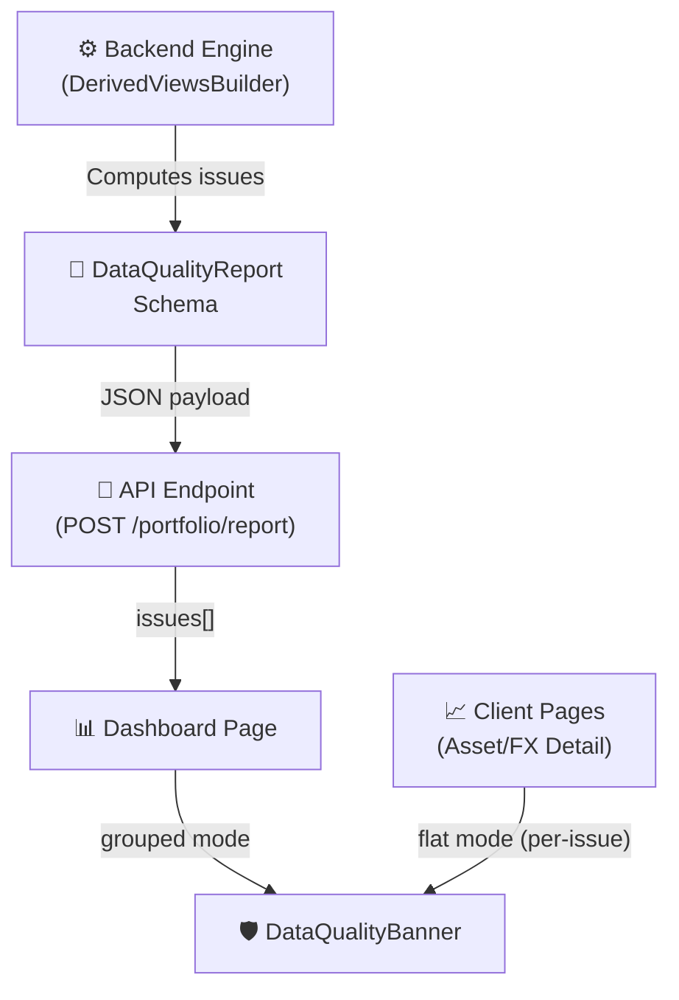

# 🛡️ DataQualityBanner Component

Component and model for unified data quality warnings across the LibreFolio UI.

---

## 🔍 Overview

`DataQualityIssue` is the standard model for surfacing data quality problems (missing prices, missing FX, incomplete NAV, etc.) across three key pages:
- **Dashboard** 📊
- **Asset Detail** 📈
- **Forex Detail** 💱

`DataQualityBanner` is the single, reusable UI component that renders these issues consistently. Before this system existed, each page had its own ad-hoc inline banners — separate markup, no consistency, and no Call-To-Action (CTA). Now, all three pages share the same component and issue model.

### 📁 File Mapping

| File | Role |
|------|------|
| 🐍 `backend/app/schemas/portfolio.py` | Defines `IssueCode`, `IssueSeverity`, `IssueDomain`, `DataQualityIssue`, and `DataQualityReport` schemas. |
| ⚙️ `backend/app/services/portfolio_engine.py` | `DerivedViewsBuilder.build_data_quality_report()` — generates portfolio-wide issues. |
| 📊 `backend/app/services/portfolio_service.py` | `get_summary()` / `get_report()` — collect the missing FX pairs and the assets without cost basis, then call `build_data_quality_report()`. |
| 🎨 `frontend/src/lib/components/ui/feedback/DataQualityBanner.svelte` | Reusable UI component (supporting `grouped` and `flat` modes). |
| 🌐 `frontend/src/lib/i18n/{en,it,fr,es}.json` | `dataQuality.*` translation namespace for localized warnings. |

---

## 🏗️ Architecture & Data Flow

Here is how data quality reports are computed in the backend and rendered inside SvelteKit pages:



---

## 📁 Component Modes

### 1. `grouped` — Dashboard 📊
* Single amber/sky container grouping all issues.
* Issues are sorted by severity: **Error** 🔴 → **Warning** 🟡 → **Info** 🔵.
* The header adapts dynamically: `"1 error"`, `"2 warnings"`, or `"Data quality note"` (for info-only alerts).
* First 3 issues are visible; an expand button appears when there are more.

```svelte
<DataQualityBanner issues={dataQualityIssues} mode="grouped" onaction={handleBannerAction} />
```

### 2. `flat` — Asset Detail / FX Detail 📈 💱
* One banner is rendered per issue.
* Each banner displays: icon + message + FX pair flags + asset context (in parentheses) + CTA button.

```svelte
<DataQualityBanner issues={assetDetailIssues} mode="flat" onaction={handleBannerAction} />
```

---

## 🖱️ CTA (Call-to-Action) System

The component emits intent — it does not navigate or open modals itself.

```typescript
onaction?: (action: string, target: string | null, issue: DataQualityIssue) => void
```

### 🎯 Active CTA Actions

| Action | Target | Handled By | Description |
|--------|--------|------------|-------------|
| `navigate_asset` | asset_id string | `goto('/assets/' + target)` | Redirects the user to the specific asset details page. |
| `navigate_fx` | FX pair slug | `goto('/fx/' + target)` on the dashboard; the asset detail adds `?start=...&end=...` | Redirects to the FX pair details page. |
| `add_fx_pair` | FX pair slug | `FxPairAddModal` | Opens the modal to configure the missing FX pair. |
| `sync_fx_pair` | First affected pair, unused — the handler syncs every pair in `issue.affected_fx_pairs` (`cta_target` only when that list is empty) | `POST /api/v1/fx/currencies/sync` (dashboard `syncMissingFxRates`) | Body built by `buildMissingFxRatesSyncRequest` (`utils/sync/syncRange.ts`): `{pairs, start, end}`, the pairs as alphabetical slugs and the issue's `message_params.date_from`…`date_to` widened by `padSyncRange` to 7 days either side, the end capped at today — the margin `buildComparisonSyncRange` also uses. E.g. `2022-11-03`…`2023-06-27` → `start: '2022-10-27'`, `end: '2023-07-04'`. Without usable dates: the full history (`start: 'min'`, `end`: today). Timeout 120 s (`FX_SYNC_TIMEOUT_MS`). After the answer the dashboard reloads its report (not after a transport error), then emits one notification, `fx.rates.synced`, detail `{origin: 'dashboard-banner', pairs, start, end, outcome, stillMissing}` (`stillMissing` is `null` when the report was not reloaded); its toast has one line per pair. When the sync answered `ok` or `partial` but the reloaded report still has a `sync_fx_pair` issue for one of those pairs, the toast appends `dataQuality.missingFxRatesAfterSync` and a success becomes a warning. |
| `sync_asset_prices` | First affected id, unused — the handler syncs every id in `issue.affected_asset_ids` | `POST /api/v1/assets/prices/sync` (dashboard `handleBannerAction`) | Sends one item per affected asset: `{asset_id, date_range: {start: 'resume', end: <dashboard end date>}}`. `'resume'` is the backend sentinel for "the day after the last stored price" (full history when there is none). Shows one toast per asset result, then reloads the dashboard report. |

In grouped mode, `navigate_asset` renders one link per affected asset; every other action, `sync_asset_prices` included, renders a single CTA button. While a sync request runs, the dashboard passes the issue's code as the `busyCode` prop: that issue's CTA button shows a spinner and stays disabled until the request settles. The CTA test id (`data-quality-cta-{code}`) and `busyCode` are keyed by the issue code alone, so the two `MISSING_FX_RATES` rows share them: while **Sync rates** runs, the MANUAL row's **View FX** button spins and is disabled too (known limitation).

---

## 🏷️ Active IssueCodes

!!! warning "Do Not Add Future-Proof Codes"

    Every `IssueCode` must be actively generated by the backend engine or constructed client-side. Add a new code only in the same step where it is generated. Do not define unused placeholder codes.

### 📊 Portfolio Issues (generated by `DerivedViewsBuilder.build_data_quality_report`)

| Code | Severity | Condition | CTA Action |
|------|----------|-----------|------------|
| `MISSING_PRICE` | 🔴 Error | Asset held with no PriceHistory and no WAC/cost basis fallback | `navigate_asset` |
| `TRANSACTION_IMPLIED` | 🟡 Warning | Asset held with no PriceHistory but WAC/cost basis available — valued at cost temporarily | `navigate_asset` |
| `STALE_PRICE` | 🟡 Warning | Open position valued at a market price carried forward more than 7 days, on an asset with a provider (full rule below) | `sync_asset_prices` |
| `MISSING_COST_BASIS` | 🟡 Warning | An acquisition of the asset has no known cost: a `TRANSFER` or `ADJUSTMENT` adding quantity without `cost_basis_override` (full rule below). Also emitted by the FIFO lots analysis for the analysed asset. `message_params`: `count`; group `missing_cost_basis` | `navigate_asset` |
| `MISSING_FX_MARKET` | 🟡 Warning | A conversion the report needed ([sources below](#where-missing-fx-pairs-come-from)) has no configured FX pair | `add_fx_pair` |
| `MISSING_FX_RATES` | 🟡 Warning | A configured pair with a real (non-`MANUAL`) provider in at least one route step cannot convert an amount on some dates: no rate exists on or before them (`convert_bulk` backfills without limit), so they precede the pair's first stored rate. Movement dates come from the whole history up to the end date, valuation dates only from the period ([sources below](#where-missing-fx-pairs-come-from)). `message_params`: `count`, `date_from`/`date_to` (span over all affected pairs), `dates_count`; group `missing_fx_rates` | `sync_fx_pair` |
| `MISSING_FX_RATES` | 🟡 Warning | Same, for configured pairs whose routes are all `MANUAL`. `message_params`: `count` only; group `missing_fx_rates_manual` | `navigate_fx` |
| `NAV_INCOMPLETE` | 🔵 Info | One or more days had incomplete NAV (caused by MISSING_PRICE) | none |
| `MWRR_NOT_CALCULABLE` | 🔵 Info | MWRR did not converge or period is too short | none |

**`STALE_PRICE` rule.** `PortfolioService.get_summary` builds the list and passes it to `build_data_quality_report` as `stale_prices_dto`. An asset is listed when, at the end date, all of these hold:

* its position is open (quantity above the dust threshold);
* the position is valued at a **market** price (`ValuationSource.MARKET_PRICE`), not at a trade price;
* that price is carried forward **more than** `STALE_PRICE_THRESHOLD_DAYS` (7) days, so a quote exactly 7 days old is still current;
* the asset has a provider assignment.

Each asset appears once, whatever the number of brokers holding it, as `StalePriceAsset{asset_id, name, last_price_date, stale_days}`, with `stale_days` counted from `last_price_date` to the end date. Left out on purpose: manual assets, which have nothing to sync (those valued at their last trade price, such as crowdfunding or `HOLD` assets, are stale by design); provider assets with no quote at all, already reported as `TRANSACTION_IMPLIED`; closed positions. With stale prices and nothing that makes it `partial`, the report's derived `data_quality_status` is `carried_forward` ([source-data status](../../financial-theory/technical-analysis/risk-metrics/data-quality.md#source-data-status)), so portfolio risk results that read it can turn `PARTIAL`.

**`MISSING_COST_BASIS` rule.** `PortfolioService._missing_cost_basis_assets()` lists the assets whose average cost, in the engine run behind the report, has an acquisition of unknown cost (`AverageCost.unknown_cost_movement_ids`): a `TRANSFER` or `ADJUSTMENT` adding quantity, not split-linked, without `cost_basis_override` (see [WAC & Cost Basis](../backend/transactions/wac.md#diagnostics)). The engine replays the whole history up to the end date, so the position does not have to be open any more. Each asset appears once, as `(asset_id, name)`, whatever the number of brokers. The average cost adds the quantity without any cost: the units count at zero in the purchase cost (`open_cost_basis`), and the position's `wac_per_unit`, `gain_loss` and `annualized_return` are `null` until the pool empties. In grouped mode the issue renders one link per affected asset, labelled with the asset's name.

Two producers build this issue, both through `build_data_quality_report(missing_cost_basis_assets=...)`:

| Producer | Assets listed | Where it shows |
|----------|---------------|----------------|
| `PortfolioService._missing_cost_basis_assets()` | Every asset with an acquisition of unknown cost in the engine run behind the report | Dashboard banner (`summary.data_quality`, or the report's own `data_quality` without a summary) |
| `LotsAnalysisService._report_average_cost_gaps()` | The analysed asset, when one of its WAC lines has an acquisition of unknown cost; the analysis also turns `DEGRADED` | FIFO lots analysis `data_quality`, rendered by `LotDataQualityBanner` without call-to-action buttons |

### 💱 Where missing FX pairs come from {: #where-missing-fx-pairs-come-from }

`PortfolioService.get_summary()` merges every conversion it could not make into `summary.missing_fx_pairs` (pair `FROM/TO` with its dates, `_merge_missing_pairs()`), and `build_data_quality_report()` turns them into `MISSING_FX_MARKET` / `MISSING_FX_RATES` issues. Two sources feed the list:

| Source | Conversions | Dates kept |
|--------|-------------|------------|
| The summary's own conversions | Transaction cash amounts and priced in-kind adjustments at their dates; holding prices and cash balances at the end date; the previous day's price for Δ1; Yield on Cost income | As requested |
| The engine, through `_engine_missing_fx_pairs()` | **Movements** — `PortfolioCalculationResult.missing_fx`: the average cost of each acquisition (report and asset leg), cash amounts, external cash flows, the cost of assets in transit (at the arrival date) | Every date, whenever the movement happened |
| | **Valuations** — `DailyPortfolioState.missing_fx_pairs`: market prices and in-transit cash, day by day | Only the days of the period shown, `[date_from, end date]`; the first one is the period's opening state |

So a purchase made years ago whose rate is missing is reported, because its cost weighs on today's figures, while a valuation gap before the period changes nothing on screen and is left out. When `get_report()` builds no summary, its own `data_quality` takes its missing pairs from the engine source only, and still reports `MISSING_COST_BASIS`.

The FIFO lots analysis reports what its WAC lines could not compute — missing conversions and acquisitions of unknown cost — in its own `data_quality`; see [Lots Analysis Service — WAC lines](../backend/transactions/lots_analysis_service.md#wac-lines).

### 📈 Asset Detail Issues (built client-side in `assets/[id]/+page.svelte`)

| Code | Severity | Condition | CTA Action |
|------|----------|-----------|------------|
| `ASSET_ARCHIVED` | 🟡 Warning | `assetInfo.active === false` | none |
| `RANGE_BEFORE_FIRST_DATA` | 🔵 Info | Selected range starts before first PriceHistory | none |
| `FX_PAIR_MISSING` | 🟡 Warning | Required FX pair not configured | `add_fx_pair` |
| `FX_PAIR_NO_DATA` | 🟡 Warning | FX pair configured but no rate history | `navigate_fx` |
| `FX_PAIR_PARTIAL_GAP` | 🔵 Info | FX data exists but range starts before first rate | `navigate_fx` |

### 💱 FX Detail Issues (built client-side in `fx/[pair]/+page.svelte`)

| Code | Severity | Condition | CTA Action |
|------|----------|-----------|------------|
| `RANGE_BEFORE_FIRST_DATA` | 🔵 Info | Selected range starts before first rate in DB | none |

---

## 🧪 How to Trigger Issues (Manual Testing)

### 📊 Dashboard

| Issue | How to Trigger |
|-------|----------------|
| `MISSING_PRICE` | Add a BUY transaction for an asset that has no PriceHistory entries AND no WAC/cost basis is available. The NAV will exclude it. |
| `TRANSACTION_IMPLIED` | Buy an asset (e.g. BTP in collocamento) before its first PriceHistory is available. WAC must exist. The engine uses WAC as a temporary proxy; the issue disappears once the first price becomes available. |
| `STALE_PRICE` | Hold an open position in an asset **with a provider** whose newest market price is more than 7 days before the dashboard end date, e.g. prices seeded with `POST /api/v1/assets/prices` and ending 10 days ago. Any fresh quote clears it, including the live-price polling of the asset pages (`POST /api/v1/assets/prices/current` stores today's quote). `e2e/portfolio/stale-price-banner.spec.ts` seeds a holding that stays stale: `mockprov` with `INVALID_TICKER_12345`, the one identifier the mock refuses a current price for, and it intercepts the sync the CTA sends. |
| `MISSING_COST_BASIS` | Hold an asset with a `TRANSFER` or `ADJUSTMENT` adding quantity and no `cost_basis_override`. The transaction flows refuse to save such a row (`costBasisRequired`), so write it directly in the database: `test_portfolio_cost_currency.py` (S5) inserts one through the session. |
| `MISSING_FX_MARKET` | Add an asset in a foreign currency (e.g. USD) when the dashboard target currency is EUR and the EUR/USD pair is not configured. |
| `NAV_INCOMPLETE` | Same scenario as `MISSING_PRICE` — appears automatically when NAV is incomplete for ≥1 day. |
| `MWRR_NOT_CALCULABLE` | Portfolio with only 1 transaction on 1 day. MWRR needs ≥2 nav snapshots with a non-zero cash flow. |

### 📈 Asset Detail

| Issue | How to Trigger |
|-------|----------------|
| `ASSET_ARCHIVED` | Asset detail → Edit modal → check "Archived" → save → reload the page. |
| `RANGE_BEFORE_FIRST_DATA` | In DateRangePicker, set start date to a year before the first PriceHistory entry (e.g. 2018 for an asset with data from 2020). |
| `FX_PAIR_MISSING` | Open an asset in a currency different from the display currency (e.g. USD asset, EUR display) when the EUR/USD pair is **not** configured. |
| `FX_PAIR_NO_DATA` | Create an FX pair via the FX page but skip sync — the pair exists but has no rates. |
| `FX_PAIR_PARTIAL_GAP` | Configure an FX pair with data from 2022. Open an asset detail with date range starting in 2020. |

### 💱 FX Detail

| Issue | How to Trigger |
|-------|----------------|
| `RANGE_BEFORE_FIRST_DATA` | Navigate to `/fx/EUR-USD?start=2000-01-01&end=2000-12-31`. Alternatively set DateRangePicker to a very early start date. |

---

## 🔍 Debugging: Verify `data_quality.issues` Payload

Open browser DevTools → Network → find the `POST /api/v1/portfolio/report` request.

In the response JSON, look for:

```json
{
  "data_quality": {
    "issues": [
      {
        "code": "MISSING_PRICE",
        "severity": "error",
        "count": 2,
        "affected_asset_names": ["BTP Più SC", "Apple Inc"],
        "cta_action": "navigate_asset",
        "cta_target": "123"
      }
    ]
  }
}
```

*Note: The `issues[]` array is the single source of truth for dashboard banners. For asset/forex detail, issues are constructed client-side (no network request to inspect).*

---

## 🛠️ How to Add a New IssueCode

1. Add the code to `IssueCode` enum in `backend/app/schemas/portfolio.py`.
2. Generate it in the backend engine (`build_data_quality_report`) **or** construct it client-side on the relevant page.
3. Set `severity`, `cta_action`, `cta_target`, `affected_*` fields appropriately.
4. Add `message_i18n_key` and its translations in all 4 language files under `dataQuality.*`.
5. If a new `cta_action` is needed, add its label in `dataQuality.cta.*` and handle it in the parent `onaction` callback.
6. Update this document.
7. Add a backend unit test (if generated by engine) or E2E test (if visible in the UI).
8. Document how to trigger the issue manually.

---

## 🧪 Test Coverage

### 🐍 Backend Unit Tests (`test_data_quality_report.py`)
* Covers all 5 portfolio codes: severity, affected fields, CTA, count, date_range.
* Empty inputs produce no issues.
* All 5 codes can appear together.
* `TestStalePriceIssue`: the `sync_asset_prices` CTA, the unchanged `dataQuality.stalePrice` message contract (count, aligned affected ids and names) and the `carried_forward` status of a stale-only report.

### 🗄️ Backend Service Tests (`test_portfolio_service.py`)
`TestStalePriceDataQuality` checks the `STALE_PRICE` rule through `get_summary`, on a DB-backed portfolio:

* a provider asset last quoted 10 days ago is flagged once, with its `last_price_date`, its `stale_days` and the `sync_asset_prices` CTA, and the status is `carried_forward`;
* not flagged: a quote exactly 7 days old, a fresh quote, a manual asset with the same 10-day-old quote, a position sold before the end date, a provider asset valued at its trade price (left to `TRANSACTION_IMPLIED`);
* an asset held at two brokers is a single `StalePriceAsset`.

### 🗄️ Backend Service Tests (`test_portfolio_cost_currency.py`)
On a DB-backed portfolio whose rows are inserted directly through the session:

* `TestCostDiagnostics`: a purchase, or an opening cost, in a currency without rates leaves the position's cost incomplete and reaches the banner with its pair (S4, S4b); an `ADJUSTMENT` adding quantity without cost basis raises `MISSING_COST_BASIS` and leaves the row without WAC or P&L (S5); the engine's failures reach `missing_fx_pairs` with the purchase date and only the period's valuation days (S6).
* `TestLotsAverageCostLines` (L2): a purchase that cannot be converted is reported by the lots analysis (pair, issue, `DEGRADED`) and blanks its WAC lines until the pool empties.

Run both backend suites:
```bash
pipenv run ./dev.py test services roi-fifo-utils
pipenv run ./dev.py test services roi-fifo-utils TestStalePriceIssue TestStalePriceDataQuality   # STALE_PRICE only
pipenv run ./dev.py test services roi-fifo-utils TestCostDiagnostics TestLotsAverageCostLines   # missing cost and FX only
```
*(Covers `test_services/test_financial/` — includes `test_portfolio_engine/test_data_quality_report.py`, `test_portfolio_service.py` and `test_portfolio_cost_currency.py`)*

### 🎭 Frontend E2E Tests (`e2e/portfolio/data-quality-banners.spec.ts`)
* Dashboard loads without JS errors.
* Legacy inline banners removed (old testids gone).
* Grouped mode structure checks when issues present.
* Header does not show `"0 errors, 0 warnings"` for info-only issues.
* NAV incomplete message includes dates.
* Flat mode: checks that no grouped container is rendered.
* FX pair missing: CTA button checks.

Run test suite:
```bash
pipenv run ./dev.py test front-portfolio banners
```

### 🎭 Frontend E2E Tests (`e2e/portfolio/stale-price-banner.spec.ts`)
* On a disposable account, a provider-priced holding last quoted 10 days ago is reported as `STALE_PRICE` with the `sync_asset_prices` CTA.
* The grouped banner shows the issue with its single CTA button, not per-asset links.
* The CTA posts one item per affected asset to `POST /api/v1/assets/prices/sync` (`start: 'resume'`, `end`: the dashboard end date), and the button is disabled while the sync runs.
* Once the sync answers, the dashboard reloads its report and the CTA is enabled again. The sync is intercepted with a canned response: no provider is called and no price is written.

Run test suite:
```bash
pipenv run ./dev.py test front-portfolio stale-price-banner
```
