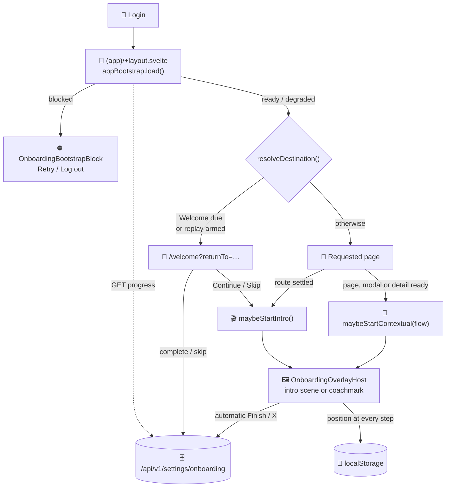

# 🧭 Onboarding Guides

LibreFolio 1.2 adds a guided onboarding: a **Welcome** setup for new accounts, a short **intro
tour** of the navigation, and **contextual guides** that start the first time a user reaches a
page, an *Add* modal, a detail view, the Import Wizard or the bulk workspace. A guide is a
sequence of coachmarks pointing at real controls. The server keeps one versioned status per user
and flow; the browser remembers where an unfinished guide stopped.

This page explains how the system is built, for developers who add or change a guide. What users
see is described in [Getting Started](../../user/getting-started.md) and
[User Preferences](../../user/settings/preferences.md).

## 🧱 Ground rules {: #ground-rules }

1. **The guide observes; it never acts.** It may scroll its target into view, and the intro tour
   moves to `/dashboard` and opens the sidebar for its stops, but nothing in the system clicks,
   fills or saves for the user. When a step advances on a click of its target, the click still
   reaches the control: the coachmark only listens to it. The `guideAnchor` action registers
   nodes and does nothing else (`guideAnchors.test.ts` checks it).
2. **Anchor only what is rendered.** A registered anchor that is hidden counts as absent and
   stalls the step ([Anchors and stalls](#anchors)).
3. **A step describes its own section or control.** It never announces that another guide will
   start. `guideCopy.test.ts` scans every step text of the overlay host, in all four languages,
   for the words that name a guide or a tour; a mention that describes rather than announces is
   added to its `REGISTRY`, with a reason.
4. **Pages talk to the engine, not to the stored state.** Starting, finishing, skipping and
   replaying go through `onboardingGuide`; persistence, resume, stall handling and the cross-tab
   close all live behind it.

## 🗺️ The fifteen flows {: #flows }

The flows are the `OnboardingFlow` enum in `backend/app/db/models.py`, mirrored by
`ONBOARDING_FLOWS` in `frontend/src/lib/types/onboarding.ts`. `welcome` is a page of its own; the
other fourteen are guided flows, declared in `ONBOARDING_GUIDE_CATALOG`
(`frontend/src/lib/features/onboarding/onboardingGuideCatalog.ts`).

| Flow | Kind | Starts when | Steps |
|---|---|---|---|
| `welcome` | Setup page | the layout gate redirects to `/welcome` | — |
| `intro_tour` | Tour | Welcome hands off, or the layout settles on a page | 9 |
| `transactions_page_guide` | Page | `/transactions` has loaded | 4 |
| `transaction_create_guide` | Modal | the transaction form opens in create mode | 4 |
| `transaction_bulk_guide` | Step-managed | the bulk workspace reaches each milestone | 4 |
| `import_guide` | Step-managed | the Import Wizard shows each step; the last one in the bulk editor | 9 |
| `broker_page_guide` | Page | `/brokers` has loaded | 4 |
| `broker_guide` | Modal | the Add Broker modal opens | 3 |
| `broker_detail_guide` | Detail | `/brokers/[id]` has loaded its broker | 5 |
| `fx_page_guide` | Page | `/fx` has loaded | 4 |
| `fx_guide` | Modal | the add-pair modal opens | 2 |
| `fx_detail_guide` | Detail | `/fx/[pair]` has initialized | 4 |
| `asset_page_guide` | Page | `/assets` has loaded | 4 |
| `asset_guide` | Modal | the add-asset modal opens | 3 |
| `asset_detail_guide` | Detail | `/assets/[id]` has loaded its asset | 5 |

*Kind* is descriptive. The catalogue itself knows three fields: `trigger` (`automatic` for the
tour, `contextual` for every other guide), `completionMode: 'steps'` for the two step-managed
flows, and `navigationMode: 'checkpoint'` for the bulk workspace. Every flow is at **version 1**
in `ONBOARDING_FLOW_VERSIONS` (`backend/app/services/onboarding_service.py`).

## 🏗️ Architecture {: #architecture }



Frontend paths below are relative to `frontend/src/`.

| Module | Role |
|---|---|
| `lib/types/onboarding.ts` | Flow list, wire types, the "due" predicates |
| `lib/features/onboarding/onboardingApi.ts` | Client for the endpoints, with strict Zod schemas |
| `lib/stores/app/onboarding.svelte.ts` | Controller: server progress, plus the positions stored in `localStorage` |
| `lib/features/onboarding/onboardingGuideCatalog.ts` | Step ids and flow definitions |
| `lib/features/onboarding/onboardingGuide.svelte.ts` | The engine, singleton `onboardingGuide`: start, step, finish, skip, replay, queue |
| `lib/features/onboarding/guideAnchors.svelte.ts` | Anchor registry and the `guideAnchor` action |
| `lib/features/onboarding/appBootstrap.svelte.ts` | Bootstrap loads and the Welcome redirect rule |
| `lib/features/onboarding/onboardingRouteSettlement.ts` | Applies the redirect, or starts the tour, once per settled route |
| `lib/components/onboarding/OnboardingOverlayHost.svelte` | Presentation table of every step; renders the intro scene or the single coachmark |
| `lib/components/onboarding/OnboardingCoachmark.svelte` | Measures the anchor; spotlight, pointer, panel placement, waiting and stalled states |
| `lib/components/onboarding/OnboardingReplaySection.svelte` | The replay list in Settings |
| `lib/components/onboarding/DeferredAppPopups.svelte` | Holds automatic popups while a guide runs |
| `routes/(app)/welcome/+page.svelte` | The Welcome route, rendering `WelcomePage.svelte` and `WelcomeForm.svelte` |

Each of these singletons resets its in-memory state when the signed-in account changes, through
`registerClientSessionReset` (`lib/stores/app/clientSession.ts`).

!!! note "Tour surfaces are not wired"

    `lib/features/onboarding/onboardingTourSurfaces.svelte.ts` keeps preview handlers for the create
    modals (`brokers.create`, `fx.create`, `assets.create`). Only its unit test exercises it: no
    component registers a handler, and no guide step requests one.

## 🚪 From login to the first guide {: #layout-gate }

The `(app)` route group renders on the client only (`routes/(app)/+layout.ts` sets `ssr = false`).
Once the auth check succeeds, `routes/(app)/+layout.svelte` runs `appBootstrap.load()`: user
settings, onboarding progress and global settings load in parallel, and the bootstrap settles on
one state.

| State | When | The layout renders |
|---|---|---|
| `blocked` | user settings failed, or progress failed and no completed or skipped Welcome was loaded before | `OnboardingBootstrapBlock`, with a retry and a logout button |
| `degraded` | progress failed, but a completed or skipped Welcome was already loaded | the app, with `OnboardingBootstrapBanner` and its retry button |
| `ready` | everything loaded | the app |

`appBootstrap.resolveDestination()` turns the requested path into a destination. While Welcome is
**due** — or a Welcome replay is armed — every app route resolves to
`/welcome?returnTo=<requested path>`; once it is not, `/welcome` resolves back to its `returnTo`,
or to `/dashboard`. Only same-origin absolute paths are accepted as `returnTo`.

`lib/features/onboarding/onboardingRouteSettlement.ts` acts on that destination once per route
snapshot (state, path, destination): it navigates with `replaceState` when the destination
differs, and otherwise starts the intro tour (`onboardingGuide.maybeStartIntro()`). The initial
load owns the settlement; the layout's reactive gate claims only snapshots that were not handled
yet, and never while the load owns it. The layout is a legacy (non-runes) component, so it reads
`appBootstrap.ready` through `toStore()`: that is what makes its `$:` gate re-run when the
bootstrap settles. `routes/(app)/layout.gate.test.ts` pins it — while a redirect is pending, the
layout shows `onboarding-redirecting`, never the requested page.

### 👋 Welcome {: #welcome }

`routes/(app)/welcome/+page.svelte` renders the form: language, base currency and avatar,
pre-filled from the user's settings. A new account's settings row is created by its first
`GET /api/v1/settings/user` (`get_or_create_user_settings` in
`backend/app/services/settings_service.py`) from the instance defaults `default_language`,
`default_currency` and `default_theme`, so Welcome starts from the administrator's choices, as its
hint says (`onboarding.welcome.defaultsHint`). Changing the language previews it immediately;
skipping restores the saved one.

- **Continue** completes the flow with the choices attached (`welcome_settings`);
  `complete_welcome_onboarding()` saves the settings and the completion in one transaction.
- **Skip setup permanently** skips the flow and saves no setting.
- In a **replay**, Continue saves through `PUT /api/v1/settings/user` and leaves the onboarding
  status alone; **Exit tour** saves nothing.

Every path ends in `onboardingGuide.maybeStartIntro(returnTo)`: the page then moves to
`/dashboard` if the tour starts, and to `returnTo` otherwise.

### 🎬 Intro tour {: #intro-tour }

`intro_tour` opens with `intro.scene`, a full-screen scene (`OnboardingIntroScene.svelte`) that
plays three phrases and starts the tour on **Start tour**, or by itself after 8 seconds. Eight
coachmark stops follow, all on navigation controls: `intro.navigation` (the sidebar toggle), then
`intro.dashboard`, `intro.transactions_nav`, `intro.brokers_nav`, `intro.fx_nav`,
`intro.assets_nav`, `intro.tools_nav` and `intro.settings_nav`, anchored on the sidebar links
(`nav.dashboard`, `nav.transactions`, …, derived from each link's `href` in
`lib/components/layout/Sidebar.svelte`).

During the tour the overlay host keeps the user on `/dashboard` and opens the sidebar (the mobile
drawer) for the stops that point into it, while the layout makes the app shell `inert`
(`data-guide-inert="true"`), so the page behind the tour cannot be operated. **Finish** and **X**
both lead to the `returnTo` that Welcome received, or to `/dashboard`.

## 📍 Contextual guides {: #contextual-guides }

A page, modal or detail view starts its guide with `onboardingGuide.maybeStartContextual(flow)`
once its content is ready: `routes/(app)/brokers/+page.svelte` calls it at the end of `onMount`,
after `loadBrokers()`, and the detail pages wait until their broker, pair or asset has loaded.
The engine starts the guide only if the flow is due (resuming at a stored position when there is
one) or if a replay is armed for it ([Progress and positions](#progress)).

Around the host, a few calls keep the state consistent:

- **Opening an Add modal from a page guide** — the page dismisses its own guide first
  (`dismissHost()`), which keeps its position, then starts the modal's guide.
- **Closing a modal** — `dismissHost({restartAtFirst: true})` rewinds a linear guide to its first
  step, so the next opening starts over. Step-managed flows ignore the rewind.
- **Leaving the host route** — each step declares a `hostRoute`: an exact path, or a prefix when it
  ends with `/`, as `'/brokers/'` for broker details. On any other route the overlay host suspends
  the guide on its current step; coming back resumes it there.
- **Another guide is running** — the request is queued, and `maybeStartQueued()` starts it later;
  the overlay host calls it right after suspending a guide whose route was left.
- **A nested dialog** — every modal built on `lib/components/ui/modals/ModalBase.svelte` bumps
  `document.body.dataset.modalScrollLockCount`. While that depth exceeds the step's
  `allowedModalDepth` (0 for page steps, 1 or 2 inside modals), the coachmark is hidden but the
  guide stays active.

On contextual steps whose `pointer` is `'cursor'`, clicking the real target also advances the
guide: to the next step, to the end on the last step, or completing the current step of a
step-managed flow. The coachmark's **X** reads *Skip this tour* in an automatic guide and *Exit
tour* in a replay; both call `onboardingGuide.exit()`, an alias of `skip()`.

### 🧩 Step-managed flows {: #step-managed }

`import_guide` and `transaction_bulk_guide` declare `completionMode: 'steps'`. The server tracks
each of their steps, an automatic guide completes or skips one step at a time, and the owning
component decides which step is current: `ImportWizardModal.svelte` calls `startImportAt()` as the
wizard moves, and `TransactionBulkModal.svelte` queues each Bulk step when the workspace reaches
the matching milestone. The engine's `next()` and `previous()` do nothing for these flows. Bulk is
also a checkpoint flow (`navigationMode: 'checkpoint'`): no progress counter, no **Back**, and a
**Got it** button.

The Import guide's wiring, including its hand-off to the bulk editor for `import.bulk`, is
documented with the wizard in
[Onboarding: the contextual import guide](components/features/import-wizard.md#import-guide-wiring).

### 🎯 Anchors and stalls {: #anchors }

A step targets an **anchor id**, never a CSS selector. Components register the element with the
`guideAnchor` action, next to the test id that tests use (trimmed from
`routes/(app)/brokers/+page.svelte`):

```svelte
<button data-testid="add-broker-button" use:guideAnchor={'broker.page.add'} on:click={openCreateModal}>
```

The registry (`lib/features/onboarding/guideAnchors.svelte.ts`) maps each id to one element, the
last one registered. It forgets elements that left the DOM, accepts several ids on one node
(`use:guideAnchor={['a', 'b']}`) and is cleared when the account changes. The `steps` table of
`OnboardingOverlayHost.svelte` maps every step id to its anchor id.

`OnboardingCoachmark.svelte` then decides whether the anchor is usable:

- **Absent** — not registered, disconnected, 0×0 (`display:none`, a box-less wrapper), or failing
  `checkVisibility({visibilityProperty: true})` (`visibility:hidden`). Opacity does not count:
  hover-revealed controls start transparent.
- **Settled** — the anchor's box is identical on two consecutive frames. From then on the
  coachmark follows resizes, scrolling and CSS transitions.
- **Waiting, then stalled** — while the anchor is absent, the panel is centred and reads *Waiting
  for this area to become available…*. After `GUIDE_STALL_MS` (3 s) the step stalls: the panel
  says the area did not load in time, and the primary button becomes **Continue anyway**. In a
  step-managed flow that button skips the step, which was never really shown; elsewhere it
  behaves as **Next** or **Finish**. The countdown does not run while a nested dialog suspends the
  step.

With the default `scrollPolicy: 'nearest-if-hidden'`, the coachmark scrolls only when the target
is outside its scroll container or under the app header; an element marked
`data-guide-scroll-root` (the Import Wizard body, the transaction form) is used as that container.
For tests, the coachmark root (`data-testid="onboarding-coachmark"`) exposes `data-step-id` and
`data-guide-state` (`waiting`, `anchored`, `stalled`, `error`). The complete rules, and the
page-author rule for tabs and collapsed panels, are in
[Anchor presence and stalls](components/features/import-wizard.md#guide-anchor-stall).

### 📱 Desktop and mobile {: #mobile }

`OnboardingOverlayHost.svelte` switches to its mobile variant below 1024 px
(`matchMedia('(max-width: 1023px)')`):

- `intro.navigation` targets `nav.toggle.mobile`, the header's menu button, instead of
  `nav.toggle.desktop`, the sidebar's collapse button. Both stay registered (`guideAnchors.test.ts`
  checks that they coexist), and the host picks one by viewport.
- A step may set `mobilePanelPlacement` beside `panelPlacement`. The panel tries the preferred
  side first, then the side with the most room, avoiding the target, and is centred as a last
  resort.

The guide walks in `frontend/e2e/onboarding-guides.spec.ts` run on both a desktop and a mobile
viewport.

## 💾 Progress and positions {: #progress }

Two stores cooperate. The **server** keeps, per user and flow, whether the guide is still due.
The **browser** keeps where an unfinished guide currently is.

### 📏 When a guide is due {: #due-rule }

Each progress row has a `status` (`pending`, `completed`, `skipped`) and the `version` the user
went through; the API adds `current_version` (from `ONBOARDING_FLOW_VERSIONS`) and
`update_available` (`version < current_version`). The frontend rule, `isOnboardingProgressDue()`
in `lib/types/onboarding.ts`, is:

```ts
progress.status === 'pending' || progress.version < progress.current_version
```

A guide therefore starts by itself while it is pending, and again after its version is bumped,
even if the user completed or skipped the older version. A completed or skipped guide at the
current version never starts by itself: the user can replay it from Settings. Step-managed flows
apply the same rule to each step (`isOnboardingStepProgressDue()`).

Every complete or skip request carries the `expected_version` the client rendered. The server
answers **409** (`onboarding_version_mismatch`) when it differs from the current version, so a
client that rendered other content cannot record it as seen.

!!! warning "A version bump reaches every account"

    A bumped flow becomes due for **every** account whose row is at an older version, including
    the accounts older than 1.2.0, which were seeded `skipped` at version 1
    ([Accounts older than 1.2.0](#grandfathering)). Bump only when users should really see the
    guide again.

### 🗂️ Positions in this browser {: #positions }

The controller (`lib/stores/app/onboarding.svelte.ts`) saves the active guide's position in
`localStorage` when the guide starts and at every step change, under one key per account, flow
and content version:

```text
lf_{userId}_onboarding_replay_{flow}_v{version}
```

The value records the step id, the mode (`automatic` or `replay`), the steps left in a
step-managed replay, and the `returnTo`. From that key:

- **A guide resumes at the step it left.** A reload or a closed tab loses only the in-memory
  guide; its next trigger reads the key and resumes there. A step id that no longer exists falls
  back to the first step, and an unreadable value is deleted.
- **Logging out keeps it.** An account change resets the in-memory state only
  (`createOnboardingSessionResetter`); the keys stay, and the same account resumes after logging
  in again on this browser. Keys are never shared across accounts, browsers or devices.
- **A version bump drops it.** Reading or writing a flow's key removes that flow's keys for every
  other version.
- **A guide that ends in one tab closes in the others.** All tabs share the keys. Ending a guide —
  finishing it, skipping it, or cancelling an armed replay — deletes its key, and the `storage`
  listener registered at the bottom of `onboardingGuide.svelte.ts` (`createReplayStorageListener`)
  makes every other tab drop its copy and close the step, so a stale tab cannot write the key
  back. The browser's `storage` event is the whole mechanism; there is no `BroadcastChannel`.

### 🔁 Replays from Settings {: #replays }

`OnboardingReplaySection.svelte`, the **Onboarding** category of the Preferences tab, lists the
flows in groups written by hand (setup, core, transactions, broker, fx, asset):

- **Welcome** — arms a Welcome replay and opens `/welcome`; the gate redirects there while it is
  armed.
- **Quick tour** — starts at once, in replay mode, on `/dashboard`.
- **Any other guide** — *Replay at next trigger* only arms the key in `replay` mode; the guide
  starts the next time its page or modal calls the engine. An armed replay can be cancelled.
- **Replay all** — arms every flow, then opens `/welcome`.

A replay never calls the onboarding complete or skip endpoints: its **Finish** and **X** only
update or delete the stored key, so the server status does not change. The Settings components are
documented in [Settings](components/features/settings.md).

## 🔕 Deferred popups {: #deferred-popups }

The layout mounts `DeferredAppPopups.svelte`, which owns the popups nobody asked for: the donation
prompt and the update-available modal. It holds them while a guide is active or any modal is open,
and shows the next one when both are gone. A prompt the user did ask for — a manual update check,
shown with `updateAvailable.show(release, {requested: true})` — appears at once, above a guide or
a modal.

## 🗄️ Backend {: #backend }

`backend/app/services/onboarding_service.py` holds the registry and the transitions:

| Name | Role |
|---|---|
| `ONBOARDING_FLOW_VERSIONS` | Current content version of each flow |
| `ONBOARDING_FLOW_STEPS` | Step ids of the step-managed flows (`transaction_bulk_guide`, `import_guide`) |
| `get_onboarding_progress()` | Inserts any missing flow or step row as `pending` (`INSERT … ON CONFLICT DO NOTHING`, never rewriting stored progress), then returns every flow in registry order |
| `transition_onboarding_progress()` | Completes or skips a flow; on a step-managed flow, applies the status to every registered step |
| `transition_onboarding_step_progress()` | Completes or skips one step, then recomputes its flow |
| `complete_welcome_onboarding()` | Saves the Welcome settings and completes `welcome` in one transaction |

A step-managed flow stays `pending` until every registered step is terminal at the current
version; it then becomes `skipped` if all its steps were skipped, and `completed` otherwise.

Rows live in `user_onboarding_progress` (one per user and flow) and
`user_onboarding_step_progress` (one per user, flow and step), both deleted with their user; see
[Users & Access](../architecture/database/users_access.md). The `flow` column is a plain string
without a CHECK on its values, so a new flow needs no schema change.

### 🔌 Endpoints {: #endpoints }

Declared in `backend/app/api/v1/settings.py`, for the signed-in user:

| Method | Path | Body |
|---|---|---|
| `GET` | `/api/v1/settings/onboarding` | — |
| `POST` | `/api/v1/settings/onboarding/{flow}/complete` | `expected_version`; `welcome_settings` for `welcome` only |
| `POST` | `/api/v1/settings/onboarding/{flow}/skip` | `expected_version` |
| `POST` | `/api/v1/settings/onboarding/{flow}/steps/{step_id}/complete` | `expected_version` |
| `POST` | `/api/v1/settings/onboarding/{flow}/steps/{step_id}/skip` | `expected_version` |

A version mismatch answers 409 with `code`, `flow`, `expected_version` and `current_version`.
`welcome_settings` anywhere but the Welcome completion, or a step the flow does not register,
answers 422. The frontend client, `lib/features/onboarding/onboardingApi.ts`, validates responses
with strict Zod schemas that list the flows explicitly: a flow the client does not know makes the
progress load fail, so the backend and frontend lists change together.

### 👴 Accounts older than 1.2.0 {: #grandfathering }

Migration `backend/alembic/versions/004_release_1_2_0_schema.py` creates both tables and seeds
every user that exists when it runs: `welcome` as `completed`, because their settings are already
configured, and the other fourteen flows as `skipped`, with `skipped` rows for the steps it lists
(four Bulk steps, eight Import steps). `skipped` silences the triggers like `completed` while
recording that the guide was never shown, so the guides can still be offered later — by a version
bump, for instance.

Accounts created afterwards get nothing from the migration. Their rows appear as `pending` on the
first progress read, so a new user lands on Welcome, pre-filled with the administrator's defaults
([Welcome](#welcome)).

!!! note "The seed lists are frozen"

    The migration lists flows and steps in literal SQL; it does not read the service registry.
    Anything registered later — a new flow, or a new step of a step-managed flow — reaches older
    accounts as `pending` through the lazy insert, like everybody else. `import.gapFix` is such a
    step: the migration seeds the other eight Import steps. Keeping a later addition from older
    accounts takes a migration of its own.

**Test accounts.** On a fresh test database the migration runs before the E2E users exist, so
`_grandfather_onboarding_for_test_users` (`backend/test_scripts/test_db/populate_mock_data.py`)
marks the canonical users — among them `e2e_test_admin` and `e2e_test_empty`, which the gallery
logs in with — `completed` on every flow and step, at its current version. Guide specs never walk
them:
`frontend/e2e/fixtures/onboarding-accounts.ts` registers a disposable account, takes it through
the real Welcome, closes the intro scene, skips over the API every due flow except the ones under
test, and provides `deleteDisposableUser()` to remove it at the end.

## ➕ Adding or changing a guide {: #add-a-guide }

### 🆕 A new guide

1. **Backend registry** — add the flow to `OnboardingFlow` (`backend/app/db/models.py`) and to
   `ONBOARDING_FLOW_VERSIONS` at version 1; a step-managed flow also lists its steps in
   `ONBOARDING_FLOW_STEPS`.
2. **Frontend flow lists** — `ONBOARDING_FLOWS` (`lib/types/onboarding.ts`) and the `flow` enum in
   `onboardingApi.ts`.
3. **Catalogue** — a `…_STEP_IDS` constant and an `ONBOARDING_GUIDE_CATALOG` entry in
   `onboardingGuideCatalog.ts`: `trigger: 'contextual'`, plus `completionMode` or `navigationMode`
   when needed.
4. **Presentation** — one entry per step in the `steps` table of `OnboardingOverlayHost.svelte`:
   `anchorId`, `titleKey` and `descriptionKey` as string literals (the copy gate reads them from
   the source), `hostRoute`, `allowedModalDepth`, and optionally `pointer`, `highlight`,
   `panelPlacement`, `mobilePanelPlacement` and `scrollPolicy`.
5. **Anchors** — `use:guideAnchor` on elements that are actually rendered for their step.
6. **Trigger** — call `onboardingGuide.maybeStartContextual(flow)` when the page or modal is ready.
   For a modal, dismiss the page guide before opening it, and call
   `dismissHost({restartAtFirst: true})` when it closes.
7. **Settings** — add the flow to its group in `OnboardingReplaySection.svelte`; a step-managed
   flow also adds its steps to `stepTitleKeys` there.
8. **Copy, in four languages** — the flow name under `onboarding.flows.<flow>`, and each step's
   `title` and `description` under `onboarding.<guide>.steps.<step>`, for example
   `onboarding.brokerPageGuide.steps.add.title`. The `dev.py i18n` commands are in
   [Internationalization](i18n.md).
9. **Older accounts** — by default the new flow is pending for everybody, including accounts older
   than 1.2.0 ([above](#grandfathering)); hiding it from them needs a migration.
10. **User docs** — the guide groups in [User Preferences](../../user/settings/preferences.md).

### ✏️ Changing a guide

- **Content users should see again** — increment the flow in `ONBOARDING_FLOW_VERSIONS`. The
  frontend reads `current_version` from the server, so the bump is a backend change, plus the
  pinned registry test below. Positions stored for the old version are dropped on their next read.
- **A wording fix that should not re-show the guide** — leave the version alone.
- **A new step** — add it to the catalogue and to the presentation table. In a linear guide, only
  users for whom the guide is still due see it automatically, unless you bump the version. In a
  step-managed flow, also add it to `ONBOARDING_FLOW_STEPS`: every account then receives it as a
  `pending` step on its next progress read.

### 🧪 Tests {: #tests }

| File | What it pins |
|---|---|
| `backend/test_scripts/test_services/test_settings_service.py` | The registry: exactly fifteen flows, the two step lists, every flow at version 1. Update it when you add a flow or bump a version |
| `backend/test_scripts/test_api/test_settings_api.py` | The endpoints, including the exact flow and step arrays of the progress read |
| `backend/test_scripts/test_db/db_schema_validate.py` | Migration 004 and its grandfathered rows |
| `backend/test_scripts/test_db/test_db_referential_integrity.py` | The canonical E2E users, completed on every flow and step |
| `frontend/src/lib/stores/app/onboarding.test.ts` | Controller, API contract (`ONBOARDING_FLOWS` pinned by hand), storage keys, cross-tab drop, bootstrap |
| `frontend/src/lib/features/onboarding/guideAnchors.test.ts` | Anchor registry and action |
| `frontend/src/lib/features/onboarding/guideCopy.test.ts` | No step text announces another guide |
| `frontend/src/lib/features/onboarding/onboardingRouteSettlement.test.ts` | Welcome redirect or tour start, exactly once |
| `frontend/src/routes/(app)/layout.gate.test.ts` | The layout gate follows the bootstrap |
| `frontend/src/lib/components/onboarding/*.test.ts` | Coachmark geometry and stalls, intro scene, replay section, deferred popups, Welcome |
| `frontend/e2e/onboarding-guides.spec.ts` | Broker, FX and Asset guides walked to completion on desktop and mobile; pause and resume across routes; positions across tabs and logout |
| `frontend/e2e/onboarding-tour.spec.ts` | Intro-tour order and Transactions overview geometry, scroll clearance, the Import and Bulk step interplay |

Some E2E specs list the flows by hand, `frontend/e2e/settings.spec.ts` and
`frontend/e2e/transactions/tx-import-flow.spec.ts` among them: when you add a flow, search
`frontend/e2e/` for an existing flow id.

## 🔗 Related

- [Getting Started](../../user/getting-started.md) — Welcome and the guides, from the user's side
- [User Preferences](../../user/settings/preferences.md) — the Onboarding replay list
- [Import Wizard](components/features/import-wizard.md) — the step-managed Import guide
- [Settings](components/features/settings.md) — the Settings components, replay section included
- [Users & Access](../architecture/database/users_access.md) — the database tables
- [Internationalization](i18n.md) — managing the translation catalogues
