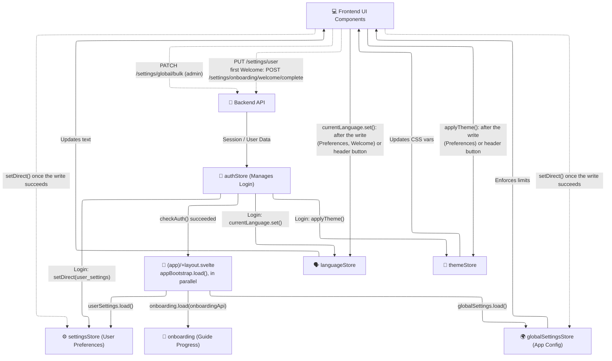

# 📱 App & UI State

*Status: Implemented (Feb 2026)*

The **App & UI State** category contains stores responsible for the global user experience. These stores manage authentication, global preferences, localization, and shell navigation.

## 🗂️ Stores

| Store | File | Purpose |
|:------|:-----|:--------|
| **Auth** | `app/auth.ts` | Manages login status, JWT tokens, and the current user object. |
| **Settings** | `app/settings.ts` | User-specific preferences (language, theme, base currency, avatar). Syncs with the backend. |
| **Global Settings** | `app/globalSettings.ts` | Application-wide settings (admin-only writes), like max upload sizes. |
| **Language** | `app/language.ts` | Controls the `svelte-i18n` locale. Reacts to changes in the Settings store. |
| **Theme** | `app/themeStore.ts` | Manages dark/light mode toggling and system-preference detection. |
| **Privacy** | `app/privacyStore.svelte.ts` | Device-local "hide amounts" flag, read inside the currency formatters. See [Privacy masking](#privacy-masking). |
| **Navigation** | `app/navigationStore.ts` | Controls the sidebar state (open/closed) and active page tracking. |
| **Toasts** | `app/toastStore.svelte.ts` | Svelte 5 Rune-based store for displaying global notification messages. |
| **Chart Settings** | `chartSettingsStore.svelte.ts` | Chart preferences of the FX and Assets pages: line colouring, area fill, grid lines, stale-data gradient, axis scales, the asset Calendar Return window and overlay signals. Kept per user in `localStorage` (`lf_{userId}_chartSettingsStore`), never on the server, in two separate scopes, `fx` and `assets`: each has its own global settings plus per-item overrides (pair slug, `asset-{id}`), and applying a scope's global settings clears that scope's per-item overrides. The chart period is not stored here: it lives in `sessionStorage` (Date Range, below). |
| **Date Range** | `dateRangeStore.svelte.ts` | The date range (start, end) shared by the Dashboard (through `dateRangeController.svelte.ts`), the broker detail page, and the Assets and FX pages, list and detail. It lives in `sessionStorage` (`librefolio_dateRange`), so it belongs to the browser tab and survives a reload; on a full page load, `start` and `end` in the URL win, and it falls back to the last three months when the account changes. |

## 📐 Architecture & Flow

The following diagram shows how the stores are filled and who sets the language and the theme. Once the auth check succeeds, the `(app)` layout's `appBootstrap.load()` loads the stores in parallel (see [Onboarding Guides](../onboarding.md#layout-gate)); nothing listens to the settings store, so language and theme are set explicitly (items 2–3 below). Writes are dotted and go through the components (*write first*, item 4 below): a component sends the change to the API and, once it succeeds, copies the saved values into the store with `setDirect()`. No store writes to the API itself — their `updateSetting()` methods have no callers.



### 🔐 Authentication Flow

1. **Mount**: On app load, `auth.checkAuth()` verifies the existing cookie with the backend.
2. **Bootstrap**: If authenticated, the `(app)` layout runs `appBootstrap.load()`, which loads the user settings (`userSettings.load()`), the onboarding progress (`onboarding.load(onboardingApi)`) and the global settings (`globalSettings.load()`) in parallel. The auth store loads nothing: at login it copies the login response's `user_settings` into the store with `setDirect()`, and applies their language and theme (item 3).
3. **Language and theme**: nothing listens to the settings store; they are set explicitly — by the auth store at login, from the same response (`currentLanguage.set()`, `applyTheme()`); by the Preferences tab after its write; by the Welcome page after **Continue** (the language only: Welcome leaves the theme alone); and, for this browser only, by the header buttons (item 4).
4. **Write first**: no settings screen updates the store before the server answers. The Preferences tab sends `PUT /api/v1/settings/user` (one field per request) and, only once it succeeds, applies the language or theme and calls `userSettings.setDirect()`; a failed write leaves the store as it was and shows an error toast. The Profile tab (avatar) and the Welcome page also write first; Welcome only previews a new language (the svelte-i18n `locale`) until **Continue** saves it. `setDirect()` itself never calls the API: it sets the store and its per-user `localStorage` cache (`lf_{userId}_user_settings`). The header's theme and language buttons change only this browser (`librefolio-theme`, `librefolio-locale`) and save nothing to the account.
5. **After a reload**: language and theme come from this browser's `librefolio-locale` and `librefolio-theme`, so a change made on another device shows here only at the next login.

## 🙈 Privacy masking {: #privacy-masking }

The header's eye button (`lib/components/ui/PrivacyToggle.svelte`) flips a single flag. Everything
else is decided where a number becomes a string, so this section is the contract for any code that
renders money. What the user sees is described in the *Privacy mode* section of
[User Preferences](../../../user/settings/preferences.md). Paths are relative to
`frontend/src/` unless they start with `backend/`.

### 🗄️ The store

`lib/stores/app/privacyStore.svelte.ts` holds one rune, hydrated **synchronously at module init**
from `localStorage['librefolio-privacy']`: the currency formatters import the store, so it is
initialized before the first amount is formatted. Only the exact value `'1'` means on; an absent key
means off, so nothing is masked by default.

- **Device-local, bare key.** The preference describes the screen being watched, not the account,
  so the key is not `lf_{userId}_…`. With a per-user key, switching account in front of a projector
  would adopt the other account's "off" and bring every value back.
- **Two guards.** `browser` answers whether `localStorage` exists; `try/catch` answers whether the
  call can fail while existing (private modes, exceeded quota, denied storage). After a refused
  write `isPrivacyPersisted()` returns `false`: this session keeps masking, the next load will not.
  No component reads it today.
- **No cross-tab sync.** There is no `storage` listener: another open tab follows on reload.

| Export | Use |
|:-------|:----|
| `isPrivacyEnabled()` | Read the flag. Called inside a runes template or a `$derived`, the read registers the dependency — no subscription needed. |
| `setPrivacyEnabled(value)`, `togglePrivacy()` | Write the flag and try to persist it. |
| `isPrivacyPersisted()` | `false` once a write has failed. |

### 🧰 The masking channel

Masking is decided at **formatter level**: before the string exists, the formatter hands the caller
either the figure or `PRIVACY_PLACEHOLDER` (`•••`). Where the resulting node lands is then
irrelevant — a masked string is as safe in a table cell as in an ECharts tooltip or a `title`
attribute. The placeholder is a constant and carries nothing derived from the value: no magnitude,
no digit count, no sign.

| Primitive | File | Use it for |
|:----------|:-----|:-----------|
| `formatCurrencyAmountPlain`, `formatCurrencyAmountHtml` | `lib/utils/currency/currencyFormat.ts` | Every money amount — the **D8 primitives**. Option `sensitivity`: `'personal'` or `'public'`; omitted means `personal`, i.e. masked. |
| `maskable(formatted, sensitivity?)` | `lib/utils/privacy/maskable.ts` | A formatted amount *without its sign*, replaced whole. |
| `maskCurrencyParts(parts, sensitivity?)` | `lib/utils/privacy/maskable.ts` | An `Intl.NumberFormat` with `style: 'currency'`: pass its `formatToParts(…)`. |
| `maskFormattedNumber(formatted, sensitivity?)` | `lib/utils/privacy/maskable.ts` | A number with no currency, such as an axis tick. |
| `maskableQuantity(formatted)` | `lib/utils/privacy/maskable.ts` | A quantity the user holds, where it sits next to a price. |
| `shouldMaskAmount(sensitivity?)` | `lib/utils/privacy/maskable.ts` | The decision itself; `public` returns `false` before reading the store. |
| `CurrencyAmount.svelte` | `lib/components/ui/display/` | One D8 amount rendered from a legacy parent ([below](#privacy-legacy-freeze)). |

The rules the primitives carry:

- **`personal` or `public`.** `personal` is wealth: values, cash, P&L, proceeds, fees, taxes.
  `public` is a number that does not let anyone infer what the user owns — market and unit prices,
  WAC, FX rates, the amounts of asset-level events (product owner, 2026-09-22). The default is
  `personal` on purpose: a public value left unclassified disappears, which the user reports; a
  personal value left in the clear by the opposite default would leak, which nobody sees.
- **The currency stays.** The D8 primitives mask the absolute value and append symbol, flag and code
  afterwards: `-••• € 🇪🇺 EUR`. A formatter that lets `Intl` place the currency cannot append it, so
  `maskCurrencyParts` works on the parts: the run from the first to the last magnitude part
  (`integer`, `group`, `decimal`, `fraction`, `compact`, the exponent parts, `nan`, `infinity`),
  **inner literals included**, becomes one `•••`, while `currency`, the sign and the outer literals
  stay — `-$1,234.50` gives `-$•••`, a compact `1,2 Mio. €` gives `••• €`. `compact` is inside the
  run on purpose: `€•••K` would still disclose the order of magnitude. Known limit: in `pt-CV` ICU
  types the escudo sign `$` as a `decimal` part (and the `currency` part is a zero-width space), so
  the masked string loses the only visible symbol.
- **The sign stays (D8).** The D8 primitives write `+` or `-` outside `maskable`.
  `maskFormattedNumber` and `maskableQuantity` keep the leading sign run exactly as the locale wrote
  it (`/^[\p{Cf}+\-\u2212]*/u`: U+2212 in `sv-SE`, a bidi mark before the minus in Arabic) rather
  than rebuilding an ASCII hyphen, which would change the unmasked output too. The cost is stated
  in the `maskable` docstring: where a site passes `showSign: value !== 0`, a prefix appears exactly
  when the amount is non-zero, so a masked column still shows which rows are zero. The product
  owner ruled with that objection on the table; do not move the sign back inside the mask.
- **Absence is the caller's job.** Check for a missing, non-finite or unavailable value first and
  render `—`: masking an absence would claim a figure that does not exist, and an em-dash handed to
  `maskFormattedNumber` comes back masked.
- **A quantity's class is decided at the call site (D5′).** The same number is masked in positions
  and lots, where quantity × public price rebuilds what the user owns, and stays visible in the
  Transactions list. So the rule cannot live in a shared quantity formatter: `maskableQuantity` is a
  separate, searchable name with no `sensitivity`, and a site that must stay visible —
  `formatTxQuantity` in `lib/components/transactions/shared/txDisplayHelpers.ts` — simply does not
  call it. Its callers today are `ExposureTable.svelte`, `unifiedLotsTableHelpers.ts`,
  `LotCustodyModal.svelte`, `LotGanttChart.svelte` and `LotWacPriceChart.svelte`. Units and tickers
  stay outside the argument, as the currency does for money; a partially closed lot keeps its open
  share (`formatLotQuantityCell` renders `••• (60%)`).

### 🚧 The anti-regression gate {: #privacy-gate }

`lib/utils/privacy/moneyRenderSites.test.ts` tests a premise, not behaviour: that the places
rendering money are the places we know. It scans every `.ts` and `.svelte` file under
`frontend/src/` — test files and the `node_modules`, `__mocks__` and `__tests__` folders excluded —
line by line for two forms:

- **Form A** — `style: 'currency'`, exact;
- **Form B** — a template literal interpolating a currency token (`currency` or `symbol`) beside a
  numeric-looking one (`toFixed`, `toLocaleString`, `amount`, `price`, `total`, …), a heuristic.

Every hit must be registered in `REGISTRY`, keyed by file and whitespace-collapsed content rather
than by line number, so an unrelated edit above a site does not turn the gate red. Each entry
carries a status and a written reason:

| Status | Meaning |
|:-------|:--------|
| `masked` | Goes through the channel, at the site or at its function boundary. |
| `not-money` | Matches a form but renders no amount. |
| `public` | Real money in the clear by rule: a market price, an asset-level event, a rate. |
| `residual` | Real money outside the channel, deliberately not fixed yet. |
| `unmasked` | Real money outside the channel, found by the gate and not yet triaged. |

The test fails on an unregistered hit and on an entry whose code no longer exists. It asserts the
`residual`, `unmasked` and `public` lists by exact content, so fixing or reclassifying a site is a
visible edit, and it carries a positive control — hits ≥ entries, both forms found, the risk helper
found — because "no unregistered site" is also true of a scanner that reads nothing. It runs in
`./dev.py test front-utility core-unit`.

A line that matches `SAFE_CALL` — it names a D8 primitive, a currency-code formatter or the risk
helpers' `formatCurrencyAmount` / `formatScopedCurrencyAmount`, or calls `maskable(` or
`maskFormattedNumber(` — is not scanned for Form B. The skip is **line-granular**: a masked call on
a line also hides an unmasked fallback written on the same line. Entry to `SAFE_CALL` has a price:
the name must be an export pinned by unit tests that would break if its masking were removed.

What the gate cannot see:

1. **Money without a currency token** — axis ticks and labels, such as the value axis of the lot
   comparison chart (`formatAxisAmount` in `lib/components/brokers/lots/lotComparisonChartHelpers.ts`).
   Only their own tests protect them.
2. **A `public` marking.** `{sensitivity: 'public'}` sits on a `SAFE_CALL` line and is never a hit,
   and a `public` entry is not re-examined. Only the tests of that site protect the decision — for
   the Positions price and average cost, the D5′ block of `ExposureTable.test.ts`.
3. **Reactivity.** A site can be registered, masked and green and still not follow the toggle: see
   the legacy freeze below.

### 🧊 Legacy components freeze masked output (R20) {: #privacy-legacy-freeze }

In a **legacy** (non-runes) component, a function call inside a template expression is compiled
into `$.untrack(…)`, and only the values the expression names are tracked. The privacy flag, read
*inside* the formatter, never becomes a dependency, so the output keeps the state it had at mount:
turned on in place, privacy leaves the digits visible; turned off, `•••` stays. The same
`{@html formatCurrencyAmountHtml(amount, code)}`, compiled with the Svelte in
`frontend/node_modules` (5.48.0) — excerpt:

```js
// legacy parent: export let amount; export let code;
$.deep_read_state(amount()),
$.deep_read_state(code()),
$.untrack(() => formatCurrencyAmountHtml(amount(), code()))

// runes parent: let {amount, code} = $props();
$.html(node, () => formatCurrencyAmountHtml($$props.amount, $$props.code));
```

Neither the gate, which reads source text, nor a formatter unit test, which calls the formatter
fresh, can see this. The remedy:

- render the amount through a runes child — `lib/components/ui/display/CurrencyAmount.svelte`
  renders one D8 amount — or migrate the parent to runes when it is small;
- cover the site with a component test that toggles privacy **in place, in both directions**,
  including a mount with privacy already on: `lib/components/brokers/BrokerCard.test.ts`, and
  `lib/components/ui/display/CurrencyAmount.test.ts`, which mounts the child under
  `__tests__/harness/CurrencyAmountLegacyHost.svelte`. That host is legacy by construction
  (`export let`) and also renders the same call inline, as a control that must stay frozen.

Today the legacy parents that render money are `lib/components/brokers/BrokerCard.svelte` and
`routes/(app)/brokers/[id]/+page.svelte`; both render it through `CurrencyAmount`.

### 📈 ECharts formatters {: #privacy-echarts }

ECharts calls `formatter` and `renderItem` callbacks itself, outside Svelte's effect tracking. They
read the current flag whenever they run, but the read registers nothing, so a toggle does not redraw
what is already painted: an axis keeps its ticks, a bar keeps its label, and an open tooltip keeps
its text until it is shown again. The render `$effect` must read the flag itself —
`void isPrivacyEnabled();`, beside its other `void` dependencies — so that a toggle re-runs it and
the option is rebuilt with every formatter called again:

- `lib/components/brokers/lots/LotComparisonChart.svelte` — axis formatters; each render replaces
  `xAxis`, `yAxis` and `series` (`replaceMerge`);
- `lib/components/brokers/lots/LotGanttChart.svelte` — the lot quantity on each bar is built in
  `renderItem`.

Keep the formatter a pure exported helper, as `formatAxisAmount` and `formatAxisCurrency` in
`lotComparisonChartHelpers.ts` are, so a unit test can pin it; the effect wiring itself is only
exercised by a test that mounts the chart.

### 🧩 Contract for Tool renderers {: #tool-renderer-privacy-contract }

A Tool's compiled renderer (see
[Tool plugins](../../architecture/patterns/tool_plugins.md#frontend-and-documentation)) presents
results the backend computed from the user's own scenario, so it renders through the same channel:

- **money** only through the D8 primitives, with an **explicit** `sensitivity` on every call, so the
  classification is read at the site rather than implied by the default;
- **quantities** through `maskableQuantity` where they are holdings;
- **rates and percentages** marked `public` explicitly wherever they pass through a masking
  primitive;
- **`—`** for an empty, non-finite or unavailable value — checked before formatting, never masked;
- runes mode for the component, and the ECharts rule above for any chart it draws.

The PAC allocator adapter is planned as `lib/features/tools/pac-allocator/planner/format.ts`; it is
not in the source tree yet. It will render an `exact_ratio` number — the `ExactRatio` branch of
`backend/app/schemas/pac_allocator.py`, whose authoritative value is its reduced `numerator` and
`denominator` — as `≈` followed by the backend's `display_decimal`, a projection the schema marks
`non_authoritative`.
