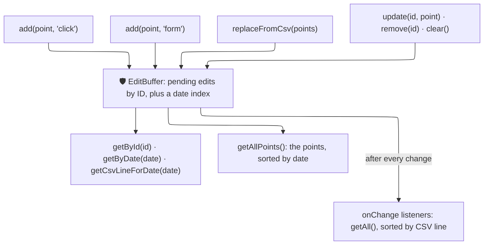

# 🛠️ Core Infrastructure

*Status: Implemented (Mar 2026) · entityStore: Apr 2026*

The **Core Infrastructure** category contains the generic building blocks of the Store Client System. These modules hold no business data of their own: `entityStore` is the session cache behind `brokerStore` and `assetStore`, `TimeSeriesStore` the date-keyed cache behind the price and rate registries, and `EditBuffer` a buffer of pending time-series edits that no component uses yet — only its unit test does.

## 🗂️ Stores

All these modules are located in `src/lib/stores/core/`.

| Module | Purpose |
|:-------|:--------|
| **`entityStore`** | Factory (`createEntityStore`) of a generic session cache for a user's list of entities, looked up by ID from many components; `brokerStore` and `assetStore` (Reference State) are built on it. It loads the list once (concurrent callers share the request), normalizes each entry, merges partial payloads — for example, after a successful create or edit, the fields the frontend just sent, since the backend answers with little more than the ID — and `invalidate` makes the next load fetch again. |
| **`EditBuffer`** | Bidirectional edit buffer class for pending time-series modifications. Provides sync between chart click-to-edit, CSV textareas, and manual forms. |
| **`TimeSeriesStore`** | A specialized generic cache for managing historical data points (keyed by ISO date). Handles gap detection (`getMissingIntervals`, which skips the ranges already marked with `markFetched`) to minimize API calls and merges partial time-series datasets (`merge`). |

## 📐 Architecture & Flow (EditBuffer Pattern)

`EditBuffer<T>` is a class designed to hold the edits of a time series that are not saved yet, for any
point type with an ISO `date` (`TimeSeriesPoint`), whichever way each edit was made: a chart click, a
line of a CSV textarea, or a form (`EditSource`: `'click'`, `'csv'`, `'form'`). It keeps them in
memory only: it has no network code and no UI.

!!! note "Not used by the app yet"

    No component uses `EditBuffer`: in `frontend/src`, only its unit test,
    `src/lib/stores/__tests__/EditBuffer.test.ts` (run by `./dev.py test front-fx fx-unit`), imports
    it, and git history shows no other file ever did. The FX and asset data editors that exist today,
    `FxDataEditorSection` and `AssetDataEditorSection`, are built on `DataEditor`
    (`src/lib/components/ui/data-editor/`), a table editor that tracks the status of each row itself
    (original, edited, deleted, appended) and imports CSV through `DataImportModal`.

Each pending edit is a `PendingEdit<T>`: a unique `id`, the `point` (new or modified), its
`csvLineNumber` (1-based, header excluded), its `source`, and `isNew` (a point absent from the
original data, rather than a change to an existing one).

### 🧠 How it Works

1. **Adding**: `add(point, source, isNew = true)` records an edit and returns it. An edit already pending for the same date is replaced by the new one, which gets a new `id` but keeps that edit's CSV line number.
2. **Changing**: `update(id, point)` replaces the point of an edit, moving it in the date index if the date changed; `remove(id)` drops an edit. Both return `false` for an unknown `id`. `clear()` empties the buffer and restarts the line numbering — meant for a Cancel action.
3. **CSV synchronization**: `replaceFromCsv(points)` takes the points already parsed from the CSV textarea, in order of appearance — the buffer does not parse CSV itself. It drops every edit whose source is `'csv'`, then numbers the points 1, 2, 3… in that order: a point on the date of a pending click or form edit updates that edit, which keeps its source; any other point becomes a new `'csv'` edit.
4. **Reading**: `size` and `hasChanges`; `getById(id)`, `getByDate(date)` and `getCsvLineForDate(date)`; `getAll()`, the edits sorted by CSV line number; `getAllPoints()`, their points sorted by date.
5. **Notifying**: `onChange(callback)` registers a listener and returns the function that removes it. Every change — `add`, a successful `update` or `remove`, `replaceFromCsv`, `clear` — calls each listener with `getAll()`.
6. **Saving is left to the caller**: the buffer sends nothing. A caller would read `getAllPoints()`, send them in one bulk request, then `clear()` the buffer.
