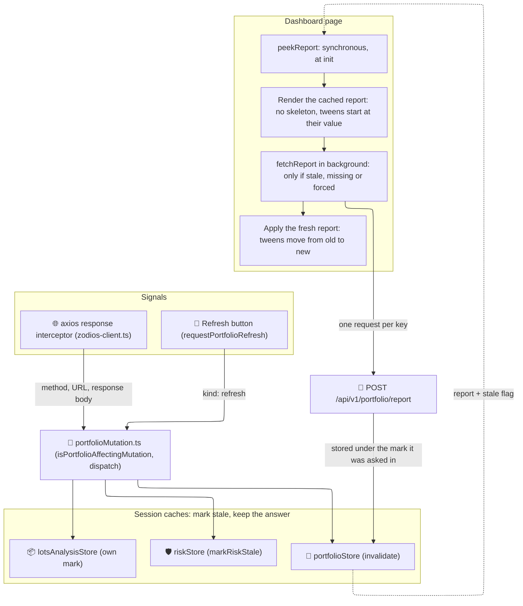

# 🧠 Domain & Feature State

*Status: Implemented (Feb 2026) · portfolio page cache: Oct 2026*

The **Domain & Feature State** houses the heavy computational stores that implement core business logic, such as the portfolio report cache, transaction ledgers, and foreign exchange (FX) graph routing. These stores often consume data from both Reference State and Registries.

## 🗂️ Stores

| Store | Location | Purpose |
|:------|:---------|:--------|
| **`portfolioStore`** | `portfolio/portfolioStore.svelte.ts` | Session cache of the unified portfolio report (`POST /api/v1/portfolio/report`). The backend engine computes holdings, performance, and allocations; the store keeps one answer per question, shares the requests in flight, and refreshes stale answers in background (stale-while-revalidate). |
| **`portfolioMutation`** | `portfolio/portfolioMutation.ts` | The signal bus: tells the portfolio caches that a write changed what they show, or that the user asked for a refresh. |
| **`lotsAnalysisStore`** | `portfolio/lotsAnalysisStore.svelte.ts` | Session cache of `POST /api/v1/portfolio/lots/analysis` (the FIFO lots panel), under the same stale-while-revalidate rule. |
| **`dashboardViewStore`** | `portfolio/dashboardViewStore.ts` | The Dashboard's target currency and broker filter, per user, in `sessionStorage`. |
| **`riskStore`** | `risk/riskStore.svelte.ts` | Session cache of the risk catalogs, of `POST /api/v1/risk/query`, and of the `POST /api/v1/risk/eligibility` verdicts. |
| **`txStore`** | `transactions/txStore.svelte.ts` | The master ledger of user transactions. Supports infinite scrolling, complex filtering, and bulk operations. |
| **`currencyGraphStore`** | `currencyGraphStore.ts` | Caches the multi-directed currency graph used by the DFS algorithm to find conversion routes (FX Chain Algorithm). |
| **`fxCardInversionStore`** | `fx/fxCardInversionStore.ts` | UI-specific domain state tracking which FX pairs the user has "flipped" visually (e.g., viewing USD/EUR instead of EUR/USD). |

## 📐 Architecture & Flow (Portfolio Page Cache)

The frontend does not compute the portfolio. One `POST /api/v1/portfolio/report` runs the backend engine and returns the summary, the daily history, the allocation history, the data-quality report, and whichever optional series the caller asked for. What the frontend decides is **when to ask again**. Every portfolio view keeps its answers for the session and follows one rule, *stale-while-revalidate*: a write marks the cached answers stale and keeps them; a page shows what it has at once, asks again in background, and moves to the fresh figures when they land. There is no time-based TTL.

### 🧠 `portfolioStore`: the report cache

- **One key per question** (`reportKey`): `user | broker ids sorted | dateFrom | dateTo | targetCurrency`, followed by one suffix per include flag (contribution, breakdown, history, allocation history, broker P&L history, P&L candles, income, cost, deposit, and acquisition-funding series). `fetchReport()` and `peekReport()` build it the same way.
- **`invalidate()`** moves the mark: every cached report becomes stale and **stays** in the cache.
- **`peekReport(...)`** reads synchronously the key that `fetchReport()` would ask with the same arguments (without `force`): `{report, stale}`, or `null` when that question was never answered.
- **`fetchReport(...)`**:
    - serves a fresh entry without asking, unless `force` is set;
    - asks a stale, missing, or forced key **once per key**: a caller joins the request in flight, unless that request left before the last mark;
    - never discards an answer because of a mark — only a session change or `resetPortfolioCache()` does, and the promise then resolves `null`;
    - stores an answer asked before the last mark still stale, and never over a newer one;
    - resolves `null` when the request fails, with the message in `portfolioError()`, and keeps the stale entry for `peekReport()`.
- **`resetPortfolioCache()`** is the hard clear. Registered as a client-session reset, it forgets every report and every request in flight on logout or account change, so a page never shows another account's figures.

### 📣 `portfolioMutation`: the signal bus

The axios response interceptor (`frontend/src/lib/api/zodios-client.ts`) passes the method, the URL, and the response body of every **successful** response to `notifyPortfolioMutation()`. `isPortfolioAffectingMutation()` keeps the writes that change what a portfolio view shows, and the bus dispatches `{kind: 'mutation', method, path}` to every listener registered with `registerPortfolioMutationListener()`. The **Refresh** button goes through the same bus: `requestPortfolioRefresh()` dispatches `{kind: 'refresh'}`.

| Write (under `/api/v1`) | Counts as a change |
|:------------------------|:-------------------|
| `POST /transactions/commit`, `POST /transactions/transfers/promote` | Always |
| `POST`/`DELETE /brokers`, `PATCH /brokers/{id}`, `PUT /brokers/{id}/access`, `PATCH`/`DELETE /brokers/{id}/access/me` | Always |
| `POST`/`PATCH`/`DELETE /assets`, `POST /assets/{id}/market-data/wipe` | Always |
| `POST /assets/merge` | Unless the answer says `dry_run: true` |
| `POST /assets/prices/sync` | When a result has `points_changed > 0` or `events_changed > 0` |
| `POST`/`DELETE` on the other `/assets/prices…` paths, `/prices/current` included | Always, except `/prices/query` (a read) |
| `POST`/`DELETE` on `/assets/events…` | Always, except `/events/query` |
| `POST`/`DELETE` on `/assets/provider…` | Always, except `/provider/probe` |
| `POST /fx/currencies/sync` | When `total_points_changed > 0`; without a total, when a result has `points_changed > 0` |
| `POST`/`DELETE /fx/currencies/rate`, `POST`/`DELETE /fx/providers/routes` | Always |

Reads and failed requests count as nothing. An answer the rules cannot read (a sync without `results`, a merge without `dry_run`) counts as a write: a stale view nobody refreshes is worse than one request too many. `POST /assets/prices/current` is a write because it persists today's candle, so the live-price poll of the asset page marks every portfolio view stale. `isPortfolioAffectingMutation()` is the source of truth: a new endpoint that changes portfolio figures belongs there.

### 👂 The other listeners

| Store | On a mutation or a refresh | On a session change |
|:------|:---------------------------|:--------------------|
| `riskStore.svelte.ts` | `markRiskStale()`: query and eligibility answers are marked stale and kept, a remembered failure is dropped, nothing in flight is discarded. The catalogs describe the engine, not the portfolio, and are left alone. | `invalidateRisk()`, the hard reset: forgets everything, catalogs included, and discards every answer in flight. |
| `lotsAnalysisStore.svelte.ts` | Moves its own mark: every lots analysis is stale and kept, so `peekLotsAnalysis()` still returns it while `fetchLotsAnalysis()` asks again. | `resetLotsAnalysisCache()` |

Both follow the report's rules — one request per key, an answer stored under the mark it was asked in and never over a newer one — with two differences. `queryRisk()` and `fetchLotsAnalysis()` **reject** on failure, leaving the previous answer cached. And a lots key is the user plus the request with its object keys sorted and its `broker_ids`, `requested_analyses`, and `selected_lot_ids` lists sorted, so the same question in any order shares one entry. `getRiskQuerySnapshot()` is the risk counterpart of `peekReport()`: `{key, status, response, error, stale}`.

`dashboardViewStore.ts` is not on the bus. It keeps the Dashboard's `targetCurrency` and `brokerIds` per user in `sessionStorage` (`librefolio_dashboardView:<userId>`) through `readDashboardView()` and `writeDashboardView()`, so a return asks the key it left and the cache can serve it; `resetDashboardView()` forgets every user's view on logout or account change. The period already lasts the session in `dateRangeStore`.

### 🧮 How a page uses the cache

The Dashboard (`frontend/src/routes/(app)/dashboard/+page.svelte`) is the reference:

1. **At init, before the first render.** `readDashboardView()` restores the currency and the broker filter; the period comes from `dateRangeStore`. When the broker list is already in memory — any in-app return — the owned brokers are known at once (`brokersReady`), and `hydrateFromCache()` puts the `peekReport()` answer, and the cached Performance contribution, on screen. `setTweenHydration(() => summary !== null && activeTab !== 'rischio')` runs just before it, so a `TweenedValue` that mounts with a known figure starts at its value instead of counting up from 0.
2. **Owned brokers first.** On a cold load the broker list arrives in `onMount` (`ensureBrokersLoaded()`), and nothing is asked before `brokersReady`: a request without `broker_ids` is widened by the backend to every broker the user can see, Editor and Viewer ones included. When the user owns at least one broker, the report, contribution, and lots requests then carry the owned set from `getOwnedBrokers()` (role `OWNER`, share unset or above 0), or the filter's subset of it; with none, `loadAll()` never runs and the overview stays empty.
3. **`loadAll()`** peeks again, applies the cached report if it is not the one on screen, and calls `fetchReport()` only when the entry is missing, stale, or forced. The answer replaces the figures and the tweens move from the old values to the new ones. When the refresh fails with a cached report on screen, the figures stay and a toast reports the error. `loadContribution()` follows the same rule for the Performance view: `contributionRefreshing` keeps the rows on screen instead of the skeleton of `contributionLoading`.
4. **Refresh** (`handleSync`, `data-testid="sync-button"`) calls `requestPortfolioRefresh()` — every cache marks its answers stale — bumps `refreshVersion`, which makes the risk and lots panels ask again with `force`, and runs `loadAll(true)`.

The panels and the broker detail page reuse the same pieces:

- **Risk** — `riskPanelController.svelte.ts`: when the store holds every base wave the panel needs (fresh or stale), `loadBase()` puts the `getRiskQuerySnapshot()` responses on screen with `initialLoading = false` and `refreshing = true`, sets `hydratedFromCache` on a first load, and refreshes through `queryRisk()`. Its own sync (`handleSynced()`) marks the answers stale as well, instead of forgetting them. `hydratedFromCache` has no reader yet. `RiskLevelsPanel` is due to pass it to `setTweenHydration()` and to wire `onrefreshfailed` to a toast; both are pending because another workstream has that file open. Until then, the tweened L2 cards (`numericValue` + `formatValue` in `L2Diversification.svelte`) count up from 0 on mount, since the Dashboard leaves the Risk tab out of its own tween hydration, and a failed refresh sets `loadError`, which replaces the levels with the error message.
- **Lots** — `LotsAnalysisPanel.svelte` shows `peekLotsAnalysis()` at once and calls `fetchLotsAnalysis()` only when the answer is stale, missing, or forced; a failed refresh keeps the lots on screen with a toast. Its `ready` prop holds every request until the host knows the broker scope (the Dashboard passes `brokersReady`), and `refreshVersion` forces both analyses again.
- **Broker detail page** — `frontend/src/routes/(app)/brokers/[id]/+page.svelte` does the same for its single-broker report: `peekReport()` then `fetchReport()` in `loadOverview()`, `setTweenHydration()`, and `requestPortfolioRefresh()` plus `refreshVersion` for its own refresh.

`TweenedValue.svelte` exports the hydration hook from its module script: `setTweenHydration(isHydrated)` sets `TWEEN_HYDRATION_CONTEXT` during a component's init, and every `TweenedValue` below it that mounts while `isHydrated()` is true starts at its value; later changes still tween.
