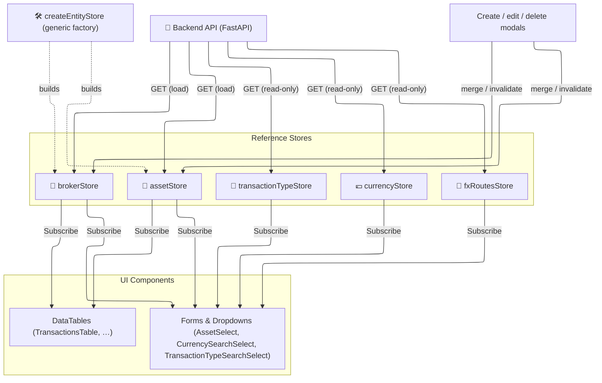

# 🗃️ Reference State

*Status: Implemented (Feb 2026)*

The **Reference State** manages domain entities that act as "dictionaries" or master data. These entities are rarely mutated rapidly by the system itself but are created, updated, or deleted by the user (CRUD operations).

## 🗂️ Stores

All these stores are located in `src/lib/stores/reference/` (with one exception).

| Store | API Endpoint | Purpose |
|:------|:-------------|:--------|
| **`brokerStore`** | `/brokers?include_inaccessible=true` | Brokers the user can see: the accessible ones with their `user_role`, plus the inaccessible ones with `user_role: null`. Lookups by id from any component (tables, selectors, badges) and role helpers (`canEditBroker`, `getEditableBrokers`). |
| **`assetStore`** | `/assets/query` | All accessible financial instruments (Stocks, ETFs, Crypto, …), looked up by id. |
| **`currencyStore`** | `/utilities/currencies` | ISO 4217 currencies with symbols and flags; reloaded when the language changes. |
| **`countryStore`** | `/utilities/countries` | ISO 3166-1 countries (alpha-3 and alpha-2 codes, name, flag), looked up by alpha-3; reloaded when the language changes. |
| **`sectorStore`** | `/utilities/sectors` | The standard financial sectors (GICS-based: Technology, Health Care, Financials, …) and their emoji. |
| **`fxRoutesStore`** | `/fx/providers/routes` | The configured FX pairs and the currencies they reach — the two endpoints of each configured pair. Currency selectors with `configuredOnly`, the FX pair dialog and the risk panels use it to offer only what the user can actually convert. `invalidateFxRoutes()` forces a reload, e.g. after a pair is created. |
| **`transactionTypeStore`** | `/transactions/types` | List of valid Tx Types (BUY, SELL, DIVIDEND) and their behavioral rules. (Located in `transactions/`) |

## 📐 Architecture & Flow

`brokerStore` and `assetStore` are built on `createEntityStore` (documented in
[Core Infrastructure](core-infrastructure.md)), the generic cache for user-scoped lists that
modals create, edit and delete. The other stores are read-only module caches with the same shape:
an idempotent `ensure…Loaded()` that shares the in-flight request, and, except for countries and
sectors, a reactive version counter.

### 🔄 Reactivity & Caching

The stores are session caches; they never write to the backend themselves.

1. **Load once**: `ensureBrokersLoaded()`, `ensureAssetsLoaded()`, `ensureCurrenciesLoaded(language)`
   and the other `ensure…Loaded()` functions fetch on the first call; later calls resolve at once
   or share the request in flight. `refreshAllBrokers()` / `refreshAllAssets()` discard the cache
   and fetch again.
2. **Reactivity**: components subscribe to a version counter (`brokerStoreVersion`,
   `assetStoreVersion`, `currencyStoreVersion`, `fxRoutesVersion`, `typesVersion`) and read the
   data through plain getters (`getBrokerInfo(id)`, `getAssetInfo(id)`, …), which re-run when the
   counter moves.
3. **After a mutation**: the modal that saved calls `mergeBrokers` / `mergeAssets` (a partial
   upsert that keeps the fields the patch does not carry) or evicts the entry with
   `invalidateBroker` / `invalidateAfterMutation`, which also marks the cache as not loaded so the
   next `ensure…Loaded()` fetches again. There is no optimistic update to roll back: the cache
   changes only after the server has answered.

### 🖼️ Broker icon hydration {: #broker-icon-hydration }

A component that only has a partial broker (`{id, name}`) can ask for its icon fields with
`ensureBrokerIconFieldsLoaded(brokerId)`; `BrokerIcon` does it when given a `brokerId` and no icon
field. The store calls `GET /brokers/{id}` and merges the answer, sharing a request already in
flight for the same broker.

Since 1.2 each broker is asked **at most once per cache generation**: the first answer, success
or error, settles the id (`settledIconFieldIds`), because a broker with no icon, portal URL or
import plugin is a valid state, not missing data. Before this, every answer bumped the cache
version, the icon effect ran again and found the fields still missing, and a page could request
the same broker in a loop. `invalidateBroker`, `refreshAllBrokers` and the session reset release
the settled ids, and an answer from an old session settles nothing.
