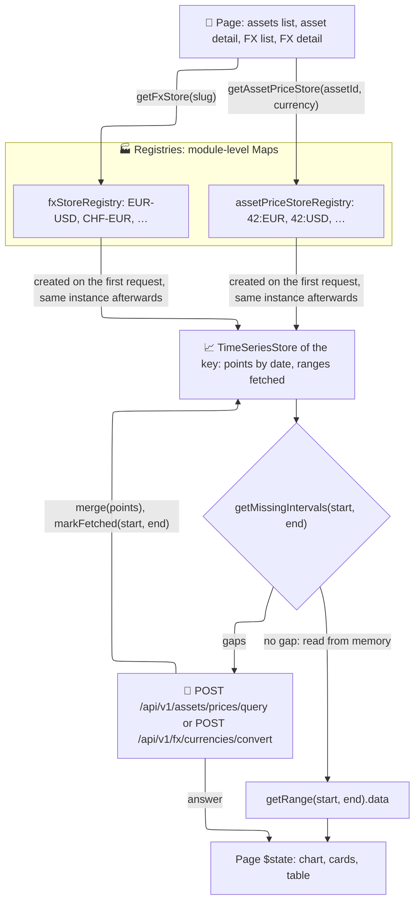

# 🏭 Registries & Caches

*Status: Implemented (Mar 2026) · asset price registry and image preview cache: Jun 2026*

The **Registries & Caches** category holds the client-side caches for data that the frontend loads in pieces and reuses across pages: the daily price series of each asset, the daily rate series of each FX pair, and the object URLs of image previews.

A **registry** is not a store itself: it is a module-level `Map` of *many independent stores*, one per key. It creates a store the first time its key is requested and returns that same instance on every later request.

## 🗂️ Stores

| Store | Location | Purpose |
|:------|:---------|:--------|
| **`assetPriceStoreRegistry`** | `assetPriceStoreRegistry.ts` | One `TimeSeriesStore<AssetPricePoint>` per asset **and currency**, keyed `"{assetId}:{CURRENCY}"` (e.g. `"42:EUR"`), holding the daily price points already loaded. Prices converted to another currency (`target_currency`) are cached apart from the native ones. |
| **`fxStoreRegistry`** | `fxStoreRegistry.ts` | One `TimeSeriesStore<FxDataPoint>` per currency pair, keyed by the pair slug in alphabetical order (`"EUR-USD"`, see `createPairSlug`), holding the daily rates already loaded in that orientation. The FX list and the FX detail page share these stores. |
| **`imagePreviewCache`** | `stores/files/imagePreviewCache.ts` | Plain `Map` from file ID to the object URL of the largest preview fetched for that file. `LazyImage` reuses it for the same or a smaller size instead of downloading the preview again; a larger size replaces the entry and revokes the old URL. Emptied, every URL revoked, when the signed-in account changes. |

## 📐 Architecture & Flow (The Registry Pattern)

A chart shows a date range, and the user moves between ranges (another preset, a custom range) and between pages that show the same series. The stores outlive the page components, and each one remembers both the points it holds and the ranges already requested: a range that is already loaded is answered from memory, and only a range with gaps costs a price or rate request.

The portfolio figures do not come from these stores: the backend computes the portfolio report, and `portfolioStore` keeps it as a session cache — see [Domain & Feature State](domain-state.md).

### 🧠 How it Works

1. **Getting a store**: a page asks the registry for the store of its key: `getAssetPriceStore(assetId, currency)`, which upper-cases the currency into the key, or `getFxStore(slug)` (`getFxStoreByPair(base, quote)` builds the slug first). The first request creates an empty `TimeSeriesStore` (`stores/core/TimeSeriesStore.ts`); every later request returns the same instance.
2. **Finding the gaps**: `store.getMissingIntervals(start, end)` lists the date intervals of the range that hold no point and were never marked fetched. With no gap, the page reads `store.getRange(start, end).data` instead of asking the backend for prices or rates (the asset detail page still asks for its events, and backend-computed signals are still requested), so narrowing or widening the range is instant once it is loaded.
3. **Fetching and merging**: otherwise the data is requested, `store.merge(points)` upserts the answer by date, and `store.markFetched(start, end)` records the range as fetched (the asset pages do so only when the answer holds points). Asset prices are requested for the whole range, not gap by gap: each item of `POST /api/v1/assets/prices/query` carries one `date_range`. FX rates come from `POST /api/v1/fx/currencies/convert`, one item per gap, or one for the whole range when the request also asks for signals.
4. **Invalidating**: after a sync or a refresh, `invalidateAssetPriceStore(assetId)` empties every currency store of the asset. The FX pages empty every FX store with `invalidateAllFxStores()` or one range of a pair with `store.invalidateRange(start, end)`, and `removeFxStore(slug)` drops the store of a deleted pair.
5. **Lifetime**: nothing counts subscribers and nothing is evicted. `TimeSeriesStore` is a plain class, not a Svelte store: each page copies what it reads into its own `$state`. The stores stay in memory as long as the loaded app: a logout does not clear them, a page reload does. `removeAssetPriceStore(assetId)` exists for asset deletion, but nothing calls it.

`ensureAssetPriceRangeLoaded(assetId, currency, start, end, {targetCurrency})` and `ensureFxRangeLoaded(slug, start, end)` wrap steps 2 and 3 in one call and return the cached points of the range; `ensureFxRangeLoadedBulk` does the same for several pairs in one request. They mark a range fetched even when the answer is empty or a 404, so it is not requested again; any other error (network, 5xx) leaves it unmarked, and the next call retries. `ensureFxRangeLoaded` loads the FX overlays of the FX detail page and the FX data of the asset pages; the other two are called only by their unit tests. The asset pages run steps 2 and 3 inline: the assets list sends one `POST /api/v1/assets/prices/query` for every asset that misses prices or needs backend signals, and the asset detail page asks for events and signals in the same request. On the FX side, `loadFxRatesAndSignalsBulk` loads the rates and signals of the FX list cards in one request, and `lookupFxRate(base, quote, date)` answers one day's rate for the transaction modals, reading the cache first (`lookupFxRateSync`).
