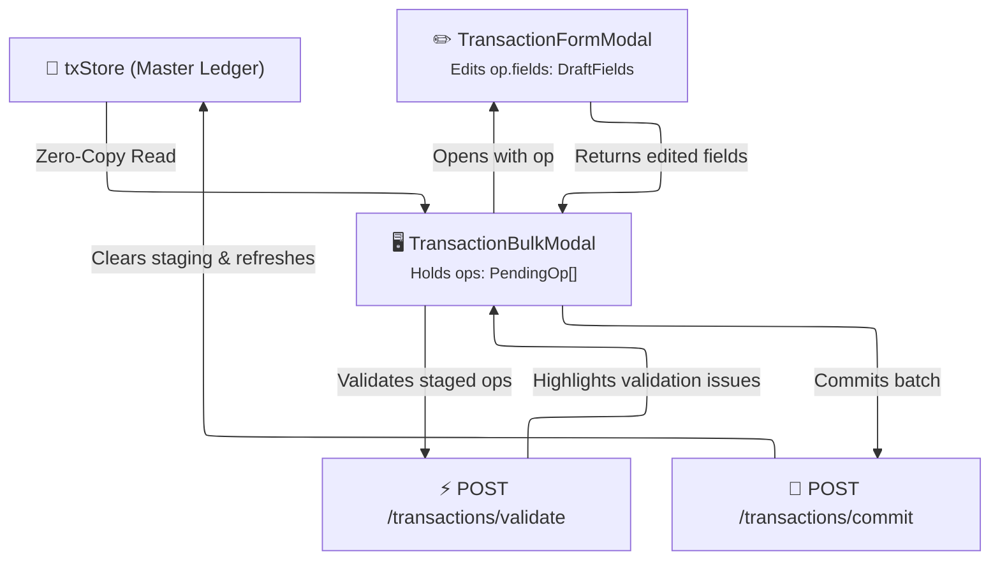
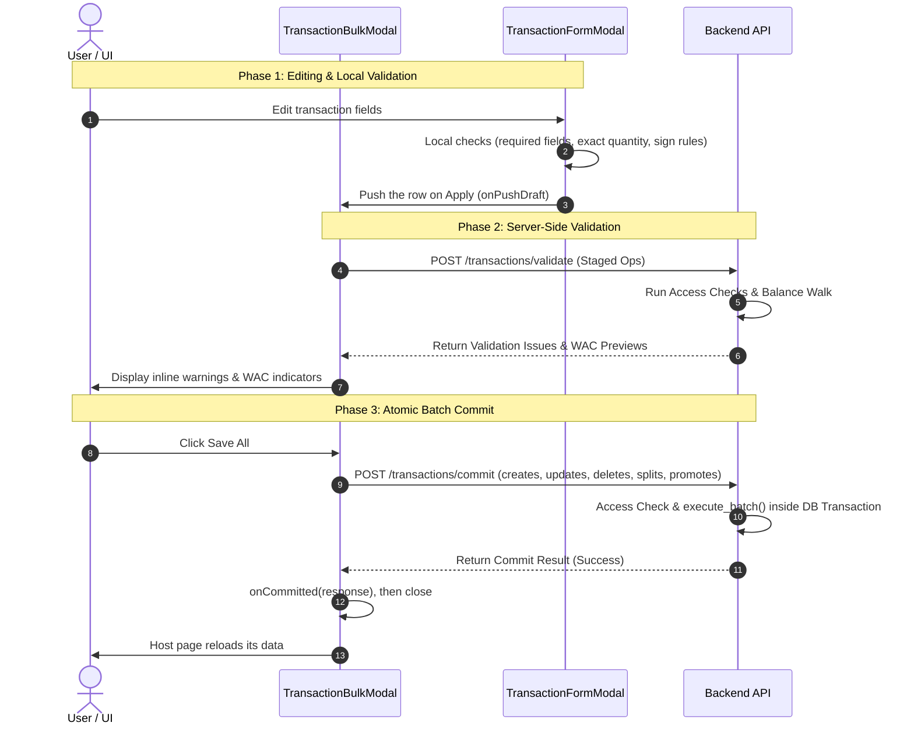

# 📝 Transaction Staging State

This document describes how LibreFolio manages the transient staging state of transactions in the frontend before they are committed in bulk to the database.

---

## 🏗️ Architecture Overview

The staging state acts as a local in-memory sandbox where users can add, edit, clone, split, promote, and delete transactions. Rather than immediately saving changes, the operations are staged in the `TransactionBulkModal` as a list of operations. 



---

## 🏷️ The `PendingOp` Tagged Union

LibreFolio represents each staged row as a `PendingOp`. It is implemented as a TypeScript **discriminated (tagged) union** in `TransactionBulkModal.svelte` that separates metadata from pure transaction data fields (`DraftFields`).

### State Schema

```typescript
interface DraftFields {
    broker_id: number;
    asset_id: number | null;
    type: TransactionTypeCode;
    date: string;
    quantity: string;
    cash: { code: string; amount: string; } | null;
    tags: string[];
    description: string;
    asset_event_id: number | null;
    cost_basis_override: { code: string; amount: string; } | null;
    cost_basis_mode: 'auto' | 'manual' | null; // UI-only; null = not applicable to this type/side
}

type PendingOp = (
    | { op: 'create'; } // Brand new row
    | { op: 'edit'; txId: number; markedDelete: boolean; addedViaPicker?: boolean; } // Existing DB row
) & {
    tempId: string;
    createdSeq: number; // Keeps new rows of the same day in the order they were added
    fields: DraftFields;
    pairedWith?: string; // Set on the hidden partner op: the tempId of its visible row
    link_uuid?: string | null; // Shared pairing UUID for transfers & conversions
    inaccessible?: boolean; // Read-only marker for a partner on an inaccessible broker
    promoteFromType?: TransactionTypeCode | null; // Pre-promote type sent to the backend by a mixed promote
    _wacCache?: WacResultEntry | null; // Transient WAC result returned by validate
    wacCurrencyHint?: string | null; // WAC target currency; null = backend decides
    todos?: ImportTodo[]; // Import field todos (see below)
};
```

A linked pair is two ops: the visible row and a hidden partner whose `pairedWith` points to it.

---

## ⚡ Core Design Principles

### 1. Zero-Copy Originals
For edits (`op: 'edit'`), the staging state **never** stores a copy of the database row. The single source of truth is always the `txStore`. The original values are read live on-demand via `txStoreGet(op.txId)`. This ensures that if the transaction is modified elsewhere, the staging state remains in sync without stale data risks.

### 2. Derived Row Status
Row status is calculated dynamically at runtime. It is never stored as an editable property. The helper function `deriveStatus(op)` computes it instantly based on Svelte reactivity:

| Operation Mode | Condition | Derived Status | Description |
|----------------|-----------|----------------|-------------|
| `op.op === 'create'` | Always | `new` | A newly appended transaction row |
| `op.op === 'edit'` | `markedDelete === true` | `delete` | Row marked to be removed |
| `op.op === 'edit'` | `fields` match `txStoreGet(txId)` | `original` | Unchanged row |
| `op.op === 'edit'` | `fields` differ from `txStoreGet(txId)` | `edited` | Row has local modifications |

---

## ✂️ Split & Promote Integration

The tagged union structure of `PendingOp` simplifies complex composite operations in Svelte:

* **Split** (`handleSplitRow`) breaks a linked pair (`TRANSFER`, `CASH_TRANSFER`, `FX_CONVERSION`)
  into two independent rows; nothing is deleted.
  - A **saved** pair is queued in `pendingSplits` as `{id_a, id_b}`; the backend splits it at
    commit. Meanwhile the partner op loses `pairedWith` and becomes a visible row next to its
    former main row.
  - A **new** pair is split locally: both ops lose their link and take the standalone types of
    `SPLIT_TYPE_MAP` (the client mirror of the backend's split rules, e.g. `WITHDRAWAL` and
    `DEPOSIT` for `FX_CONVERSION`).
* **Promote** (`executePromote`) links two independent rows (e.g. a `WITHDRAWAL` and a `DEPOSIT`)
  into a pair of the matching type; both ops take the target type and collapse into one paired
  row, the receiving op becoming the hidden partner (`collapseIntoPaired`).
  - Two **saved** rows are queued in `pendingPromotes` (`{id_a, id_b}`) for the backend.
  - Two **new** rows simply share a fresh `link_uuid`.
  - A **mixed** pair (one saved, one new) is queued as `{id_a, link_uuid_b}`, and the new row keeps
    its pre-promote type in `promoteFromType`, because the backend derives the target from the
    two source types.

### 💡 Promote suggestions {: #promote-suggestions }

The workspace looks for the two halves of a transfer or an exchange and offers to promote them
(`TransactionBulkModal.svelte`, with the pure helpers of `lib/utils/transactions/promoteSuggest.ts`):

* **The green banner** (`promote-suggest-banner`) lists `bannerSuggestions`: pairs of standalone
  rows that are both in the workspace — two new rows, two saved rows, or a new row and a saved one
  (`mixedPromotePairs`). The two dates are at most *Max Δ days* apart (`maxDeltaDays`, 0–14),
  `findPromoteMatch` finds a rule, and a cash transfer's amounts cancel (`cashAmountsCancel`). It
  shows the first five pairs, the paying row first when both rows carry cash.
* **The 💡 button** (`tx-bulk-suggest-import`, and the row action `suggest`) lists
  `importableSuggestions`: saved transactions that `POST /transactions/promote-suggest` proposes as
  the other half of a row, and that are not in the workspace yet. The search runs debounced on the
  standalone saved rows and on the new rows that have a type, a broker, a date and an amount or a
  quantity, asked about under a negative id (`newRowSuggestId`). The 💡 opens
  `TransactionPickerModal` on those candidates; once one is added, the banner offers the pair.
* **Merge** (`promote-suggest-link-<idx>`) promotes one pair: `executePromote` at once, or
  `PromoteMergeModal` first when the two rows differ in description or tags.
* **Merge all (N)** (`promote-suggest-merge-all`, when the banner holds more than one pair) opens
  `PromoteAllModal.svelte` (`promote-all-modal`), which asks one `PromoteAllStrategy` for every
  pair, `merge` preselected at each opening: `left` (*All left*, the description and tags of the
  row the banner lists first), `right` (*All right*, those of the other row) or `merge` (*Combine*:
  `mergeStrings` of the two descriptions and `mergeTagSets` of the tags, `PromoteMergeModal`'s
  default). `mergeAllSuggestions` then walks the banner's pairs and passes the chosen values to
  `executePromote` where a pair differs in description or tags. It skips a pair whose rows no
  longer match a rule, and a pair with a row that an earlier pair has merged (`isPaired`): when
  two suggestions share a row, the row is merged once, so *N* counts suggestions, not the pairs
  that will be merged.
* **The save gate.** `requestCommit` first counts the suggestions nobody looked at
  (`unseenSuggestionCount`): the 💡 candidates until the picker has been opened once
  (`suggestPickerSeen`), and the banner's pairs until a click lands anywhere in the banner
  (`promoteBannerSeen`, an `onclickcapture`). With any left, **Save All** opens *Suggestions you
  have not looked at* (`tx-bulk-unseen-suggestions`) instead of saving. **Save anyway** marks both
  as seen and goes on to the [warnings gate](#validation-resolution-lifecycle)
  (`requestCommitPastSuggestions`). **Show the suggestions** — and closing the dialog — opens the
  picker when it was never opened and has candidates, and otherwise marks the banner as seen and
  scrolls it into view. Both flags reset only when the workspace opens again.

`PromoteAllModal.test.ts` (Vitest, jsdom) pins the dialog: the three answers, *Combine* by default
and again at every opening, and cancelling. `e2e/transactions/tx-import-scalable-transfers.spec.ts`
runs the whole path on two Scalable exports: the banner's **Merge** (S1), the 💡 and a new + saved
pair (S2), the save gate (S3) and **Merge all** (S4).

---

## 📤 Validation & Commit Pipeline

Staged operations undergo a two-phase validation before they are persisted:



### 1. Local Sanity Checks
Before a row reaches the workspace, the single-row form checks what it can know locally: the
fields its type requires, the exact quantity and the sign rules (see
[Client-Side Validation](../components/features/transaction-form.md#client-side-validation)).

### 2. Server-Side Validation (`/transactions/validate`)
LibreFolio defers all deep ledger validation (such as checking if a sale results in a negative cash or asset balance) to the backend.

* **Auto-validation**: while the workspace holds at most 50 operations (`AUTO_VALIDATE_THRESHOLD`,
  hidden partners included) and at least one row is ready for validation, every edit schedules a
  run, debounced by `createValidateScheduler` (500 ms by default); an idle run also fires after
  60 s without changes.
* **Manual validation**: above that threshold the automatic runs stop, and once more than 50 rows
  are visible the toolbar says so (*Auto-validate is OFF … press ⚡️ Validate now before commit*).
  The **⚡ Validate now** button works at any size.
* **Import hand-over**: the rows handed over by the Import Wizard (`onImportBatch`) are validated
  once right away, whatever their number (`scheduler.trigger('manual')`), so even a large import
  shows its issues without a click. Later edits follow the two rules above.

### 3. Batch Commit (`/transactions/commit`)
**Save All** passes two gates first (`requestCommit`): the [suggestions nobody looked at](#promote-suggestions),
then the warning todos ([below](#validation-resolution-lifecycle)).

Then `resolveOps()` turns `PendingOp[]` into create, update and delete operations, and `buildBatchPayload()` assembles them, together with the queued splits and promotes, into a single atomic batch:

* **Creates**: Array of brand-new transaction data (a pair contributes both legs).
* **Updates**: Key-value diffs containing only modified fields vs the original `txStore` data.
* **Deletes**: List of transaction IDs marked for deletion.
* **Splits** / **Promotes**: the pairs queued in `pendingSplits` and `pendingPromotes`.

Empty lists are left out of the payload. When the server refuses the batch (`committed: false`),
the workspace stays open with the issues; on success it calls `onCommitted` and closes.

---

## 🗺️ The `WorkspaceIntent` Pattern

To keep components decoupled and avoid passing large, stale arrays of transaction objects, LibreFolio uses a declarative routing pattern to open the bulk transaction workspace. 

Instead of passing copies of data, the calling component (such as the transactions page or toolbar) sets a reactive `intent` property on the `TransactionBulkModal`:

```typescript
export type WorkspaceIntent = 
  | { action: 'create'; }                      // Open empty grid to add new rows
  | { action: 'import'; }                      // Mount BRIM wizard to parse files
  | { action: 'edit'; txIds: number[]; }       // Edit specific existing rows
  | { action: 'delete'; txIds: number[]; }     // Pre-mark specific rows for deletion
  | { action: 'clone'; txIds: number[]; };     // Copy existing rows, keeping their dates
```

Upon receiving the intent, `TransactionBulkModal` resolves the actual row data directly from `txStore` (the Single Source of Truth) using the provided transaction IDs. This ensures the modal always operates on the most up-to-date ledger state.

---

## 📥 `ImportTodo` (BRIM Staging Integration)

When running a file import (`action: 'import'`), LibreFolio's backend BRIM parser plugins might accept a transaction but leave some fields incomplete if they cannot be computed automatically (e.g. cost basis on complex corporate mergers). These are returned to the frontend as a list of `field_todos` (`BRIMFieldTodo` schema).

On the frontend, these are loaded into the bulk modal grid as an array of `ImportTodo` objects
(`lib/utils/transactions/txPayloadHelpers.ts`) linked to the staging row:

```typescript
export interface ImportTodo {
    field: string;                  // The field requiring manual input (e.g. 'cost_basis_override')
    severity: 'blocker' | 'warning'; // blocker = prevents saving; warning = to verify before saving
    reasonCode: string;             // Machine-readable code (e.g., 'stock_merger')
    message: string;                // Human-readable fallback message
    evidence?: BrimEvidence[];      // Source-data tables backing the todo (raw rows + plugin comment)
    context?: Record<string, unknown>; // Numbers behind the todo
}
```

### Validation & Resolution Lifecycle:
1. **Highlighting:** A row with a blocker todo gets the `row-todo-blocker` row class. Above the
   grid, two folded banners list the open todos: the blockers in red (each with its evidence
   tables) and the warnings (*auto-derived fields to verify*). Each entry shows the row number and
   the todo's message.
2. **Going to the row:** clicking an entry calls `jumpToTodoRow()`, which pages the grid to that
   row and highlights it through `DataTable.navigateToRowId()` — the same mechanism as a
   validation issue. The highlight clears on the next row click or key press in the table. A todo
   of a hidden partner leads to its visible row (`pairedWith`); a row filtered out of the table
   gives a warning toast instead (*The affected rows are hidden by the table filters.*).
3. **Blocker Prevention:** If any row has a todo with `severity: 'blocker'`, the **Save All** button
   is disabled and its tooltip reads *Complete all required fields before saving*.
4. **Warnings gate:** with warning todos left, **Save All** — once past the
   [suggestions gate](#promote-suggestions) — opens *Verify auto-derived fields?*, listing them,
   with **Save anyway** and **Review**.
5. **Resolution:** the user opens the row in the nested `TransactionFormModal` (double-click or the
   row action) and applies it. Applying re-checks the row's todos with `remainingTodos()`
   (`lib/utils/transactions/bulkTodos.ts`): a todo is resolved when its field now holds a value.
   A missing cost basis has a second answer: Auto (WAC) mode, where the backend computes the cost.
   Applying the form with **Auto** selected clears the "enter the cost" todo
   (`cost_basis_override`) even when Auto was already the mode, because `remainingTodos()` looks
   only at the row's resulting `cost_basis_mode`. Once its last blocker is resolved, the row no
   longer holds **Save All** back.

### 🧹 Selection on the Transactions page {: #transactions-selection }

The Transactions page (`routes/(app)/transactions/+page.svelte`) empties its selection — the
table's checkboxes and the toolbar's `selectedRows` — with `clearSelection()` after every operation
that ran: any save from the bulk workspace (add, edit, clone, delete, import) through
`handleBulkCommitted`, and a successful link (promote) or unlink (split) of a pair. The rows the
selection pointed at may have changed or disappeared. Cancelling — closing the workspace without
saving, or dismissing a confirmation — keeps the selection. The **Refresh** button also clears it,
together with the filters.

---

## 🔗 Related

- ⚖️ **[Backend Transactions Service](../../backend/transactions/service.md)** — Batch commit endpoint and execution pipeline
- ✂️ **[Backend Split & Promote](../../backend/transactions/split_promote.md)** — Split and promote rules
- 🔒 **[Backend Balance Validation](../../backend/transactions/balance_validation.md)** — Balance walk validation rules
- ✏️ **[Transaction Form Feature](../components/features/transaction-form.md)** — Single item editor modal and form schemas

