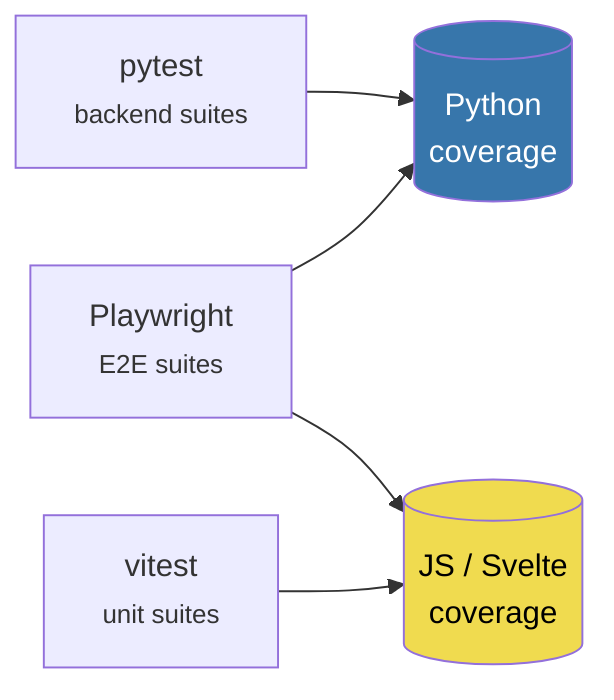

# Coverage Model

LibreFolio measures coverage on **two independent axes**. Keeping them apart is the
single most important thing to understand about the reports — most of the confusion
around the older report names came from collapsing them into one.

| Axis | Question it answers | Values |
|------|--------------------|--------|
| **Language** | *Which code is being measured?* | `py` (Python backend) · `js` (JS/Svelte frontend) |
| **Suite** | *Which tests are driving it?* | backend pytest · Playwright E2E · vitest unit |

The two axes are orthogonal. A Playwright E2E run drives **both** languages at once:
it exercises the frontend in the browser *and* the backend through HTTP.



## The six reports

| Report | Language | Driven by | Opened with |
|--------|----------|-----------|-------------|
| `htmlcov-backend/` | Python | backend pytest | `./dev.py test coverage show backend` |
| `htmlcov-backend-e2e/` | Python | Playwright E2E | `./dev.py test coverage show frontend` |
| `htmlcov/` | Python | both, merged | `./dev.py test coverage show combined` |
| `frontend/coverage-js/unit-combined/` | JS/Svelte | vitest | `./dev.py test coverage show js-unit` |
| `frontend/coverage-js/e2e/` | JS/Svelte | Playwright E2E | `./dev.py test coverage show js-e2e` |
| `frontend/coverage-js/combined/` | JS/Svelte | both, merged | `./dev.py test coverage show js` |

!!! info "Why `htmlcov-backend-e2e/` and not `htmlcov-frontend/`"

    The folder used to be called `htmlcov-frontend/`, which suggested it measured
    frontend code. It never did: it measures **Python**, driven by the frontend's E2E
    suite. The HTML title was already correct ("Frontend E2E → Backend Coverage") —
    only the folder name lied. Frontend *code* coverage now lives under
    `frontend/coverage-js/`.

## The `--coverage` flag

```bash
./dev.py test --coverage all            # both languages (default when omitted)
./dev.py test --coverage py all         # Python only
./dev.py test --coverage js front-asset all
```

`--coverage` takes an optional language. When omitted it means `all`, so every
pre-existing invocation keeps working unchanged:

```bash
./dev.py test --coverage api all        # still valid — 'api' is the suite, not a language
```

### `all` means "everything measurable *in that suite*"

Not "everything, always". Asking for something a suite cannot produce is an error,
not an empty report:

| Suite | What `all` collects |
|-------|--------------------|
| backend (`api`, `db`, `services`, `schemas`, `utils`, `external`) | Python only |
| Playwright E2E | Python **+** JS |
| vitest unit | JS only |

!!! warning "`./dev.py server --coverage` stays boolean"

    A server process can only ever measure Python. The flag is deliberately **not**
    generalised there, and the argv normaliser that makes `--coverage api all` work
    is scoped to the `test` sub-command so it cannot corrupt the Playwright
    `webServer` command line.

## How JS coverage is collected

```text
vitest    ──(vitest-monocart-coverage)──▶ coverage-js/unit/<pid>/raw ─┐
                                                                      ├─▶ mcr merge ─▶ combined
Playwright ──(page.coverage → V8)───────▶ coverage-js/e2e/raw       ─┘
```

Both levels go through [`monocart-coverage-reports`](https://github.com/cenfun/monocart-coverage-reports),
which is what makes a **single merged report** possible instead of two silos. The
`raw` format is the meeting point — the same role `.coverage.<pid>` files play on
the Python side before `coverage combine`.

Configuration lives in three files under `frontend/`:

| File | Role |
|------|------|
| `mcr.shared.js` | Filters and source resolution shared by both levels |
| `mcr.config.js` | vitest level — auto-loaded by `vitest-monocart-coverage` |
| `mcr.e2e.config.js` | E2E level — imported explicitly by the Playwright fixture |

### The Playwright fixture

`frontend/e2e/fixtures/playwright.ts` is a **barrel**: every spec imports `test` and
`expect` from it instead of from `@playwright/test`. It adds an `auto` fixture that,
**only when `COVERAGE_JS=1`**, starts V8 coverage on every page of the context and
hands the result to monocart at the end of each test.

The fixture calls `mcr.add()` and **never** `generate()`. Playwright is launched once
per suite, so the data has to accumulate in monocart's cache across processes; the
report is produced once, at the end, by `frontend/scripts/mcr-generate.js`.

!!! note "The opposite is true for vitest"

    `vitest-monocart-coverage` calls `generate()` at the end of *every* vitest
    process, and the runner launches vitest **eight times** (one per category). Each
    run would wipe the previous one's output. The fix is a **per-process
    `outputDir`** (`coverage-js/unit/<timestamp>-<pid>`), merged afterwards — the
    same result the E2E level gets from a shared cache, reached from the other side.

### Four non-obvious details

1. **External sourcemaps must be resolved from disk.** SvelteKit emits `.map` files
   next to the bundles, and monocart does *not* fetch them over HTTP. `mcr.shared.js`
   installs a `sourceMapResolver` that reads them from `frontend/build/_app/`.
   Reading from disk is not an optimisation but a requirement: report generation
   happens after Playwright has already shut the test server down.

2. **Third-party code cannot be excluded by path prefix.** npm sourcemaps preserve
   *package-internal* paths, so Svelte's own runtime shows up as
   `src/internal/client/…` — indistinguishable from ours by prefix alone. The filter
   is therefore a **disk-existence check** against the real contents of
   `frontend/src`.

3. **The E2E build is already the right one.** `./dev.py server --test` builds in
   debug mode, so sourcemaps and unminified code are present without any change to
   the production build.

4. **`mcr merge` does not re-emit a `raw` report.** Only `generate()` can write `raw`
   (it copies the cache). Asking `merge` for it produces no error and no directory —
   so a two-step merge silently drops a whole source. The combined report is therefore
   built from the **original** raw directories (`coverage-js/unit/*/raw` plus
   `coverage-js/e2e/raw`), never from an intermediate merge.

    !!! danger "How this fails"
        The broken report still generates, still lists every file, and still shows
        plausible percentages. The only visible symptom is a file covered in one
        source appearing at 0 % in the combined one — added by `--all` rather than
        merged in. If you change the merge, verify a file measured *only* by vitest
        (for example `src/lib/stores/core/EditBuffer.ts`) keeps its coverage in
        `combined/coverage-final.json`.

## How Python coverage reaches **spawned** children

`.coveragerc` already declares `concurrency = multiprocessing,thread,gevent`, which lets a
*running* tracer follow **forked** children (e.g. `uvicorn --workers N`). It does nothing for a
**spawned** child — `backend/app/services/risk/quant/spawn_worker.py` starts a fresh
interpreter that inherits the environment but no tracer, so the quant workers measured **0 %**
while being very much alive.

The fix is coverage.py's documented subprocess recipe, wired by the test runner:

1. `backend/test_scripts/_coverage_sitecustomize/sitecustomize.py` calls
   `coverage.process_startup()` at interpreter startup.
2. Whenever a run collects coverage, `scripts/test_runner/_common.py`
   (`apply_subprocess_coverage_env`) sets `COVERAGE_PROCESS_START=<repo>/.coveragerc` and
   **prepends** that directory to `PYTHONPATH` on every child it spawns (pytest workers, the
   shared backend, Playwright → its `webServer`). Python's `site` module then imports the
   sitecustomize in *every* interpreter of the process tree.
3. Each child reads the repo `.coveragerc` (`parallel = true`), starts its own tracer, and
   writes `.coverage.<host>.<pid>.<rand>` next to the parent's data file — where the existing
   `coverage combine` steps already pick it up.

Three load-bearing details:

- **The guard is the feature.** Outside a coverage run `COVERAGE_PROCESS_START` is unset and
  the module is a no-op — production interpreters pay nothing. When the variable *is* set, a
  failure to start coverage must crash the spawn bootstrap (surfacing as a test failure)
  instead of silently dropping data. `coverage.process_startup()` is itself idempotent, so
  coexisting with the `a1_coverage.pth` that coverage 7.14 installs in the virtualenv is safe.
- **Not every interpreter has coverage installed.** Along the spawn/exec chain there are
  interpreters that never run measured code (the Homebrew Python hosting the `pipenv`
  launcher): a `ModuleNotFoundError` on `import coverage` is tolerated for exactly those.
- **The sitecustomize chain-execs the next one down `sys.path`.** Python imports only ONE
  `sitecustomize` — the first found — so prepending ours **shadows** the interpreter's own.
  Homebrew Python ships one that rewrites `sys.prefix` from the Cellar path to the opt prefix
  and exposes `/opt/homebrew/lib/pythonX.Y/site-packages`; when it is shadowed, `pipenv`
  becomes unimportable and every `pipenv run …` child of the server/test flow dies at import.
  The file therefore finds and `exec`s the next sitecustomize down the path — do not remove
  that block. The full post-mortem lives in the devWiki at
  `LibreFolio_devWiki/wiki/problems/sitecustomize-shadows-homebrew-python.md`.

## Reading the reports

!!! tip "Coverage is a map, not a grade"

    There are deliberately **no blocking thresholds**. Svelte 5 compiles templates
    into closures: the remap is reliable about *"was this component reached"* and much
    less so about *"is line X covered"*.

    On the defects actually found during beta testing, coverage would have flagged
    roughly half of them — the ones caused by code that never ran. It says nothing
    about code that runs and is simply wrong.

!!! tip "Running under coverage doubles as a slow-environment stress test"

    Python instrumentation slows the backend down enough to turn latent races into
    deterministic failures. A spec that passes without `--coverage` and fails with it
    is worth investigating: it has usually found a real timing bug, not a measurement
    artefact.

## Finding the gaps

An HTML report tells you the percentage. It does not tell you *which* untested code
is worth a test. `coverage-report` does:

```bash
./dev.py test coverage-report --lang js --summary          # counts by category
./dev.py test coverage-report --lang js --category js_store   # the detail
./dev.py test coverage-report --lang js --priority high --json
```

Without `--lang js` the same command analyses the **backend** JSON, exactly as before —
one analyser, two languages, identical filters and output modes.

The input is picked automatically: `combined`, then `e2e`, then `unit-combined`,
whichever exists. Pass `--input` to point elsewhere.

| Category | Covers |
|---|---|
| `JS_FEATURE` | `src/lib/features/` — AI export, import wizard, asset grouping |
| `JS_STORE` | `src/lib/stores/` — shared client state |
| `JS_API` | `src/lib/api/`, `src/lib/services/` |
| `JS_UTILITY` | `src/lib/utils/`, `src/lib/risk/` — pure functions, the cheapest to test |
| `JS_CHART` | `src/lib/charts/` — chart building and signal overlays |
| `SVELTE_UI` | `.svelte` component blocks |
| `JS_ROUTE` | `src/routes/` — pages and layouts |
| `JS_ACTION` | `src/lib/actions/` |
| `JS_I18N`, `JS_INFRA`, `JS_OTHER` | plumbing, workers, types |

!!! warning "Two things to know about the JS numbers"

    **Svelte components have no function names.** The compiler turns markup into
    closures, so entries appear as `block@142` — the line, which is what you need to
    find the code anyway. `.ts` files keep their real names, which is why the
    `JS_UTILITY` / `JS_STORE` sections are the most readable and the best place to start.

    **Statements are attributed by line range.** istanbul does not record which
    statement belongs to which function, so a nested closure is counted both for
    itself and for its parent. Use the numbers to *rank* untested code by weight,
    not to quote a percentage.

## Cleaning

```bash
./dev.py test --coverage --cov-clean-backend --cov-clean-backend-e2e all
```

JS coverage directories are cleaned automatically at the start of every run that
requests `js` or `all`, since monocart's cache is designed to accumulate.
