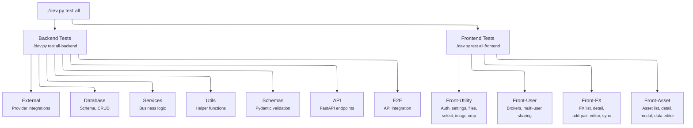
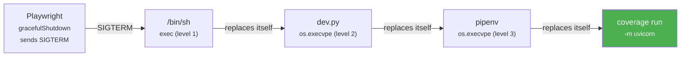

# 🧪 Test Walkthrough

This section guides you through the LibreFolio test suite. Understanding the tests is one of the best ways to understand the codebase.

!!! note "Modular Test Runner Architecture"

    LibreFolio uses a modular test orchestrator package located in `scripts/test_runner/` to manage, register, and isolate coverage for all backend and frontend test suites. For details on how the runner is structured and how to extend it, see the [Test Runner Architecture](runner_architecture.md) documentation.


## 🚀 Running Tests

All tests are executed through `dev.py`:

```bash
# Run everything
./dev.py test all

# Run a single category
./dev.py test api all

# Run a specific test file
./dev.py test api test_auth_api

# List available tests (without running them)
./dev.py test api --list
```

### 🌐 Global Flags

| Flag | Description |
|------|-------------|
| `-q` / `--quiet` | Suppress the detailed test output. Without it, the output is verbose |
| `--coverage [py\|js\|all]` | Run with code coverage tracking. The language is optional and defaults to `all` |
| `--cov-clean-backend` | Clean Python coverage from backend tests (`htmlcov-backend/` + `.coverage_data/backend`) |
| `--cov-clean-backend-e2e` | Clean Python coverage collected during E2E runs (`htmlcov-backend-e2e/` + `.coverage_data/frontend`) |
| `--cov-clean-js` | Clean JS/Svelte coverage (`coverage-js/`). Manual utility only — a `--coverage js` run cleans it by itself |
| `--workers N\|auto` | Run isolation-safe backend units in parallel. Default `1` — the serial path, unchanged. `auto` is half the cores |
| `--fail-fast` | Stop handing out work after the first red. The default runs everything and reports every failure |
| `--log-dir PATH` | One log file per test unit. Defaults to `.testLog`; `--log-dir ""` turns it off |
| `--no-consolidate` | Keep one invocation per action instead of grouping a whole category into a single run — one pytest invocation on the backend, one Playwright and one vitest run on the frontend |
| `--test-port PORT` / `--port PORT` | Port of this run's test backend. Defaults to `TEST_PORT`, then `6041` — see [Isolated Runtime Lanes](#isolated-runtime-lanes) |
| `--data-dir PATH` | Test data root of this run. Defaults to `LIBREFOLIO_TEST_DATA_DIR`, then `backend/data/test` — see [Isolated Runtime Lanes](#isolated-runtime-lanes) |

!!! note "Where the flags go"

    They belong to `./dev.py test`, so they come **before** the category:
    `./dev.py test --workers 4 --coverage py services all`.

!!! warning "`--cov-clean-frontend` is deprecated"

    It still works as an alias for `--cov-clean-backend-e2e`, but the old name was
    misleading: it never cleaned JavaScript coverage. It cleans the **Python**
    coverage collected while Playwright drives the backend.

    JS coverage has no accumulate-or-clean choice to make. It is raw V8 data whose
    byte offsets only mean anything for the bundle that produced them, so it cannot
    survive a frontend rebuild — a `--coverage js|all` run therefore always wipes it
    first. `--cov-clean-js` exists only to clean it outside a run.

!!! tip "Two axes, not one"

    `--coverage` selects **which language** is measured; the suite you run selects
    **which tests drive it**. See [Coverage Model](coverage-model.md) for the full
    picture — including why the report formerly called `htmlcov-frontend/` actually
    measured Python.

### 🛣️ Isolated Runtime Lanes

A test run owns one **runtime lane**: the port of the backend it starts and talks to, and
the data directory that backend uses (`sqlite/app.db`, uploads, broker reports, logs). Runs
that are active at the same time — one per worktree — must each have their own lane: never
point two active runs at the same port or the same data directory.

| Flag | Environment variable | Default | Lane resource |
|------|----------------------|---------|---------------|
| `--test-port PORT` / `--port PORT` | `TEST_PORT` | `6041` | Port of the test backend |
| `--data-dir PATH` | `LIBREFOLIO_TEST_DATA_DIR` | `backend/data/test` | Root of the test data |

A flag wins over the shell environment, which wins over the checkout's `.env`. A relative
data path resolves against the root of the checkout that runs the command, so each worktree's
default data directory is already its own. The port is machine-wide, so every worktree that
runs tests at the same time needs a different one — on the command line, or as `TEST_PORT` in
that worktree's `.env`. If you set `LIBREFOLIO_TEST_DATA_DIR` to an absolute path, give each
worktree a different one as well.

```bash
# A second worktree, testing while another one uses the default lane (6041)
./dev.py test --test-port 6141 api all
```

The runner applies the lane before any setup, server start, or child process
(`configure_test_runtime` in `scripts/cli_base.py`), and stops with an error when:

- the port is outside 1–65535 or equals the production port (`PORT`, default `6040`);
- the data directory overlaps the production data directory (`backend/data/prod`, or
  `LIBREFOLIO_DATA_DIR`) in either direction, sits inside — or holds in its managed
  subdirectories — a directory marked as production data, or has a managed path that
  escapes it or aliases production data.

The resolved `TEST_PORT` and `LIBREFOLIO_TEST_DATA_DIR` are exported to every child process,
together with a random lane identity (`LIBREFOLIO_TEST_LANE_ID`). A backend counts as ready
only when `/api/v1/system/test-lane-health` echoes that identity in the
`X-LibreFolio-Test-Lane` header, and the shared test server refuses to start on a port that
another process already holds: it never reuses or terminates another lane's server. The
contract is covered by `./dev.py test utils runtime-isolation`.

### 🔍 Provider Filter Flags (external, all, all-backend)

| Flag | Description |
|------|-------------|
| `--providers CODE [CODE ...]` | Only test these provider(s) |
| `--exclude-providers CODE [CODE ...]` | Exclude these provider(s) from testing |

```bash
# Skip yfinance when Yahoo Finance is down
./dev.py test external asset-providers --exclude-providers yfinance

# The same flags work with all and all-backend
./dev.py test all --exclude-providers yfinance
./dev.py test all-backend --providers ECB justetf
```

!!! tip "See available provider codes"

    Run `./dev.py test external -h` to see all available provider codes (Asset, FX, BRIM), dynamically discovered from the source tree.

### 🖥️ Frontend Flags

Frontend test categories support additional flags (`--headed`, `--debug`, `--ui`). See the [Frontend Tests Overview](front-overview.md) for details.

---

## 📋 Test Categories

LibreFolio organizes tests into **11 categories**, grouped by layer:

| Category | Command | What It Tests |
|----------|---------|---------------|
| **External** | `./dev.py test external all` | Provider integrations (FX, assets, BRIM) — no server needed |
| **Database** | `./dev.py test db all` | SQLite schema, migrations, CRUD — no server needed |
| **Services** | `./dev.py test services all` | Business logic in the service layer |
| **Utils** | `./dev.py test utils all` | Helper functions and utility modules |
| **Schemas** | `./dev.py test schemas all` | Pydantic model validation |
| **API** | `./dev.py test api all` | FastAPI endpoints (auto-starts server) |
| **E2E** | `./dev.py test e2e all` | Backend end-to-end with API interaction |
| **Front-Utility** | `./dev.py test front-utility all` | Auth, settings, files, select, image-crop (Playwright) |
| **Front-User** | `./dev.py test front-user all` | Brokers, multi-user, sharing (Playwright) |
| **Front-FX** | `./dev.py test front-fx all` | FX list, detail, add-pair, editor, sync (Playwright) |
| **Front-Asset** | `./dev.py test front-asset all` | Asset list, detail, modal, data editor (Playwright) |

### 🏃 Meta Categories

| Meta Category | Command | What It Runs |
|---------------|---------|--------------|
| **All** | `./dev.py test all` | All backend + frontend tests |
| **All Backend** | `./dev.py test all-backend` | All backend tests (external → e2e) |
| **All Frontend** | `./dev.py test all-frontend` | All frontend tests (front-utility → front-asset) |

---

## 🏗️ Architecture Overview



---

## 📑 Category Details

### 🔧 Backend Categories

- **[External](external.md)** — Tests that call real external APIs (FX providers, asset providers, BRIM parsers). Run without the backend server.
- **[Database](db.md)** — Tests the database layer directly (schema validation, persistence, migrations). Uses an isolated test SQLite file.
- **[Services](services.md)** — Tests the service layer business logic, often with mocked dependencies.
- **[Utils](utils.md)** — Tests utility modules and helper functions.
- **[Schemas](schemas.md)** — Tests Pydantic model validation, serialization, and edge cases.
- **[API](api.md)** — Integration tests for FastAPI endpoints. Automatically starts a test server if needed.
- **[E2E](e2e.md)** — End-to-end backend tests with real API interaction and database state.

### 🎭 Frontend Categories (Playwright)

- **[Front-Utility](front-utility.md)** — Tests UI components: authentication flow, settings tabs, file upload, search selects, image cropping.
- **[Front-User](front-user.md)** — Tests user-facing features: broker CRUD, multi-user scenarios, broker sharing with RBAC.
- **[Front-FX](front-fx.md)** — Tests the FX module: pair list, detail chart, add-pair modal, data editor, sync, and FX-specific API calls.
- **[Front-Asset](front-overview.md)** — Tests the Asset module: asset list, detail page, create/edit modal, data editor.

!!! info "Frontend tests require a running server"

    Frontend categories automatically start both the backend server and serve the frontend build. Use `--headed` to watch the browser in action.

---

## 📊 Coverage

### File Architecture

Coverage data is stored in SQLite databases and HTML reports:

```text
LibreFolio/
├── .coveragerc                 # Coverage configuration (parallel=true, sigterm=true)
├── .coverage                   # Working copy — swapped in/out by scripts/test_runner/
├── .coverage_data/
│   ├── backend                 # Accumulated backend-only coverage DB
│   ├── frontend                # Accumulated frontend-only coverage DB
│   └── archive/                # Previous versions (timestamped)
│       ├── backend_20260416_0930
│       ├── backend_20260416_0951
│       └── frontend_20260415_1420
├── htmlcov-backend/            # HTML report: Python, driven by backend tests
├── htmlcov-backend-e2e/        # HTML report: Python, driven by frontend E2E
├── htmlcov/                    # HTML report: Python, combined
└── frontend/coverage-js/       # JS/Svelte coverage (unit, e2e, combined)
```

| File | Updated by | Contains |
|------|-----------|----------|
| `.coverage` | pytest-cov (working copy) | Temporary — swapped in before pytest, swapped out after |
| `.coverage_data/backend` | `run_command()` finally block | Accumulated backend-only coverage, grows with each backend test run |
| `.coverage_data/frontend` | `_finalize_coverage()` | Server subprocess coverage from Playwright E2E |
| `htmlcov-backend/` | `_finalize_coverage()` | HTML report from `.coverage_data/backend` |
| `htmlcov-backend-e2e/` | `_finalize_coverage()` | HTML report from `.coverage_data/frontend` |
| `htmlcov/` | `_finalize_coverage()` | HTML report from merged backend + frontend |
| `frontend/coverage-js/` | `_finalize_js_coverage()` | JS/Svelte reports — see [Coverage Model](coverage-model.md) |

### Running with Coverage

#### Full Run (clean baseline)

```bash
# Full test suite with coverage — generates all 3 reports
./dev.py test --coverage all

# Clean stale data before a fresh run
./dev.py test --coverage --cov-clean-backend --cov-clean-backend-e2e all
```

#### Incremental Runs (append to existing)

After a full run, you can run individual test files and the coverage **accumulates**
in the existing `.coverage` database thanks to `--cov-append`:

```bash
# Run only specific tests — coverage is added to the existing DB
./dev.py test --coverage services static-uploads
./dev.py test --coverage services fx-core
./dev.py test --coverage utils day-count

# The HTML report (htmlcov-backend/) is regenerated after each run
# The .coverage.backend snapshot is updated automatically
```

!!! tip "Incremental coverage workflow"

    1. Run `./dev.py test --coverage all` once to establish a baseline
    2. Write new tests
    3. Run only the new test file with `--coverage` — it appends to the existing DB
    4. Check the updated report with `./dev.py test coverage show backend`

#### Viewing Reports

```bash
./dev.py test coverage show backend    # open htmlcov-backend/
./dev.py test coverage show frontend   # open htmlcov-backend-e2e/
./dev.py test coverage show combined   # open htmlcov/ (merged)

./dev.py test coverage show js         # open frontend/coverage-js/combined/
./dev.py test coverage show js-unit    # open frontend/coverage-js/unit-combined/
./dev.py test coverage show js-e2e     # open frontend/coverage-js/e2e/
```

### Coverage Isolation

The `.coveragerc` uses `parallel = true` (required for frontend subprocess coverage).
This causes `coverage combine` to pick up **all** `.coverage.*` files and delete them.

To keep backend and frontend coverage properly isolated, the test runner uses a
**swap-in/swap-out** pattern with a dedicated `.coverage_data/` folder:

```text
Before pytest (run_command):
  .coverage_data/backend ──copy──▶ .coverage    (restore accumulated DB)

During pytest:
  pytest-cov runs with --cov-append → appends to .coverage
  parallel=true writes .coverage.HOST.PID, then combines → .coverage
  (.coverage_data/ folder is safe — combine only looks in root)

After pytest (finally block):
  .coverage ──copy──▶ .coverage_data/backend    (save accumulated DB)

After all tests (_finalize_coverage):
  .coverage_data/backend → htmlcov-backend/     (generate HTML report)
  .coverage_data/frontend → htmlcov-backend-e2e/
  merge both → htmlcov/                          (combined report)
```

!!! tip "Why `.coverage_data/` instead of `.coverage.backend`?"

    With `parallel = true`, `coverage combine` picks up **all** files matching
    `.coverage.*` in the current directory. A file named `.coverage.backend` would
    be consumed and deleted. Files in a subdirectory are safe.

### Frontend Coverage Architecture

!!! info "This section is about **Python** coverage driven by the E2E suite"

    For JS/Svelte coverage — the frontend's *own* code — see
    [Coverage Model](coverage-model.md).

Backend coverage during Playwright E2E tests requires a precise signal chain so that
`coverage run` receives SIGTERM (not SIGKILL) and can write `.coverage.<pid>` data.

**4 required elements:**

1. **`gracefulShutdown`** in `playwright.config.ts` — sends SIGTERM instead of SIGKILL
2. **`exec`** in the shell command — shell replaces itself with `dev.py`
3. **`os.execvpe()`** in `dev.py` — replaces itself with `pipenv run coverage run`
4. **`sigterm = true`** in `.coveragerc` — coverage catches SIGTERM and writes data



All four steps share the **same PID**. When Playwright sends SIGTERM, it reaches
`coverage run` directly. The `.coveragerc` option `sigterm = true` catches it and
writes `.coverage.<pid>` before the process exits.

!!! danger "Without `gracefulShutdown`"

    By default, Playwright sends **SIGKILL** to terminate the webServer.
    SIGKILL cannot be caught or handled — the process is killed instantly
    and no coverage data is ever written. This is the most common cause of
    missing `htmlcov-backend-e2e/`.

!!! warning "Without `exec` at any level"

    If any level uses `subprocess.run()` instead of exec, SIGTERM only reaches
    the parent process. The child (`coverage run`) becomes an **orphan** and no
    coverage data is written.

!!! danger "The grace window must be wide enough"

    SIGTERM is only half the story: Playwright falls back to **SIGKILL** once the
    `gracefulShutdown.timeout` expires. Flushing the coverage data file takes real
    time, and the default 5 s was not always enough — when it wasn't, the run lost
    **all** backend coverage and reported only a terse
    `No .coverage.* files found!` at the end, which looks like a configuration
    problem rather than a race.

    The timeout is therefore widened to **30 s whenever `COVERAGE_BACKEND` is set**,
    and left at 5 s otherwise (outside coverage there is nothing to flush, so a slow
    shutdown would only waste time).
