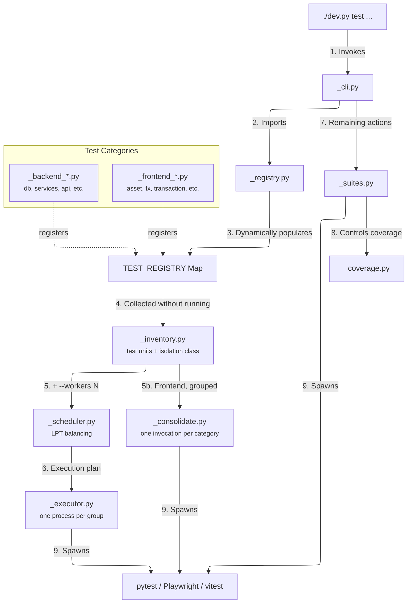
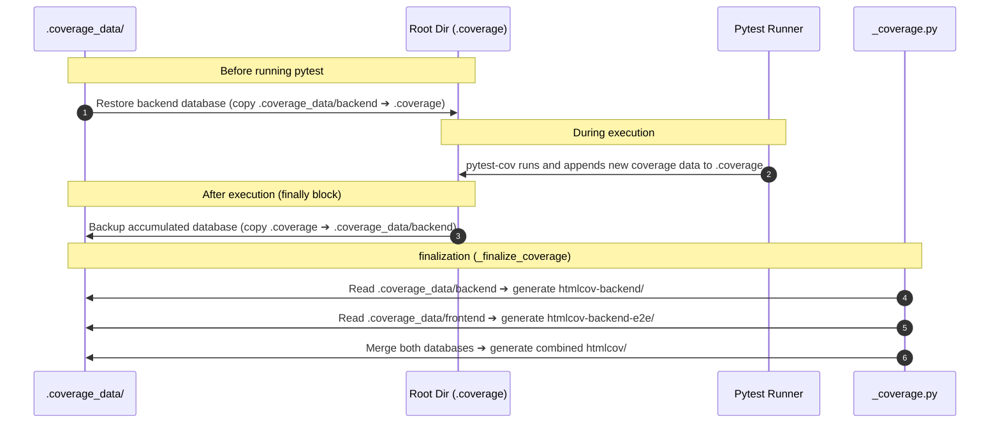

# 🏗️ Test Runner Architecture

This document describes the design and inner workings of the modular test orchestrator located in `scripts/test_runner/`.

---

## 🏗️ Architecture Overview

LibreFolio orchestrates its test execution through a custom Python package rather than a static,
monolithic script. The package separates **what exists** from **how it is grouped** from **how it is
run** — three concerns that used to live inside a single function per test action, which is why
parallel execution was impossible before.



---

## 🧭 The Inventory (`_inventory.py`)

The inventory answers one question — **what test units exist?** — and it answers it by *derivation*,
never by a hand-written list. Hand-written lists drift silently: before the inventory existed, six
registered actions covering roughly 259 tests were reachable by name but executed by no `all` list,
and the orphan check could not see it because it grepped for filenames rather than reasoning about
reachability.

Collection works because the action functions are almost-pure *command producers*. Replacing
`run_command` and `_run_playwright` with collectors makes every action report what it **would** launch
without launching anything, so the whole registry can be inspected in well under a second.

!!! danger "Two actions do real work during collection"

    `db create` and `db populate` do not merely compose a command — `db create` calls
    `TEST_DB_PATH.unlink()` for real, and an early collection pass genuinely emptied the test
    database. They are therefore neutralised **both in the registry dictionary and in the module that
    defines them**, because the `all` suites hold direct references to the function object. A guard on
    `Path.unlink` during collection catches any future action that acquires the same habit.

### Isolation classes

Every unit carries the class that says *what it needs in order not to disturb anything else*. The
classes come from the data model: of the 12 tables only `UserSettings` and `BrokerUserAccess` are
per-user, so almost every write lands on a shared surface.

| Class | Meaning | Can share with… | Dedicated resource |
|---|---|---|---|
| **PURE** | touches neither the database nor a server | anything | `COVERAGE_FILE` only |
| **READ** | reads shared data, never writes | other READs, on one backend | none |
| **WRITE-SCOPED** | writes only rows owned by its own user/broker | other WRITE-SCOPED with a *different* user | one E2E user |
| **WRITE-GLOBAL** | writes shared surfaces (assets, FX, prices, settings) | nothing | a whole database |

Classification is deliberately **strict**: vitest units are PURE by construction, a pytest unit is
PURE only when neither the file **nor the helpers it imports** mention a shared-state marker, and
everything else falls through to WRITE-GLOBAL. The asymmetry is the point — a wrong PURE produces an
intermittent red, while a wrong WRITE-GLOBAL only costs time.

!!! warning "Impurity travels through imports"

    A test file can look spotless and still import `test_db_config`, which points at the shared test
    database. Classification therefore follows `test_utils`, `test_db_config` and `test_server_helper`
    one level deep. One level is enough because those helpers do not import each other.

READ and WRITE-SCOPED must be **declared** before they can be trusted; a textual heuristic was tried
and misclassified real cases, so until a unit is declared it stays serial.

### Declaring a class — and earning it

The default is correct but it is not free: left alone, it serialised **50 of the 51 `api` units and
37 of the 85 `services` units** for no reason at all. The debt was never in the tests — it was in
the catalogue, which had no way to be told it was wrong.

Declare per unit, or on the category when the property holds for all of it:

```python
make_category(
    "api", ...,
    # every unit creates its own user and addresses its own rows by id
    default_isolation="write-scoped",
)

add_test(
    "auth", ...,
    exclusive_because="rewrites global_settings.enable_registration; while it is False "
                      "every concurrent user creation fails",
)
```

`exclusive_because` **is** the WRITE-GLOBAL declaration, not a comment next to a flag. Storing the
class and its justification as one statement means a category default cannot silently promote a unit
somebody already explained must not be promoted — and the catalogue of exceptions is generated
rather than maintained by hand.

!!! tip "A class claim is earned by a passing parallel run, not asserted"

    `--assume-scoped` ignores the catalogue and runs everything concurrently. Use it **once per
    category** to find out what the catalogue was getting wrong, read the reds with the
    `test-triage` skill, then write down what you learnt. It is experiment instrumentation, never a
    default.

    On `api` that experiment produced **14 reds out of 603 tests**, thirteen of which had a single
    cause: `test_auth_api.py` turning registration off while its neighbours were creating users.
    The fourteenth had nothing to do with concurrency — it reached the real ECB over the internet.

### How to ask for an exclusive, and what justifies one

The whole backend currently has **one** exclusive unit. That number is the point of the section: it
is small because an exclusive has to survive being written down.

| Unit | Why it cannot be scoped |
|---|---|
| `api auth` | rewrites `global_settings.enable_registration` — an **instance-wide flag**, not a per-user row. While it is `False` every concurrent user creation fails, and a test that verifies closed registration necessarily owns the instance. |

Two claims that look like reasons and are not:

- *"It reaches a third party over the network, so it is slow and fragile."* That is a reason to stop
  reaching the third party, not to take the database. `api fx` held an exclusive on exactly this
  argument until the three syncs were pointed at `MOCKFX`; it now runs with everyone else, and its
  assertions became exact in the process.
- *"It failed when I ran it in parallel."* Say **what** it mutates. If you cannot name the shared
  surface, the cause is somewhere else — read the reds with the `test-triage` skill first, because
  the loudest failure is usually not the one doing the damage.

The test is simple: name the surface, and say why it has no per-user equivalent. If the sentence
works, it belongs in `exclusive_because` and the exclusive is granted by the same act. If it does
not, the unit is not exclusive — it is unfinished.

---

## 🧹 Shared state: whoever commits, cleans up

This is a **rule for whoever writes the next test**, not an implementation note. It is the one thing
in this page you can break without any tool telling you.

### Why the old design hid the problem

While the runner spent one process per action, every test file effectively got a fresh database:
`globalSetup` re-populated before each Playwright invocation, and each pytest invocation started
from a clean import. A test could write whatever it liked and walk away — the evidence was wiped
before anyone could trip over it.

Consolidation removes that accident. Once several units share one invocation, **what one leaves
behind becomes the next one's input.** No test changed; the contract they were all silently relying
on did.

### The rule

> **A test that commits to a shared surface must restore it, in its own teardown, without assuming a
> freshly populated database.**

"Shared surface" is almost everything: of 12 tables only `UserSettings` and `BrokerUserAccess` are
per-user. `Transaction` in particular has **no `user_id`** — isolation happens at service level via
broker access — so a committed transaction is visible to every later test.

Tests that only *read*, and fixtures that flush and roll back, are already compliant and need
nothing. **The only candidates are fixtures and specs that deliberately call `commit()`** — few, and
findable.

### Backend

```python
@pytest_asyncio.fixture(scope="module")
async def fx_asset_ids():
    ...                       # writes and commits
    yield asset_id
    async with ... as session:   # and now puts it back
        await session.execute(delete(PriceHistory).where(...))
        await session.execute(delete(FxRate).where(...))
        await session.execute(delete(Asset).where(Asset.id == asset_id))
        await session.commit()
```

Without that teardown the committed FX rows collide with a later `session.add()` on the same
`(date, base, quote)` key, and the failure surfaces in a *different file* — which is what makes this
class of bug expensive.

### Frontend (E2E)

An E2E test writes over HTTP, so there is no session to roll back. Use
`frontend/e2e/fixtures/db-cleanup.ts`, which works **by id difference**: photograph before, delete
what appeared after.

```ts
import {deleteTransactionsCreatedSince, snapshotTransactionIds} from '../fixtures/db-cleanup';

let txBefore: Set<number>;

test.beforeEach(async ({page}) => {
    await login(page, TEST_USER);
    txBefore = await snapshotTransactionIds(page);   // after login: page.request shares the cookie jar
    await goToTransactions(page);
});

test.afterEach(async ({page}) => {
    await deleteTransactionsCreatedSince(page, txBefore);
});
```

Prefer the id-difference form over deleting the ids you *think* you created: it also catches rows
created **indirectly** — the second half of a linked pair, a promoted transfer, a derived event —
and those are precisely the ones that get forgotten.

!!! example "The bug this rule was written from"

    `tx-clone.spec.ts` clones "the first paired giver row on editable brokers" and commits it for
    real. That row is the `delete-safe` ETH transfer. `tx-delete.spec.ts` then deletes that pair and
    asserts nothing matching survives — and found the clone. Neither test was wrong; the implicit
    contract between them was.

#### `--workers` reaches Playwright too

The frontend has **two** worker counts, and they are derived from the same number:

```text
./dev.py test front-transaction --workers 4
        │
        ├─ _apply_parallel  → _common._E2E_WORKERS = 4
        │                       └─ _run_playwright injects E2E_WORKERS=4
        │                            └─ playwright.config.ts: workers: 4   (browser contexts)
        │
        └─ playwright.config.ts: SERVER_WORKERS = max(1, ⌊4 / 2⌋) = 2      (uvicorn processes)
```

One uvicorn worker per two browser workers, minimum one. The ratio is deliberate: browser workers
spend most of their time rendering and waiting, so pairing them onto a single backend keeps the
backend *usefully* contended — which is the point. A suite that never makes the backend queue is
not testing concurrency, it is only testing itself faster.

!!! warning "The environment variable is not the interface"

    `E2E_WORKERS` existed long before `--workers` wrote it. That gap meant
    `./dev.py test front-transaction --workers 4` gave four **uvicorn** workers and one **browser**
    worker: the flag was half-obeyed, silently. If you set `E2E_WORKERS` in your shell it still
    wins — the runner does not overwrite a value you chose deliberately.

!!! danger "Do not edit the repository while an E2E run is in flight"

    Playwright's `webServer` starts the backend itself, and it must be started with `--no-reload`
    (it is, since this was found the hard way). Under `--reload` uvicorn watches the **repo root**:
    a single saved file restarts the backend mid-run, and every test that happens to be logging in
    at that moment dies at 20 s. The signature is unmistakable — a burst of `login()` timeouts in
    the tests scheduled first, scattered across unrelated files. It reads exactly like a
    concurrency bug, and it is not one.

---

## 🧮 The Scheduler (`_scheduler.py`)

The scheduler turns *inventory + `--workers N`* into an execution plan. It decides what runs with what
using the isolation class alone — never a test name or a directory shape.

Balancing is **longest-processing-time first**: the longest unit goes to the currently shortest group.
Round-robin was measured losing about half the theoretical gain, because one group finished in 32 s
while another was still running at 84 s and the run is only as fast as its slowest group. Durations
come from the workers' JUnit reports and are persisted in `.coverage_data/unit_durations.json`, so the
first run balances on a median guess and every run after that balances on measurement.

An action is marked as *already covered* — and therefore skipped in the serial pass — only when
**every** path it launches is in the parallel set. A mixed action would otherwise lose its
WRITE-GLOBAL half in silence.

---

## ⚙️ The Executor (`_executor.py`)

Each group runs in its own process with an exclusive lot of resources. Today the lot holds one item,
`COVERAGE_FILE`, because only PURE units are parallelised and they need nothing else; the database,
the port and the E2E user join the lot as the write classes are activated.

| Resource | Serial | Per worker | Needed by |
|---|---|---|---|
| `COVERAGE_FILE` | global `.coverage`, copied in and out | `.coverage_data/parts/.coverage.wN` | every worker |
| `DATABASE_URL` | one shared `app.db` | `app_wN.db` | WRITE-GLOBAL |
| `TEST_PORT` | fixed | `TEST_PORT + N` | backend workers with an in-process server |
| E2E user | always `e2e_test_user` | one of the eight | WRITE-SCOPED |

Workers also run with `-p no:cacheprovider` and without `--cov-report`, since a shared `.pytest_cache`
and a shared `htmlcov-backend/` would be written by every worker at once.

!!! note "Failure policy: stop assigning, never kill"

    By default the run continues past a red and reports the full list. Under `--fail-fast` the
    scheduler hands out no further work, but workers already running are still left to finish:
    killing a worker mid-flight discards its coverage, and coverage that disappears without failing
    is the most expensive defect this project has met.

### `--workers`

- `--workers 1` (default) is the serial path, not an approximation of it: the plan has one group and
  execution follows exactly the route it followed before the migration.
- `--workers N` parallelises the isolation-safe units and leaves everything else serial — a
  WRITE-GLOBAL unit stays serial even at `--workers 8`.
- `--workers auto` resolves to half the cores, because a development machine is not dedicated to tests
  and timing-sensitive tests degrade under load.
- On a **frontend** category the same flag sets Playwright's browser workers and, derived from it,
  the number of uvicorn processes behind them (see *[`--workers` reaches Playwright too](#-workers-reaches-playwright-too)*).

The flag belongs to `./dev.py test`, so it goes **before** the category:

```bash
./dev.py test --workers 4 services all
./dev.py test --workers auto --coverage py all-backend
```

Measured on `utils all`: 258 tests in 31.8 s serially, the same 258 tests in 22.8 s at four workers,
with an identical coverage total of 14.73 %. On `services all` the parallel pass ran 44 units and
1329 tests in 41.5 s.

#### What the whole backend actually gains

`all-backend` with coverage, run both ways from a clean database:

| | `--workers 1` | `--workers 4` |
|---|---|---|
| Tests | 4654 | 4654 |
| Failures | 0 | 0 |
| Coverage | 37336 stmts / 3224 missing / **91.36 %** | 37336 / 3224 / **91.36 %** |
| Wall time | 38 min 52 s | 31 min 03 s |

The coverage figures are identical digit for digit, and identical **file by file** across all 241
modules — the only check worth making on a tool that can silently lose data. The speedup — 1.25× — is
deliberately modest: the parallel pass finishes 51 PURE units (1494 tests) in **32.2 s** with workers
landing at 32.2 / 32.1 / 32.1 / 32.1 s, so the LPT balancing is close to perfect, but everything else
is WRITE-GLOBAL and stays serial by design. Going further means one database per worker, not a
bigger `N`.

!!! note "The total has a noise floor of about 4 statements — and it is attributable"

    Two runs launched minutes apart matched exactly. A third, hours later, closed at 3220 uncovered
    instead of 3224 — *more* covered, despite doing strictly less work, which is causally impossible
    for a deterministic number.

    Compared file by file, the difference sits entirely in `asset_source.py` and
    `asset_source_providers/borsa_italiana.py`: the two modules that talk to the live internet. Test
    and skip counts were identical in all three runs, so nothing changed about *what* ran — only
    which branch the provider took given what the site returned that day.

    So compare **per file, not on the total**. On the total, 4 statements of network noise are
    indistinguishable from a real loss of data; per file they are immediately attributable.

!!! warning "A running test server poisons the whole backend run"

    `--fresh-run` starts with `db create`, which **unlinks the database first** and only then calls
    `db:upgrade` — and `db:upgrade` refuses to migrate while something holds port 6041. The result is
    not one clear error but roughly a dozen unrelated-looking reds downstream, all caused by a
    database that no longer exists. Check `lsof -ti:6041` is empty before a backend run.

### On failure

By default every unit runs and every failure is reported, across the parallel pass, the
consolidation pass **and** the serial suite. The reason is empirical: reds arrive in clusters, and
nine failures in one worker are usually nine symptoms of one cause — a list you cannot see if the
run stops at the first, and that costs one full re-run per red to rediscover.

`--fail-fast` inverts it: the scheduler hands out no further work and the serial pass stops at the
failing action. Workers already started are still left to finish their batch — killing one
mid-flight would discard its coverage, which is exactly how P7 lost data without anything turning
red.

---

## 📦 Frontend consolidation (`_consolidate.py`)

On the backend the win is parallelism. On the frontend it is **not invoking Playwright 120 times**.

Each frontend action used to pay, before running a single assertion: a database populate, eight user
creations, a `globalSetup` that populates and creates users *again*, and a webServer start/stop —
roughly eleven cold Python starts per spec file. Measured on `front-fx`: seven invocations run 42
tests in 502.6 s, while one invocation runs *those same 42 tests plus 21 more* in 218.6 s.

So the units of a category are grouped into one Playwright invocation and one vitest invocation:

| Category | Playwright | vitest | invocations before | after |
|---|---:|---:|---:|---:|
| `front-ai-export` | 4 | 22 | 26 | 2 |
| `front-asset` | 7 | 15 | 22 | 2 |
| `front-broker` | 2 | 3 | 5 | 2 |
| `front-fx` | 8 | 3 | 11 | 2 |
| `front-portfolio` | 3 | 3 | 6 | 2 |
| `front-transaction` | 25 | 7 | 32 | 2 |
| `front-user` | 2 | 2 | 4 | 2 |
| `front-utility` | 8 | 6 | 14 | 2 |
| **total** | **59** | **61** | **120** | **16** |

The `after` column is the shape without JS coverage. With `--coverage js` the Playwright side is run
in batches of 8 specs (see below), so `front-transaction` costs 4 invocations instead of 1 and the
total is 21 rather than 16.

!!! tip "Consolidation is now also what makes parallelism possible"

    The startup saving above was the original reason. Since `fullyParallel: true`, there is a second
    one that matters more: **a Playwright invocation can only distribute the tests it was given.**
    One spec file per invocation means one unit of work, and `--workers 4` buys nothing at all —
    three browsers sit idle. Consolidation is what turns a category into a pool the scheduler can
    spread. On `front-transaction` the two effects are not comparable: grouping alone was worth
    ~0,2 min, grouping *plus* four workers is worth 11.

### A long-lived worker exposes what a short-lived one hid

Grouping changes the lifetime of the process, and anything that accumulated per test used to be
collected for free when the process died after one spec file. It no longer is.

The case that bit: with `--coverage js`, the fixture called `MCR(options)` — a **constructor**, not a
singleton — once per test, and each instance re-resolved the sourcemaps of the whole build. Worse,
monocart's `add()` writes its payload to the cache directory *and* keeps a copy in an instance-level
`Map`, keyed by a fresh id per call. That map is an optimisation for callers that `add()` and
`generate()` in one process; here the fixture only adds, and `scripts/mcr-generate.js` produces the
report later in a different process, reading the same data back from disk. Every retained entry was a
complete V8 payload — sources and sourcemaps — kept for a reader that never looks.

Over one spec file, invisible. Over 25, the worker died at the heap limit.

Both were real and both were fixed — a worker-scoped `mcr` fixture, and `fileCache.clear()` after each
`add()`. Neither made the crash go away. Each one bought about four minutes:

| Configuration | Ceiling | Reached after |
|---|---|---|
| 25 specs, MCR per test, default heap | ~4 GB | ~700 s |
| 25 specs, one MCR per worker, `--max-old-space-size=8192` | 8181 MB | 988 s |
| 25 specs, and `fileCache.clear()` | 8174 MB | 1214 s |
| **8 specs**, same two fixes | — | **no OOM**, 163 tests green in 7.8 min |

The last row is the one that settles it: with identical code, a group of 8 finishes and a group of 25
does not. **The quantity that matters is not what any single test does, it is how long the process
lives.** So the answer is a scheduling decision, not another hunt through monocart: with JS coverage
on, a group is run in **batches of 8 specs** (`_JS_COVERAGE_CHUNK`). `front-transaction` goes from 25
invocations to 4 rather than to 1 — about a minute and a half of extra `globalSetup` in total, against
a run that previously never reached the end.

The crash was also **falsifying the measurement**, which is the part worth remembering. A full
`--coverage all --workers 4 all` run before the fix reported 91.38 % Python coverage; after it, doing
exactly the same work, it reports **91.64 %** — 98 more statements. The specs that died of OOM were
exercising the backend through the E2E path, and their coverage vanished with the process. A defect
that shows up as *slightly lower coverage* rather than as an error is the hardest kind to notice:
compare the numbers, never the colour.

!!! danger "An out-of-memory worker names the wrong test"

    Playwright reports it as `worker process exited unexpectedly (code=null, signal=SIGABRT)` against
    whichever test was running, with a duration of `0ms`. The real message is further up the log:
    `FATAL ERROR: Ineffective mark-compacts near heap limit`. A `0ms` failure is never an assertion —
    always look for the crash above it.

    Raising `--max-old-space-size` defers, it does not fix. If a run under JS coverage starts dying
    again, lower `_JS_COVERAGE_CHUNK` before raising the heap: bounding the lifetime is the lever that
    actually works.

The general rule for anything in a consolidated fixture: **hold per-worker state deliberately, and
release per-test state explicitly.** What used to be freed by process death now has to be freed on
purpose.

### The setup runs once, not once per invocation

Even 16 invocations would each redo the same preparation, so the Python side signals that it is
already done with `LF_SETUP_DONE=1`. `global-setup.ts` then skips populating the database and
creating the E2E users, and jumps straight to initialising the global settings via the API — the one
step nothing on the Python side performs, and one that `populate --force` wipes.

The variable is set only after *both* the populate and the users have succeeded, and cleared by any
repopulate. Running `npx playwright test` by hand never has it, so that path is unchanged.

!!! warning "Deduplicate only what is genuinely duplicated"

    `global-setup.ts` populated with `--with-reports` (the sample BRIM files) while the Python
    `_ensure_db_populated()` did not. While the JS side redid everything, the difference was
    invisible — the richer populate simply happened second. Skipping it would have silently removed
    the fixtures the broker import-history specs depend on, turning an unrelated category red. The
    Python populate was made a superset *first*.

### It only applies to a whole category

`./dev.py test front-fx fx-list` still means one invocation for one spec. Consolidation applies to
`all` of a category and to `all-frontend` — the cases where the actions would have run back to back
anyway. `--no-consolidate`, `--test-names`, `--ui`, `--headed` and `--debug` all return to the 1:1
shape.

### Per-unit outcomes are part of it, not a follow-up

Consolidation on its own would make the runner say *"the category is red"* instead of naming the
spec, and would coarsen `--resume` from a spec to a category. That is a regression, so the reporters
are read back: Playwright and vitest both write a JSON report, and each is folded into a per-spec
verdict before anything is printed. The action-level summary stays exactly as detailed as before.

!!! warning "A unit missing from the report counts as failed"

    Silence must never read as success. That is precisely how a coverage run can drop half its data
    without anything turning red.

### The serial suite steps aside when there is nothing left

Once the consolidated pass has run every action of a category, the category's `all` function returns
immediately instead of running the serial route. Without that guard it would still build the
frontend, repopulate the database and create the E2E users before discovering it has nothing to
execute — about ten seconds per category, and worse than wasteful: the repopulation happens *after*
the consolidated pass, so a log read top-down shows the database being wiped after the tests that
used it.

The check is `nothing_left_to_run(category)` in `_common.py`, and it is deliberately all-or-nothing:
if even one action was left to the serial path, the normal route with its full setup applies.

!!! danger "Stepping aside must not launder a red"

    A skipped serial suite that returns `True` makes the category green. The first version of this
    guard did exactly that, and with the run continuing past the red it printed `✘ front-transaction
    tx-wac-mode` and then, twenty lines below, **"🎉 ALL FRONTEND TESTS PASSED! 🎉"**. The exit code
    was right the whole time; a summary that contradicts the exit code is worse than no summary.

    So the guard returns `consolidated_verdict(category)`, which reports what the pre-pass actually
    found. `_SKIP_ACTIONS` and `_FAILED_ACTIONS` are kept as two separate sets on purpose: they
    answer "was it already run?" and "did it pass?", and conflating them is precisely how a red
    becomes a green.

### The precondition, and how it is met

Consolidated specs share one database, so they must not disturb each other — this is the
[whoever commits, cleans up](#shared-state-whoever-commits-cleans-up) rule. In practice the damage
is rarely a duplicate key. It is **row inflation**:

> `tx-tooltips` scans *the first 20 rows* for an `access-test` transaction; `tx-split-promote` looks
> for a paired row on *page one*. Neither assertion is wrong. But once earlier specs have added a
> hundred rows that sort ahead of the fixtures, neither finds what it needs — and the spec that gets
> blamed is the one that only reads.

Writing `beforeEach`/`afterEach` into 59 spec files would work and would be forgotten 59 times, so
the guarantee lives in an automatic fixture instead — `txHygiene` in `e2e/fixtures/playwright.ts`,
next to the JS-coverage one. It photographs the transaction ids when the spec file changes and
deletes the difference before the next file starts, through a worker-scoped API context (one login
per worker, two calls per file).

!!! danger "Per file, not per test — and the difference is measurable"

    Cleaning after every *test* looks tidier and is wrong. Specs are written sequentially:
    `tx-commit-all-types` commits a BUY and then sells part of it, `tx-delete` creates a pair in one
    test and deletes it in the next. Wiping between tests breaks those chains — tried on the full
    `transactions/` directory, it turned three reds into five.

    What consolidation removed was the *inter-file* reset: before it, every spec file ran in its own
    process against a freshly populated database. So that is the invariant to restore, and no more
    than that. State accumulates freely inside a file and is rolled back when the file changes.

It is active only under `LF_TX_HYGIENE=1`, which the consolidated pass sets. That is deliberate: the
invariant "the database is what `populate_mock_data` produced" needs restoring exactly when specs
share it, and someone running a single spec by hand keeps the old path bit for bit. A cleanup that
fails never turns the test red — inventing a red in the innocent spec that happened to run first is
worse than the defect being cured.

#### The rollback has to work in both directions

Deleting what a spec *added* is only half the invariant. `tx-delete` **destroys** mock rows — that is
its job — and no API call can bring back a row with its original id and its original half of a linked
pair. What follows is a failure that never names the culprit:

| | `tx-picker-pagination` alone, fresh database | `tx-picker-pagination` on the database the suite leaves behind |
|---|---|---|
| Outcome | **5 passed** | **4 failed** |

With fewer rows in the table, the spec's first two checkbox clicks land on a *linked pair*; the bulk
modal treats it as a single entity and opens a form modal by itself; four tests then time out
clicking a button behind that modal's backdrop. The error talks about a `tx-form-modal` intercepting
pointer events and says nothing about `tx-delete`, two files earlier in alphabetical order. It is the
same family as row inflation, mirrored: **row deflation**.

So `restore()` compares the id set against the opening snapshot. If even one baseline id has gone
missing it repopulates, re-initialises the global settings (`initGlobalSettings()` is exported from
`global-setup.ts` for exactly this) and logs the worker's API context back in — after a repopulate
the users have new ids and the session cookie is stale. If nothing is missing it just drops the
difference, as before.

!!! warning "A repopulate costs time that belongs to a test"

    Playwright charges test-scoped fixture setup to the current test's timeout, and these specs run
    at 25 s. The fixture grants `testInfo.setTimeout(+25 s)` **only when a repopulate actually
    happened** — raising it unconditionally would hide the very slowness those timeouts exist to
    catch.

    Also worth knowing: `populate_mock_data` recreates the E2E users itself, but not the global
    settings. Those are the one piece of `globalSetup` that has to be replayed by hand.

!!! tip "A wedged test server looks exactly like a hung test suite"

    An aborted run can leave uvicorn half-shut-down yet still **listening** on 6041: it accepts
    connections and answers nothing — `/docs` and `/openapi.json` included, so it is the event loop,
    not a database lock. `reuseExistingServer` reuses it happily and Playwright parks forever inside
    `globalSetup`'s `fetch`, before the reporter has printed a line. The tell is that the Playwright
    node process has **no children** and the log stops at the dotenv banner.

    Both `globalSetup` fetches now carry `AbortSignal.timeout(20 s)` and say what to look for. The
    cure is to kill the process holding the port and restart with `./dev.py server --test --force`.

### Projects are grouped too

`front-ai-export` runs its specs on desktop **and** mobile; every other category runs desktop only.
So the inventory records the project selector alongside each Playwright unit, and consolidation
groups by `(category, project)`. Without it, folding those four specs into the desktop group would
have halved what runs — and, since everything left would still have passed, nothing would have said
so.

### Resuming a consolidated pass

`--resume` skips units a previous run already passed. The consolidated pass keeps its own run-cache
namespace (`consolidated:<category>`), because the serial suites are indexed by their human title
("Frontend User Tests"), which is written by hand inside each `*_all` function and cannot be derived
from the registry. Guessing it would be fragile; a namespace of our own is exact and obvious in
`--run-status`.

Resumed units still count as covered — the serial pass does not re-run them either.

---

## 🗃️ Dynamic Registry Pattern (`_registry.py`)

To prevent the orchestrator from needing hardcoded knowledge of every single test action, the runner utilizes a **Dynamic Registry Pattern**. 

1. **Central Store:** `scripts/test_runner/_registry.py` defines a global `TEST_REGISTRY` dictionary.
2. **Registration Hooks:** Each test category module (e.g., `_backend_utils.py`, `_frontend_fx.py`) implements a `populate_registry(registry: dict)` function.
3. **Execution Mapping:** When the orchestrator starts, it calls the populate functions in order. Each category registers its commands and sub-test functions:

```python
# Example from scripts/test_runner/_backend_utils.py
def populate_registry(registry: dict) -> None:
    cat = make_category(
        help_text="Utility module tests (decimal, datetime, geo, currency, cache)",
        description="Utility Module Tests..."
    )
    # Register actions
    add_test(cat, "decimal-precision", utils_decimal_precision, name="Decimal Precision", desc="...")
    add_test(cat, "all", utils_all, test_names=False, name="All Utils Tests", desc="...")
    
    registry["utils"] = cat
```

### Registry Entry Shape

A category registered in `TEST_REGISTRY` maps to a dictionary containing:
* `_meta`: General information about the category (used for `--help` texts).
* A set of actions (e.g., `"decimal-precision"`, `"all"`), where each action points to:
  * `func`: The Python callable that starts the test.
  * `name`: A human-readable title.
  * `desc`: A short description of the test action.
  * `prereq` / `tests` / `note`: Optional flags and metadata for dependencies.

---

## 📊 Coverage Isolation & Swap Pipeline (`_coverage.py`)

Because backend and frontend tests run in different modes (some as direct test scripts, others as separate server subprocesses driven by Playwright E2E tests), they write coverage reports using `parallel = true`. 

By default, running `coverage combine` would merge and delete all coverage databases. To prevent backend and frontend reports from colliding, the test runner implements a **swap-in/swap-out** pipeline:



!!! note "JS/Svelte coverage follows a parallel, independent path"

    `_finalize_js_coverage()` merges monocart's `raw` output instead of coverage.py
    databases, producing the reports under `frontend/coverage-js/`. The two pipelines
    never share state — see [Coverage Model](coverage-model.md).

### Coverage File Invariants
* `.coverage`: Active working copy. Stored in the root folder, updated during pytest runs, and combined dynamically.
* `.coverage_data/backend`: Accumulated backend test coverage. Persisted here between backend test runs.
* `.coverage_data/frontend`: Subprocess coverage captured from the backend server while running Playwright E2E tests.
* `.coverage_data/parts/`: Per-worker data files (`.coverage.wN`) and JUnit reports (`junit.wN.xml`) from a parallel pass. The parts are removed only once they have been folded into the accumulated database, so a failure to combine loses nothing.
* `.coverage_data/unit_durations.json`: Measured seconds per test unit, read by the scheduler to balance the next run.

!!! info "Why per-worker files rather than one shared database"

    Python coverage is a SQLite database and combining is native to it, which is exactly what makes
    per-worker files viable. The copy-in/copy-out of a single global `.coverage` in `run_command` is the
    point at which the old design forced serialisation: a global mutable file cannot be shared by two
    processes. JS coverage cannot follow suit — its raw V8 data is a set of byte offsets into one
    specific bundle, so it cannot survive a rebuild and is wiped unconditionally by design.

---

## 📂 Submodule Directory Map

| File | Purpose |
|------|---------|
| [`__init__.py`](file:///Users/ea_enel/Documents/00_My/LibreFolio/scripts/test_runner/__init__.py) | Package entry point. Exports the CLI dispatchers and registers system-wide path overrides. |
| [`_cli.py`](file:///Users/ea_enel/Documents/00_My/LibreFolio/scripts/test_runner/_cli.py) | Defines the argparse command hierarchy (e.g., `./dev.py test [category] [action]`), listings (`--list`), and executes the matched callback. |
| [`_registry.py`](file:///Users/ea_enel/Documents/00_My/LibreFolio/scripts/test_runner/_registry.py) | Imports and invokes the registry population hook for all modules to assemble `TEST_REGISTRY`. |
| [`_suites.py`](file:///Users/ea_enel/Documents/00_My/LibreFolio/scripts/test_runner/_suites.py) | Contains logic to run entire groups of tests (`all`, `all-backend`, `all-frontend`) and clean up coverage folders. |
| [`_coverage.py`](file:///Users/ea_enel/Documents/00_My/LibreFolio/scripts/test_runner/_coverage.py) | Implements database merging, report generation (`htmlcov-backend/`, `htmlcov-backend-e2e/`, `htmlcov/`), the JS/Svelte pipeline (`frontend/coverage-js/`), and HTML viewer serving. |
| [`_inventory.py`](file:///Users/ea_enel/Documents/00_My/LibreFolio/scripts/test_runner/_inventory.py) | Derives the test units from the registry without executing them, classifies each one by isolation class, and answers the reachability questions used by `check-orphans`. |
| [`_scheduler.py`](file:///Users/ea_enel/Documents/00_My/LibreFolio/scripts/test_runner/_scheduler.py) | Turns inventory plus `--workers N` into an execution plan, balancing groups longest-processing-time first from persisted per-unit durations. |
| [`_executor.py`](file:///Users/ea_enel/Documents/00_My/LibreFolio/scripts/test_runner/_executor.py) | Runs the plan's groups as concurrent processes, hands each worker its exclusive resource lot, and combines the per-worker coverage databases afterwards. |
| [`_consolidate.py`](file:///Users/ea_enel/Documents/00_My/LibreFolio/scripts/test_runner/_consolidate.py) | Groups a frontend category's units into one Playwright and one vitest invocation, then reads the JSON reporters back into a per-spec verdict. |
| [`_common.py`](file:///Users/ea_enel/Documents/00_My/LibreFolio/scripts/test_runner/_common.py) | Shared testing helpers: spawning backend servers, waiting for ports, checking database states, and executing test subprocess commands. |
| `_backend_*.py` | Specific modules for launching pytest categories on the backend. |
| `_frontend_*.py` | Specific modules for running Playwright E2E testing files on the frontend SPA. |

---

## 🛠️ Developer Guide: Adding a Test Action

To add a new test action to an existing category:

1. Open the category module (e.g., `_backend_utils.py` for utility tests).
2. Write a function that executes your test suite using the shared runner helpers:
   ```python
   def utils_my_new_utility(verbose: bool = False) -> bool:
       """Run tests for the new utility helper."""
       # Run command returns True on success
       return run_command(
           cmd=["pytest", "backend/test_scripts/test_utilities/test_my_new_utility.py"],
           verbose=verbose
       )
   ```
3. Locate the `populate_registry` function at the bottom of the file and register your action:
   ```python
   add_test(cat, "my-new-utility", utils_my_new_utility, name="My New Utility", desc="Tests my new utility module")
   ```
4. Once registered, it is automatically exposed in the CLI:
   ```bash
   ./dev.py test utils my-new-utility
   ```
5. Nothing else is needed. The category's `all` list is **derived** from the registry by
   `_get_category_tests_for_all()`, so a registered action is reachable by construction — the state
   "registered but never executed" is no longer expressible. Pass `in_all=False` only when another
   action already runs the same files, as with an aggregate alias.

!!! danger "Never hand-write an `all` list"

    `_get_category_tests_for_all()` does two jobs, and the second one is easy to forget: it derives
    the list *and* it drops the actions the parallel pass has already covered (`_SKIP_ACTIONS`). An
    `all` that builds its own list therefore does not diverge in some distant future — it re-runs, in
    the serial pass, everything the workers just ran.

    `external_all()` was the last such list on the backend, and it made `test_fx_providers.py` run
    twice under `--workers 4`. Nothing turned red; the only symptom was a test count 28 higher than
    the serial run's. Derive the list, always.

!!! tip "Verify with the orphan check"

    ```bash
    ./dev.py test check-orphans
    ```

    This reports both test files that no action mentions **and** actions that no `all` reaches,
    reasoning about launched paths rather than about strings in the source.

---

## 🔗 Related

* 🧪 **[Test Walkthrough Overview](index.md)** — Listing of test commands and categories.
* 🖥️ **[Frontend E2E Tests Overview](front-overview.md)** — Guide to running Playwright E2E suites.
* 📦 **[Developer Workflow Guide](../dev_workflow.md)** — Command catalog for `dev.py`.
