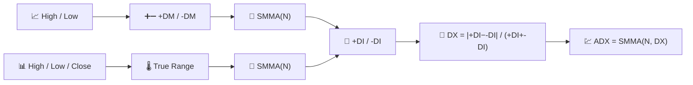

# 💹 ADX — Average Directional Index

ADX answers a question none of the moving averages can: *"is there even a trend worth following?"* It measures the **strength** of a directional move, deliberately ignoring its direction.

---

## 💡 Financial Meaning

Traders often pair ADX with a trend-following system (moving-average crossovers, breakouts) as a filter: only take trend signals when ADX is rising above a threshold (commonly 25), and stand aside when it is low — a sign of a range-bound, chop-prone market where trend-followers get whipsawed. The two companion lines, **+DI** and **-DI**, show *which* direction currently dominates.

---

## 🔢 Mathematical Formulas

1.  **Directional Movement** — the larger of the up-move or down-move in high/low, keeping only the dominant one:

    $$
    +DM_t = \max(H_t - H_{t-1},\, 0) \quad \text{if} \quad H_t - H_{t-1} > L_{t-1} - L_t, \text{ else } 0
    $$

    $$
    -DM_t = \max(L_{t-1} - L_t,\, 0) \quad \text{if} \quad L_{t-1} - L_t > H_t - H_{t-1}, \text{ else } 0
    $$

2.  **True Range** $TR_t$ (see [ATR](atr.md)), smoothed over $N$ periods, normalises the directional moves into **+DI** / **-DI**:

    $$
    +DI_t = 100 \cdot \frac{SMMA_N(+DM)}{SMMA_N(TR)}, \qquad
    -DI_t = 100 \cdot \frac{SMMA_N(-DM)}{SMMA_N(TR)}
    $$

3.  **Directional Index** and its own smoothing give the **ADX**:

    $$
    DX_t = 100 \cdot \frac{\left| +DI_t - -DI_t \right|}{+DI_t + -DI_t}, \qquad
    ADX_t = SMMA_N(DX)
    $$

---

## ⚙️ Parameters

| Parameter | Key | Default | Description |
|---|---|---|---|
| Period ($N$) | `period` | 14 | Smoothing window for +DM, -DM, TR and DX. |

---

## 🎛️ Signal Processing Equivalent — Rectified, Normalised Derivative Envelope

+DM and -DM are **half-wave rectified derivatives** of the high/low series — conceptually the same trick RSI applies to the close. The DI lines normalise each rectified derivative by the True Range (the signal's local amplitude), making them scale-invariant. ADX then takes the **normalised absolute difference** of two envelopes and smooths it — effectively measuring how far the "directional energy" is from being evenly split between up and down.

!!! warning "ADX is not directional"

    A rising ADX with `+DI` above `-DI` confirms an **uptrend**; a rising ADX with
    `-DI` above `+DI` confirms a **downtrend**. ADX alone, without checking which DI
    line is on top, only tells you a trend exists — never which way it points.

:material-link: [Average Directional Index on Wikipedia](https://en.wikipedia.org/wiki/Average_directional_movement_index){ target="_blank" }
