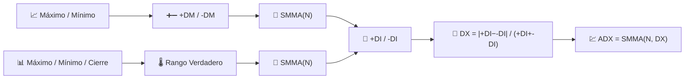

# 💹 ADX — Índice Direccional Promedio

El ADX responde una pregunta que ningún promedio móvil puede responder: *"¿existe siquiera una tendencia que valga la pena seguir?"* Mide la **fuerza** de un movimiento direccional, ignorando deliberadamente su dirección.

---

## 💡 Significado Financiero

Los traders a menudo combinan el ADX con un sistema de seguimiento de tendencia (cruces de promedios móviles, rupturas) como filtro: solo toman señales de tendencia cuando el ADX está subiendo por encima de un umbral (comúnmente 25), y se mantienen al margen cuando está bajo — señal de un mercado lateral y propenso a sacudidas donde los seguidores de tendencia sufren pérdidas. Las dos líneas acompañantes, **+DI** y **-DI**, muestran *cuál* dirección domina actualmente.

---

## 🔢 Fórmulas Matemáticas

1. **Movimiento Direccional** — el mayor de los movimientos al alza o a la baja en el máximo/mínimo, conservando solo el dominante:

    $$
    +DM_t = \max(H_t - H_{t-1},\, 0) \quad \text{si} \quad H_t - H_{t-1} > L_{t-1} - L_t, \text{ sino } 0
    $$

    $$
    -DM_t = \max(L_{t-1} - L_t,\, 0) \quad \text{si} \quad L_{t-1} - L_t > H_t - H_{t-1}, \text{ sino } 0
    $$

2. **Rango Verdadero** $TR_t$ (ver [ATR](atr.md)), suavizado en $N$ períodos, normaliza los movimientos direccionales en **+DI** / **-DI**:

    $$
    +DI_t = 100 \cdot \frac{SMMA_N(+DM)}{SMMA_N(TR)}, \qquad
    -DI_t = 100 \cdot \frac{SMMA_N(-DM)}{SMMA_N(TR)}
    $$

3. **Índice Direccional** y su propio suavizado dan el **ADX**:

    $$
    DX_t = 100 \cdot \frac{\left| +DI_t - -DI_t \right|}{+DI_t + -DI_t}, \qquad
    ADX_t = SMMA_N(DX)
    $$

---

## ⚙️ Parámetros

| Parámetro | Clave | Valor por defecto | Descripción |
|---|---|---|---|
| Período ($N$) | `period` | 14 | Ventana de suavizado para +DM, -DM, TR y DX. |

---

## 🎛️ Equivalente en Procesamiento de Señales — Envolvente de Derivada Rectificada y Normalizada

+DM y -DM son **derivadas rectificadas de media onda** de las series de máximo/mínimo — conceptualmente el mismo truco que RSI aplica al cierre. Las líneas DI normalizan cada derivada rectificada mediante el Rango Verdadero (la amplitud local de la señal), haciéndolas invariantes a la escala. ADX luego toma la **diferencia absoluta normalizada** de dos envolventes y la suaviza — midiendo efectivamente qué tan lejos está la "energía direccional" de estar dividida equitativamente entre alza y baja.

!!! warning "ADX no es direccional"

    Un ADX en aumento con `+DI` por encima de `-DI` confirma una **tendencia alcista**;
    un ADX en aumento con `-DI` por encima de `+DI` confirma una **tendencia bajista**.
    ADX solo, sin verificar qué línea DI está arriba, solo te indica que existe una
    tendencia — nunca hacia dónde apunta.

:material-link: [Índice direccional promedio en Wikipedia](https://en.wikipedia.org/wiki/Average_directional_movement_index){ target="_blank" }
